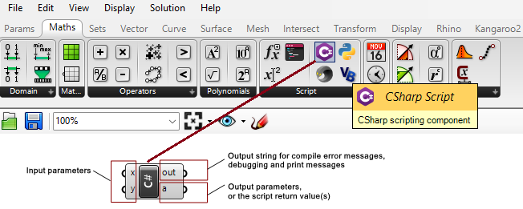
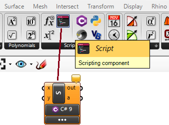
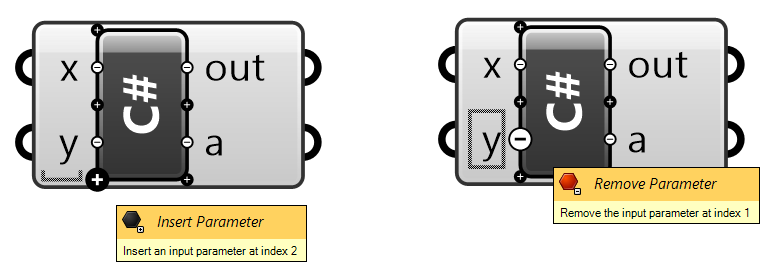
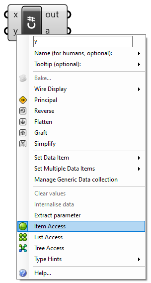
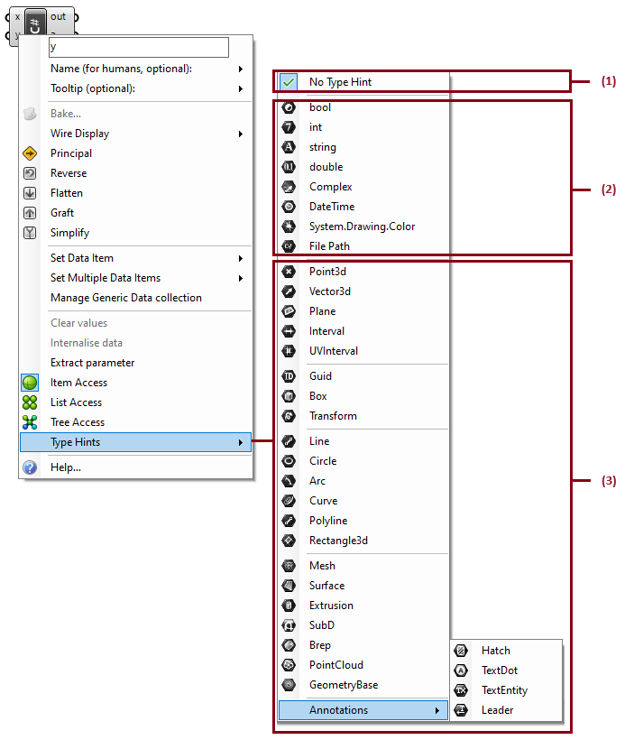
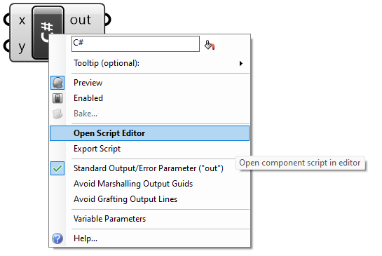
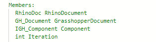
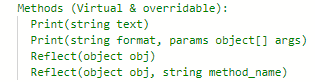
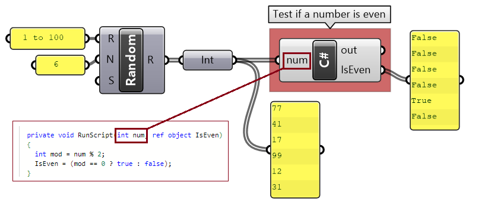
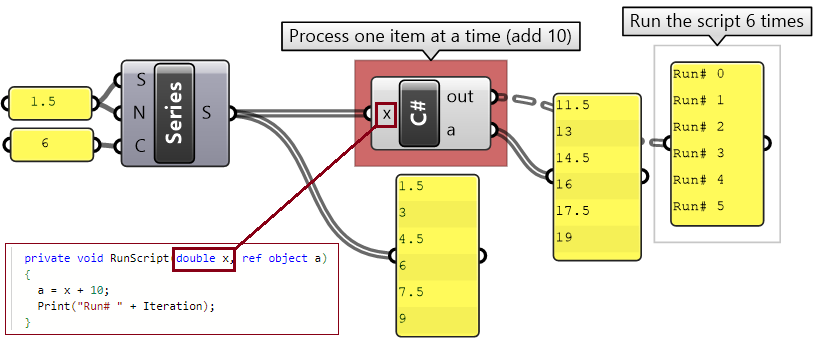

+++
aliases = [""]
authors = [ "rajaa" ]
categories = [ "Csharp Essentials" ]
category_page = "guides/grasshopper/csharp-essentials/"
keywords = [ "csharp", "commands" ]
languages = [ "C#" ]
sdk = [ "RhinoCommon" ]
title = "Chapter One: Grasshopper C# Component"
type = "guides"
weight = 15
override_last_modified = "2018-12-05T14:59:06Z"
draft = false

[admin]
picky_sisters = ""
state = ""

[included_in]
platforms = [ "Windows", "Mac" ]
since = 8
until = ""

[page_options]
block_webcrawlers = false
byline = true
toc = true
toc_type = "single"

+++

## 1.1 Introduction

Grasshopper supports multiple scripting languages such as **VB.NET**, **C#** and **Python** to help develop custom components using the Rhino and Grasshopper SDKs (software development kit). Rhino publishes a cross-platform **SDK** for **.NET** languages called **RhinoCommon**. The documentation of the SDK and other developer resources are available at [Rhino Developer Documentation](http://developer.rhino3d.com/). 

## 1.2 C# component interface

The scripting components are integrated within Grasshopper and have a similar interface to that of other typical components. They can read input and produce output, and have an editor to write custom code with access to **RhinoCommon**. They are used to create specialized code and workflows not supported by other Grasshopper components. You can also use them to simplify, optimize and streamline your definitions by combining multiple functions.

To add an instance of the C# script component to the canvas, drag and drop the component from the **Script** panel under the **Maths** tab. The default script component has two inputs and two outputs. The user can change the names of input and output, set the input data type and data structure and also add more inputs and outputs parameters or remove them. We will explain how to do all that shortly.

<figure>
   
   <figcaption>Figure(1): The C# component and its location in the toolbar. **x**: first input parameter. **y**: second input parameter. out: output string with compiling messages. **a**: Returned output of type object.</figcaption>
</figure>  

Alternatively, you can use the generic **Script** component, then click on the C# at the margin. 

<figure>
   
   <figcaption>Figure(2): The default Script component in Grasshopper</figcaption>
</figure>  

## 1.3 The input parameters

By default, there are two input parameters named **x** and **y**.  It is possible to edit the parameters’ names, delete them or add new ones.  If you zoom in, you will notice a few “+” and “-” signs appearing. You can click on those to add or remove parameters. You can also right-mouse click on a parameter to change its name. Note that the names of the parameters and their types are passed to the main function inside the script component, which is called **RunScript**. It is a good practice to set the input and output parameter names to reflect what each parameter does. Parameter names should not use white spaces or special characters.

<figure>
   
   <figcaption>Figure(3): Zoom in to add a remove input parameters by pressing the + and - signs</figcaption>
</figure>  

If you right-mouse click on an input parameter, you will see a menu that has four parts as detailed in *Figure 4* below.

drop_menu.png

<figure>
   
   <figcaption>Figure(4): Expand the input parameter menu (access by right-mouse click on the parameter).</figcaption>
</figure>  

The input parts are:
1. **Name**: you can click on it and type a new parameter name. Also you have the option to set a description of the parameter and the tooltip.
1. **General attributes**: common to most other GH components.
Data access: to indicate whether the input should be accessed as a single item, a list of items or as a tree. *Note: We will explain how to traverse and navigate data access options in some detail later in this chapter.*
1. **Type**: Input parameters are set by default to be of an **object** type.  It is best to specify a type to make the code more readable and efficient. Types can be primitive, such as **int** or **double**, or **RhinoCommon** types that are used only in Rhino such as **Point3d** or **Curve**. You need to set the type for each input.
1. **Help**: full description of the scripting component.

Just like all other GH components, you can hook data to the input parameters of the script components. Your script component can process most data types. You can specify the data type of your input using the **Type hint** as in the following image.

<figure>
   
   <figcaption>Figure(5): The type hint in the input allows setting input parameters to specific types. 1) No Type. 2) Primitive types. 3) RhinoCommon types.</figcaption>
</figure>  

The Type hint, gives access to many data types and can be divided into three groups:
1. **No Type Hint**. if you do not specify the input type, GH assigns the base type **System.Object**. The **System.Object** is the root type that all other types are built on. Therefore it is safe to assign System.Object type to any data type.
1. **Primitive** types. Those are made available by the **.NET** framework.
1. **RhinoCommon types**. Those are defined in the **RhinoCommon SDK**.

## 1.4: The output parameters

Just like with input parameters, you can add or remove output parameters by zooming in, then use the “+” or “-” signs.  You can also change the name of the output. However, there is no data access or data types that you can set.  They are always defined as **System.Object**, and hence you can assign any type, and as defined by your script and GH, take care of parsing it to use downstream.

<figure>
   
   <figcaption>Figure(6): Zoom in to add or remove an output parameter by pressing the + and - gadgets</figcaption>
</figure>

## 1.5: The out string

The **out** string is used to list errors and other useful information about your code. You can connect the **out** to a **Panel** component to be able to read the information. 

<figure>
   
   <figcaption>Figure(7): The out parameter includes compile and runtime messages</figcaption>
</figure>

There are two types of messages that print to the **out** string. 
1. **Compile-time** messages. These include compiler errors and warnings about your code. This is very helpful information to point you to the lines in code that the compiler is complaining about, so that you can correct the errors.
1. **Runtime messages**.  You can print any text to the **out** string to track information generated inside your code during execution. 

## 1.6: Main menu

You can access the main component menu by hovering over the middle of the scripting component (black label) and right-clicking. Most of the functions are similar to other GH components, but there are a couple specialized functions such as **Open Script Editor...** to open the code editor and **Manage Assemblies** to help add external libraries to access in your script. 

<figure>
   
   <figcaption>Figure(8): Scripting component main menu</figcaption>
</figure>

## 1.7: Code Editor

To show the code editor window for the C# script component, you need to double-click in the middle of the component (or right-click the middle, and select **Open Script Editor…**). The code editor supports debugging. For a full explanation of the editor interface and functionality, please visit xyz… **[TODO]**

<figure>
   
   <figcaption>Figure(9): The code editor has 4 parts. (1) toolbar, (2) code, (3) cache, (4) OK</figcaption>
</figure>

The code window of the C# scripting component has a few distinct sections as in figure 10. Next, we will expand and explain each of the parts.

<figure>
   
   <figcaption>Figure(10): The parts of the code section of the C# scripting component: (1) default imports, (2) default members and functions of the script instance, (3) the RunScript function when the code is placed.</figcaption>
</figure>

### 1.7.1: Imports

There are assemblies that you can access and use in your code. Most of them are the .Net system ones, but there are also the Rhino and Grasshopper assemblies that give access to the Rhino geometry classes and the Grasshopper types and functions. You can also add your custom libraries or external assemblies in this section. 

<figure>
   
   <figcaption>Figure(11): Default imports in the C# scripting component (1) System imports, (2) Rhino imports, (3) Grasshopper imports</figcaption>
</figure>

### 1.7.2: Utility members and functions

The members are useful variables that can be utilized in your code. Members include a one-and-only instance to the active Rhino document, an instance to the Grasshopper document, the current GH scripting component and finally the iteration variable, which references the number of times the script component is called (usually based on the input and data access). For example, when your input parameters are single items, then the script component runs only once, but if you input a list of values, say 10 of them, then the component is executed 10 times (that is assuming that the **data access** is set to a **single item**). You can use the **Iteration** variable if you would like your code to do different things at different iterations, or to simply analyze how many times the component is called.

<figure>
   
   <figcaption>Figure(12): Reference list of built in utility methods</figcaption>
</figure>

You can use the methods to help debug and communicate useful information. The **Print()** functions to send strings to the **out** output parameter. You can use the **Reflect()** functions to gain information regarding classes and their methods. For example, if you wish to get more information about the data that is available through the input parameter **x**, you can add **Reflect(x)** to your code. As a result, a string with type method information will be written to the **out** parameter.

<figure>
   
   <figcaption>Figure(13): Reference list of built in utility members</figcaption>
</figure>

### 1.7.3: The RunScript

This is the main function where you write your code. The signature of the **RunScript** includes the input and output parameters along with their data types and names. There is white space between the open and closed parentheses to indicate the region where you can type your code.

<figure>
   
   <figcaption>Figure(14): The RunScript is the main function within which the user can put their code.</figcaption>
</figure>

## 1.8: Data access

This topic requires knowledge in C# programming. If you need to review or refresh your knowledge in C# programming, please review chapter two before reading this section.

Grasshopper scripting components, just like all other GH components, can process three types of data access; **item access**, **list access** and **tree access**.

<table class="rounded">
  <tr>
    <th>Icons in GH</th>
    <th>Data Access</th>
  </tr>
  <tr>
    <td><span></span></td>
    <td>Item Access</td>
  </tr>
  <tr>
    <td></td>
    <td>List Access</td>
  </tr>
  <tr>
    <td></td>
    <td>Tree Access</td>
  </tr>
</table>

You need to right-mouse-click on the input parameter to set its data access, otherwise it is set to **item access** by default. We will explain what each access means and how data is processed inside the component in each case.

## Next Steps

Now that you know what a scripting language is, check out the [Python Essentials](/guides/rhinopython/primer-101/2-python-essentials/) guide to learn more about the Python language.

<figure>
   
   <figcaption>Figure(22): Set the input parameter to be an **item access** to indicate that input in processed one element at a time
</figcaption>
</figure>

###1.8.1: Item access

**Item access** means that the input is processed one item at a time. Suppose you have a list of numbers that you need to test if they are odd or even. To simplify your code, you can choose to only process one number at a time. In this case, **item access** is appropriate to use. So even if the input to **num** is a list of integers, the scripting component will process one integer at a time and run the script a number of times equal to the length of the list.



```C#
private void RunScript( int num, ref object IsEven )
{
    int mod = num % 2;
    IsEven = (mod == 0 ? true : false);
}
```

With **item access**, each element in a list is processed independently from the rest of the elements.  For example, if you have a list of 6 numbers {1, 2, 3, 4, 5, 6} that you would like to increment each one of them by some number – let’s say 10 – to get the list {11, 12, 13, 14, 15, 16}, then you can set the data access to **item access**. The script will run 6 times, once for each element in the list and the output will be a list of 6 numbers. Notice in the following implementation in GH where **x** is input as a single item of type **double**.




```C#
private void RunScript( int num, ref object IsEven )
{
    A = x + 10;
    Print("Run# " + Iteration);
}
```
