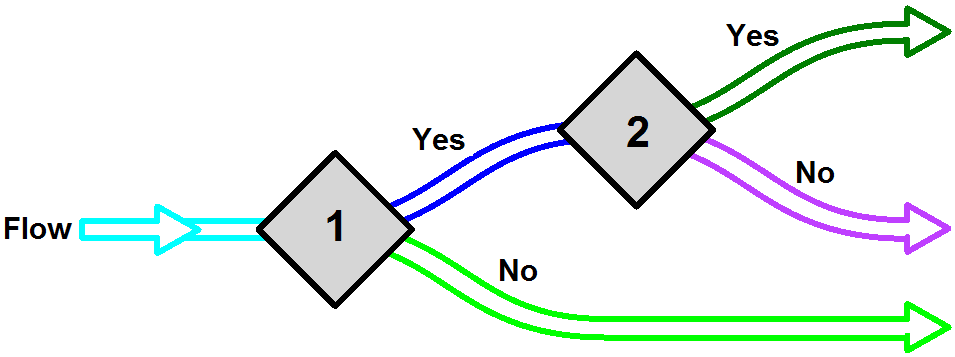
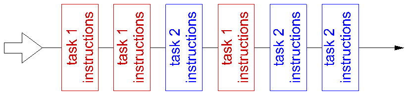
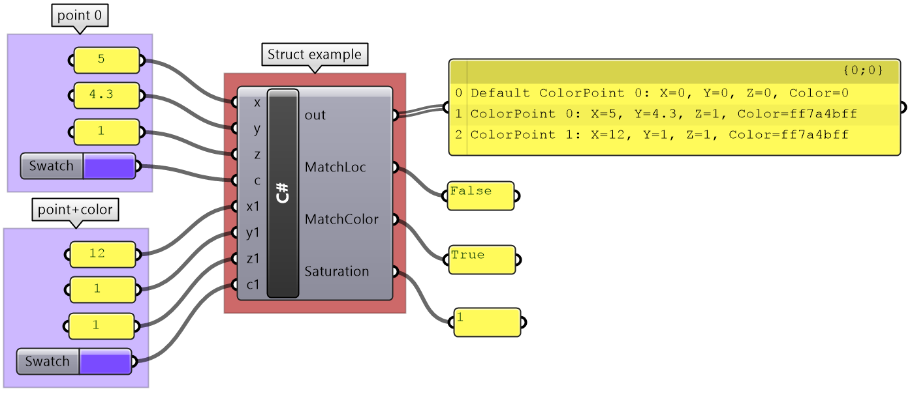
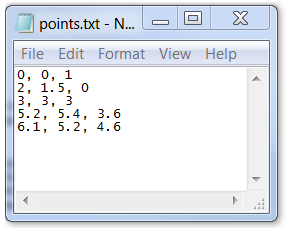
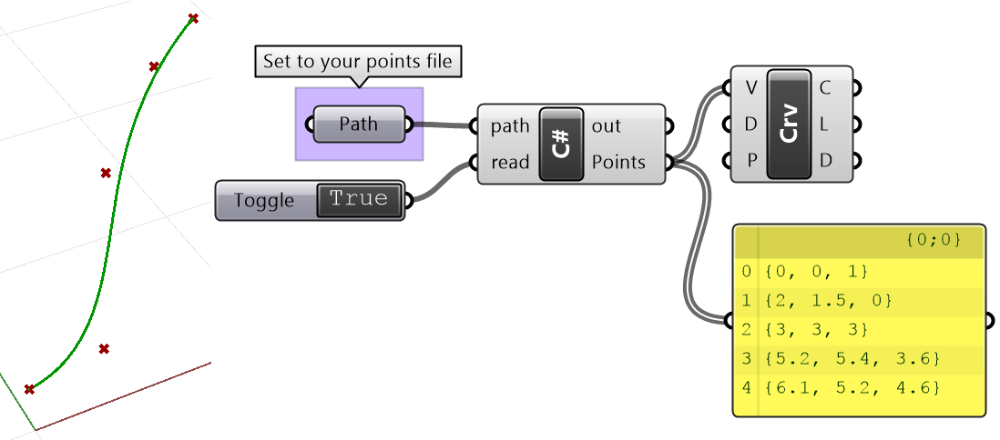

+++
aliases = []
authors = [ "rajaa" ]
categories = [ "Csharp Essentials" ]
category_page = "guides/grasshopper/csharp-essentials/"
keywords = [ "csharp", "commands" ]
languages = [ "C#" ]
sdk = [ "RhinoCommon" ]
title = "Chapter 2: C# Programming Basics"
type = "guides"
weight = 15
override_last_modified = "2024-04-15T14:59:06Z"
draft = false

[admin]
picky_sisters = ""
state = ""

[included_in]
platforms = [ "Windows", "Mac" ]
since = 7
until = ""

[page_options]
block_webcrawlers = false
byline = true
toc = true
toc_type = "single"
+++

## 2.1 Introduction

This chapter covers basic C# programming concepts. It serves as an introduction and quick reference to C#'s language syntax. It is not meant to be complete by any measure, so please refer to the C# resources available online and in print. All examples in this chapter are implemented using the Grasshopper C# component. For additional documentation [The Microsoft CSharp Programming Guide](https://docs.microsoft.com/en-us/dotnet/csharp/programming-guide/) is a good resource.

## 2.2 Comments

Comments are very useful to describe your code in plain language. They are useful as a reminder for you and also for others to help them understand your code. To add a comment, you can use two forward slashes // to signal that the rest of the line is a comment and the compiler should ignore it. In the Grasshopper C# code editor, comments are displayed in green. You should enclose a multi-line comment between /* and */ as in the following example.

```C#
// The compiler ignores this line 
/*
  The compiler ignores all lines enclosed 
  within this area
*/
```

## 2.3 Variables

You can think of variables as labeled containers in your computer’s memory where you can store and retrieve data. Your script can define any number of variables and label them with the names of your choice, as long as you do not use spaces, special characters, or reserved words by the programming language. Try to always use variable names that are descriptive of the data you intend to store. This will make it easier for you to remember what kind of information is stored in each variable.

<figure>
   
   <figcaption>Figure(16): How variables are stored in a computer's memory</figcaption>
</figure>  

Your script uses variable names to access the value stored in them. In general, you can assign new values to any variable at any point in your program, but each new value wipes out the old one. When you come to retrieve the value of your variable, you will only get the last one stored. For example, let’s define a variable and name it **x**. Suppose we want **x** to be of type integer. Also, suppose we would like to assign it an initial value of 10. This is how you write a statement in C# to declare and assign an integer:

```C#
int x = 10;
```

Let us dissect all the different parts of the above statement:

<table class="multiline">
<tr>
<td><b>int</b></td>
<td>The type of your data. int is a special keyword in <b>C#</b> that means the type of the variable is a signed integer (can be a positive or negative whole number)</td>
</tr>
<tr>
<td><b>x</b></td>
<td><i>The name of the variable</i></td>
</tr>
<tr>
<td><b>=</b></td>
<td>Used for assignment and it means the value that follows will be stored in the variable x</td>
</tr>
<tr>
<td><b>10</b></td>
<td>The initial value stored in the <b>x</b> variable</td>
</tr>
<tr>
<td>;</td>
<td>The semicolon is used to end a single statement</td>
</tr>
</table>

In general, when you declare a variable, you need to explicitly specify the **data type**.

## 2.4 Operators

Operators are used to perform arithmetic, logical, and other operations. Operators make the code more readable because you can write expressions in a format similar to that in mathematics. So, instead of having to use functions and write **C=Add(A, B)**, we can write **C=A+B**, which is easier to read. The following is a table of the common operators provided by the C# programming language for quick reference:

<table class="rounded">
  <tr>
    <th>Type</th>
    <th>Operator</th>
    <th>Description</th>
  </tr>
  <tr>
    <td>Arithmetic </n>Operators</td>
    <td>*</td>
    <td>Multiplies two numbers</td>
  </tr>
  <tr>
    <td> </td>
    <td>/</td>
    <td>Divides two numbers and returns a floating-point result</td>
  </tr>
  <tr>
    <td> </td>
    <td>\</td>
    <td>Divides two numbers and returns an integer result</td>
  </tr>
  <tr>
    <td> </td>
    <td>%</td>
    <td>Remainder: divides two numbers and returns only the remainder</td>
  </tr>
  <tr>
    <td> </td>
    <td>+</td>
    <td>Adds two numbers or returns the positive value of a numeric expression</td>
  </tr>
  <tr>
    <td> </td>
    <td>-</td>
    <td>Returns the difference between two numeric expressions or the negative value of a numeric expression</td>
  </tr>
  <tr>
    <td>Assignment </n>Operators</td>
    <td>=</td>
    <td>Assigns a value to a variable</td>
  </tr>
  <tr>
    <td> </td>
    <td>*=</td>
    <td>Multiplies the value of a variable by the value of an expression and assigns the result to the variable</td>
  </tr>
  <tr>
    <td> </td>
    <td>+=</td>
    <td>Adds the value of a numeric expression to the value of a numeric variable and assigns the result to the variable. Can also be used to concatenate a String expression to a String variable and assign the result to the variable.</td>
  </tr>
  <tr>
    <td> </td>
    <td>-=</td>
    <td>Subtracts the value of an expression from the value of a variable and assigns the result to the variable</td>
  </tr>
  <tr>
    <td>Comparison </n>Operators</td>
    <td><</td>
    <td>Less than</td>
  </tr>
  <tr>
    <td> </td>
    <td><=</td>
    <td>Less or equal</td>
  </tr>
  <tr>
    <td> </td>
    <td>></td>
    <td>Greater than</td>
  </tr>
  <tr>
    <td> </td>
    <td>>=</td>
    <td>Greater or equal</td>
  </tr>
  <tr>
    <td> </td>
    <td>==</td>
    <td>Equal</td>
  </tr>
  <tr>
    <td> </td>
    <td>!=</td>
    <td>Not equal</td>
  </tr>
  <tr>
    <td>Concatenation </n>Operators</td>
    <td>=</td>
    <td>Assigns a value to a variable</td>
  </tr>
  <tr>
    <td> </td>
    <td>&</td>
    <td>Generates a string concatenation of two expressions</td>
  </tr>
  <tr>
    <td> </td>
    <td>+</td>
    <td>Concatenate two string expressions</td>
  </tr>
  <tr>
    <td>Logical </n>Operators</td>
    <td>&&</td>
    <td>Performs a logical conjunction on two Boolean expressions</td>
  </tr>
  <tr>
    <td> </td>
    <td>!</td>
    <td>Performs logical negation on a Boolean expression</td>
  </tr>
 <tr>
    <td> </td>
    <td>||</td>
    <td>Performs a logical disjunction on two Boolean expressions</td>
  </tr>
</table>

## 2.5 Namespaces

Namespaces are very useful to group and organize classes, especially for large projects. **.NET** uses namespaces to organize its classes. For example, **System** namespace has many classes under it, including the **Math** class, so if you like to calculate the square root of a number, your code will look like the following:

```C#
double num = 16;
double sqrNum = System.Math.Sqrt(num);
```

Notice how you use the namespace followed by “.” to access the classes within that namespace. If you do not want to type the namespace each time you need to access one of the classes within that namespace, then you can use the **using** keyword as in the following:

```C#
using System;
double num = 16;
double sqrNum = Math.Sqrt(num);
```

## 2.6 Data

Data types refer to the kind of data stored in the variable. There are two main data types. The first is supplied by the programming language and involves things like numbers, logical true or false, and characters. Those are generally referred to as primitive or built-in types. Variables of any data type can be composed into groups or collections.

### 2.6.1 Primitive Data Types

Primitive types refer to the basic and built-in types provided by the programming language. The following examples declare variables of primitive data types:

<table class="rounded">
  <tr>
    <th>Declare primitive data types</th>
    <th>Notes</th>
  </tr>
  <tr>
    <td>double pi = 3.1415;</td>
    <td>double: big number with decimal point</td>
  </tr>
  <tr>
    <td>bool pass = true;</td>
    <td>bool: set to either true or false. Used mainly to represent the truth value of a variable or a logical statement</td>
  </tr>
  <tr>
    <td>char initial = ‘R’;</td>
    <td>char: stores exactly one character</td>
  </tr>
  <tr>
    <td>string myName = “Mary”;</td>
    <td>string: a sequence of characters</td>
  </tr>
  <tr>
    <td>object someData = “Mary”;</td>
    <td>object type can be used to store data of any type. The use of object type is inefficient and should be avoided if at all possible.</td>
  </tr>
</table>

### 2.6.2 Collections

In many cases, you will need to create and manage a group of objects. There are generally two ways to group objects: either by organizing them in arrays or using a collection. Collections are more versatile and flexible, and they allow you to expand or shrink the group dynamically. There are many ways to create collections, but we will focus on ordered ones that contain elements of the same data type. For more information, you can reference the literature.

**Arrays**

Arrays are a common way to assemble an ordered group of data. Arrays are best suited if you already know the values you are storing, and do not need to expand or shrink the group dynamically.

<figure>
   
   <figcaption>Figure(17): How arrays are stored in the computer memory</figcaption>
</figure> 

For example, you can organize the days of the week using an array. The following declares and initializes the weekdays array in one step:

```C#
// Declare and initialize the days of the week array
string[] weekdays = {"Sunday","Monday","Tuesday","Wednesday","Thursday","Friday","Saturday"};
```

You can also declare the array first with a specific dimension representing the number of elements to allocate in memory for the array, then assign the values of the elements in separate statements. In the C# language, each statement ends with a semicolon:

```C#
// Declare the days of the week in one statement, then assign the values later
string[ ] weekdays = new string[7];
weekdays[0] = "Sunday";
weekdays[1] = "Monday";
weekdays[2] = "Tuesday";
weekdays[3] = "Wednesday";
weekdays[4] = "Thursday";
weekdays[5] = "Friday";
weekdays[6] = "Saturday";
```

Let’s take the statement that sets the first value in the weekdays array in the above.


```C#
weekdays[0] = “Sunday”;
```

**Sunday** is called an **array element**. The number between brackets is called the **index** of the element in the array. Notice that in **C# language** the array always starts with index=0 that points to the first element. The last index of an array of seven elements therefore equals 6. If you try to retrieve data from an invalid index, for example 7 in the weekday example above, then you will get what is called an **out of bound error** because you are basically trying to access a part of the memory that you did not allocate for your array, and it can lead to a crash.

**Lists**

If you need to create an ordered collection of data dynamically, then use a **List**. You will need to use the **new** keyword and specify the data type of the list. The following example declares a new list of integers and appends elements incrementally in subsequent statements. *Note that the indices of a list are also zero based just like arrays.*


```C#
// Declare a dynamic ordered collection using “List”
List<string> myWorkDays =  new List<string>();

// Add any number of new elements to the list
myWorkDays.Add("Tuesday");
myWorkDays.Add("Wednesday");
myWorkDays.Add("Thursday");
myWorkDays.Add("Friday");
```
You need to use the keyword **new** to declare an instance of a **List**. *We will explain what it means to be a reference type with some more details later.*

## 2.7 Flow Control

The flow of your scripts indicates the order of code execution. Sometimes you might need to branch or loop through specific statements several times. For example, you might want to branch your script to implement a different sequence based on some condition. Other times, you might need to repeat a certain sequence multiple times. We will discuss three important mechanisms to control the flow of a program: conditional statements, loops, and methods.

### 2.7.1 Conditional Statements

Conditional statements allow you to decide on which part of your code to use based on some condition that can change during runtime. Unlike regular programming instructions, conditional statements can be described as decision-making logic. Conditional statements help control and regulate the flow of the program.

<figure>
   
   <figcaption>Figure(17): Conditional statements 1 & 2 and how they affect the flow of the program</figcaption>
</figure> 

The following script examines a number variable and prints “zero” if it equals zero:

```C#
if (myNumber == 0)
{
    Print("myNumber is zero");
}
```

<table class="multiline">
<tr>
<td><b>if</b></td>
<td>Keyword indicating the start of the if statement</td>
</tr>
<tr>
<td>(myNumber == 0)</td>
<td>The condition of the if statement enclosed by parentheses</td>
</tr>
<tr>
<td>{
    Print("myNumber is zero");
    }</td>
<td>The if statement block enclosed between curly brackets. The block is executed only if the condition evaluates to true, otherwise it is skipped.</td>
</tr>
</table>

The following code checks if a number is between 0 and 100:

```C#
if (myNumber >= 0 && myNumber <= 100)
{
    Print("myNumber is between 0 and 100");
}
```

Sometimes, the script needs to execute one block when some condition is satisfied and another if not. Here is an example that prints the word **positive** when the given number is greater than zero and prints **less than 1** if not. It uses the **if… else** statement.

```C#
if (myNumber > 0)
{
    Print("positive");
}
else
{
    Print( "less than 1" );
}
```

You can use as many conditions as you need, as shown in the following example:

```C#
if (myNumber > 0)
{
    Print("myNumber is positive");
}
else if (myNumber < 0)
{
    Print( "myNumber is negative" );
}
else
{
    Print( "myNumber is zero" );
}
```

### 2.7.2 Loops

Loops allow you to run the body of your loop a fixed number of times or until the loop condition is no longer true.

<figure>
   
   <figcaption>Figure(18): Loops in the context of the overall flow of the program</figcaption>
</figure> 

There are two kinds of loops. The first is iterative where you can repeat code a defined number of times, and the second is conditional where you repeat until some condition is no longer satisfied.

**Iterative Loops: for loop**

This is a common way of looping when you need to run a block of code a specific number of times. Here is a simple example that prints numbers from 1 to 10. You first declare a counter and then increment in the loop to run the code a specific number of times. *Notice that the code statements you would like to repeat are bound by the block after the for statement.*


```C#
for (int i = 1; i <= 10; i++)
{
  // Convert a number to string
  Print( i.ToString() );
}
```


<table class="multiline">
<tr>
<th>Line</th>
<th>Description</th>
</tr>
<tr>
<td>1</td>
<td>The for statement. It has 4 parts:
for(... ; … ; ...): the for keyword and loop condition and counter</br>
i=1: the counter initial value</br>
i<=10: the condition: if evaluates to true, then execute the body of the for loop</br>
i++: increment the counter (by 1 in this case)</td>
</tr>
<tr>
<td>3-5</td>
<td>The body of the for loop. This is the code that is executed as long as the condition is met.</br>
Note: if the condition of the for loop is always true, then the program will enter what is called an “infinite loop” that leads to a crash. For example, if the condition was “i>0” instead of “i<=10”, then it will cause an infinite loop.
</td>
</tr>
</table>

The loop counter does not have to be increasing or change by 1. The following example prints the even numbers between 10 and -10. You start with a counter value equal to 10, and then change by -2 thereafter until the counter becomes smaller than -10.

```C#
for (int i = 10; i >= -10; i = i-2)
{
    Print( i.ToString() );
}
```

If you happen to have an array that you need to iterate through, then you can set your counter to loop through the indices of your array. Just remember that the indices of arrays are zero-based, and therefore, you need to remember to loop from index=0 to the length of the array minus 1, or else you will get an out-of-bounds error.

```C#
string alphabet = "ABCDEFGHIJKLMNOPQRSTUVWXYZ";
char[ ] letters = alphabet.ToCharArray();
for (int i = 0; i < letters.Length; i++)
{
  Print( i.ToString() + " = " + letters[i] );
}
```

Here is another example that iterates through a list of places:

```C#
// List of places
List< string > placesList = new List< string >();
placesList.Add( "Paris" );
placesList.Add( "NY" );
placesList.Add( "Beijing" );

int count = placesList.Count();
// Loop starting from 0 to count -1 (count = 3, but last index of the placesList is 2)
for (int i = 0; i < count; i++)
{ 
    Print( "I have been to " + placesList[i] );
} 
```

**Iterative Loops: foreach loop**

You can use the **foreach** loop to iterate through the elements of an array or a list without using a counter or index. This is a less error-prone way to avoid an out-of-bounds error. The above example can be rewritten as follows to use **foreach** instead of the **for** loop:

```C#
// List of places
List< string > placesList = new List< string >();
placesList.Add( "Paris" );
placesList.Add( "NY" );
placesList.Add( "Beijing" );

// Loop
foreach (string place in placesList)
{
    Print(place);
}
```

**Conditional Loops: while loop**

Conditional loops are ones that keep repeating until certain conditions are no longer true. You have to be very careful when you use conditional loops because you can be trapped looping infinitely until you crash when your condition continues to be true.

Some problems can be solved iteratively, but others cannot. For example, if you need to find the sum of 10 consecutive positive even integers starting with 2, then this can be solved iteratively with a **for** loop. Why? This is because you have a specified number of times to loop (10 in this case). This is how you might write your loop to solve your problem:

```C#
int sum = 0;
for (int i = 1; i <= 10; i++)
{
    sum = sum + ( i*2 );
}
Print( sum.ToString() );
```

On the other hand, if you need to add consecutive positive even integers starting with 2 until the sum exceeds 1000, then you cannot simply use an iterative **for** loop because you do not know how many times you will have to loop. You only have a condition to stop looping. Here is how you might solve this problem using the conditional **while** loop: 

```C#
int sum = 0;
int counter = 0;
int number = 2;
// Loop
while (sum < 1000)
{
   sum = sum + number;
   // Make sure you increment the counter and the number
   counter = counter + 1;
   number = number + 2;
}
// Remove last number
sum -= number;
counter --;
Print("Count = " + counter);
Print("Sum = " + sum);
```

Here is another example from mathematics where you can solve the **[Collatz conjecture](http://en.wikipedia.org/wiki/Collatz_conjecture)**. It basically says that you can start with any natural positive integer, and if even then divide by 2, but if odd, then multiply by 3 and add 1. If you repeat the process long enough, then you always converge to 1. The following example prints all the numbers in a **Collatz conjecture** for a given number:

```C#
int x = 46;
while(x > 1)
{
  Print( x.ToString() );
  if( x % 2 == 0 )
    x = x / 2;
  else
      x = x * 3 + 1;
}
Print( x.ToString() );
```

**Nested Loops**

A nested loop is a loop that contains another loop inside it. You can nest as many loops as you need, but keep in mind this can make the logic harder to follow.

<figure>
   
   <figcaption>Figure(19): Nested loops</figcaption>
</figure> 

For example, suppose you have the following list of words as input: {apple, orange, banana, strawberry} and you need to calculate the number of letters **a**. You will have to do the following:
1. Loop through each one of the fruits. This is the outer loop.
2. For each fruit, loop through all the letters. This is the inner loop (nested).
3. Whenever you find the letter “a”, increment your counter by 1.
4. Print the counter.

```C#
// Declare and initialize the fruits
string[ ] fruits =  {“apple”, “orange”, “banana”, “strawberry”};
int count = 0;
// Loop through the fruits
foreach (string fruit in fruits)
{
   // Loop through the letters in each fruit
   foreach (char letter in fruit)
   {
      // Check if the letter is "a"
      If (letter == ‘a’)      {
         count = count + 1;
      }
   }
}
Print( “Letter a is repeated “ + count + “ times“ );
```

**Using break and continue inside loops**

The **break** statement is used to terminate or exit the loop, while the **continue** statement helps skip one loop iteration. Here is an example to show the use of both. It checks if there is an orange in a list of fruits and counts how many fruits have at least one letter **r** in their name.

```C#
// Declare and initialize the fruits
string[ ] fruits =  {“apple”, “orange”, “banana”, “strawberry”};
//Check if there is at least one orange
foreach (string fruit in fruits)
{
   // Check if it is an orange
   if (fruit == "orange")
   {
      // Check if the letter is ‘a"
      Print( "Found an orange" );
      // No need to check the rest of the list, exit the loop
      break;
   }
}
// Check how many fruits has at least one letter ‘r’ in the name
int count = 0;
// Loop through the fruits
foreach (string fruit in fruits)
{
   // Loop through the letters in each fruit
   foreach (char letter in fruit)
   {
      // Check if the letter is "r"
      if (letter == ‘r’)      {
         count = count + 1;
         // No need to check the rest of the letters, and skip to the next fruit
         continue;
      }
   }
}
Print( "Number of fruits that have at least one letter r is: " + count );
```

## 2.8 Methods

### 2.8.1 Overview

A method is a self-contained block of code that performs a specific task. Methods, which are similar to functions, can be called multiple times within a program, allowing for code reusability and modularity. Functions are basically used to organize your program into sub-tasks. The following is an example of a program flow that performs two specific tasks multiple times. Without using separate functions for these tasks, the same code must be rewritten each time the tasks are needed, leading to unnecessary repetition.

<figure>
   
   <figcaption>Figure(20): Sequential flow of the script where tasks are repeated</figcaption>
</figure> 

Most programming languages let you organize your tasks into separate modules, known as functions or methods. Think of each Grasshopper component like a function. You write the instructions for a task once, give it a name, and then use that name to refer to it whenever you need to perform the task again in your program. This makes your code cleaner and easier to manage. Your program flow will look like the following:


<figure>
   
   <figcaption>Figure(21): Methods can be called and executed as many times as the program requires</figcaption>
</figure> 

When you need to do the same task multiple times in your code, it’s a good idea to put that task in its own function. Using functions has several advantages:
1. It divides your program into smaller, easier-to-manage pieces. Smaller sections of code are simpler to understand, develop, test, and maintain than a large, single block.
2. You write and test the code once, then reuse it wherever needed. If you need to make changes, you only have to update it in one place.

Writing functions might not always be easy, and they need some planning. There are four general steps you need to satisfy when writing a function:
1. Define the purpose of your function, and give it a descriptive name.
2. Identify the data that goes into the function when it is called.
3. Identify the data that the function needs to give back or return.
4. Consider what you need to include inside the function to perform your task.

For example, suppose you would like to develop a function that checks whether a given natural number is a prime number or not. Here are four things you need to do:
1. **Purpose & name**: Check if a given number is prime. Find a descriptive name for your function, for example “**IsPrimeNumber**”.
2. **Input parameters**: Pass your number as type integer.
3. **Return**: True if the number is prime, otherwise return false.
4. **Implementation**: Use a loop of integers between 2 and half the number. If the number is not divisible by any of those integers, then it must be a prime number. *Note: There are more efficient ways to quickly test for a prime number.*


```C#
bool IsPrimeNumber( int x)
{
    bool primeFlag = true;

    for( int i = 2; i < (x / 2); i++)
    {
      if( x % i == 0)
      {
        primeFlag = false;
        break; // Exit the loop
      }
    }
    return primeFlag;
}
```


Let us dissect the different parts of the **IsPrimeNumber** function to understand the different parts.

<table class="multiline">
<tr>
<th>Line</th>
<th>Description</th>
</tr>
<tr>
<td>1</td>
<td>The name of the function proceeded by the return type. The function body is enclosed inside the curly parenthesis. Function parameters and their types.</td>
</tr>
<tr>
<td>3-12</td>
<td>This is called the body of the function. It includes a list of instructions to examine whether the given number is prime or not, and append all divisible numbers.
</td>
</tr>
<tr>
<td>13</td>
<td>Return value. Use return keyword to indicate the value the function gives back.
</td>
</tr>
</table>

### 2.8.2 Method Parameters

Input parameters are enclosed within parentheses after the method name. The parameters are a list of variables and their types. They represent the data the function receives from the code that calls it. Each parameter is passed either **by value** or **by reference**. Keep in mind that variables themselves can be a value-type such as primitive data (int, double, etc.), or reference-types such as lists and user-defined classes. The following table explains what it means to pass value or reference types by value or by reference.

<table class="rounded">
  <tr>
    <th>Parameters</th>
    <th>Description</th>
  </tr>
  <tr>
    <td><b>Pass by</b> value a <b>value-type</b> data such as <i>int, double, bool</i></td>
    <td>The caller passes a copy of the actual value of the parameter. Changes to the value of a variable inside the function will not affect the original variable passed from the calling part of the code.</td>
  </tr>
  <tr>
    <td><b>Pass by</b> reference a <b>value-type</b> data</td>
    <td>Indicates that the address of the original variable is passed and any changes made to the value of that variable inside the function will be seen by the caller.</td>
  </tr>
  <tr>
    <td><b>Pass by value</b> a <b>reference-type</b> data such as lists, arrays, object, and all classes</td>
    <td>Reference-Type data holds the address of the data in memory. Passing a Reference-Type data by value simply copies the address, so changes inside the function will change the original data. If the caller cares that its data is not affected by the function, it should duplicate the data before passing it to any function.</td>
  </tr>
  <tr>
    <td><b>Pass by reference</b> a <b>reference-type</b> data</td>
    <td>Indicates that the original reference of the variable is passed. Again, any changes made to the variable inside the function are also seen by the caller.</td>
  </tr>
</table>

As you can see from the table, whether the parameter is passed as a copy (by value) or as a direct link (by reference), it's mostly relevant to **value-type** variables such as **int**, **double**, **bool**, etc. If you need to pass a **reference-type** such as objects and lists, and you do not wish the function to change your original data (act as though the variable is passed by value), then you need to duplicate your data before passing it. All input values to the GH **RunScript** function (the main function in the scripting component) are duplicated before being used inside the component so that input data is not affected.

Let’s expand the **IsPrimeNumber** function to return all numbers each input is divisible by. We can pass a list of numbers to be processed inside the function (**List** is a reference type). Notice it does not matter if you pass the list with the **ref** keyword. In both cases, the caller changes the original data inside the function.

```C#
private void RunScript(int num, ref object IsPrime, ref object Factors)
{
    // Assign variables to output
    List<int> factors = new List<int>();
    IsPrime= isPrimeNumber(num, factors);
    Factors = factors;
}
// Note: “List” is a reference type and hence you can pass it by value (without “ref” keyword)
//          and the caller still gets any changes the function makes to the list
bool IsPrimeNumber( int num, ref List<int> factors )
{
    // All numbers are divisible by 1
    factors.Add(1);
    bool primeFlag = true;
    for( int i = 2; i < (num / 2); i++)
    {
      if( num % i == 0)
      {
        primeFlag = false;
        factors.Add( i); //append number
      }
    }
    // All numbers are divisible by the number itself
    factors.Add(num);

    return primeFlag;
}
```

Passing parameters **by reference** using keyword **ref** is very useful when you need to get more than one **value-type** back from your function. Since functions are allowed to return only one value, programmers typically pass more parameters by reference as a way to return more values. Here is an example of a division function that returns success if the calculation is successful but also returns the result of the division using the **rc** parameter that is passed **by-reference**.

```C#
public bool Divide(double x, double y, ref double rc)
{
    if (Math.Abs(y) < 1e-100)
        return false;
    else
        rc = x / y;
    return true;
}
```

As we explained before, **RunScript** is the main function that is available in the **C#** and other script components. This is where the main code lives. Notice that the scripting component output is passed by reference. This is what you see when you open a default **C#** script component in Grasshopper.


<table class="rounded">
  <tr>
    <th>Code</th>
    <th>Description</th>
  </tr>
  <tr>
    <td>{ </br> }</td>
    <td>Curly parentheses enclose the function's body of code.</td>
  </tr>
  <tr>
    <td><b>RunScript</b></td>
    <td>This is the name of the main function.</td>
  </tr>
  <tr>
    <td><b>RunScript(…)</b></td>
    <td>Parentheses after the function name enclose the input parameters. This is the list of variables passed to the function.</td>
  </tr>
  <tr>
    <td><b>object x</b></td>
    <td><b>x</b> is the first input parameter. It is passed by value, and its type is object. That means changes to “x” inside the RunScript do not change the original value.</td>
  </tr>
  <tr>
    <td><b>object y</b></td>
    <td><b>y</b> is the second input parameter. It is passed ByVal, and its type is Object.</td>
  </tr>
  <tr>
    <td><b>ref object a</b></td>
    <td><b>ax</b>is the third input parameter. It is passed by reference, and its type is Object. It is also an output, because you can assign it a value inside your script and the change will be carried outside the RunScript function.</td>
  </tr>
</table>

## 2.9 User-Defined Data Types

We mentioned above that there are built-in data types supported by the programming language, such as int, double, string, and object. However, users can create their own custom data types with specific functionalities that suit the application. There are a few ways to create custom data types. We will explain the most common ones: enumerations, structures, and classes.

### 2.9.1 Enumerations

Enumerations help make the code more readable. An enumeration “provides an efficient way to define a set of named integral constants that may be assigned to a variable.” You can use enumerations to group a family of options under one category and use descriptive names. For example, there are only three values in a traffic light signal.

```C#
enum Traffic
{
Red = 1,
Yellow = 2,
Green = 3
}

Traffic signal = Traffic.Yellow;
if( signal == Traffic.Red)
   Print("STOP");
else if(signal == Traffic.Yellow)
   Print("YIELD");
else if(signal == Traffic.Green)
   Print("GO");
else
   Print("This is not a traffic signal color!");
```

### 2.9.2 Structures

A structure is used to define a new **value-type**. In C# programming , we use the keyword **struct** to define new structure. The following is an example of a simple structure that defines a number of variables (fields) to create a custom type of a colored 3D point. We use **private** access to the fields and use **properties** to **get** and **set** the fields.

```C#
struct ColorPoint{
    // Fields for the point XYZ location & color
    private double _x;
    private double _y;
    private double _z;
    private System.Drawing.Color _c;

    // Properties to get and set the location & color
    public double X { get { return _x; } set { _x = value; } }
    public double Y { get { return _y; } set { _y = value; } }
    public double Z { get { return _z; } set { _z = value; } }
    public System.Drawing.Color C { get { return _c; } set { _c = value; } }
}
```

As an example, you might have two instances of the **ColorPoint** type, and you need to compare their location & color. Notice that when you instantiate a new instance of the **ColorPoint** object, the object uses a default constructor that sets all fields to “0”:

```C#
    ColorPoint cp0 = new ColorPoint();
    // Using default constructor sets the fields to zero
    Print("Default ColorPoint 0: X=" + cp0.X + ", Y=" + cp0.Y + ", Z=" + cp0.Z + ", Color=" + cp0.C.Name);
    // Set fields
    cp0.X = x;
    cp0.Y = y;
    cp0.Z = z;
    cp0.C = c;
    Print("ColorPoint 0: X=" + cp0.X + ", Y=" + cp0.Y + ", Z=" + cp0.Z + ", Color=" + cp0.C.Name);

    ColorPoint cp1 = new ColorPoint();
    // Set fields
    cp1.X = x1;
    cp1.Y = y1;
    cp1.Z = z1;
    cp1.C = c1;
    Print("ColorPoint 1: X=" + cp1.X + ", Y=" + cp1.Y + ", Z=" + cp1.Z + ", Color=" + cp1.C.Name);

    // Compare location
    MatchLoc = false;
    if(cp0.X == cp1.X && cp0.Y == cp1.Y && cp0.Z == cp1.Z)
      MatchLoc = true;

    // Compare color
    MatchColor = cp0.C.Equals(cp1.C);
```

This is the output you get when implementing the above struct and function in a C# component:



Structs typically define one or more constructors to allow setting the fields. Here is how we expand the example above to include a constructor:

```C#
struct ColorPoint{
    // Fields
    private double _x;
    private double _y;
    private double _z;
    private System.Drawing.Color _c;
    // Constructor
    public ColorPoint(double x, double y, double z, System.Drawing.Color c)
    {
      _x = x;
      _y = y;
      _z = z;
      _c = c;
    }
    // Properties
    public double X { get { return _x; } set { _x = value; } }
    public double Y { get { return _y; } set { _y = value; } }
    public double Z { get { return _z; } set { _z = value; } }
    public System.Drawing.Color C { get { return _c; } set { _c = value; } }
}
```

You can use properties to only set or get data. For example, you can write a property that get the color saturation:

```C#
    // Property
    public double Saturation { get { return _c.GetSaturation(); } }
```

We can rewrite the **Saturation** property as a method as in the following:

```C#
    // Method
    public double Saturation() { return _c.GetSaturation(); }
```

However, methods typically include more complex functionality, multiple inputs, or possible exceptions. There are no fixed rules about when to use either, but it is generally acceptable that properties involve data, while methods involve actions. We can write a method to calculate the average location & color of two input ColorPoints:

```C#
    // Method
    public static Average (ColorPoint a, ColorPoint b)
    {
      ColorPoint avPt = new ColorPoint();
      avPt.X = (a.X + b.X) / 2;
      avPt.Y = (a.Y + b.Y) / 2;
      avPt.Z = (a.Z + b.Z) / 2;
      avPt.C = Color.FromArgb((a.C.A + b.C.A) / 2, (a.C.R + b.C.R) / 2, (a.C.G + b.C.G) / 2, (a.C.B + b.C.B) / 2);
      return avPt;
    }
```
Structures can include members and methods that can be called, even if there is no instance created of that type. Those use the keyword **static**. For example, we can add a member called OriginBlack that creates a black point located at the origin. We can also include a **static** method to compare if two existing points have the same color, as in the following:

```C#
    // Static methods
    public static bool IsEqualLocation(ColorPoint p1, ColorPoint p2)
    {
      return (p1.X == p2.X && p1.Y == p2.Y && p1.Z == p2.Z);
    }
    public static bool IsEqualColor(ColorPoint p1, ColorPoint p2)
    {
      return p1.C.Equals(p2.C);
    }
```

Because structs are value types, if you pass your colored points to a function and change the location (x,y,z), it will only be changed inside or within the scope of that function but will not affect the original data, unless explicitly passed by reference, as in the following example:


```C#
  void ChangeLocationByValue(ColorPoint cp)
  {
    cp.X += 10;
    cp.Y += 10;
    cp.Z += 10;
    Print(" Inside change location= (" + cp.X + "," + cp.Y + "," + cp.Z + ")");
  }
  void ChangeLocationByReference(ref ColorPoint cp)
  {
    cp.X += 10;
    cp.Y += 10;
    cp.Z += 10;
    Print(" Inside change location= (" + cp.X + "," + cp.Y + "," + cp.Z + ")");
  }
```

Using our **ColorPoint** struct, the following is a program that generates 2 colored points, compares their location & color, then finds their average:


```C#
    // Create 2 instances of ColorPoints type
    ColorPoint cp0 = new ColorPoint(1, 1, 1, System.Drawing.Color.Red);
    ColorPoint cp1 = new ColorPoint(1, 1, 1, System.Drawing.Color.Blue);
    // Compare location
    bool matchLoc = ColorPoint.isEqualLocation(cp0, cp1);
    // Compare color
    Bool matchColor = ColorPoint.isEqualColor(cp0, cp1);
    // Output average point and color
    ColorPoint avPt = ColorPoint.Average(cp0, cp1);
```

### 2.9.3 Classes

Classes help create new data types that are **reference-type**. They also have added functionality compared to structures. The main added functionality is they support creating a hierarchy of types, where each new level inherits the members and methods of the level above it. Many of the geometry types in **RhinoCommon** use classes to define them. Let us redefine the **ColorPoint** above as a class that inherits from a generic **Point** class:

```C#
class CPoint{
    // Fields
    private double _x;
    private double _y;
    private double _z;
    // Constructors
    public CPoint() : this(0,0,0) //default calls another constructor
    {
    }
    public CPoint(double x, double y, double z)
    {
      _x = x;
      _y = y;
      _z = z;
    }
    // Properties
    public double X { get { return _x; } set { _x = value; } }
    public double Y { get { return _y; } set { _y = value; } }
    public double Z { get { return _z; } set { _z = value; } }
    // Static methods
    public static bool IsEqualLocation(CColorPoint p1, CColorPoint p2)
    {
      return (p1.X == p2.X && p1.Y == p2.Y && p1.Z == p2.Z);
    }
}

class CColorPoint: CPoint{
    // Fields
    private System.Drawing.Color _c;

    // Constructors
    public CColorPoint() : base()//default
    {
      _c = System,.Drawing.Color.White;
    }
    public CColorPoint(double x, double y, double z, System.Drawing.Color c) : base (x, y, z)
    {
      _c = c;
    }
    // Properties
    public System.Drawing.Color C { get { return _c; } set { _c = value; } }
    // Static methods
    public static bool IsEqualColor(CColorPoint p1, CColorPoint p2)
    {
      return p1.C.Equals(p2.C);
    }
    // Method
    public static CColorPoint Average (CColorPoint a, CColorPoint b)
    {
      CColorPoint avPt = new CColorPoint();
      avPt.X = (a.X + b.X) / 2;
      avPt.Y = (a.Y + b.Y) / 2;
      avPt.Z = (a.Z + b.Z) / 2;
      avPt.C = Color.FromArgb((a.C.A + b.C.A) / 2, (a.C.R + b.C.R) / 2, (a.C.G + b.C.G) / 2, (a.C.B + b.C.B) / 2);
      return avPt;
    }
}
```

You can use the same program written above for **ColorPoint struct** to create an average point between 2 color points. The only difference is that if you now pass an instance of the class **CColorPoint** to a function, it will be passed by reference, even without using the **ref** keyword.

Here are the key differences between structures & classes:

<table class="rounded">
  <tr>
    <th>Struct</th>
    <th>Class</th>
    <th>What does it mean?</th>
  </tr>
  <tr>
    <td>Value type</td>
    <td>Reference type</td>
    <td>Value types (struct) are cheaper to allocate & deallocate in memory, however the assignment of a large value type can be more costly than a reference type (class).</td>
  </tr>
  <tr>
    <td>Passed to functions by value</td>
    <td>Passed to functions by reference</td>
    <td>When you pass a parameter to a function as an instance of a reference type, changes inside the function affect all references pointing to that same instance. Value types are copied when passed by value.</td>
  </tr>
  <tr>
    <td>Cannot use inheritance</td>
    <td>Can use inheritance</td>
    <td>Use classes when building a hierarchy of objects or when the data type is large, and use structs when creating types that are generally small, short-lived, and embedded inside other objects.</td>
  </tr>
</table>

### 2.9.4 Value vs Reference Types

It is worth stressing the two data classifications: **value-types** & **reference-types**. We touched on that topic when introducing methods and how parameters are passed **by value** or **by reference**. There are also differences in how the two are stored and managed in memory. Here is a summary comparison between the two classifications:

<table class="rounded">
  <tr>
    <th> </th>
    <th>Value data types</th>
    <th>Reference data types</th>
  </tr>
  <tr>
    <td><b>Examples</b></td>
    <td>All built-in numeric data types (such as integer, double, bool, and char), Arrays, and
Structures</td>
    <td>Lists </br>Classes</td>
  </tr>
  <tr>
    <td><b>Memory storage</b></td>
    <td>Stored inline in the program stack</td>
    <td>Stored in the heap</td>
  </tr>
  <tr>
    <td><b>Memory management</b></td>
    <td>Cheaper to create and clear from memory especially for small data</td>
    <td>Costly to clear (use garbage collectors), but more efficient for big data</td>
  </tr>
  <tr>
    <td><b>When passed as parameters in methods</b></td>
    <td>Passes a copy of the data to methods, which means that the original data is not changed even when altered inside the method</td>
    <td>Passes the address of the original data, and hence any changes to the data inside the method change the original data as well</td>
  </tr>
</table>

### 2.9.5 Interface

You may need your structures & classes to implement some common functionality. For example, you may need to check if two instances of the same type are equal. In this case, you would like to make sure that you use the same method name and signature. To ensure that, you can define that functionality inside a separate entity called **interface** and have your structure & classes implement that same **interface**.

**The .NET Framework** provides interfaces, but you can also define your own. For example, we can implement an **IEquatable** interface in the **ColorPoint struct** as in the following:

```C#
struct ColorPoint: IEquatable<ColorPoint>
{
    // Fields
    private double _x;
    private double _y;
    private double _z;
    private System.Drawing.Color _c;
    // Properties
    public double X { get { return _x; } set { _x = value; } }
    public double Y { get { return _y; } set { _y = value; } }
    public double Z { get { return _z; } set { _z = value; } }
    public System.Drawing.Color C { get { return _c; } set { _c = value; } }
    // Implement Equals method inside IEquatable interface - if omitted, you’ll get an error
    public bool Equals( ColorPoint pt )
    {
        return (this._x == pt._x && this._y == pt._y && this._z == pt._z && this._c == pt._c);
    }
}
```

## 2.10 Read & Write Text Files

There are many ways to read from and write to files in **C#** and many tutorials & documents are available online. In general, reading a file involves the following:
- Open the file (generally, you need a path to point to).
- Read a string (whole text or line by line).
- Tokenize the string using some delimiter characters (such as a comma, space, etc.)
- Cast each token to the appropriate data type.
- Store the result in your data structure.

We will discuss a simple example that parses points from a text file. Using the following text file format, we will read each line as a point and use the first value as x coordinate, the second as y, and the third as z of the point.  We will then use these points to create a NURBS curve.



The input to the scripting component is the path to the text file, and the output is an array of points. You can then use these points as input to create a curve in Grasshopper.



Here is the code inside the C# script component. It reads the file line by line, then parses each into a point assuming that each point is stored in one line and the coordinates are comma-separated.

```C#
// Read the file
string[] lines = File.ReadAllLines(path);
// Declare list of points (Point3d is a data type in RhinoCommon SDK)
List<Point3d> pts = new List<Point3d>();
// Loop through lines
foreach (string line in lines)
{
      // Tokenize line into array of strings separated by ","
      string[] parts = line.Split(",".ToCharArray());
      // Convert each coordinate from string to double
      double x = Convert.ToDouble(parts[0]);
      double y = Convert.ToDouble(parts[1]);
      double z = Convert.ToDouble(parts[2]);
      pts.Add(new Point3d(x, y, z));
}
Points = pts;
```

The above code does not do any validation of the data and will only work if the text file has no errors, such as empty lines, invalid numbers, or simply does not follow the expected format. Validating the data before using it is a good practice that helps make your program robust and avoid crashes & errors. The following is a rewrite of the same code but with validation (highlighted):

```C#
if ((!File.Exists(path)) || !read) {
      // Show message box
      System.Windows.Forms.MessageBox.Show("File does not exist or could not be read");
      // Give feedback in the component out parameter
      Print("Exit without reading");
      return;
}
// Read the file
string[] lines = File.ReadAllLines(path);
// Check that file is not empty
if ((lines == null)) 
{
    Print("File has no content. Exit without reading");
    return;
}
// Declare list of points (Point3d is a data type in RhinoCommon SDK)
List<Point3d> pts = new List<Point3d>();
// Characters to remove
var charsToRemove = new string[] { " ", ")", "(", "[", "]", "{", "}" };
// Loop through lines
foreach (string line in lines)
{
    // Trim invalid char
    var tLine = line;
    foreach (var c in charsToRemove)
    {
        tLine = tLine.Replace(c, string.Empty);
    }
    if (String.IsNullOrEmpty(line)) continue;
    // Tokenize line into array of strings separated by ","
    string[] parts = tLine.Split(",".ToCharArray());
    // Make sure that each line has exactly 3 values
    if (parts.Length != 3)
        continue;
    // Convert each coordinate from string to double
    double x = Convert.ToDouble(parts[0]);
    double y = Convert.ToDouble(parts[1]);
    double z = Convert.ToDouble(parts[2]);
    pts.Add(new Point3d(x, y, z));
}
A = pts;
```

## 2.11 Recursive Functions

Recursive functions are functions that call themselves until a stopping condition is met. Recursion is not very common, but it is useful in data searching, subdividing, and generative systems.

Just like conditional loops, recursive functions need to be designed & tested carefully for all possible input; otherwise, you run the risk of crashing your code.

The next example takes an input line then makes a copy that is shorter & rotated. It keeps doing that for each newly generated line until the line length becomes less than some minimum length. The following table shows the input & output parameters:

<table class="rounded">
  <tr>
    <th>Function parameters</th>
    <th></th>
    <th></th>
  </tr>
  <tr>
    <td><b>Input parameters</b></td>
    <td>Line inputLine</td>
    <td>Starting line</td>
  </tr>
  <tr>
    <td></td>
    <td>double angle</td>
    <td>Angle in radians</td>
  </tr>
  <tr>
    <td></td>
    <td>double minLength</td>
    <td>The stopping condition</td>
  </tr>
  <tr>
    <td><b>Output parameters</b></td>
    <td>Line [] A</td>
    <td>The result as an array of lines</td>
  </tr>
</table>

To compare the two approaches, we will solve the problem recursively & iteratively to be able to compare the two approaches. Note that not all recursive cases can be solved iteratively. Also, some cases are easier to solve recursively than iteratively or vice-versa. If you do not design your recursive function carefully, you can end up in an infinite loop.

In the following recursive solution, note that inside the **DivideAndRotate** function includes:

- A stopping condition to exit the function
- A call to the same function from within the function (recursive function call themselves)
- The result (array of lines) is passed by reference to keep adding new lines to the list.


```C#
private void RunScript(Line inputLine, double angle, double minLength, ref object Lines)
{
    // Declare all lines
    List<Line> allLines = new List<Line>();


    // Call recursive function
    if(inputLine.IsValid && angle != 0 && minLength > 0)
    {
        // Append input line as a first line in the list of lines
        allLines.Add(inputLine);
        DivideAndRotate(inputLine, ref allLines, angle, minLength);
    }
    else
        Print("Invalid input. Nothing done.");


    // Assign return value
    Lines = allLines;
}
  public void DivideAndRotate(Line currLine, ref List<Line> allLines, double angle, double minLength)
  {
    // Check the stopping condition
    if (currLine.Length < minLength)
      return;

    // Take a portion of the line
    Line newLine = new Line();
    newLine = currLine;

    Point3d endPt = new Point3d();
    endPt = newLine.PointAt(0.95);

    newLine.To = endPt;

    // Rotate
    Transform xform = default(Transform);
    xform = Transform.Rotation(angle, Vector3d.ZAxis, newLine.From);
    newLine.Transform(xform);

    allLines.Add(newLine);

    // Call self
    DivideAndRotate(newLine, ref allLines, angle, minLength);
  }
```

We can solve the same problem using an iterative solution through a conditional loop. Note that:

- The stopping condition appears in the **while** loop condition.
- The **DivideAndRotate** function parameters are passed by value (not changed inside the function). The function simply calculates and returns the new line.


```C#
private void RunScript(Line inputLine, double angle, double minLength, ref object Lines)
{
    // Declare all lines
    var allLines = new List<Line>();


    if(inputLine.IsValid && angle != 0 && minLength > 0)
    {
        // Find current length
        double length = inputLine.Length;
        Line newLine = default(Line);
        newLine = inputLine;
        // Loop until length is less than min length
        while (length > minLength)
        {
            // Generate the new line
            newLine = DivideAndRotate(newLine, angle);
            // Add to list
            allLines.Add(newLine);
            // Stopping condition
            length = newLine.Length;
        }
    }
    else
        Print("Invalid input. Nothing done.");


    // Assign return value
    Lines = allLines;
}
public Line DivideAndRotate(Line currLine, double angle)
{
    // Take a portion of the line
    Line newLine = new Line();
    newLine = currLine;
    Point3d endPt = new Point3d();
    endPt = newLine.PointAt(0.95);
    newLine.To = endPt;
    // Rotate
    newLine.Transform(Transform.Rotation(angle, Vector3d.ZAxis, newLine.From));
    // Function return
    return newLine;
}
```

## Next Steps

Those are the basics of C# Programming. Next, learn [RhinoCommon Geometry in Grasshopper](/guides/grasshopper/csharp-essentials/3-rhinocommon-geometry/).

This is part 2 of the [Essential C# Scripting for Grasshopper guide](/guides/grasshopper/csharp-essentials/).
