+++
aliases = [""]
authors = [ "rajaa" ]
categories = [ "Csharp Essentials" ]
category_page = "guides/grasshopper/csharp-essentials/"
keywords = [ "csharp", "commands" ]
languages = [ "C#" ]
sdk = [ "RhinoCommon" ]
title = "3: RhinoCommon Geometry"
type = "guides"
weight = 15
override_last_modified = "2024-04-15T14:59:06Z"
draft = false

[admin]
picky_sisters = ""
state = ""

[included_in]
platforms = [ "Windows", "Mac" ]
since = 7
until = ""

[page_options]
block_webcrawlers = false
byline = true
toc = true
toc_type = "single"

+++

## 3.1 Overview

**RhinoCommon** is the **.NET SDK** for Rhino. It is used by Rhino plug-in developers to write **.NET** plug-ins for Rhino and Grasshopper. All Grasshopper scripting components can access **RhinoCommon** including all geometry objects and functions. For the whole namespace, see the **[RhinoCommon documentation](https://developer.rhino3d.com/api/RhinoCommon)**

In this chapter, we will focus on the part of the **SDK** dealing with Rhino geometry.  We will show examples of how to create and manipulate geometry using the Grasshopper C# component.

The use of the geometry classes in the **SDK** requires basic knowledge in vector mathematics, transformations and NURBS geometry. If you need to review or refresh your knowledge in these topics, then refer to the *[Essential Mathematics for Computational Design](https://www.rhino3d.com/download/rhino/6/essentialmathematics)*

If you recall from Chapter 2, we worked with value types such as **int** and **double**. Those are system built-in types provided by the programming language, **C#** in this case. We also learned that you can pass the value types to a function without changing the original variables (unless passed by reference using the **ref** keyword). We also learned that some types, such as **objects**, are always passed by reference. That means changes inside the function also changes the original value.

The system built-in types, whether they are value or reference types, are often very limiting in specialized programming applications. For example, in computer graphics, we commonly deal with points, lines, curves or matrices. These types need to be defined by the **SDK** to ease the creation, storage and manipulation of geometry data. Programming languages offer the ability to define new types using **structures** ( value types) and **classes** ( reference types). The **RhinoCommon SDK** defines many new types as we will see in this chapter.

## 3.2: Geometry structures

**RhinoCommon** defines basic geometry types using structures. We will dissect the **Point3d** structure and show how to read in the documentation and use it in a script. This should help you navigate and use other structures. Below is a list of the geometry structures.

<table class="rounded">
  <tr>
    <th>Structures</th>
    <th>Summary description</th>
  </tr>
  <tr>
    <td><b>Point3d</b></td>
    <td>Location in 3D space. There are other points that have different dimensions such as: Point2d (parameter space point) and Point4d to represent control points.</td>
  </tr>
  <tr>
    <td><b>Vector3d</b></td>
    <td>Vector in 3D space. There is also Vector2d for vectors in parameter space</td>
  </tr>
  <tr>
    <td><b>Interval</b></td>
    <td>Domain. Has min and max numbers</td>
  </tr>
  <tr>
    <td><b>Line</b></td>
    <td>A line defined by two points (from-to)</td>
  </tr>
  <tr>
    <td><b>Plane</b></td>
    <td>A plane defined by a plane origin, X-Axis, Y-Axis and Z-Axis</td>
  </tr>
 <tr>
    <td><b>Arc</b></td>
    <td>Represents the value of a plane, two angles and a radius in a subcurve of a circle</td>
  </tr>
 <tr>
    <td><b>Circle</b></td>
    <td>Defined by a plane and radius</td>
  </tr>
 <tr>
    <td><b>Ellipse</b></td>
    <td>Defined by a plane and 2 radii</td>
  </tr>
 <tr>
    <td><b>Rectangle3d</b></td>
    <td>Represents the values of a plane and two intervals that form an oriented rectangle </td>
  </tr>
 <tr>
    <td><b>Cone</b></td>
    <td>Represents the center plane, radius and height values in a right circular cone.</td>
  </tr>
 <tr>
    <td><b>Cylinder</b></td>
    <td>Represents the values of a plane, a radius and two heights -on top and beneath- that define a right circular cylinder.</td>
  </tr>
 <tr>
    <td><b>BoundingBox</b></td>
    <td>Represents the value of two points in a bounding box defined by the two extreme corner points.This box is therefore aligned to the world X, Y and Z axes.</td>
  </tr>
 <tr>
    <td><b>Box</b></td>
    <td>Represents the value of a plane and three intervals in an orthogonal, oriented box that is not necessarily parallel to the world Y, X, Z axes.</td>
  </tr>
 <tr>
    <td><b>Sphere</b></td>
    <td>Represents the plane and radius values of a sphere.</td>
  </tr>
 <tr>
    <td><b>Torus</b></td>
    <td>Represents the value of a plane and two radii in a torus that is oriented in 3D space.</td>
  </tr>
 <tr>
    <td><b>Transform</b></td>
    <td>4x4 matrix of numbers to represent geometric transformation</td>
  </tr>
</table>

## 3.2.1: The Point3d structure

The **[Point3d](https://developer.rhino3d.com/api/RhinoCommon/html/T_Rhino_Geometry_Point3d.htm)** type includes three **fields** (X, Y and Z). It defines a number of **properties** and also has **constructors** and **methods**. We will walk through all the different parts of **Point3d** and how it is listed in the **RhinoCommon** documentation. First, you can navigate to **Point3d** from the left menu under the **Rhino.Geometry** namespace. When you click on it, the full documentation appears on the right. At the very top, you will see the following:

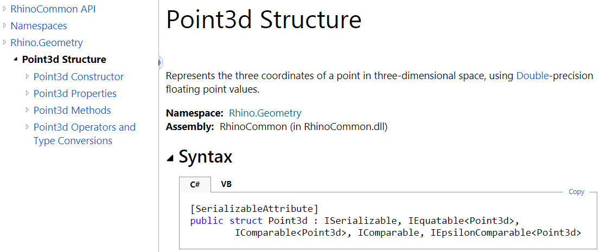

Here is a break down of what each part in the above **Point3d** documentation means:

<table class="rounded">
  <tr>
    <th>Part</th>
    <th>Description</th>
  </tr>
  <tr>
    <td><b>Point3D</b> Structure Represents the ...</td>
    <td>Title and description</td>
  </tr>
  <tr>
    <td><b>Namespace: Rhino.Geometry</b></td>
    <td>The namespace that contains Point3d</td>
  </tr>
  <tr>
    <td><b>Assembly: RhinoCommon (in RhinoCommon.dll)</b></td>
    <td>The assembly that includes that type. All geometry types are part of the RhinoCommon.dll</td>
  </tr>
  <tr>
    <td>/[SerializableAttribute/]</td>
    <td>Allow serializing the object</td>
  </tr>
  <tr>
    <td><b>public struct Point3d</b></td>
    <td>public: public access: your program can instantiate an object of that type</br>struct: structure value type.</br>Point3d: name of your structure</td>
  </tr>
 <tr>
    <td>: ISerializable,</br>
    IEquatable<Point3d>, </br>
    IComparable<Point3d>, </br>
    IComparable, </br>
    IEpsilonComparable<Point3d>
</td>
    <td>The “:” is used after the struct name to indicate what the struct implements.
Structures can implement any number of interfaces. An interface contains a common functionality that a structure or a class can implement. It helps with using consistent names to perform similar functionality across different types. 
For example IEquatable interface has a method called “Equal”. If a structure implements IEquatable, it must define what it does (in Point3d, it compares all X, Y and Z values and returns true or false).</td>
  </tr>
</table>

#### Point3d Constructors:

Structures define constructors to instantiate the data. One of the **Point3d** constructors takes three numbers to initialize the values of X, Y and Z. Here are all the constructors of the **Point3d** structure .

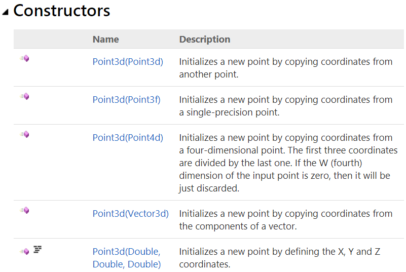

The following example shows how to define a variable of type Point3d using a GH C# component.

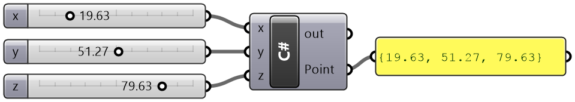

```C#
private void RunScript(double x, double y, double z, ref object Point)
{
    //Create an instance of a point and initialize to x, y and z
    Point3d pt = new Point3d(x, y, z);

    //Assign the point "pt" to output
    Point = pt;
}
```

#### Point3d Properties: 

Properties are mostly used to “get” and/or “set” the fields of the structure. For example, there are the “X”, “Y” and “Z” properties to get and set the coordinates of an instance of **Point3d**. Properties can be **static** to get specific points, such as the origin of the coordinate system (0,0,0). The following are **Point3d** properties as they appear in the documentation:

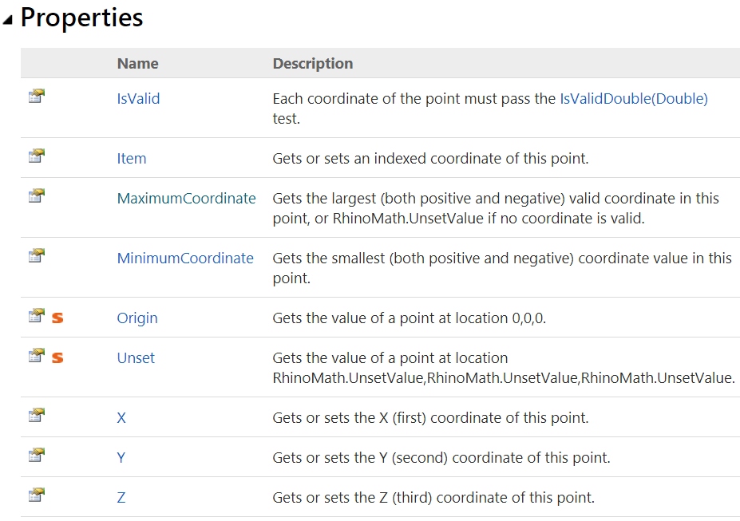
 
Here are two GH examples to show how to get and set the coordinates of a **Point3d**. 


```C#
private void RunScript(Point3d pt, ref object A, ref object B, ref object C)
{
    //Assign the point coordinates to output
    a = pt.X;
    b = pt.Y;
    c = pt.Z;
}
```


```C#
private void RunScript(double x, double y, double z, ref object Point)
{
    //Declare a new point
    Point3d newPoint = new Point3d(Point3d.Unset);

    //Set "new_pt" coordinates
    newPoint.X = x;
    newPoint.Y = y;
    newPoint.Z = z;

    //Assign the point coordinates to output
    Point = newPoint;
}
```
Static properties get or set a generic data of that type. The above example uses the static **Point3d** method **Unset** to unset the new point. Another example that is commonly used is the **origin** property in **Point3d** to get the origin of the coordinate system, which is (0,0,0) as in the following example.


```C#
private void RunScript( ref object Origin)
{
   Origin = Point3d.Origin;
}
```

#### Point3d Methods

The methods are used to help inquire about the data or perform specific calculations, comparisons, etc. For example, **Point3d** has a method to measure the distance to another point. All methods are listed in the documentation with full details about the parameters and the return value, and sometimes an example to show how they are used. In the documentation, **Parameters** refer to the input passed to the method and the **Return Value** describes the data returned to the caller. Notice that all methods can also be navigated through the left menu.


Here is how the **DistanceTo** method is used in an example.


```C#
private void RunScript( double x, double y, double z, Point3d other, ref object Point, ref object Distance)
{
    //Create an instance of a point and initialize to x, y and z
    Point3d pt = new Point3d(x, y, z);
    //Calculate the distance from "pt" to the "other" input point
    double dis = pt.DistanceTo(other);
    //Assign the point "point" to the A output
    Point = pt;
    //Assign the distance to the B output
    Distance = dis;
}
```

The **DistanceTo** method does not change the fields (the X, Y and Z). However, other methods such as **Transform** change the fields. The **Transform** method resets the X, Y and Z values to reflect the new location after applying the transform.


Here is an example that uses **Point3d.Transform**.


```C#
private void RunScript(Point3d pt, Transform xform, ref object Point)
{
    //Create an instance of a point and initialize to input point
    Point3d newPoint = new Point3d(pt);
    //Transform the point
    newPoint.Transform(xform);
    //Assign the point "new_pt" to the A output
    Point = newPoint;
}
```
#### Point3d static methods:

Point3d has **static** methods that are accessible without instantiating an instance of **Point3d**. For example, if you would like to check if a list of given instances of points are all coplanar, you can call the static method **Point3d.ArePointsCoplanar** without creating an instance of a point. Static methods have the little red “s” symbol in front of them in the documentation.

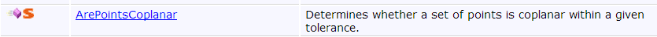

The **ArePointsCoplanar** has the following syntax, parameters and the return value.

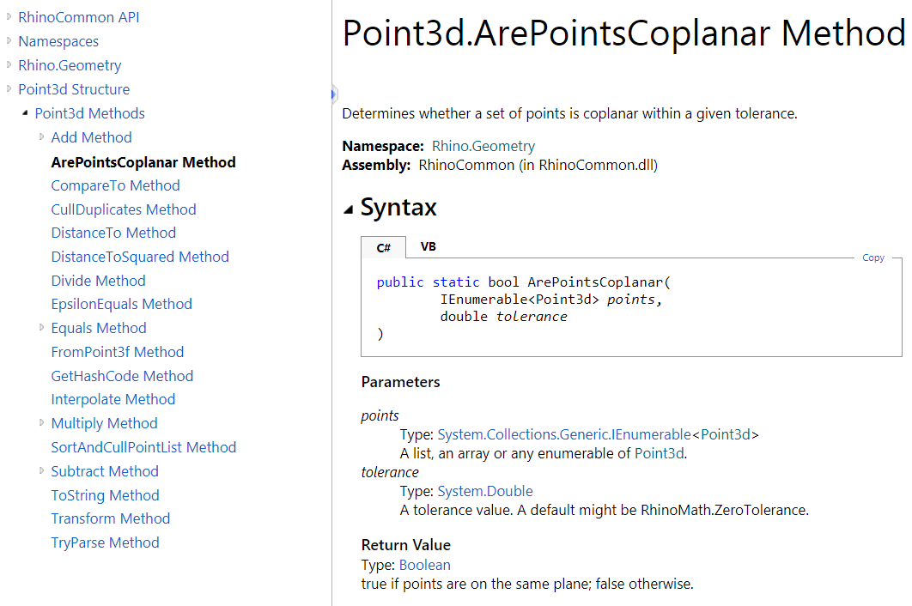

Here is an example that uses the static method **Point3d.ArePointsCoplanar**.


```C#
private void RunScript(List<Point3d> pts, double tol, ref object IsCoplanar)
{
     //Test if the list of input points are coplanar
    bool coplanar = Point3d.ArePointsCoplanar(pts, tol);

    //Assign the co-planar test to output
    IsCoplanar = coplanar;
}
```
#### Point3d Operators:

Many Structures and Classes in RhinoCommon implement operators whenever relevant. Operators enable you to use the “+” to add two points or use the “=” to assign the coordinates of one point to the other. **Point3d** structure implements many operators and this simplifies the coding and its readability. Although it is fairly intuitive in most cases, you should check the documentation to verify which operators are implemented and what they return. For example, the documentation of adding 2 **Point3d** indicates the result is a new instance of **Point3d** where X, Y and Z are calculated by adding corresponding fields of 2 input **Point3d**.


Note that all operators are declared **public** and **static**. Here is an example that shows how the “+” operator in **Point3d** is used. Note that the “+” returns a new instance of a **Point3d**.

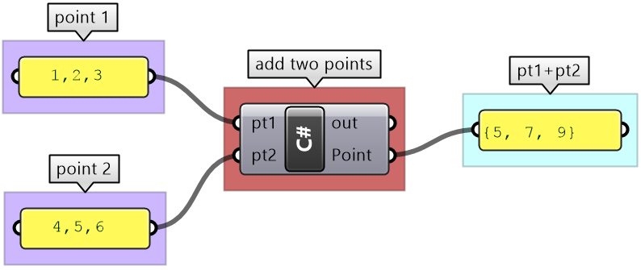

```C#
private void RunScript(Point3d pt1, Point3d pt2, ref object Point)
{
    //Add 2 points and assign result to output
    Point = pt1 + pt2;
}
```
#### Point3d as a function parameter:

**Point3d** is a value type because it is a structure. That means if you pass an instance of **Point3d** to a function and change its value inside that function, the original value outside the function will not be changed, as in the following example:


```C#
private void RunScript(double x, double y, double z, Point3d pt2, ref object Point)
{
    Point3d pt = new Point3d(x, y, z);
    Print("Before calling ChangeX function: pt.x=" + pt.X);


    //Call a function to change the value of X in the point
    ChangeX(pt);

    Print("After ChangeX: pt.x=" + pt.X);
    Point = pt;
}
 public void ChangeX(Point3d pt) 
 {
    pt.X = 100;
    Print("Inside ChangeX: pt.x=" + pt.X);
  }
```
### 3.2.2 Points and Vectors

**RhinoCommon** has a few structures to store and manipulate points and vectors.  Take for example the double precision points. There are three types of points that are commonly used listed in the table below. For more detailed explanation of vectors and points, please refer to the [Essential Mathematics for Computational Design](https://www.rhino3d.com/download/rhino/6/essentialmathematics), a publication by McNeel. 

<table class="rounded">
  <tr>
    <th>Class Name</th>
    <th>Member Variables</th>
    <th>Notes</th>
  </tr>
  <tr>
    <td><b>Point2d</b></td>
    <td>X as Double </br>Y as Double</td>
    <td>Used for parameter space points.</td>
  </tr>
  <tr>
    <td><b>Point3d</b></td>
    <td>X as Double </br>Y as Double</td>
    <td>Most commonly used to represent points in three dimensional coordinate space</td>
  </tr>
  <tr>
    <td><b>Point4d</b></td>
    <td>X as Double </br>Y as Double </br>Z as Double </br>W as Double</td>
    <td>Used for grips or control points.  Grips have weight information in addition to the 3D location.</td>
  </tr>
</table>

As for vectors, there are two main types.

<table class="rounded">
  <tr>
    <th>Class Name</th>
    <th>Member Variables</th>
    <th>Notes</th>
  </tr>
  <tr>
    <td><b>Vector2d</b></td>
    <td>X as Double </br>Y as Double</td>
    <td>Used in two dimensional space</td>
  </tr>
  <tr>
    <td><b>Vector3d</b></td>
    <td>X as Double </br>Y as Double </br>Z as Double</td>
    <td>Used in three dimensional space</td>
  </tr>
</table>

The following are a few point and vector operations with examples of output. The script starts with declaring and initializing a few values, then applying some operations.


<table class="multiline" width="100%">
<tr>
<th width="20%">Notation</th>
<th width="50%">Syntax</th>
<th>result</th>
</tr>
<tr>
<td>
Create a new instance of a point and vector
</td>
<td>

```C#
Point3d p0 = new Point3d(3, 6, 0);
Vector3d v0 = new Vector3d(4, 1.5, 0);
double factor = 0.5;
```

</td>
<td></td>
</tr>
<tr>
<td>Move a point by a vector</td>
<td>

```C#
Point3d p1 = new Point3d(Point3d.Unset);
p1 = p0 + v0;
```

</td>
<td></td>
</tr>
<tr>
<td>
Distance between 2 points
</td>
<td>

```C#
double distance = p0.DistanceTo(p1);
```

</td>
<td></td>
</tr>
<tr>
<td>
Point subtraction (create vector between two points)
</td>
<td>

```C#
Vector3d v1 = new Vector3d(Vector3d.Unset);
v1 = Point3d.Origin - p0;
```

</td>
<td>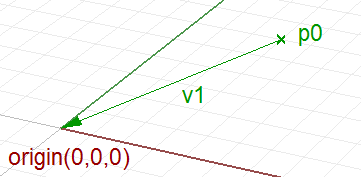</td>
</tr>
<tr>
<td>
Vector addition (create average vector)
</td>
<td>

```C#
Vector3d addVectors = new Vector3d(Vector3d.Unset);
addVectors = v0 + v1;
```

</td>
<td></td>
</tr>
<tr>
<td>
Vector subtraction
</td>
<td>

```C#
Vector3d subtractVectors = v0 - v1;
```

</td>
<td>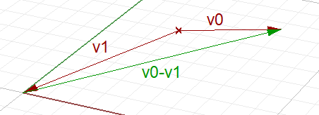</td>
</tr>
<tr>
<td>
Vector dot product (if result Is positive number then vectors are In the same direction)
</td>
<td>

```C#
double dot = v0 * v1;

/*---
For example if
v0 = <10, 0, 0>
v1 = <0, 10, 0>

then
dot = 0
*/
```

</td>
<td>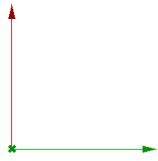</td>
</tr>
<tr>
<td>
Vector cross product (result is a vector normal to the 2 input vectors)
</td>
<td>

```C#
Vector3d cross = new Vector3d(Vector3d.Unset);
cross = Vector3d.CrossProduct(v0, v1);
```

</td>
<td></td>
</tr>
<tr>
<td>
Scale a vector
</td>
<td>

```C#
Vector3d scaleV0 = new Vector3d(Vector3d.Unset);
scaleV0 = factor * v0;
```

</td>
<td>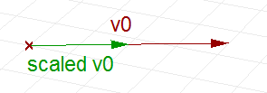</td>
</tr>
<tr>
<td>
Get vector length
</td>
<td>

```C#
double v0Length = v0.Length;
```

</td>
<td></td>
</tr>
<tr>
<td>
Use vector operations to get the angle between 2 vectors
</td>
<td>

```C#
// Unitize the input vectors
v0.Unitize();
v1.Unitize();
double dot = v0 * v1;

// Force the dot product of the two input vectors to
// fall within the domain for inverse cosine, which
// is -1 <= x <= 1. This will prevent runtime
// "domain error" math exceptions.
if ((dot < -1.0))
    dot = -1.0;
if ((dot > 1.0))
    dot = 1.0;
double angle = System.Math.Acos(dot);
```

</td>
<td>


```C#
v0 = <10, 0, 0>
v1 = <0, 10, 0>
dot = 0
angle = acos(0) = 90 degrees
```

</td>
</tr>
</table>

3.2.3: Lightweight curves

**RhinoCommon** defines basic types of curves such as lines and circles as structures and hence most of them are value types. The mathematical representation is easier to understand and is typically more light-weight.  If needed, it is relatively easy to get the Nurbs approximation of these curves using the method **ToNurbsCurve**. The following is a list of the lightweight curves.


<table class="rounded">
  <tr>
    <th>Lightweight Curves Types </th>
    <th></th>
  </tr>
  <tr>
    <td><b>Line</b></td>
    <td>Line between two points</td>
  </tr>
  <tr>
    <td><b>Polyline</b></td>
    <td>Polyline connecting a list of points (not value type)</td>
  </tr>
  <tr>
    <td><b>Arc</b></td>
    <td>Arc on a plane from center, radius, start and end angles</td>
  </tr>
  <tr>
    <td><b>Circle</b></td>
    <td>Circle on a plane from center point and radius</td>
  </tr>
  <tr>
    <td><b>Ellipse</b></td>
    <td>Defined by a plane and 2 radiuses</td>
  </tr>
 </table>

The following shows how to create instances of different lightweight curve objects:

<table class="multiline" width="100%">
<tr>
<th width="20%">Notation</th>
<th width="50%">Syntax</th>
<th>result</th>
</tr>
<tr>
<td>
Declare and initialize 3 new points
</td>
<td>

```C#
Point3d p0 = new Point3d(0, 0, 0);
Point3d p1 = new Point3d(5, 1, 0);
Point3d p2 = new Point3d(6, -3, 0);
```

</td>
<td></td>
</tr>
<tr>
<td>Create an instance of a Line </td>
<td>

```C#
//Create an instance of a lightweight Line
Line line = new Line(p0, p1);
```

</td>
<td>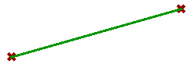</td>
</tr>
<tr>
<td>
Distance between 2 points
</td>
<td>

```C#
double distance = p0.DistanceTo(p1);
```

</td>
<td></td>
</tr>
<tr>
<td>
Create an instance of a Arc 
</td>
<td>

```C#
//Create an instance of a lightweight Arc
Arc arc = new Arc(p0, p1, p2);
```

</td>
<td></td>
</tr>
<tr>
<td>
Create an instance of a Polyline 
</td>
<td>

```C#
//Put the 3 points in a list
Point3d[ ] pointList = {p0, p1, p2};

//Create an instance of a lightweight Polyline
Polyline polyline = new Polyline(pointList);
```

</td>
<td></td>
</tr>
<tr>
<td>
Create an instance of a Circle
</td>
<td>

```C#
double radius = 3.5;

//Create an instance of a lightweight Circle
Circle circle = new Circle(p0, radius);
```

</td>
<td></td>
</tr>
<tr>
<td>
Create an list of instances of an Ellipse
</td>
<td>

```C#
double angle = 0.01; //angle in radian
int ellipseCount = 20; //number of ellipses
double x = 1.5; // shift along X axis

//Declare a new list of ellipse curve type
List<Ellipse> ellipseListist = new List<Ellipse>();

//Use a loop to create a number of ellipse curves
Plane plane = Plane.WorldXY;

for (Int i = 1; i <= ellipseCount; i++) {
      Point3d pt = new Point3d(x, 0, 0);
      Vector3d y = new Vector3d(0,1,0);
      plane.Rotate(angle * i, y , pt);

      //Declare and instantiate a new ellipse
      Ellipse ellipse = new Ellipse(plane, (double) i / 2, i);

      //Add the ellipse to the list
      ellipseList.Add(ellipse);
    }
```

</td>
<td></td>
</tr>
</table>

### 3.2.4: Lightweight surfaces

Just like with curves, **RhinoCommon** defines a number of lightweight surfaces that are defined as structures. They can be converted to Nurbs surfaces using the **ToNurbsSurface()** method. They include common surfaces such as cones and spheres. Here is a list of them:

<table class="rounded">
  <tr>
    <th>Lightweight Surface Types </th>
    <th></th>
  </tr>
  <tr>
    <td><b>Sphere</b></td>
    <td>Line between two points</td>
  </tr>
  <tr>
    <td><b>Cylinder</b></td>
    <td>Polyline connecting a list of points (not value type)</td>
  </tr>
  <tr>
    <td><b>Cone</b></td>
    <td>Arc on a plane from center, radius, start and end angles</td>
  </tr>
  <tr>
    <td><b>Torus</b></td>
    <td>Circle on a plane from center point and radius</td>
  </tr>
 </table>

The following shows how to create instances of different lightweight surface objects:


<table class="multiline" width="100%">
<tr>
<th width="20%">Notation</th>
<th width="50%">Syntax</th>
<th>result</th>
</tr>
<tr>
<td>
Create an instance of a Sphere 
</td>
<td>

```C#
Point3d center = Point3d.Origin;
double radius = 7.5;

Sphere sphere = new Sphere(center, radius);
```

</td>
<td></td>
</tr>
<tr>
<td>Create an instance of a Cylinder </td>
<td>

```C#
double height = 7.5;
double radius = 2.5;
Point3d center = Point3d.Origin;
Circle baseCircle = new Circle(center, radius);

Cylinder cy = new Cylinder(baseCircle, height);
```

</td>
<td></td>
</tr>
<tr>
<td>
Create an instance of a Cone 
</td>
<td>

```C#
double distance = p0.DistanceTo(p1);
```

</td>
<td></td>
</tr>
<tr>
<td>
Create an instance of a Arc 
</td>
<td>

```C#
double height = 7.5;
double radius = 7.5;

Cone cone = new Cone(Plane.WorldXY, height, radius);
```

</td>
<td>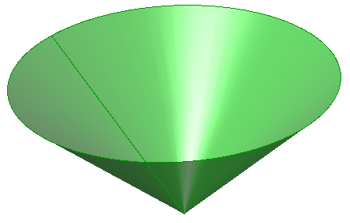</td>
</tr>
<tr>
<td>
Create an instance of a Polyline 
</td>
<td>

```C#
//Put the 3 points in a list
Point3d[ ] pointList = {p0, p1, p2};

//Create an instance of a lightweight Polyline
Polyline polyline = new Polyline(pointList);
```

</td>
<td></td>
</tr>
<tr>
<td>
Create an instance of a Torus 
</td>
<td>

```C#
double minorRadius = 2.5;
double majorRadius = 7.5;

Torus torus = new Torus(Plane.WorldXY, majorRadius, minorRadius);
```

</td>
<td></td>
</tr>
</table>

3.2.5: Other geometry structures

Now that we have explained the **Point3d** structure in some depth, and some of the lightweight geometry structures you should be able to review and use the rest using the **RhinoCommon** documentation. As a wrap up, the following example uses eight different structures defined in the **Rhino.Geometry** namespace. Those are **Plane**, **Point3d**, **Interval**, **Arc**, **Vector3d**, **Line**, **Sphere**, and **Cylinder**. The goal is to create the following composition.


Create an instance of a circle on the xy-plane, center (2,1,0) and a random radius between 10 and 20:

```#C
    //Generate a random radius of a circle
    Random rand = new Random();
    double radius = rand.Next(10, 20);

    //Create xy_plane using Plane static method WorldXY
    Plane plane = Plane.WorldXY;

    //Set plane origin to (2,1,0)
    Point3d center = new Point3d(2, 1, 0);
    plane.Origin = center;

    //Create a circle from plane and radius
    Circle circle = new Circle(plane, radius);
```

Create an instance of an arc from the circle and angle interval between 0 and Pi

```#C
    //Create an arc from an input circle and interval
    Interval angleInterval = new Interval(0, Math.PI);

    Arc arc = new Arc(circle, angleInterval);
```

Extract the end points of the arc and create a vertical lines with length = 10 units

```#C
    //Extract end points
    Point3d startPoint = arc.StartPoint;
    Point3d endPoint = arc.EndPoint;

    //Create a vertical vector
    Vector3d vec = Vector3d.ZAxis;
    //Use the multiplication operation to scale the vector by 10
    vec = vec * 10;

    //Create start and end lines
    Line line1 = new Line(startPoint, vec);
    Line line2 = new Line(endPoint, vec);
```
Create a cylinder around the start line with radius = line height/4, and a sphere around the second line centered in the middle and with radius = line height/4

```#C
    //Create a cylinder at line1 with radius = 1/4 the length
    double height = line1.Length;
    double radius = height / 4;
    Circle circle = new Circle(line1.From, radius);
    Cylinder cylinder = new Cylinder(c_circle, height);

    //Create a sphere at the center of line2 with radius = ¼
    // the length
    Point3d sphereCenter = line2.PointAt(0.5);
    Sphere sphere = new Sphere(sphereCenter, radius);
```

## 3.3: Geometry classes

Just like structures, classes enable defining custom types by grouping other types together along with some custom methods and events. A class is like a blueprint that encapsulates the data and the behavior of the user-defined type. But, unlike structures, classes allow **inheritance** which enables defining a hierarchy of types that starts with a generic type and branches into more specific types. For example, the **Curve** class in RhinoCommon branches into specialized curve types such as **ArcCurve** and **NurbsCurve**. The following diagram shows the hierarchy of the **Curve** class:


Most geometry classes are derived from the **GeometryBase** class. The following diagram shows the hierarchy of these classes.


You can instantiate an instance of most of the classes above. However, there are some classes that you cannot instantiate. Those are usually up in the hierarchy such as the **GeometryBase**, **Curve** and **Surface**. Those are called **abstract** classes.

* **Abstract Classes**: The **GeometryBase** in **RhinoCommon** is one example of an abstract class. You cannot create an object or instantiate an instance of an abstract class. The purpose is to define common data and functionality that all derived classes can share.
* **Base Classes**: refer to parent classes that define common functionality for the classes that are derived from them. The **Curve** class is an example of a base class that also happens to be an abstract (cannot instantiate an object from it). Base classes do not have to be abstract though. 


```#C
private void RunScript(ref object A)
{
    //ERROR: attempt to create an instance of the abstract "Curve" class
    Rhino.Geometry.Curve crv = new Rhino.Geometry.Curve();
}
```

* **Derived Classes**: inherit the members of a class they are derived from and add their own specific functionality and implementation. The **NurbsCurve** is an example of a derived class from the **Curve** class. The **NurbsCurve** can use all members in **Curve** class methods. The same is true for all other classes derived from **Curve**, such as **ArcCurve**, **PolyCurve**. The following example shows how to create a new instance of the **PolylineCurve** class.
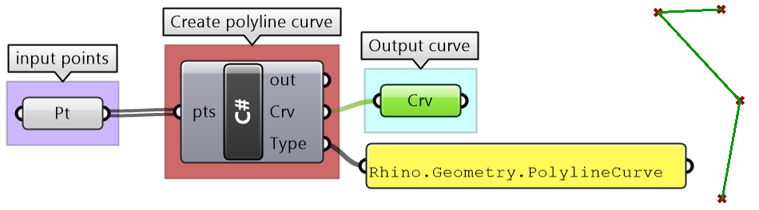

```#C
private void RunScript(List<Point3d> pts, int degree, ref object Crv, ref object Type)
{
    //Declare and create a new instance of a polyline curve from points
    var crv = new Rhino.Geometry.PolylineCurve(pts);
    //Assign curve to A output
    Crv = crv;
    //Assign curve type to B output
    Type = crv.GetType();
}
```
The most common way to create an instance of a class is to use the new keyword when declaring the object.

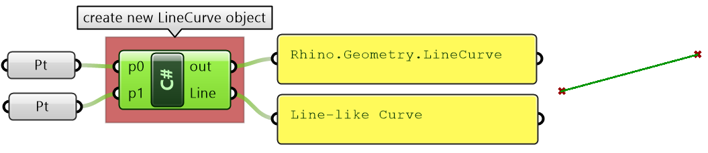

```#C
private void RunScript( Point3d p0, Point3d p1, ref object Line )
{
    //Create an instance of a point object and unset
    var lineCurve = new Rhino.Geometry.LineCurve(p0, p1);
    Print(lineCurve.ToString());
    Line = lineCurve
}
```

There is another common way to create instances of classes. That is to use special methods in some classes to help create and initialize a new instance of an object. For example, the **Curve** class has **static** methods to create a variety of curve types as in the following example. Notice that you do not need to use **new** in this case.

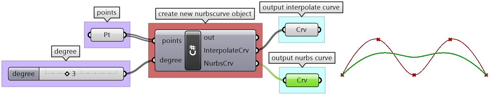

```#C
private void RunScript(List<Point3d> points, int degree, ref object A, ref object B)
{
    //Declare a curve variable
    Rhino.Geometry.Curve inter_crv = default(Rhino.Geometry.Curve);
    //Create new instance of a curve from interpolate points
    inter_crv = Rhino.Geometry.Curve.CreateInterpolatedCurve(points, degree);

    //Declare a curve variable
    Rhino.Geometry.Curve nurbs_crv = default(Rhino.Geometry.Curve);
    //Create new instance of a curve from control points
    nurbs_crv = Rhino.Geometry.Curve.CreateControlPointCurve(points, degree);

    //Assign output
    A = inter_crv;
    B = nurbs_crv;
}
```

The following sections summarizes the different ways to create new instances of objects, which applied to both class and structure types.

#### Use the class constructor

Need to use the new keyword. For example, the following creates a line from two points.

```C#
Rhino.Geometry.LineCurve lc = new Rhino.Geometry.LineCurve(p0, p1);
```

Note that each class may have a number of constructors that include different sets of parameters. For example the **LineCurve** class has the following constructors:


Many times, there are “protected” constructors. Those are used internally by the class and you cannot use them to create a new instance of the object with them. They are basically locked. The LineCurve class has one marked in the image above.

#### Use the  class static Create methods

Some classes include a **Create** method to generate a new instance of the class. Here is an example:

```C#
Rhino.Geometry.NurbsCurve nc = NurbsCurve.Create(isPeriodic, degree, controlPoints);
```

You can find these methods in the **RhinoCommon** help when you navigate the class “members”. Here are different ways to create a **NurbsCurve** for example and how they appear in the help.


#### Use the static Create methods of the parent class

There are times when the parent class has “Create” methods that can be used to instantiate an instance of the derived class. For example, the Curve class has few static methods that a derived class like NurbsCurve can use as in the example:

```C#
Rhino.Geometry.Curve crv= Curve.CreateControlPointCurve(controlPoints, degree);
Rhino.Geometry.NurbsCurve nc = crv as Rhino.Geometry.NurbsCurve;
```

For the full set of the **Curve Create** methods, check the **RhinoCommon** documentation. Here is an example of a few of them.

#### Use the return value of a function


Class methods return values and sometimes those are new instances of objects. For example the Offset method in the Curve class returns a new array of curves that is the result of the offset.

```C#
Curve[ ] offsetCurves = x.Offset( Plane.WorldXY, 1.4, 0.01, CurveOffsetCornerStyle.None );
```


Once you create an instance of a class or a structure, you will be able to see all class methods and properties through the auto-complete feature. When you start filling the method parameters, the auto-complete will show you which parameter you are at and its type.  This is a great way to navigate all available methods for each class and be reminded of what parameters are needed. Here is an example from a **Point3d** structure. Note that you don’t always get access to all the methods via the auto-complete. For the complete list of properties, operations and methods of each class, you should use the **RhinoCommon** help file.

<figure>
   
   <figcaption>Figure(23) Auto-complete help navigate the type methods</figcaption>
</figure> 

Classes and structures define properties to set and retrieve data. Each property has either a **Get** or a **Set** method, or both. The following example shows how to get and set the coordinates of a **Point3d** object.


```C#
private void RunScript(double degree, ref object A)
{
    //Create an instance of a point object and initialize to origin (0,0,0)
    Point3d pt = new Point3d(0, 0, 0);
    //Get coordinates and print to "output"
    Print("X = " + pt.X);
    //Set the x coordinate to a new value from input
    pt.X = x;
    //Print the new x value
    Print("X = " + pt.X);
    //Get the pt "x" value and assign to output
    A = pt.X;
}
```

Copying data from an existing class to a new one can be done a few different ways depending on what the class supports.  The following example shows how to copy data between two points using three different ways. It also shows how to use the **DuplicateCurve** method of the **Curve** class to create a new identical instance of a **Curve**.


```C#
private void RunScript(Point3d pt, Curve crv, ref object newCrv)
{
    //Different ways to copy data between objects
    //Use the constructor when you instantiate an instance Of the Point3d class
    Point3d newPt1 = new Point3d(pt);
    Print("new pt1 = " + newPt1.ToString());

    //Use the “= Operator” If the Class provides one
    Point3d newPt2 = new Point3d(Point3d.Unset);
    newPt2 = pt;
    Print("new pt2 = " + newPt2.ToString());

    //Copy the properties one by one
    Point3d newPt3 = new Point3d(Point3d.Unset);
    newPt3.X = pt.X;
    newPt3.Y = pt.Y;
    newPt3.Z = pt.Z;
    Print("new pt3 = " + newPt3.ToString());

    //Some geometry  classes provide “Duplicate” method that Is very efficient to use
    newCrv = crv.DuplicateCurve();
}
```

### 3.3.1: Curves

The **RhinoCommon SDK** has the abstract **Rhino.Geometry.Curve** class that provides a rich set of functionality across all curves. There are many classes derived from the parent **Curve** class and we will learn about how to create and manipulate them. The following is a list of the classes derived from the **Curve** class.

<table class="rounded">
  <tr>
    <th>Curve Types</th>
    <th>Notes</th>
  </tr>
  <tr>
    <td><b>ArcCurve</b></td>
    <td>Used to create arcs and circles</td>
  </tr>
  <tr>
    <td><b>LineCurve</b></td>
    <td>Used to create lines</td>
  </tr>
  <tr>
    <td><b>NurbsCurve</b></td>
    <td>Used to create free form curves</td>
  </tr>
  <tr>
    <td><b>PolyCurves</b></td>
    <td>A curve that has multiple segments joined together</td>
  </tr>
  <tr>
    <td><b>PolylineCurve</b></td>
    <td>A curve that has multiple lines joined together</td>
  </tr>
  <tr>
    <td><b>CurveProxy</b></td>
    <td>Cannot instantiate an instance of it. Both BrepEdge and BrepTrim types are derived from the CurveProxy class.</td>
  </tr>
 </table>

#### Create curve objects:

One way to create a curve object is to use the create methods available as **static** methods in the parent **Rhino.Geometry.Curve** class. Here is an example.

Create an instance of a **NurbsCurve** from control points and degree

```C#
Curve nc = Rhino.Geometry.Curve.CreateControlPointCurve(points, degree);
```


## Next Steps

That was a basic overview of Python running in Rhino.  Now learn to use [operators and functions](/guides/rhinopython/primer-101/4-operators-and-functions/) to get something done.
