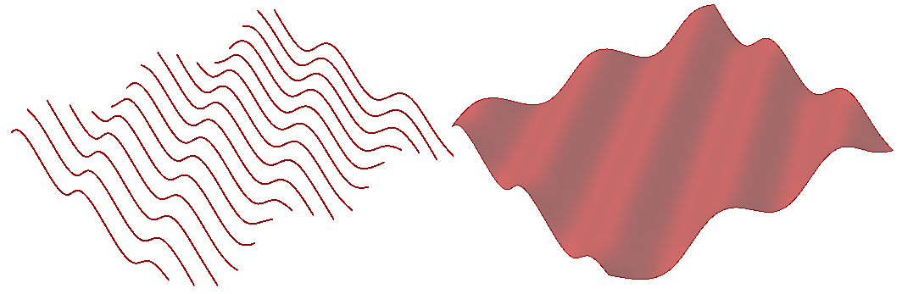
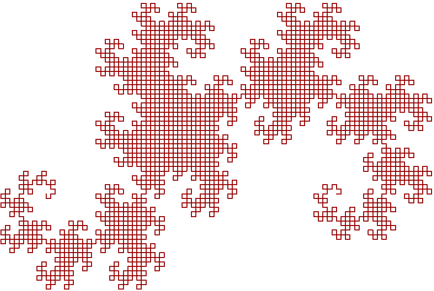
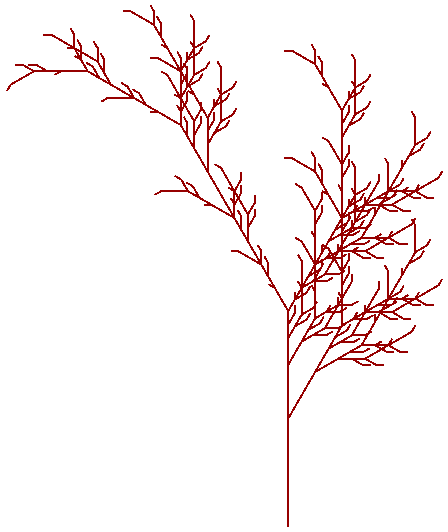
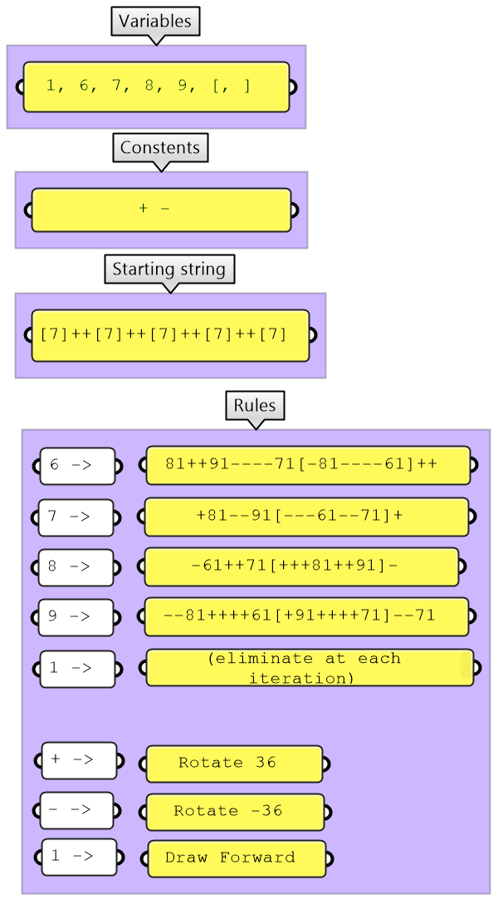
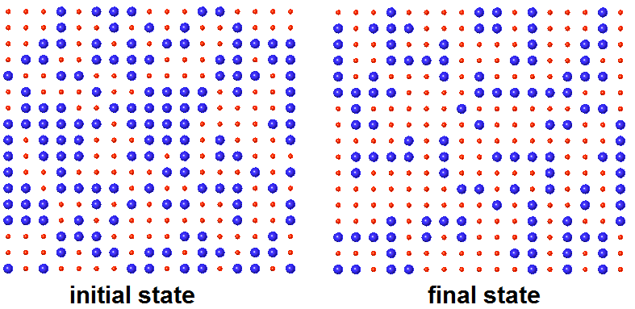

+++
aliases = ["/en"]
authors = [ "rajaa" ]
categories = [ "Csharp Essentials" ]
category_page = "guides/grasshopper/csharp-essentials/"
keywords = [ "csharp", "commands" ]
languages = [ "C#" ]
sdk = [ "RhinoCommon" ]
title = "Chapter 4: Design Algorithms"
type = "guides"
weight = 15
override_last_modified = "2018-12-05T14:59:06Z"
draft = false

[admin]
picky_sisters = ""
state = ""

[included_in]
platforms = [ "Windows", "Mac" ]
since = 7
until = ""

[page_options]
block_webcrawlers = false
byline = true
toc = true
toc_type = "single"
+++

## 4.1 Introduction

In this chapter we will implement a few examples to create mathematical curves & surfaces and solve a few generative algorithms using C# in Grasshopper. Many of the examples involve using loops & recursions, which are not supported in regular Grasshopper components.

## 4.2 Geometry Algorithms

It is relatively easy to create curves & surfaces that follow certain mathematical equations when you use scripting. You can generate control points to create smooth NURBS or interpolate points to create the geometry.

### 4.2.1 Sine Curves & Surface

The following example shows how to create NurbsCurves, NurbsSurfaces, and a lofted Brep using the sine of an angle:

Create curves & surface using the sine equation



```C#
private void RunScript(int num, ref object OutCurves, ref object OutSurface, ref object OutLoft)
{
  // List of all points
  List<Point3d> allPoints = new List<Point3d>();
  // List of curves
  List<Curve> curves = new List<Curve>();

  for(int y = 0; y < num; y++)
  {
      // Curve points
      List<Point3d> crvPoints= new List<Point3d>();
      for(int x = 0; x < num; x++)
      {
        double z = Math.Sin(Math.PI / 180 + (x + y));
        Point3d pt = new Point3d(x, y, z);
        crvPoints.Add(pt);
        allPoints.Add(pt);
      }
      // Create a degree 3 nurbs curve from control points
      NurbsCurve crv = Curve.CreateControlPointCurve(crvPoints, 3);
      curves.Add(crv);
  }
  // Create a nurbs surface from control points
  NurbsSurface srf = NurbsSurface.CreateFromPoints(allPoints, num, num, 3, 3);

  // Create a lofted brep from curves
  Brep[ ] breps = Brep.CreateFromLoft(curves, Point3d.Unset, Point3d.Unset, LoftType.Tight, false);

  // Assign output
  OutCurves = curves;
  OutSurface = srf;
  OutLoft = breps;
}
```

### 4.2.2 De Casteljau Algorithm to Interpolate a Bezier Curve

You can create a cubic Bezier curve from four input points. The De Casteljau algorithm is used in computer graphics to evaluate the Bezier curve at any parameter. If evaluated at multiple parameters, then the points can be connected to draw the curve. The following example shows a recursive function implementation to interpolate through a Bezier curve:

The De Casteljau algorithm to draw a Bezier curve with 2, 4, 8, and 16 segments


```C#
private void RunScript(Point3d pt0, Point3d pt1, Point3d pt2, Point3d pt3, int segments, ref object BezierCrv)
{
    if(segments < 2)
      segments = 2;

    List<Point3d> bezierPts = new List<Point3d>();
    bezierPts.Add(pt0);
    bezierPts.Add(pt1);
    bezierPts.Add(pt2);
    bezierPts.Add(pt3);

    List<Point3d> evalPts = new List<Point3d>();
    double step = 1 / (double) segments;
    for(int i = 0; i <= segments; i++)
    {
      double t = i * step;
      Point3d pt = Point3d.Unset;
      EvalPoint(bezierPts, t, ref pt);
      if(pt.IsValid)
        evalPts.Add(pt);
    }
    Polyline pline = new Polyline(evalPts);
    BezierCrv = pline;
}
void EvalPoint(List<Point3d> points, double t, ref Point3d evalPt)
{
    // Stopping condition - point at parameter t is found
    if(points.Count < 2)
      return;
    List<Point3d> tPoints = new List<Point3d>();
    for(int i = 1; i < points.Count; i++)
    {
      Line line = new Line(points[i - 1], points[i]);
      Point3d pt = line.PointAt(t);
      tPoints.Add(pt);
    }
    if(tPoints.Count == 1)
      evalPt = tPoints[0];
    EvalPoint(tPoints, t, ref evalPt);
}
```
### 4.2.3 Simple Subdivision Mesh

The following example takes a surface & closed polyline, then creates a subdivision mesh. It pulls the midpoints of the polyline edges to the surface to then subdivide & pull again:


```C#
private void RunScript(Surface srf, List<Polyline> inPolylines, int degree, ref object OutPolylines, ref object OutMesh)
{
    // Instantiate the collection of all panels
    List<Polyline> outPanels = new List<Polyline>();
    // Limit to 6 subdivisions
    if( degree > 6)
      degree = 6;
    for(int i = 0; i < degree; i++)
    {
      // Outer polylines
      List<Polyline> plines = new List<Polyline>();
      // Mid polylines
      List<Polyline> midPlines = new List<Polyline>();
      // Generate subdivided panels
      bool result = SubPanelOnSurface(srf, inPolylines, ref plines, ref midPlines);
      if( result == false)
        break;
      // Add outer panels
      outPanels.AddRange(plines);
      // Add mid panels only in the last iteration
      if(i == degree - 1)
        outPanels.AddRange(midPlines);
      else // Subdivide mid panels only
        inPolylines = midPlines;
    }
    // Create a mesh from all polylines
    Mesh joinedMesh = new Mesh();
    for(int i = 0; i < outPanels.Count; i++)
    {
      Mesh mesh = Mesh.CreateFromClosedPolyline(outPanels[i]);
      joinedMesh.Append(mesh);
    }
    // Make sure all mesh faces normals are in the same general direction
    joinedMesh.UnifyNormals();

    // Assign output
    OutPolylines = outPanels;
    OutMesh = joinedMesh;
    bool SubPanelOnSurface( Surface srf, List<Polyline>
 inputPanels, ref List<Polyline> outPanels, ref List<Polyline> midPanels)
{
    // Check for a valid input
    if (inputPanels.Count == 0 || null == srf)
      return false;
    for (int i = 0; i < inputPanels.Count; i++)
    {
      Polyline ipline = inputPanels[i];
      if (!ipline.IsValid || !ipline.IsClosed)
        continue;
      // Stack of points
      List<Point3d> stack = new List<Point3d>();
      Polyline newPline = new Polyline();
      for (int j = 1; j < ipline.Count; j++)
      {
        Line line = new Line(ipline[j - 1], ipline[j]);
        if (line.IsValid)
        {
          Point3d mid = line.PointAt(0.5);
          double s, t;
          srf.ClosestPoint(mid, out s, out t);
          mid = srf.PointAt(s, t);
          newPline.Add(mid);
          stack.Add(ipline[j - 1]);
          stack.Add(mid);
        }
      }
      // Add the first 2 point to close last triangle
      stack.Add(stack[0]);
      stack.Add(stack[1]);
      // Close
      newPline.Add(newPline[0]);
      midPanels.Add(newPline);

      for (int j = 2; j < stack.Count; j = j + 1)
      {
        Polyline pl = new Polyline { stack[j - 2], stack[j - 1], stack[j], stack[j - 2] };
        outPanels.Add(pl);
      }
    }
    return true;
}
```

## 4.3 Generative Algorithms

Most of the generative algorithms require recursive functions that are only possible through scripting in Grasshopper. The following are four examples of generative solutions to generate the dragon curve, fractals, penrose tiling, and game of life:

### 4.3.1 Dragon Curve

<table>
<tr>
<td>

</td>
<td>

</td>
</tr>
</table>

```C#
private void RunScript(string startString, string ruleX, string ruleY, int Num, double Length, ref object DragonCurve)
{
    // Declare string
    string dragonString = startString;
    // Generate the string
    GrowString(ref Num, ref dragonString , ruleX, ruleY);
    // Generate the points
    List<Point3d> dragonPoints = new List<Point3d>();;
    ParseDeagonString(dragonString, Length, ref dragonPoints);
    // Create the curve
    PolylineCurve dragonCrv= new PolylineCurve(dragonPoints); 
    // Assign output
    DragonCurve = dragonCrv;
}
void GrowString(ref int Num, ref string finalString, string ruleX, string ruleY)
  {
    // Decrement the count with each new execution of the grow function
    Num = Num - 1;
    char rule;
    // Create new string
    string newString = "";
    for (int i = 0; i < finalString.Length ; i++)
    {
      rule = finalString[i];
      if (rule == 'X')
        newString = newString + ruleX;
      if (rule == 'Y')
        newString = newString + ruleY;
      if (rule == 'F' | rule == '+' | rule == '-')
        newString = newString + rule;
    }
    finalString = newString;
    // Stopper condition
    if (Num == 0)
      return;
    // Grow again
    GrowString(ref Num, ref finalString, ruleX, ruleY);
}
void ParseDeagonString(string dragonString, double Length, ref List<Point3d> dragonPoints)
{
    // Parse instruction string to generate points
    // Let base point be world origin
    Point3d pt = Point3d.Origin;
    dragonPoints .Add(pt);

    // Drawing direction vector - strat along the x-axis
    // Vector direction will be rotated depending on (+,-) instructions
    Vector3d V = new Vector3d(1.0, 0.0, 0.0);

    char rule;
    for(int i = 0 ; i < dragonString.Length;i++)
    {
      // Always start for 1 & length 1 to get one char at a time
      rule = DragonString[i];
      // Move forward using direction vector
      if( rule == 'F')
      {
        pt = pt + (V * Length);
        dragonPoints.Add(pt);
      }
      // Rotate Left
      if( rule == '+')
        V.Rotate(Math.PI / 2, Vector3d.ZAxis);
      // Rotate Right
      if( rule == '-')
        V.Rotate(-Math.PI / 2, Vector3d.ZAxis);
    }
}
```

### 4.3.2 Fractal Tree

<table>
<tr>
<td>

</td>
<td>

</td>
</tr>
</table>

```C#
private void RunScript(string startString, string ruleX, string ruleY, int num, double length, ref object FractalLines)
{
    // Declare string
    string fractalString = startString;
    // Denerate the string
    GrowString(ref num, ref dragonString , ruleX, ruleY);
    // Generate the points
    List<Line> fractalLines = new List<Line>();;
    ParsefractalString(fractalString, length, ref fractalLines );
    // Assign output
    FractalLines = fractalLines ;
}
void GrowString(ref int num, ref string finalString, string ruleX, string ruleF)
{
    // Decrement the count with each new execution of the grow function
    num = num - 1;
    char rule;
    // Create new string
    string newString = "";
    for (int i = 0; i < finalString.Length ; i++)
    {
      rule = finalString[i];
      if (rule == 'X')
        newString = newString + ruleX;
      if (rule == 'F')
        newString = newString + ruleF;
      if (rule == '[' || rule == ']' || rule == '+' || rule == '-')
        newString = newString + rule;
    }
    finalString = newString;
    // Stopper condition
    if (num == 0)
      return;
    // Grow again
    GrowString(ref num, ref finalString, ruleX, ruleF);
}
void ParsefractalString(string fractalString, double length, ref List<Line> fractalLines)
{
    // Parse instruction string to generate points
    // Let base point be world origin
    Point3d pt = Point3d.Origin;

    // Declare points array
    // Vector rotates with (+,-) instructions by 30 degrees
    List<Point3d> arrPoints = new List<Point3d>();

    // Draw forward direction
    // Vector direction will be rotated depending on (+,-) instructions
    Vector3d vec = new Vector3d(0.0, 1.0, 0.0);

    // Stacks of points and vectors
    List<Point3d> ptStack = new List<Point3d>();
    List<Vector3d> vStack = new List<Vector3d>();

    // Declare loop variables
    char rule;
    for(int i = 0 ; i < fractalString.Length; i++)
    {
      // Always start for 1 & length 1 to get one char at a time
      rule = fractalString[i];
      // Rotate Left
      if( rule == '+')
        vec.Rotate(Math.PI / 6, Vector3d.ZAxis);
      // Rotate Right
      if( rule == '-')
        vec.Rotate(-Math.PI / 6, Vector3d.ZAxis);
      // Draw Forward by direction
      if( rule == 'F')
      {
        // Add current points
        Point3d newPt1 = new Point3d(pt);
        arrPoints.Add(newPt1);
        // Calculate next point
        Point3d newPt2 = new Point3d(pt);
        newPt2 = newPt2 + (vec * length);
        // Add next point
        arrPoints.Add(newPt2);
        // Save new location
        pt = newPt2;
      }
      // Save point location
      if( rule == '[')
      {
        // Save current point & direction
        Point3d newPt = new Point3d(pt);
        ptStack.Add(newPt);

        Vector3d newV = new Vector3d(vec);
        vStack.Add(newV);
      }
      // Retrieve point & direction
      if( rule == ']')
      {
        pt = ptStack[ptStack.Count - 1];
        vec = vStack[vStack.Count - 1];
        // Remove from stack
        ptStack.RemoveAt(ptStack.Count - 1);
        vStack.RemoveAt(vStack.Count - 1);
      }
    }
    // Generate lines
    List<Line> allLines = new List<Line>();
    for(int i = 1; i < arrPoints.Count; i = i + 2)
    {
      Line line = new Line(arrPoints[i - 1], arrPoints[i]);
      allLines.Add(line);
    }
}
```

### 4.3.3 Penrose Tiling

<table>
<tr>
<td>

</td>
<td>

</td>
</tr>
</table>

```C#
private void RunScript(string startString, string rule6, string rule7, string rule8, string rule9, int num, ref object PenroseString)
  {
    // Declare string
    string finalString;
    finalString = startString;
    // Generate the string
    GrowString(ref num, ref finalString, rule6, rule7, rule8, rule9);
    // Return the string
    PenroseString = finalString;
  }
  void GrowString(ref int num, ref string finalString, string rule6, string rule7, string rule8, string rule9)
  {
    // Decrement the count with each new execution of the grow function
    num = num - 1;
    char rule;

    // Create new string
    string newString = "";
    for (int i = 0; i < finalString.Length; i++)
    {
      rule = finalString[i];
      if (rule == '6')
        newString = newString + rule6;
      if (rule == '7')
        newString = newString + rule7;
      if (rule == '8')
        newString = newString + rule8;
      if (rule == '9')
        newString = newString + rule9;

      if (rule == '[' || rule == ']' || rule == '+' || rule == '-')
        newString = newString + rule;
    }
    finalString = newString;

    // Stopper condition
    if (num == 0)
      return;

    // Grow again
    GrowString(ref num, ref finalString, rule6, rule7, rule8, rule9);
  }
private void RunScript(string penroseString, double length, ref object PenroseLines)
  {
    // Parse instruction string to generate points
    // Let base point be world origin
    Point3d pt = Point3d.Origin;

    // Declare points array
    // Vector rotates with (+,-) instructions by 36 degrees
    List<Point3d> arrPoints = new List<Point3d>();

    // Draw forward direction
    // Vector direction will be rotated depending on (+,-) instructions
    Vector3d vec = new Vector3d(1.0, 0.0, 0.0);

    // Stacks of points & vectors
    List<Point3d> ptStack = new List<Point3d>();
    List<Vector3d> vStack = new List<Vector3d>();

    // Declare loop variables
    char rule;
    for(int i = 0 ; i < penroseString.Length; i++)
    {
      // Always start for 1 & length 1 to get one char at a time
      rule = penroseString[i];
      // Rotate Left
      if( rule == '+')
        vec.Rotate(36 * (Math.PI / 180), Vector3d.ZAxis);
      // Rotate Right
      if( rule == '-')
        vec.Rotate(-36 * (Math.PI / 180), Vector3d.ZAxis);
      // Draw Forward by direction
      if( rule == '1')
      {
        // Add current points
        Point3d newPt1 = new Point3d(pt);
        arrPoints.Add(newPt1);
        // Calculate next point
        Point3d newPt2 = pt + (vec * length);
        // Add next point
        arrPoints.Add(newPt2);
        // Save new location
        pt = newPt2;
      }

      // Save point location
      if( rule == '[')
      {
        // Save current point & direction
        Point3d newPt = new Point3d(pt);
        ptStack.Add(newPt);

        Vector3d newVec = new Vector3d(vec);
        vStack.Add(newVec);
      }

      // Retrieve point & direction
      if( rule == ']')
      {
        pt = ptStack[ptStack.Count - 1];
        vec = vStack[vStack.Count - 1];

        // Remove from stack
        ptStack.RemoveAt(ptStack.Count - 1);
        vStack.RemoveAt(vStack.Count - 1);
      }
    }

    // Generate lines
    List<Line> allLines = new List<Line>();
    for(int i = 1; i < arrPoints.Count; i = i + 2)
    {
      Line line = new Line(arrPoints[i - 1], arrPoints[i]);
      allLines.Add(line);
    }

    PenroseLines = allLines;
  }
```

### 4.3.4 Conway Game of Life

A cellular automaton consists of a regular grid of cells, each in one of a finite number of states, "On" & "Off" for example. The grid can be in any finite number of dimensions. For each cell, a set of cells called its neighborhood (usually including the cell itself) is defined relative to the specified cell. For example, the neighborhood of a cell might be defined as the set of cells a distance of 2 or less from the cell. An initial state (time t=0) is selected by assigning a state for each cell. A new generation is created (advancing t by 1), according to some fixed rule (generally, a mathematical function) that determines the new state of each cell in terms of the current state of the cell and the states of the cells in its neighborhood. *Check wikipedia for full details and examples.*



```C#
  private void RunScript(Surface srf, int uNum, int vNum, int seed, ref object PointGrid, ref object StateGrid)
  {
    if(uNum < 2)
      uNum = 2;
    if(vNum < 2)
      vNum = 2;

    double uStep = srf.Domain(0).Length / uNum;
    double vStep = srf.Domain(1).Length / vNum;
    double uMin = srf.Domain(0).Min;
    double vMin = srf.Domain(1).Min;

    // Create a grid of points & a grid of states
    DataTree<Point3d> pointsTree = new DataTree<Point3d>();
    DataTree<int> statesTree = new DataTree<int>();
    int pathIndex = 0;
    Random rand = new Random(seed);
    for (int i = 0; i <= uNum; i++)
    {
      List<Point3d> ptList = new List<Point3d>();
      List<int> stateList = new List<int>();
      GH_Path path = new GH_Path(pathIndex);
      pathIndex = pathIndex + 1;
      for (int j = 0; j <= vNum; j++)
      {
        Point3d srfPt = srf.PointAt(uMin + i * uStep, vMin + j * vStep);
        ptList.Add(srfPt);
        int randState = rand.Next(0, 2);
        stateList.Add(randState);
      }
      pointsTree.AddRange(ptList, path);
      statesTree.AddRange(stateList, path);
    }

    PointGrid = pointsTree;
    StateGrid = statesTree;

  }


  private void RunScript(DataTree<int> grid, int gen, ref object OutGrid)
  {
    // Get state at the defined generation
    for(int i = 0; i < gen; i++)
      grid = NewGeneration(grid);

    OutGrid = grid;
  }


  public DataTree<int> NewGeneration(DataTree<int> inStates)
  {
    int i, j, c, nc;
    List<int> prvBranch;
    List<int> nxtBranch;
    List<int> branch;
    DataTree<int> states = new DataTree<int>();
    states = inStates;

    for (i = 0; i <= states.Branches.Count - 1; i++)
    {
      branch = states.Branches[i];
      for (j = 0; j <= branch.Count - 1; j++)
      {
        c = branch[j];
        nc = 0;

        // Check neighbouring states
        // Next
        nc = nc + branch[(j + 1 + branch.Count) % branch.Count];
        // Prev
        nc = nc + branch[(j - 1 + branch.Count) % branch.Count];

        // Top
        nxtBranch = states.Branches[(i + 1 + states.Branches.Count) % states.Branches.Count];
        nc = nc + nxtBranch[(j + 1 + nxtBranch.Count) % nxtBranch.Count];
        nc = nc + nxtBranch[(j + nxtBranch.Count) % nxtBranch.Count];
        nc = nc + nxtBranch[(j - 1 + nxtBranch.Count) % nxtBranch.Count];

        // Bottom
        prvBranch = states.Branches[(i - 1 + states.Branches.Count) % states.Branches.Count];
        nc = nc + prvBranch[(j + 1 + prvBranch.Count) % prvBranch.Count];
        nc = nc + prvBranch[(j + prvBranch.Count) % prvBranch.Count];
        nc = nc + prvBranch[(j - 1 + prvBranch.Count) % prvBranch.Count];

        // Set the new state
        if (c == 1)
        {
          if (nc < 2 | nc > 3)
            c = 0;
        }
        else if (c == 0)
        {
          if (nc == 3)
            c = 1;
        }
        branch[j] = c;
      }
    }
    return states;
  }
```


## End of Guide

This is part 4 of the [Essential C# Scripting for Grasshopper guide](/guides/grasshopper/csharp-essentials/).
