+++
aliases = []
authors = [ "rajaa" ]
categories = [ "Essentials Algorithms and Data Structures" ]
category_page = "guides/grasshopper/gh-algorithms-and-data/"
keywords = [ "data structures", "grasshopper" ]
languages = [ "" ]
sdk = [ "" ]
title = "Chapter 3: Advanced Data Structures"
type = "guides"
weight = 15
override_last_modified = "2024-07-15T14:59:06Z"
draft = false

[admin]
picky_sisters = ""
state = ""

[included_in]
platforms = [ "Windows", "Mac" ]
since = 7
until = ""

[page_options]
block_webcrawlers = false
byline = true
toc = true
toc_type = "single"
+++

This chapter is devoted to the advanced data structure in GH, namely the data trees, and different ways to generate and manage them. The aim is to start to appreciate when and how to use tree structures, and best practices to effectively use and manipulate them. 

## 3.1 The Grasshopper data structure

### 3.1.1 Introduction
 <a href="https://vimeo.com/showcase/11456959/video/1030603776" target="_blank"> Introduction to data trees</a>

In programming, there are many data structures to govern how data is stored and accessed. The most common data structures are variables, arrays, and nested arrays. There are other data structures that are optimised for specific purposes such as data sorting or mining. In Grasshopper, there is only one structure to store data, and that is the <b>data tree</b>. Hold on, what about what we have learned so far: <b>single</b> item and <b>list</b> of items? Well, in GH, those are nothing but simple trees. A single item is a tree with one branch, that has one element, and a list is a tree with one branch that has a number of elements. It is actually pretty elegant to be able to fit all data in one unifying data structure, but at the same time, this requires the user to be aware and vigilant about how their data structure changes between operations, and how that can affect intended results. This chapter attempts to demystify the data tree of Grasshopper.

### 3.1.2 Processing data trees

We used the <b>Panel</b> and <b>Parameter Viewer</b> components to view the data structure. We will use both extensively to show how data is stored. Let’s start with a single item input. The Parameter Viewer has two display modes, one with text and one that is graphical. You can see that the single item input is stored in one branch that has only one item.
<figure>
   
   <figcaption>Figure(51): Different ways to preview the data structure in Grasshopper</figcaption>
</figure>

The <b>Parameter Viewer</b> shows each branch address (called “Path”), and the number of elements in that branch as shown in Figure (52).
<figure>
   
   <figcaption>Figure(51): The Parameter Viewer indicates the path address and the number of elements in each branch</figcaption>
</figure>

A list of items is typically stored in a tree with one branch. Figure (53). However, the three items can also be stored in three different branches. Figure (54).

<figure>
   
   <figcaption>Figure(53): A list is a tree that has one branch with multiple elements</figcaption>
</figure>

<figure>
   
   <figcaption>Figure(54): A tree contains any number of branches with any number of elements in each branch</figcaption>
</figure>

The key to understanding the Grasshopper data structure is to be able to answer the following question: 
<b>What is the significance of storing x number of values in one branch vs using x number of branches to store one value in each branch?</b> 
The data structure informs GH components about how to match input values. In other words, components may process data differently based on their structure. The following example illustrates how different data structures for the same set of values can affect the result.

<figure>
   
   <figcaption>Figure(55): Organizing same set of value in different data structures affect the output</figcaption>
</figure>

We will elaborate on data tree matching later, but you can already see that GH components do pay attention to the data structure and the result can vary considerably based on it. This is one of the complications inherited in using one unifying data structure in a programming language.

### 3.1.3 Data tree notation
The first step to understanding data trees is to learn the GH notation of trees. As we have seen from the examples, trees consist of branches, and each branch holds a number of elements. The address or path of each branch is represented with integers separated by semicolons and enclosed in curly brackets. The index of each element is enclosed by square brackets. This diagram shows a breakdown of the address of elements in trees.

<figure>
   
   <figcaption>Figure(56): Address of elements include the address of the branch and the index of the element in the branch</figcaption>
</figure>

Here are a few examples of various tree structures and how they show in the <b>Parameter Viewer</b> and the <b>Panel</b>.

<figure>
   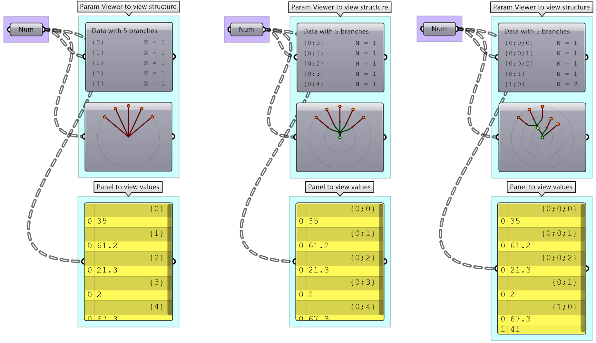
   <figcaption>Figure(57): Same set of values held in different structures. Left: 5 trunks (5 trees) with one item in each. Middle: 5 branches out of one trunk (1 tree), and each branch holds a single item. Right: two trunks (2 trees), the first has 2 branches with the first branching into 3 branches, each holds one item, the second holds 1 item. The second trunk holds 2 items.
</figcaption>
</figure>

<table class="rounded">
  <tr>
    <th>Tutorial 3.1.1 Data tree</th>
  </tr>
  <tr>
  <td>
   <table>
    <tr>
     <td>
     1. In the tree, what is the full address to the item <b>1.2</b>? Note that order of branches and leaves is always from left to right going clockwise  
     2. Construct the tree of numbers shown in the image below using the <b>Number</b> parameter only.
     </td>
     <td>
     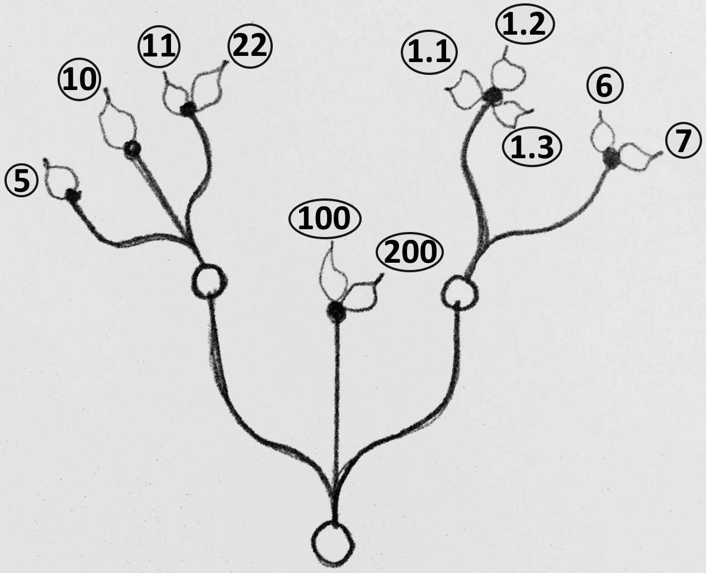
     </td>
    </tr>
   </table>
  </td>
  </tr>
  <tr>
    <td>
        

        
<b>Solution...</b>

         
        <table>
          <tr>
            <td>
            The path to <b>1.2</b> is: <b>{ 0 ; 3 ; 0} [ 1 ]</b> 
             Note: The three branches from the main trunk are set here to 0:1, 0:2, and 0:3. They also could have been 0:0, 0:1 and 0:2. Both are correct.
            </td>
            <td>
            
            </td>
          </tr>
        </table>
          
        

    </td>
  </tr>
</table>

## 3.2 Generating trees
 <a href="https://vimeo.com/showcase/11456959/video/1030604678" target="_blank"> Generate data trees</a>

There are many ways to generate complex data trees. Some explicit, but mostly as a result of some processes, and this is why you need to always be aware of the data structures of output before using it as input downstream. It is possible to enter the data and set the data structure directly inside any Grasshopper parameter. Once set, it is relatively hard to change and therefore is best suited for a constant input. The following is an example of how to set a data tree directly inside a parameter.

<figure>
   
   <figcaption>Figure(58):  Set data trees directly inside the parameter</figcaption>
</figure>

There are many components that generate data trees such as <b>Grid</b> and <b>DivideSrf</b>, and others that combine lists into a tree structure such as <b>Entwine</b>. Also all the components that produce lists can also create a tree if the input is a list. For example, if you input more than one curve into the <b>DivideCrv</b> component, we get a tree of points.

<figure>
   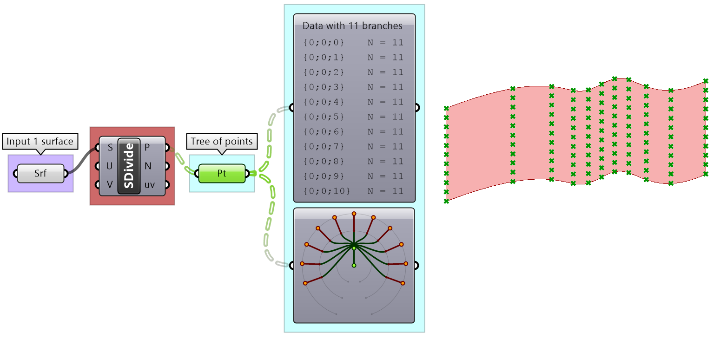
   <figcaption>Figure(59):  The SDivide component takes one input (surface) and outputs a data tree (grid)</figcaption>
</figure>

All components that generate lists of numbers (such as <b>Range</b> and <b>Series</b>) can also generate trees when given a list of input.

<figure>
   
   <figcaption>Figure(60):  Entwine component takes any number of lists and combines them into a tree structure</figcaption>
</figure>

Perhaps one of the most common cases to generate a tree is when dividing a list of curves to generate a grid of points. So the input is one list and the output is a tree.

<figure>
   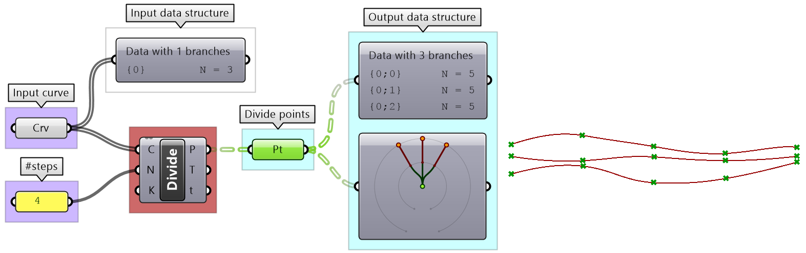
   <figcaption>Figure(61):  EDivide component takes any list (curves) and generates a tree structure (grid)</figcaption>
</figure>

<table class="rounded">
  <tr>
    <th>Tutorial 3-2-1: Generating trees</th>
  </tr>
  <tr>
    <td>
    Given the following list of points, construct a number tree with 3 branches, one for each coordinate.
    
    </td>
  </tr>
  <tr>
    <td>
        

        
<b>Solution...</b>

         Each input point is a single data item that contains 3 numbers (coordinates). We know we would like to isolate each coordinate into a separate list, then combine them into one data structure. Hence we need to first deconstruct input points (use <b>Deconstruct</b> of <b>pDecon</b> component), then combine the lists into one structure (use <b>Entwine</b> component). 
        
        

    </td>
  </tr>
</table>

## 3.3 Tree matching
 <a href="https://vimeo.com/showcase/11456959/video/1030605453" target="_blank"> Matching data trees</a>

We explained the <b>Long</b>, <b>Short</b> and <b>Cross</b> matching with lists. Trees follow similar conventions to expand the shorter branches by repeating the last element to match. If one tree has fewer branches, the last branch is repeated. The following illustrates common tree matching cases.

### 3.3.1 Item-to-tree matching
When matching an item to a tree, a matching tree structure is created and the item is repeated. For example when adding a single number to a tree of numbers, the single number is added to every item in the tree and the result is a tree with matching structure to the input tree.

### 3.3.2 Short-list-to-tree matching
When matching a short list to a tree, where the length of the list is shorter than the tree branches, a matching tree structure is created where the list is repeated in each branch, and the last item in the short list is repeated. See the following example adding a list of two number to a tree of numbers.

### 3.3.3 Long-list-to-tree matching
When matching a long list to a tree with branches that are shorter than the list, the tree branches expand to match the length of the list. The last item in each branch is repeated to match the list length Note that the resulting tree structure will be differenent than the input tree. In the following example, both input, the list and the tree, are modified to arrive to a matching structure, then the addition result have than new data structure.

### 3.3.4 Tree-to-tree matching
There are numerous possibilities when matching two trees, but the basic principle apply. The goal is to find a tree structure that can combine both input tree structure. Let’s assume the case when there is a simple tree with one level of branches that match in depth. There are two possibilities. The first is that both input trees have same number of branches. In this case, the length of the shorter corresponding branches is matched. The output tree might end up matching at least one of the input trees, or be different to both.

The second possibility is that one tree might have more branches than the other. In that case, new branches are inserted into the smaller tree repeating the last branch, then each branch is expanded (repeating the last item in the branch) to create matching length among all corresponding branches as in the following example.

When working with trees, it is of utmost importance to examine the data structure of each input before using it as input to one component. A small change in the structure can have big impact. For example, the following two trees of numbers appear to be matching at first, but because there is one level depth added to one of the trees (indicating an extra branch near the root of the tree), the result may be different than what is intended.

<table class="rounded">
  <tr>
    <th>Tutorial 3.3.1 Tree matching</th>
  </tr>
  <tr>
  <tr>
    <td>
     Inspect the following 2 number structures, then predict the structure and result of adding them (with default Grasshopper matching). Verify your answer using the <b>Addition</b> components. 
     
    </td>
    </tr>
  <tr>
    <td>
        

        
<b>Solution...</b>

         
        <table>
          <tr>
            <td>
            Key solution idea: The two input trees have different number of branches and different number of elements in each branch. The last branch of the shorter tree is repeated to match the number of branches, then corresponding branches are matched by repeating the last element of the shorter branch.  
            
            </td>
          </tr>
        </table>
        

    </td>
  </tr>
</table>

## 3.4 Traversing trees
 <a href="https://vimeo.com/showcase/11456959/video/1030608072" target="_blank"> Traversing data trees</a>

Grasshopper provides components to help extract branches and items from trees. If you have the path to a branch or to an item, then you can use <b>Branch</b> and <b>Item</b> components. You need to check the structure of your input so you can supply the correct path.

<figure>
   
   <figcaption>Figure(62):  Select branches from a tree</figcaption>
</figure>

<figure>
   
   <figcaption>Figure(63):  Select items from a tree</figcaption>
</figure>

If you know that your structure might change, or you simply do not want to type the path, you can extract the path using  the <b>Param Viewer</b> and List <b>Item</b> components.

<figure>
   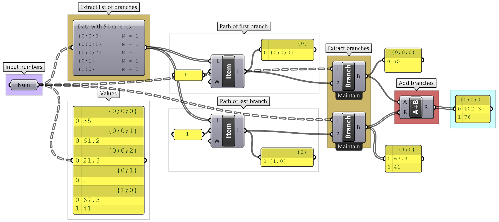
   <figcaption>Figure(64):  Example of how to extract data paths dynamically</figcaption>
</figure>

<table class="rounded">
  <tr>
    <th>Tutorial 3.4.1 Traversing trees</th>
  </tr>
  <tr>
  <tr>
    <td>
     The following tree has 3 branches for each one of the coordinates (x, y, z) of some list of points. Use that tree to construct a list of these points. 
     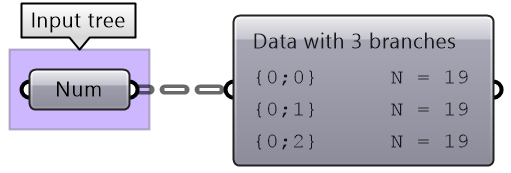
    </td>
    </tr>
  <tr>
    <td>
        

        
<b>Solution...</b>

         
        <table>
          <tr>
            <td>
            Key solution idea: We can construct a point list using as input 3 lists representing X, Y and Z values. If we can isolate the 3 branches of the input tree, then we will be able to feed them to the point construction component.  
            
            </td>
          </tr>
        </table>
        

    </td>
  </tr>
</table>

## 3.5 Basic tree operations

Basic tree operations are widely used and you will likely need them in most solutions. It is very important to understand what these operations do, and how they affect the output.

### 3.5.1: Viewing the tree structure
As we have seen in the data matching, different data structures of the same set of elements produce different results. Grasshopper offers three ways to view the data structure, the Parameter Viewer in text or diagram format, and the Panel.

<figure>
   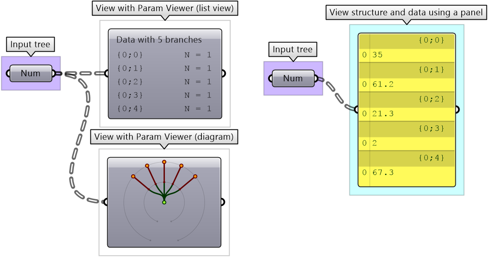
   <figcaption>Figure(65):  View trees using the Parameter Viewer and the Panel components</figcaption>
</figure>

Tree information can be extracted using the <b>TStats</b> component. You can extract the list of paths to all branches, number of elements in each branch and the number of branches.

<figure>
   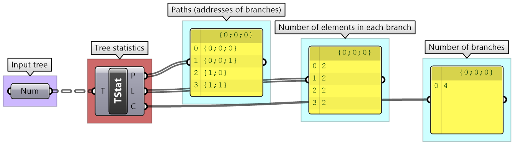
   <figcaption>Figure(66):  Extract trees structure using TStats component</figcaption>
</figure>

### 3.5.2 List operations on trees
 <a href="https://vimeo.com/showcase/11456959/video/1030608733" target="_blank"> List operations on data trees</a>

Trees can be thought of as a list of branches. When using list operations on trees, each branch is treated as a separate list and the operation is applied to each branch independently. It is tricky to predict the resulting data structure and therefore it is always important to check your input and output structures before and after applying any operation.
To illustrate how list operations work in trees, we will use a simple tree, a grid of points, and apply different list operations on it. We will then examine the output and its data structure.

<table class="rounded">
  <tr>
    <th>Common list operation and how they apply to trees</th>
  </tr>
  <tr>
    <td>
    <b>List Item</b>: Select items at specific index in each branch 
    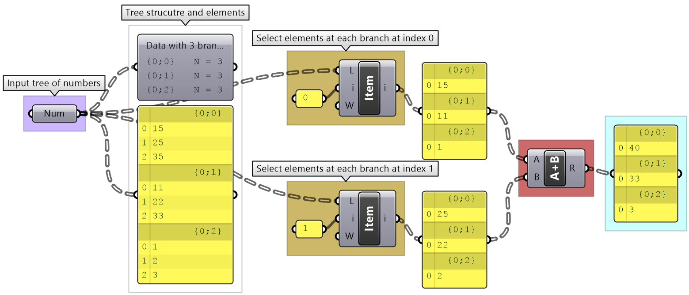
    </td>
  </tr>
    <tr>
    <td>
    <b>List Item</b>: Select multiple indices to isolate part of the tree and perform one operation on such as <b>Mass Addition</b> 
    
    </td>
  </tr>
    <tr>
    <td>
    <b>Split List</b>: Split the elements of branches into 2 trees at the specified index 
    
    </td>
  </tr>
    <tr>
    <td>
    <b>Shift List</b>: Shifts the elements of each branch 
    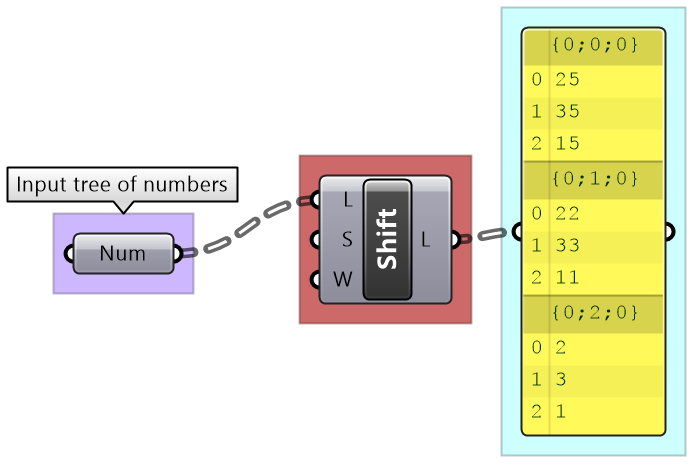
    </td>
  </tr>
    <tr>
    <td>
    <b>Cull Pattern</b>: Culls each branch 
    
    </td>
  </tr>
</table>

### 3.5.3 Grafting from lists to a trees

In some cases you need to turn a list into a tree where each element is placed in its own branch. Grafting can handle complex trees with branches of variable depths.

<figure>
   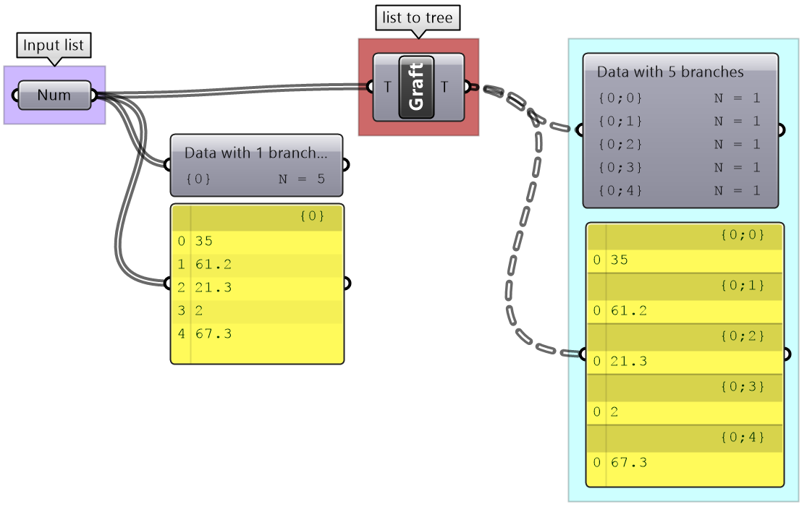
   <figcaption>Figure(67):  Grafting a tree creates a new branch for each element</figcaption>
</figure>

It might feel unintuitive to complicate the data structure (from a simple list to a tree), but grafting is very useful when trying to achieve certain matching. For example if you need to add each element of one list with all the elements in the second list, then you will need to graft the first list before inputting to the addition process.

<figure>
   
   <figcaption>Figure(68):  Grafting complex trees</figcaption>
</figure>

### 3.5.4 Flattening from trees to lists

Other times you might need to turn your tree structure into a simple list. This is achieved with the flattening process. Data from each branch is extracted and sequentially attached to one list.

<figure>
   
   <figcaption>Figure(69):  Flattening place all tree elements in one list</figcaption>
</figure>

Flatten also can handle any complex tree. It takes the branches in order starting with the lowest index trunk and put all elements in one list.

<figure>
   
   <figcaption>Figure(70):  Flattening complex trees</figcaption>
</figure>

### 3.5.5 Combining data streams

It is possible to compose a number of lists into a tree where each list becomes a branch in a new tree. It is different from the merging of lists where simply one bigger list is created.

<figure>
   
   <figcaption>Figure(71):  Entwine and Merge components combine lists into trees or bigger lists</figcaption>
</figure>

### 3.5.6 Flipping the data structure

It is logical in some cases to flip the tree to change the direction of branches.This is specially useful in grids when points are organized in rows and columns (similar to a 2 dimensional array structure). Flipping causes corresponding elements across branches (have the same index in their branch) to be grouped in one branch. For example, a data tree that has 2 branches and 4 items in each branch, can be flipped into a tree with 4 branches and 2 elements in each branch.

<figure>
   
   <figcaption>Figure(72):  Flip helps reorganize data in a trees</figcaption>
</figure>

If the number of elements in the branches are variable in length, some of the branches in the flipped tree will have “null” values.

<figure>
   
   <figcaption>Figure(73):  Add “null” when flipping trees with variable length branches</figcaption>
</figure>

Flipping is one of the operations that cannot handle variable depth branches, simply because there is no logical solution to flip.

<figure>
   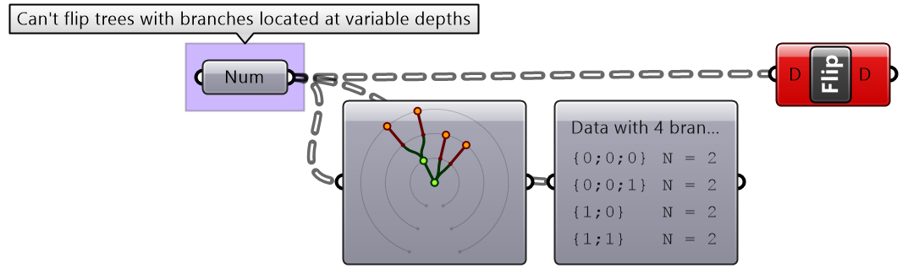
   <figcaption>Figure(74):  Flip fails when the input tree has variable depth branches</figcaption>
</figure>

### 3.5.7 Simplifying the data structure

Processing data through multiple components can add unnecessary complexity to the data structure. The most common form is adding leading or trailing zeros to the paths addresses. Complex data structures are hard to match. <b>Simplify Tree</b> process helps remove empty branches. There are other operations such as <b>Clean Tree</b> and <b>Trim Tree</b> to help remove null elements, empty branches and reduce complexity. It is also possible to extract all branches as separate lists using the <b>Explode Tree</b> operation.

<figure>
   
   <figcaption>Figure(75): Paths can increase in complexity as more operations are applied to the data. Simplify helps remove empty branches</figcaption>
</figure>

<table class="rounded">
  <tr>
    <th>Tutorial 3.5.A Louvers</th>
  </tr>
  <tr>
  <tr>
    <td>
     Given one curve on XY-Plane, create horizontal and vertical louvers as in the image 
     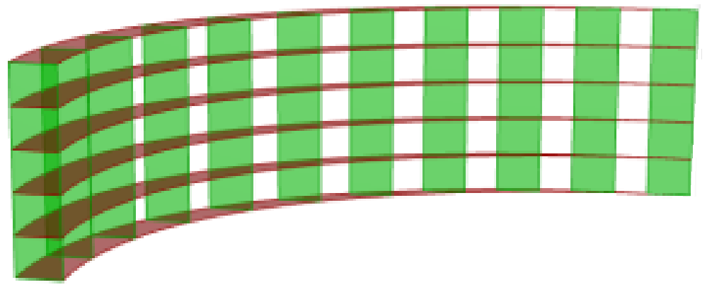
    </td>
    </tr>
  <tr>
    <td>
        

        
<b>Solution...</b>

         
        <table>
          <tr>
            <td>
            Examine the <b>data structure</b> of output from each step before feeding it into the next process: 
            input curve data structure: Single item (one branch and one item in the branch) 
            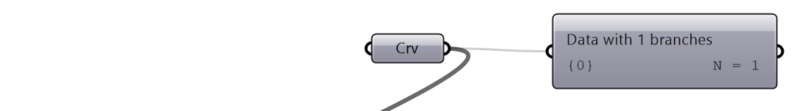
            </td>
          </tr>
          <tr>
            <td>
            Divide input curve to extract points. 
            Data structure: List (one branch with 11 items). Note that the path has added leading “0”. This indicates the next layer of calculation. 
            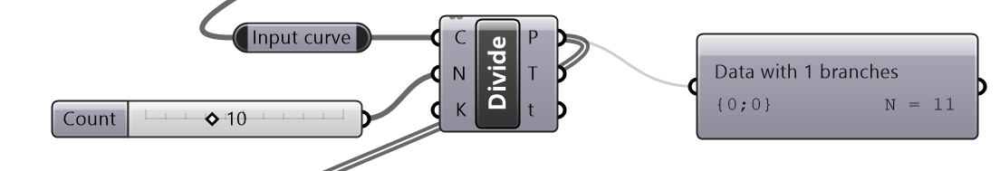
            </td>
          </tr>
          <tr>
            <td>
            Create vertical lines at each point. 
            Data structure: List (one branch with 11 items). Note that the path did not increase in complexity. 
            
            </td>
          </tr>
          <tr>
            <td>
            Divide vertical lines to create a grid of points. 
            Data structure: Tree (11 branches with 6 items). Note that the path has added leading “0”. 
            
            </td>
          </tr>
          <tr>
            <td>
            Create horizontal lines at each point. 
            Data structure: Tree (11 branches with 6 items). Note that the path did not increase in complexity. 
            
            </td>
          </tr>
          <tr>
            <td>
            Create lofted surfaces through branches of lines. 
            Data structure:Tree (11 branches with 1 item each). Note that the path did not increase in complexity. 
            
            </td>
          </tr>
          <tr>
            <td>
            Flip the tree matrix and then create lofted surfaces through branches of lines. 
            Data structure: Tree (11 branches with 1 item each). Note that the path did not increase in complexity. 
            You can flatten the tree to create one list of horizontal louvers. 
            
            </td>
          </tr>
        </table>
        

    </td>
  </tr>
</table>

<table class="rounded">
  <tr>
    <th>Tutorial 3.5.B Shutters</th>
  </tr>
  <tr>
  <tr>
    <td>
     Given four corner points on a plane and a radius for the hinge, create a shutter that can open and shut as in the image using a rotation parameter 
     
    </td>
    </tr>
  <tr>
    <td>
        

        
<b>Solution...</b>

         
        <table>
          <tr>
            <td>
            <b>Algorithm analysis:</b> 
            For each shutter there are two parts: the rectangle and the hinge. 
            Union the rectangle and hinge, then allow rotating around the hinge. 
            There is one rotation control to move all shutters together. 
             
            </td>
          </tr>
          <tr>
            <td>
             <b>Solution steps:</b>
            </td>
          </tr>
          <tr>
            <td>
            Output: Surface of the shutters and curves for the frame 
            
            </td>
          </tr>
          <tr>
            <td>
            Input: The window four corner points (and center), the hinge radius and the rotation angle parameter 
            
            </td>
          </tr>
          <tr>
            <td>
            Key processe #1: create rectangle and hinges. Use the <b>Rectangle</b> component 
            
            </td>
          </tr>
          <tr>
            <td>
            Key processe #2: Union the curves. Use the <b>RUnion</b> component, then create a surface from the boundary using <b>Boundary</b> component 
            
            </td>
          </tr>
          <tr>
            <td>
            Intermediate process #1: Rotate the rectangles using the angle. Use <b>Rotate</b> component 
            
            </td>
          </tr>
          <tr>
            <td>
            Properly match the data structures of the rectangles and hinges before the region union. Use the <b>Graft</b> so that rectangles and hinges pair correctly. 
            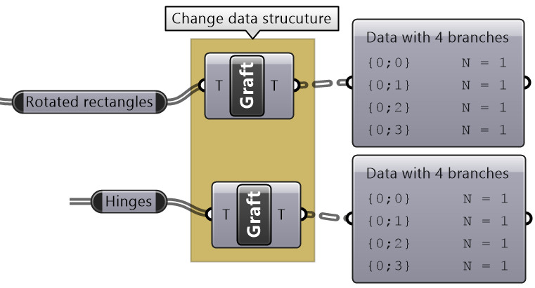
            </td>
          </tr>
          <tr>
            <td>
             <b>Putting it all together:</b>
            </td>
          </tr>
          <tr>
            <td>
            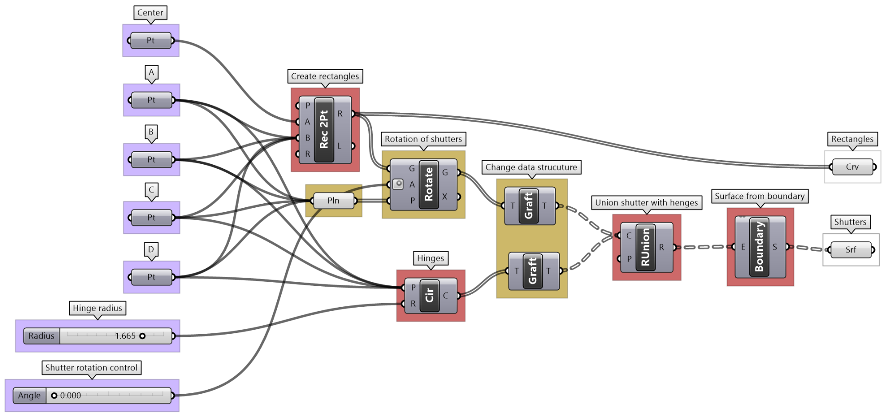
            </td>
          </tr>
        </table>
        

    </td>
  </tr>
</table>

## 3.6 Advanced tree operations

As your solutions increase in complexity, so will your data structures. We will discuss three advanced tree operations that are necessary to solve specific problems, or are used to simplify your solution by tabbing directly into the power of the data tree structure.

### 3.6.1 Relative items
 <a href="https://vimeo.com/showcase/11456959/video/1030609100" target="_blank"> Advanced data trees operations: Relative item</a>

The first operation has to do with solving the general problem of connectivity between elements in one tree or across multiple trees. Suppose you have a grid of points and you need to connect the points diagonally. For each point, you connect to another in the +1 branch and +1 index. For example a point in branch {0}, index [0], connects to the point in branch {1}, index [1].

<figure>
   
   <figcaption>Figure (76): Relative Item mask {+1}[+1] create positive diagonal connectivity</figcaption>
</figure>

In Grasshopper, the way you communicate the offset is expressed with an offset string in the format “{branch offset}[index offset]”. In our example, the string to connect points diagonally is “{+1}[+1]”. Here is an example that uses relative tree component in Grasshopper. Notice that the relative item component creates two new trees that correlate in the manner specified in the offset string.

<figure>
   
   <figcaption>Figure (77): Relative Item mask {+1}[+1] breaks the original tree into 2 new trees with diagonal connectivity</figcaption>
</figure>

Here is an example implementation in Grasshopper where we define relative items in one tree, then connect the two resulting trees with lines using the <b>Relative Item</b> component.

<figure>
   
   <figcaption>Figure (78): Relative Item with mask {+1}[+1] in Grasshopper</figcaption>
</figure>

<table class="rounded">
  <tr>
    <th>Tutorial 3.6.1.A Relative item pattern</th>
  </tr>
  <tr>
  <tr>
    <td>
     Create the pattern shown in the image using a square grid of 7 branches where each branch has11 elements. 
     
    </td>
    </tr>
  <tr>
    <td>
        

        
<b>Solution...</b>

         
        <table>
          <tr>
            <td>
            Create the grid 
            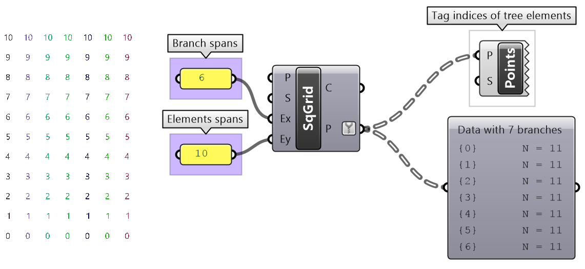
            </td>
          </tr>
          <tr>
            <td>
            Create relative trees that connect each element with -1 branch and +1 index: {-1}[+1] 
            Create lines to connect the 2 relative trees. 
            
            </td>
          </tr>
          <tr>
            <td>
            Change the offset to {+2}[+3] to create the second connections 
            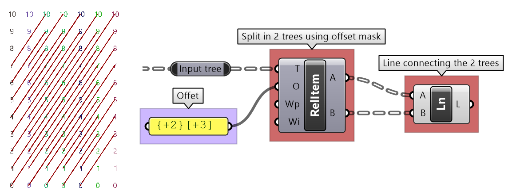
            </td>
          </tr>
        </table>
        

    </td>
  </tr>
</table>

We showed how to define relative items in one tree, but you can also specify relative items between 2 trees. You’ll need to pay attention to the data structure of the two input trees and make sure they are compatible. For example, if you connect each point from the first tree with another point from a different tree with the same index, but +1 branch, then you can set the offset string to be {+1}[0].

<figure>
   
   <figcaption>Figure (79): Relative Items create connections across multiple trees</figcaption>
</figure>

The input to the Relative Items component is two trees and the output is two trees with corresponding items according to the offset string.

<figure>
   
   <figcaption>Figure (80): The offset mask of the Relative Items generates new trees with the desired connections</figcaption>
</figure>

The following GH definition achieves the above:

<figure>
   
   <figcaption>Figure (81): Relative Items implementation in Grasshopper</figcaption>
</figure>

<table class="rounded">
  <tr>
    <th>Tutorial 3.6.1.B Relative item truss</th>
  </tr>
  <tr>
  <tr>
    <td>
     Use relative items between 2 bounding grids to generate the structure shown in the image 
     
    </td>
    </tr>
  <tr>
    <td>
        

        
<b>Solution...</b>

         <a href="https://vimeo.com/showcase/11456959/video/1030609607" target="_blank"> Solution video...</a>
         
        <table>
          <tr>
            <td>
             Create the connections for the bottom tree  
            </td>
          </tr>
          <tr>
            <td>
            Cull every other index and keep the same number of branches (cull indices 1, 3,...) 
            Define the offset strings for RelativeItem components to create the vertical and horizontal connections 
            
             
            The Grasshopper definition: 
            
            </td>
          </tr>
          <tr>
            <td>
             Create the connections for the top tree  
            </td>
          </tr>
          <tr>
            <td>
            Cull every other index and keep the same number of branches. (cull indices 0, 2,...) 
            Define the offset strings for RelativeItem components to create the vertical and horizontal connections 
            
             
            The Grasshopper definition: 
            
            </td>
          </tr>
                    <tr>
            <td>
             Connections between the bottom and top trees 
            </td>
          </tr>
          <tr>
            <td>
            Use culled grids, then define first offset string for RelativeItems component to create the first set of cross lines: {0}[0] 
            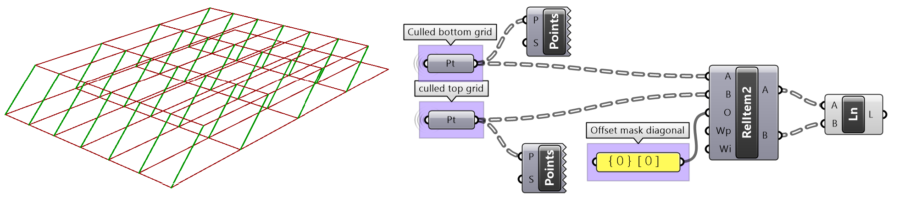
             
            Define second offset string for RelativeItems component to define the second set of cross lines: {0}[-1] 
            
            </td>
          </tr>
        </table>
        

    </td>
  </tr>
</table>

### 3.6.2 Split trees
 <a href="https://vimeo.com/showcase/11456959/video/1030610313" target="_blank"> Split data trees</a>

The ability to select a portion of a tree, or split into two parts is a very powerful tree operation in Grasshopper. You can split the tree using a string mask using specific syntax (see examples below). The mask filters, or helps select, the positive part of your tree. The portion of the tree left, is also given as an output and is called the negative part of the tree. Since all trees are made out of branches and indices, the split mask should include information about which branches and indices within these branches to split along. Here are the rules of the split mask:

<table class="rounded">
  <tr>
    <th width=25%><b>Mask syntax</b></th>
    <th width=75%><b>General rules</b></th>
  </tr>
  <tr>
    <td><b>{ ; ; }</b></td>
    <td>Use curly brackets to enclose the mask for the tree branches.</td>
  </tr>
  <tr>
    <td><b>[ ] </b></td>
    <td>Use square brackets to enclose the mask for the elements (leaves). Can be omitted if select all items or use [*]
    </td>
  </tr>
    <tr>
    <td><b>( )</b></td>
    <td>Round brackets are used for organizing and grouping</td>
  </tr>
    </tr>
    <tr>
    <td><b>*</b></td>
    <td>Any number of integers in a path. The asterisk also allows you to include all branches, no matter what their paths look like</td>
  </tr>
    </tr>
    <tr>
    <td><b>?</b></td>
    <td>Any single integer</td>
  </tr>
    </tr>
    <tr>
    <td><b>6</b></td>
    <td>Any specific integer</td>
  </tr>
    </tr>
    <tr>
    <td><b>!6</b></td>
    <td>Anything except a specific integer</td>
  </tr>
    </tr>
    <tr>
    <td><b>(2,6,7)</b></td>
    <td>Any one of the specific integers in this group.</td>
  </tr>
    </tr>
    <tr>
    <td><b>!(2,6,7)</b></td>
    <td>Anything except one of the integers in this group.</td>
  </tr>
    </tr>
    <tr>
    <td><b>(2 to 20)</b></td>
    <td>Any integer in this range (including both 2 and 20).</td>
  </tr>
    </tr>
    <tr>
    <td><b>!(2 to 20)</b></td>
    <td>Any integer outside of this range.
    </td>
  </tr>
    </tr>
    <tr>
    <td><b>(0,2,...)</b></td>
    <td>Any integer part of this infinite sequence. Sequences have to be at least two integers long, and every subsequent integer has to be bigger than the previous one (sorry, that may be a temporary limitation, don't know yet).</td>
  </tr>
    </tr>
    <tr>
    <td><b>(0,2,...,48)</b></td>
    <td>Any integer part of this finite sequence. You can optionally provide a single sequence limit after the three dots</td>
  </tr>
    </tr>
    <tr>
    <td><b>!(3,5,...)</b></td>
    <td>Any integer not part of this infinite sequence. The sequence doesn't extend to the left, only towards the right. So this rule would select the numbers 0, 1, 2, 4, 6, 8, 10, 12 and all remaining even numbers.</td>
  </tr>
    </tr>
    <tr>
    <td><b>!(7,10,21,...,425)  </b></td>
    <td>Any integer not part of this finite sequence.</td>
  </tr>
    </tr>
    <tr>
    <td><b>{ * }[ (0 to 4) or (6,11,41) ]</b></td>
    <td>It is possible to combine two or more rules using the boolean and/or operators. The example selects the first five items in every list of a tree and also the items 7, 12 and 42.</td>
  </tr>
</table>

Here are some examples of valid split masks.

<table class="rounded">
  <tr>
    <th><b>Split mask by branches</b></th>
    <th><b>Description</b></th>
  </tr>
  <tr>
    <td><b>{ * }</b></td>
    <td>Select all (the whole tree output as positive, and negative tree will be empty)</td>
  </tr>
  <tr>
    <td><b>{ *; 2 }</b></td>
    <td>Select the third branch</td>
  </tr>
  <tr>
    <td><b>{ *; (0,1) }</b></td>
    <td>Select the first two end branches</td>
  </tr>
  <tr>
    <td><b>{ *; (0, 2, …) }</b></td>
    <td>Select all even branches</td>
  </tr>
</table>

<table class="rounded">
  <tr>
    <th><b>Split mask by branches and leaves</b></th>
    <th><b>Description</b></th>
  </tr>
  <tr>
    <td><b>{ * }[(1,3,...)]</b></td>
    <td>Select elements located at odd indices in all branches</td>
  </tr>
  <tr>
    <td><b>{ *; 0 }[(1,3,...)]</b></td>
    <td>Select elements located at odd indices in the first branch</td>
  </tr>
  <tr>
    <td><b>{ *; (0, 2) }[(1,3,...)]</b></td>
    <td>Select elements located at odd indices in the first and third branches</td>
  </tr>
  <tr>
    <td><b>{*; (0,2,...) } [ (1,3,...) ]</b></td>
    <td>Select elements located at odd indices in branches located at even indices</td>
  </tr>
  <tr>
    <td><b> {*; (0,2,...) } [(0) or (1,3,...)]</b></td>
    <td>Select elements located at odd indices, and index “0”, in branches located at even indices</td>
  </tr>
</table>

One of the common applications that uses split tree functionality is when you have a grid of points that you like to transform a subset of. When splitting, the structure of the original tree is preserved, and the elements that are split out are replaced with null. Therefore, when applying transformation to the split tree, it is easy to recombine back.
Suppose you have a grid with 7 branches and 11 elements in each branch, and you’d like to shift elements between indices 1-3 and 7-9. You can use the split tree to help isolate the points you need to move using the mask: {*}[ (1,2,3) or (7,8,9) ], move the positive tree, then recombine back with the negative tree.

<figure>
   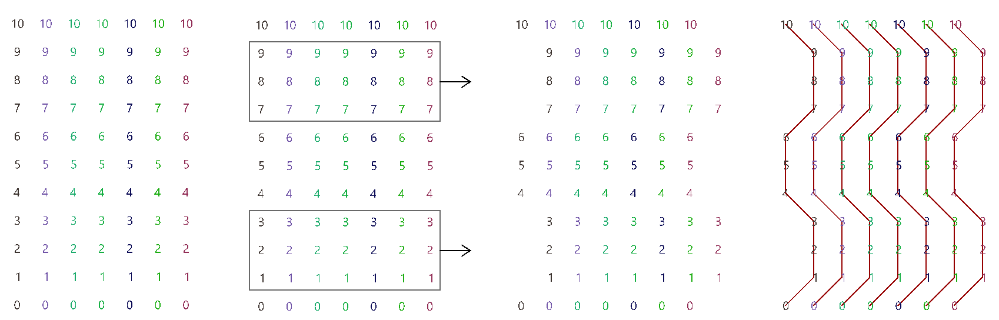
   <figcaption>Figure (82): Split tree allows operating on a subset of the tree with the possibility to recombine back</figcaption>
</figure>  

This is the GH definition that does the above using the <b>Split Tree</b> component.

<figure>
   
   <figcaption>Figure (83): Split tree Grasshopper implementation of Figure (82)</figcaption>
</figure>  

One of the advantages of using <b>Split Tree</b> over relative trees is that the split mask is very versatile and it is easier to isolate the desired portion of the tree. Also the data structure is preserved across the negative and positive trees which makes it easy to recombine the elements of the tree after processing the parts.

<table class="rounded">
  <tr>
    <th>Tutorial 3.6.2.A: Split tree pattern</th>
  </tr>
  <tr>
  <tr>
    <td>
     Given a 6x9 grid, use the split tree to generate the following pattern: 
     
    </td>
    </tr>
  <tr>
    <td>
        

        
<b>Solution...</b>

         
        <table>
          <tr>
            <td>
            Create the grid 
            
            </td>
          </tr>
          <tr>
            <td>
            Split the tree to isolate the middle part 
            
            </td>
          </tr>
          <tr>
            <td>
            Split the middle part into two new parts 
            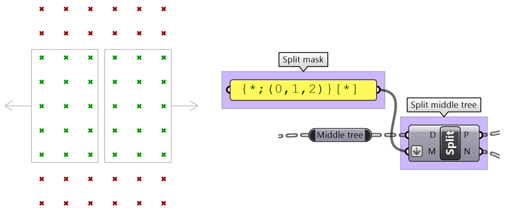
            </td>
          </tr>
          <tr>
            <td>
            Move the two middle parts in opposite directions then recombine them 
            
            </td>
          </tr>
          <tr>
            <td>
            Recombine the middle part with the rest of the tree and create polylines through each branch elements 
            
            </td>
          </tr>
        </table>
        

    </td>
  </tr>
</table>

<table class="rounded">
  <tr>
    <th>Tutorial 3.6.2.B: Split tree truss</th>
  </tr>
  <tr>
  <tr>
    <td>
     Given a grid, create the following truss system using the split tree method 
     
    </td>
    </tr>
  <tr>
    <td>
        

        
<b>Solution...</b>

         <a href="https://vimeo.com/showcase/11456959/video/1030611331" target="_blank"> Solution video...</a>
          
        <table>
          <tr>
            <td>
            Create the 6x9 grid 
            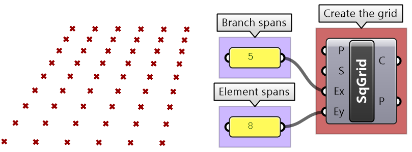
            </td>
          </tr>
          <tr>
            <td>
            Split at every other element 
            
            </td>
          </tr>
          <tr>
            <td>
            Move positive tree vertically 
            
            </td>
          </tr>
          <tr>
            <td>
            Combine positive and negative trees, and create a polyline through each branch 
            
            </td>
          </tr>
          <tr>
            <td>
            Create bottom curves using negative tree 
            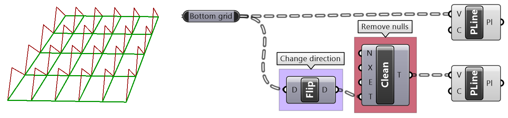
            </td>
          </tr>
          <tr>
            <td>
            Create top curves using positive tree 
            
            </td>
          </tr>
        </table>
        

    </td>
  </tr>
</table>

### 3.6.3 Path mapper
 <a href="https://vimeo.com/showcase/11456959/video/1032534380" target="_blank">Why use the Path Mapper?</a> 
 <a href="https://vimeopro.com/rhino/grasshopper-masterclass-with-david-rutten/video/79914769" target="_blank">Syntax of the Path Mapper</a>

When dealing with complex data structures such as the Grasshopper data trees, you’ll find that you need to simplify or rearrange your elements within the tree. There are a few components offered in Grasshopper for that purpose such as <b>Flatten</b>, <b>Graft</b> or <b>Flip</b>. While very useful, these might not suffice when operating on multiple trees or needing custom rearrangement. There is one very powerful component in Grasshopper that helps with reorganizing elements in trees or change the tree structure called the <b>Path Mapper</b>. It is perhaps the least intuitive to use and can cause a loss of data, but it is also the only way to find a solution in some cases, and hence it pays to address here.
The <b>Path Mapper</b> maps data between source and target paths. The source path is fixed, and is given by the input tree. You can only set the target path. There is a set of constants that you can use to help construct the mapping. Those are listed in the table below.

<table class="rounded">
  <tr>
    <th><b>Path Mapper Constants</b></th>
    <th><b>Description</b></th>
  </tr>
  <tr>
    <td><b>item_count</b></td>
    <td>Number of items in the current branch</td>
  </tr>
  <tr>
    <td><b>path_count</b></td>
    <td>Number of paths (branches) in the tree</td>
  </tr>
  <tr>
    <td><b>path_index</b></td>
    <td>Index of the current path</td>
  </tr>
</table>

Let’s start by familiarizing ourselves with the syntax using built-in mappings inside the <b>Path Mappers</b>. If you right-muse-click on the mapper components, you can open the editor, and also access a bumber of default mapping functions that are commonely used.

<figure>
   
   <figcaption>Figure(83): Algorithmic solutions involve explicit definition of geometry, vectors and transformations</figcaption>
</figure>

The **Null Mapping** does not change the data tree organization, but it offers a good start because it populates the editor with the input data structure. Set the mapping to **Null Mapping** and double click on the component to open the editor. The default tree source include the path only to start, but can add the data index part if needed for your mapping.

<figure>
   
   <figcaption>Figure(84): The Path Mapper syntax and editor</figcaption>
</figure>

The following example examines different built-in mapping in the <b>Path Mapper</b> and how it changes the data structure. The <b>Polyline</b> component creates one polyline through each branch of the tree. Notice how different mapping affect the result.

<table class="rounded">
  <tr>
    <th width=20%><b>Mappings</b></th>
    <th width=40%></th>
    <th width=40%></th>
  </tr>
  <tr>
    <td><b>Null</b></td>
    <td>Output = Input tree</td>
    <td></td>
  </tr>
  <tr>
    <td></td>
    <td>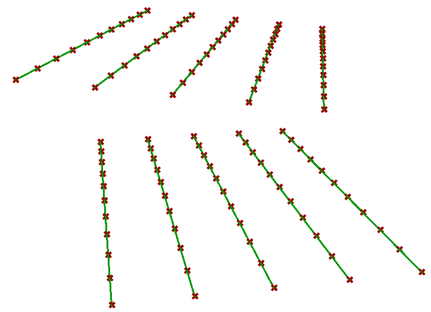</td>
    <td></td>
  </tr>
  <tr>
    <td><b>Flatten</b></td>
    <td>Convert to a list</td>
    <td></td>
  </tr>
  <tr>
    <td></td>
    <td></td>
    <td></td>
  </tr>
  <tr>
    <td><b>Graft</b></td>
    <td>Put leaves in branches</td>
    <td></td>
  </tr>
  <tr>
    <td></td>
    <td></td>
    <td>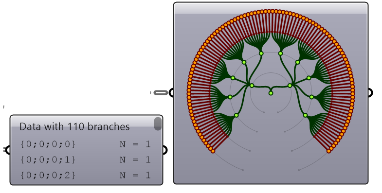</td>
  </tr>
  <tr>
    <td><b>Reverse</b></td>
    <td>Reverse the tree</td>
    <td></td>
  </tr>
  <tr>
    <td></td>
    <td></td>
    <td></td>
  </tr>
  <tr>
    <td><b>Renumbering </b></td>
    <td>Renumber branches</td>
    <td></td>
  </tr>
  <tr>
    <td></td>
    <td></td>
    <td></td>
  </tr>
</table>

For more details about the Path Mapper, please refer to the help inside the component in Grasshopper.

<table class="rounded">
  <tr>
    <th>Tutorial 3.6.3.A: Partitions</th>
  </tr>
  <tr>
  <tr>
    <td>
     Given a grid, create the following truss system using the split tree method 
     
    </td>
    </tr>
  <tr>
    <td>
        

        
<b>Solution...</b>

         
        <table>
          <tr>
            <td>
            The input has two trees, and each has 5 branches with 11 elements in each branch, a total of 10 branches 
            
            </td>
          </tr>
          <tr>
            <td>
            A Polyline is used to connect the elements in each branch 
              
            </td>
          </tr>
          <tr>
            <td>
            To create the vertical connections, you need to create a branch for each 2 corresponding elements across the 2 trees, then use Polyline to connect them 
            1. Analyze the paths of the trees 
            2. Come up with a mapping that generates the desired grouping 
            </td>
          </tr>
          <tr>
            <td>
            First, group corresponding branches across the 2 trees. 
            That can be achieved by switching the last two integers in the paths: 
            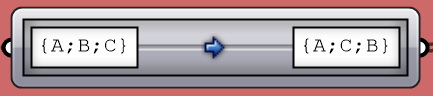
            
            </td>
          </tr>
          <tr>
            <td>
            Second, Flip each of the 5 trees. Since the branches have 11 elements each, flipping each tree will create 11 branches with 2 elements in each branch. Total of 55 branches. 
            You flip by switching the last integer of the path with the element index: 
            
            
            </td>
          </tr>
          <tr>
            <td>
            Finally, a Polyline makes the vertical connections. 
            Note: You can combine the 2 mappings in one step as in the following: 
            
            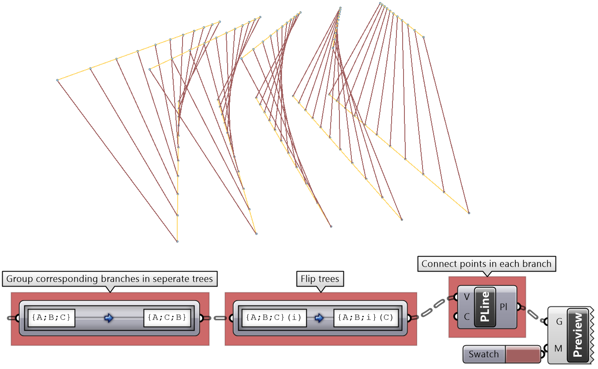
            </td>
          </tr>
        </table>
        

    </td>
  </tr>
</table>

<table class="rounded">
  <tr>
    <th>Tutorial 3.6.3.B: Bruilding structure</th>
  </tr>
  <tr>
  <tr>
    <td>
     Given the input tree of points, create the following structure. 
     
    </td>
    </tr>
  <tr>
    <td>
        

        
<b>Solution...</b>

         
        <table>
          <tr>
            <td>
            The initial tree has 42 branches, 7 branches in each of the 6 trees 
            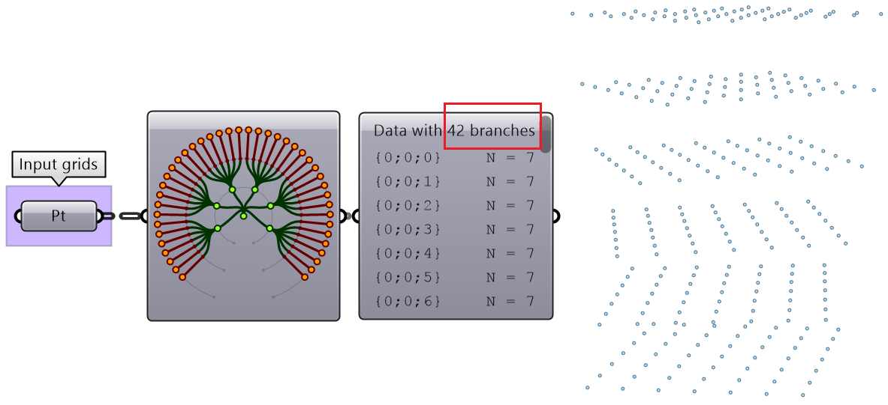
            </td>
          </tr>
          <tr>
            <td>
            The Polyline component connects the elements in each branch 
            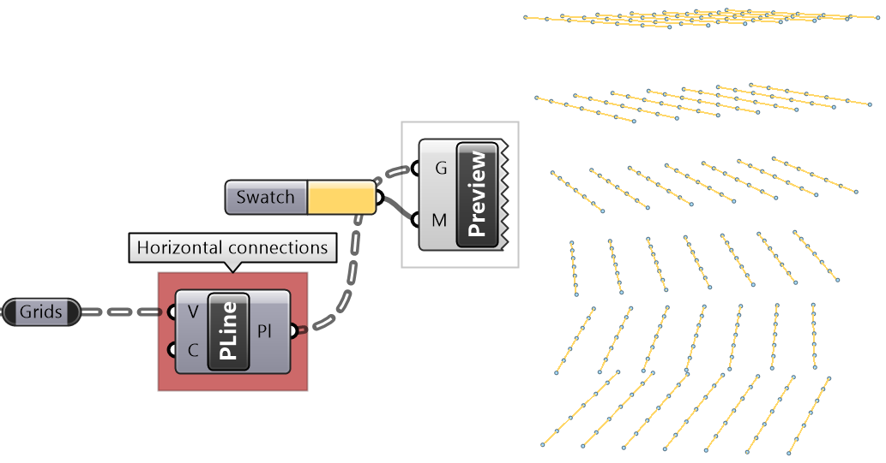  
            </td>
          </tr>
          <tr>
            <td>
            Flip the trees using Path Mapper by switching branch and element indices 
            
            </td>
          </tr>
          <tr>
            <td>
            Regroup the elements of corresponding branches in all trees using the Path Mapper 
            
            </td>
          </tr>
          <tr>
            <td>
            Final result Create all connections 
            
            </td>
          </tr>
        </table>
        

    </td>
  </tr>
</table>

## 3.7 Tutorials: advanced data structures

<table class="rounded">
  <tr>
    <th> Tutorial 3.7.1: Sloped roof</th>
  </tr>
  <tr>
  <tr>
    <td>
     Create a parametric truss system that changes gradually in height as shown in the image. 
     
    </td>
    </tr>
  <tr>
    <td>
        

        
<b>Solution...</b>

         <a href="Tutorial-3-7-1-Sloped-roof.gh"> <i>ownload GH file...</i></a>
         
        <table>
          <tr>
            <td>
            <b>Algorithm analysis: First, solve it for one simple truss</b>
            </td>
          </tr>
          <tr>
            <td>
            Identify desired output for a single truss 
            
            </td>
          </tr>
          <tr>
            <td>
            Define initial input 
            1- Base line on XY-Plane 
            2- Number of runs 
            3- Height 
              
            </td>
          </tr>
          <tr>
            <td>
             <b>Algorithms steps:</b>
            </td>
          </tr>
          <tr>
            <td>
            Create input (L=line, H=height and R= #runs) 
            
            </td>
          </tr>
          <tr>
            <td>
            Divide curve by 2*R 
            
            </td>
          </tr>
          <tr>
            <td>
            Move every other point in the Z direction by height 
            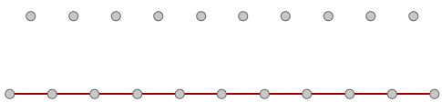
            </td>
          </tr>
          <tr>
            <td>
            Create 3 sets of ordered points for the bottom beams, top beams and middle beams, then connect each of the 3 sets with a polyline 
            
            </td>
          </tr>
          <tr>
            <td>
             <b>Implement the algorithm for a single truss  In Grasshopper:</b>
            </td>
          </tr>
          <tr>
            <td>
            
            </td>
          </tr>
          <tr>
            <td>
             <b>Resolve for multiple trusses with variable height:</b>
            </td>
          </tr>
          <tr>
            <td>
            Create a series of base lines using the initial line and copy in Y-Axis direction 
            
            </td>
          </tr>
          <tr>
            <td>
            Use the list of lines as input instead of a single line. 
            Notice that instead of a list of points for each of the 3 sets (bottom, top and middle), we now have a tree or grid of points with a number of branches equal to the number of trusses 
            
            </td>
          </tr>
          <tr>
            <td>
            Create cross connections using Flip tree operation for the bottom and top trees 
            
            </td>
          </tr>
          <tr>
            <td>
            Create variable height 
            
            </td>
          </tr>
          <tr>
          <tr>
            <td>
             <b>The complete solution implementation in Grasshopper:</b>
            </td>
          </tr>
          <tr>
            <td>
            
            </td>
          </tr>
        </table>
        

    </td>
  </tr>
</table>

<table class="rounded">
  <tr>
    <th> Tutorial 3.7.2: Diagonal triangles</th>
  </tr>
  <tr>
  <tr>
    <td>
     Given the input grid, use the RelativeItem component to create diagonal triangles 
     
    </td>
    </tr>
  <tr>
    <td>
        

        
<b>Solution...</b>

         <a href="Tutorial-3-7-2-Diagonal triangles.gh"> <i>download GH file...</i> </a>
         
        <table>
          <tr>
            <td>
            <b>Algorithm analysis:</b>
            </td>
          </tr>
          <tr>
            <td>
            To generate the triangles, we need 3 sets of corner points. 
            Two of the point sets (A, B) are within the grid. B is diagonal from A (relative index is +1 branch and +1 element) 
            The third point set (C) is a copy of set (B) moved vertically. 
            Group corners to connect into boundaries then generate surfaces 
            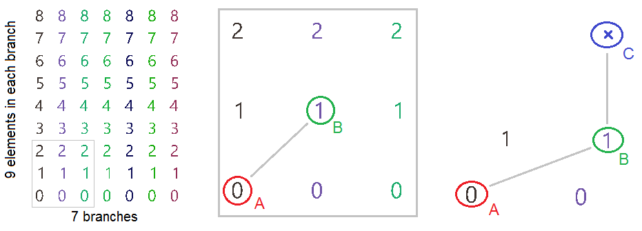
            </td>
          </tr>
          <tr>
            <td>
             <b>Grasshopper implementation:</b>
            </td>
          </tr>
          <tr>
            <td>
            Use RelativeItem to create set A and set B (use “{+1}[+1] mask) 
            Move set B vertically. 
            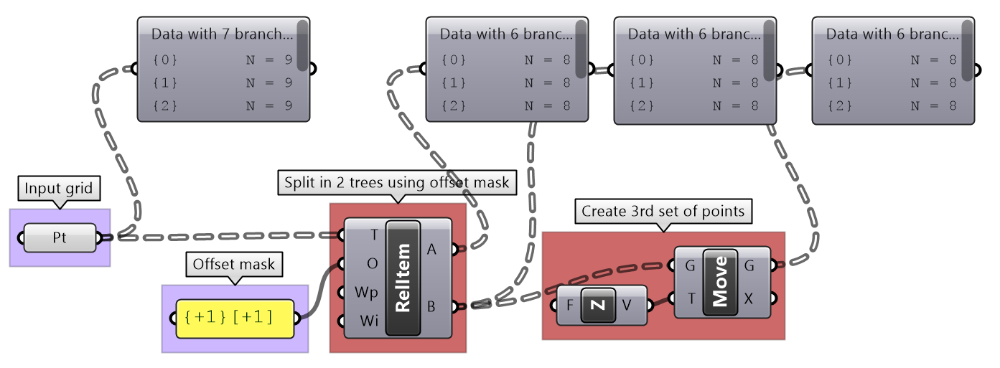
            </td>
          </tr>
          <tr>
            <td>
            Create a tree with 3 branches for sets A, B and C. 
            Flip the tree to group corresponding points. 
            Use Polyline and Boundary to generate the surfaces. 
            
            </td>
          </tr>
        </table>
        

    </td>
  </tr>
</table>

<table class="rounded">
  <tr>
    <th> Tutorial 3.7.3: Zigzag</th>
  </tr>
  <tr>
  <tr>
    <td>
     Create the structure shown in the image using a base grid as input. 
     
    </td>
    </tr>
  <tr>
    <td>
        

        
<b>Solution...</b>

         <a href="Tutorial-3-7-3-Zigzag.gh"> <i>download GH file...</i> </a>
         
        <table>
          <tr>
            <td>
            <b>Algorithm analysis:</b>
            </td>
          </tr>
          <tr>
            <td>
            Since the zigzags alternate directions from one row to the next, it is best to split the grid into 2 parts, positive and negative. 
            Find 3 sets of points in the positive tree and order 
            Reverse the elements in the branches of the negative tree, then find the 3 sets of points and order 
            Merge back the 2 trees to create geometry through points
            
            </td>
          </tr>
          <tr>
            <td>
             <b>Grasshopper implementation:</b>
            </td>
          </tr>
          <tr>
            <td>
            Use the Split Tree component to generate positive and negative trees for both bottom and top grids. Use {0,2,...} split mask. 
            Use RelativeItems2 to create A and B trees, use {0}[+1] relative mask. 
            Use Shift to create the C tree. 
            Use Weave to combine data in the intended order, then remove consecutive duplicates using the DCon component. 
            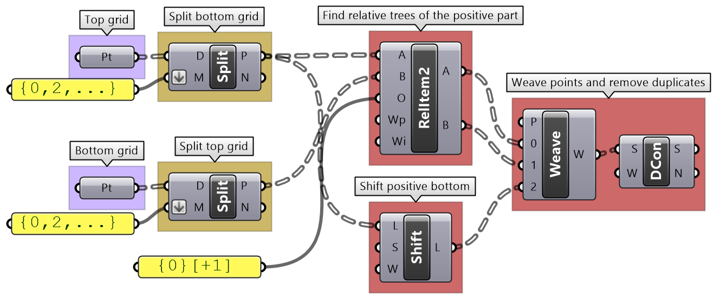
            </td>
          </tr>
          <tr>
            <td>
            Merge ordered positive and negative  trees to generate geometry using Polyline and Pipe components. 
            
            </td>
          </tr>
        </table>
        

    </td>
  </tr>
</table>

<table class="rounded">
  <tr>
    <th> Tutorial 3.7.4: Truss</th>
  </tr>
  <tr>
  <tr>
    <td>
     Create the structure shown in the image using a base grid as input. 
     
    </td>
    </tr>
  <tr>
    <td>
        

        
<b>Solution...</b>

         <a href="Tutorial-3-7-4-Truss.gh"> <i>download GH file...</i> </a>
         
        <table>
          <tr>
            <td>
            <b>Algorithm analysis:</b>
            </td>
          </tr>
          <tr>
            <td>
            <b>Understanding input:</b> 
            The 2 input grids with similar data structure (7 branches and with 9 elements).  
             Bottom grid:
            
              Top grid:
            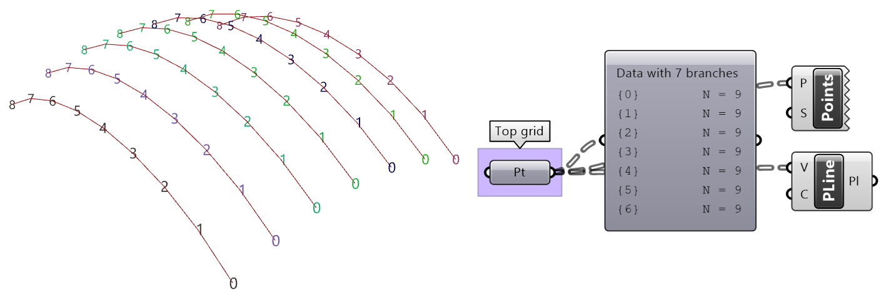
            </td>
          </tr>
          <tr>
            <td>
            <b>Understanding output:</b> 
            There are 4 parts to the output:  
            <table>
          <tr>
            <td>
            1. Bottom beams 
            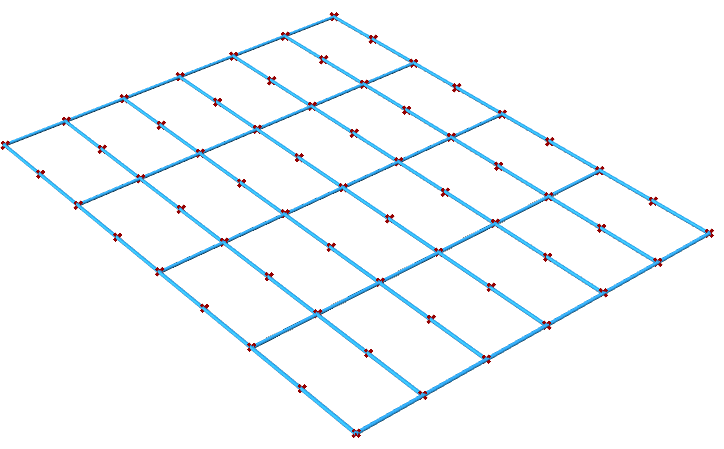
            </td>
            <td>
            2. Top beams 
            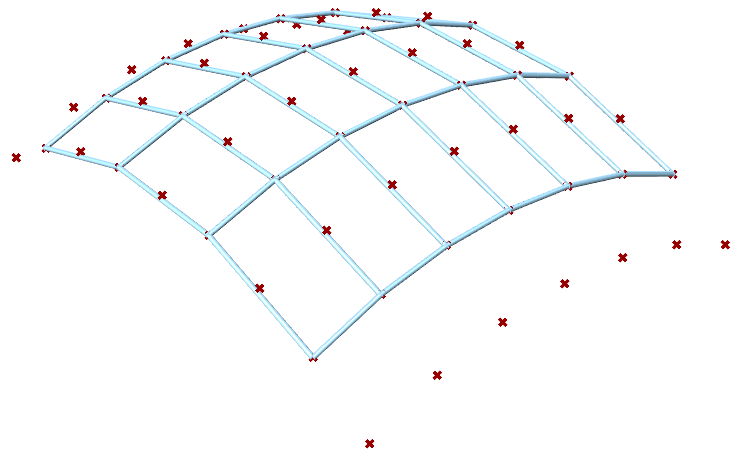
            </td>
          </tr>
          <tr>
            <td>
            3. Middle beams 
            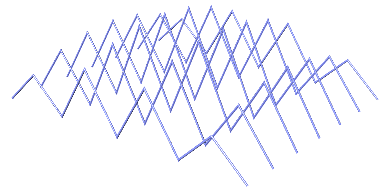
            </td>
            <td>
            4. Middle plates 
            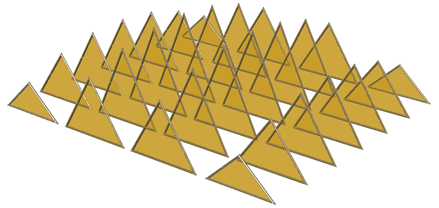
            </td>
          </tr>
          </table>
            <b>Discussion:</b> 
            Constructing the bottom and top grids can be achieved with culling some points and flipping the points grid to get both directions. The middle beams weave the 2 culled grids of the bottom and top grids. We can also use the culled points to create the joints.  
            Constructing the triangular connections is more involved since we need to create groups of 3 points that use a pair of consecutive points from the bottom grid and one point from the top. We can use relative trees to solve this. We can then offset the triangles to create the frame points, and offset again to create the plates points.
            </td>
          </tr>
          <tr>
            <td>
             <b>Grasshopper implementation:</b>
            </td>
          </tr>
          <tr>
            <td>
            Cull top and bottom tree, flip culled tree, then feed the 4 trees into a pipe component with the desired radius as a parameter 
            
            </td>
          </tr>
          <tr>
            <td>
            Weave bottom and top grids to generate the grid of middle beams. Connect grid rows with a Polyline the use Pipe with the radius as a parameter 
            
            </td>
          </tr>
          <tr>
            <td>
            To create the triangular connections, we will use a relative tree on the culled bottom grid, and combine with the culled top grid. Use Offset to generate smaller grid for the plates and their frame 
            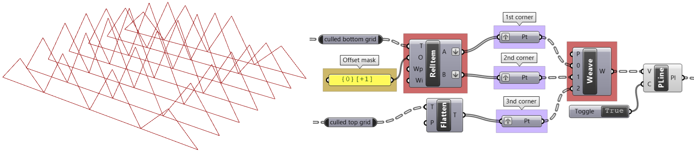
             Offset the triangles to create desired sizes. Use Pipe and boundary to create frames and surfaces for the plates 
            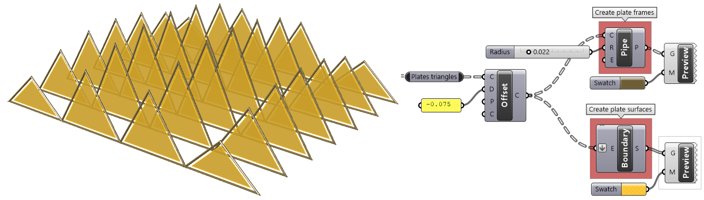
            </td>
          </tr>
          <tr>
            <td>
            The full Grasshopper definition 
            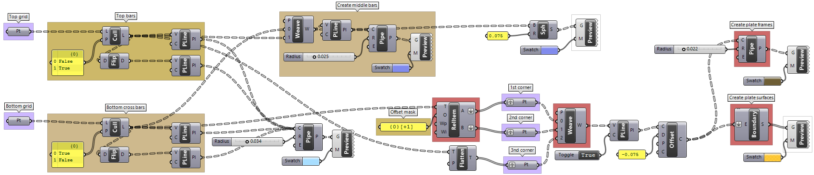
            </td>
          </tr>
        </table>
        

    </td>
  </tr>
</table>

<table class="rounded">
  <tr>
    <th> Tutorial 3.7.5: Weaving</th>
  </tr>
  <tr>
  <tr>
    <td>
     Create the structure shown in the image using a base grid as input. 
     
    </td>
    </tr>
  <tr>
    <td>
        

        
<b>Solution...</b>

         <a href="Tutorial-3-7-4-Weaving.gh"> <i>download GH file...</i> </a>
         
        <table>
          <tr>
            <td>
            <b>Algorithm analysis:</b>
            </td>
          </tr>
          <tr>
            <td>
            The input is a planar square grid with vertical branches. For vertical threads: 
            Split the grid into two parts alternating elements in each branch. 
            Move the first part up, and the second down, then recombine the parts into one set 
            Draw a curve through the points in each branch. 
            Flip the grid, then repeat to create horizontal curves 
            
            </td>
          </tr>
          <tr>
            <td>
             <b>Grasshopper implementation:</b>
            </td>
          </tr>
          <tr>
            <td>
            Use Split Tree to separate alternating points and move up and down 
            Combine points and use IntCrv to interpolate through points of each branch 
            Flip the tree, and repeat Split, Combine and IntCrv to create curves in the other direction 
            
            </td>
          </tr>
          <tr>
            <td>
            The full Grasshopper definition 
            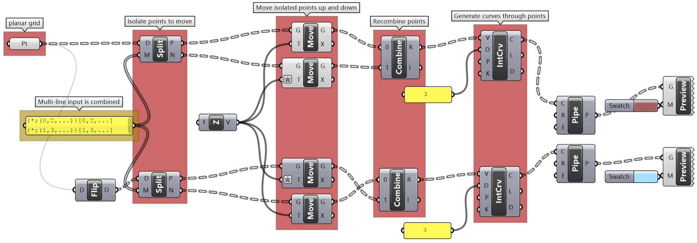
            </td>
          </tr>
          <tr>
            <td>
             <b>Expanded solution:</b>
            </td>
          </tr>
          <tr>
            <td>
            Instead of using the Z-Axis to move points up and down, use the surface normal direction at each point 
            Note: Make sure the data structure of normals and points match 
            
            </td>
          </tr>
          <tr>
            <td>
            The Grasshopper definition: 
            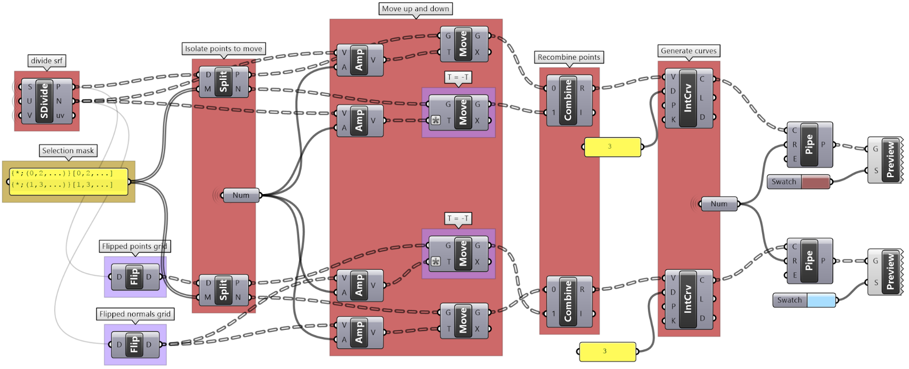
            </td>
          </tr>
        </table>
        

    </td>
  </tr>
</table>

  
## End of guide

This is part 3-3 of the [Essential Algorithms and Data Structures for Grasshopper](/guides/grasshopper/gh-algorithms-and-data-structures/).
