+++
aliases = [""]
authors = [ "rajaa" ]
categories = [ "Essentials Algorithms and Data Structures" ]
category_page = "guides/grasshopper/gh-algorithms-and-data/"
keywords = [ "algorithms", "data", "grasshopper" ]
languages = [ "" ]
sdk = [ "" ]
title = "Chapter 1: Algorithms and Data"
type = "guides"
weight = 15
override_last_modified = "2024-07-15T14:59:06Z"
draft = false

[admin]
picky_sisters = ""
state = ""

[included_in]
platforms = [ "Windows", "Mac" ]
since = 7
until = ""

[page_options]
block_webcrawlers = false
byline = true
toc = true
toc_type = "single"

+++

## 1.1 Algorithmic design

We can define algorithmic design as a design method where the **output** is achieved through **well-defined steps**. In that sense, many human activities are algorithmic. Take, for example, baking a cake. You get the **cake** (output) by using a **recipe** (well-defined steps). Any change in the ingredients (input) or the baking process results in a different cake. We will analyze the parts of typical algorithms, and identify a strategy to build algorithmic solutions from scratch.

Regardless of its complexity, all algorithmic solutions have 3 building blocks: **input, key process,** and **output**. Note that the key process may require additional input and processes.

<figure>
   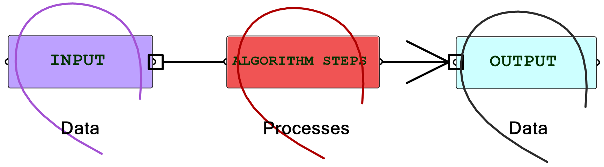
   <figcaption>Figure(1): The building blocks of algorithmic solutions</figcaption>
</figure>  

Throughout this text, we will organize and label the solutions to identify the three blocks clearly. We will also use consistent color coding to visually distinguish between the parts. This will help us become more comfortable with reading algorithms and quickly identify input, key processing steps, and properly collect and display output. Visual cues are important to develop fluency in algorithmic thinking.

In general, reading existing algorithmic solutions is relatively easy, but building new ones from scratch is much harder and requires a new set of skills. While it is useful to know how to read and modify existing solutions, it is essential to develop algorithmic design skills to build new solutions from scratch.

## 1.2 Algorithms parts

In Grasshopper, a solution flows from left to right. At the far left are input values and parameters, and the far right has the output. In between are one or more key processes, and sometimes additional input and output. Let’s take a simple example to help identify the three parts of any algorithm (input, key process, output). The simple addition algorithm includes two numbers (input), the sum (output) and one key process that takes the numbers and gives the result. We will use purple for the input, maroon for the key processes and light blue for the output. We will also group and label the different parts and adhere to organizing the Grasshopper solutions from left to right.

**Example 1-2-1:**
Algorithm to add 2 numbers
<figure>
   
</figure>  

Algorithms may involve intermediate processes. For example, suppose we need to create a circle (output) using a center and a radius (input). Notice that the input is not sufficient because we do not know the plane on which the circle should be created. In this case, we need to generate additional information, namely the plane of the circle. We will call this an intermediate process and use brown color to label it.

**Example 1-2-2:**
Algorithm to create a circle on the XY-Plane from a center and a radius
<figure>
   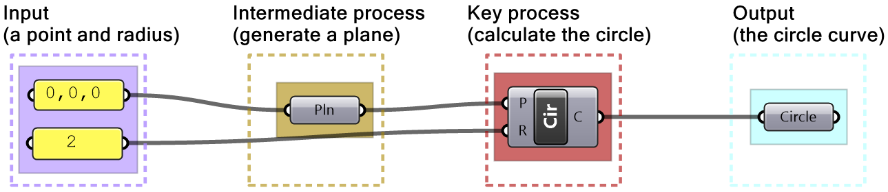
</figure>  

Some solutions are not written with styles and hence are hard to read and build on. It is very important that you take the time to organize and label your solutions to make them easier to understand, debug and use by others.  

<table class="rounded">
  <tr>
    <th>Tutorial 1-2-3: Read existing algorithm</th>
  </tr>
  <tr>
    <td>
    Given the following definition, write a description of what the algorithm does, identify input, the main process(s) and output, then label and color-code all the parts. Re-write the solution to make it more readable.
    <figure>
    
    </figure>
    </td>
  </tr>
  <tr>
    <td>
        

        
<b>Solution...</b>

         In order to figure out what the algorithm is meant to do, we need to group the input on the left side, and collect the output on the right side, then organize the processes in the order of execution. We then step through the solution from left to right to deduce what it does. We can examine and preview the output in each step.
          
        The example of the tutorial is meant to create a circle that is twice as large as another circle that goes through three given points. One of the points is constructed out of its 3 coordinates.
        <figure>
        
        </figure>
        

    </td>
  </tr>
</table>

## 1.3 Designing algorithms: the 4-step process

Before we generalize a method to design algorithms, let’s examine an algorithm we commonly use in real life such as baking a cake. If you already have a recipe for a cake, you simply get the recommended ingredients, mix them, pour in a pan, put in a preheated oven for a certain amount of time, then serve. If the recipe is well documented, then it is relatively straightforward to use. As you become more proficient in baking cakes, you may start to modify the recipe. Perhaps add new ingredients (chocolate or nuts) or use different tools (cupcake container).

<figure>
   
   <figcaption>Figure(2): Steps to follow existing recipe</figcaption>
</figure>  

When designers write algorithms, they typically try to search for existing solutions and modify them to fit their purposes. While this is a good entry point, using existing solutions can be frustrating and time-consuming. Also, existing solutions have their own flavor and that may influence design decisions and limit creativity. If designers have unique problems, and they often do, they have no choice but to create new solutions from scratch; albeit a much harder endeavor. 

Back to our example, the task of baking a cake is much harder if you don’t have a recipe to follow and have not baked one before. You will have to guess the ingredients and the process. You will likely end up with bad results in the first few attempts, until you figure it out! In general, when you create a new recipe, you have to follow the process in reverse. You start with an image of the desired cake, you then guess the ingredients, tools and steps. Your thinking goes along the following lines:

- The cake needs to be baked, so I need an oven and time,
- What goes in the oven is a cake batter held by a container,
- The batter is a mix of ingredients

<figure>
   
   <figcaption>Figure(3): Steps to invent a new recipe from scratch</figcaption>
</figure>  

We can use a similar methodology to design parametric algorithms from scratch. Keep in mind that creating new algorithms is a “skill” and it requires patience, practice and time to develop.

**Algorithmic thinking in 3D modeling vs parametric design**
3D modeling involves a certain level of algorithmic thinking, but it has many implicit steps and data. For example designing a mass model using a 3D modeler may involve the following steps:

1. Think about the output (e.g. a mass out of few intersecting boxes)
2. Identify a command or series of commands to achieve the output ( e.g. run Box command a few times, Move, Scale or Rotate one or more boxes, then BooleanUnion the geometry).

At that point, you are done!

Data such as the base point for your initial box, width, height, scale factor, move direction, rotation angle, etc. are requested by the commands, and the designer does not need to prepare ahead of time. Also, the final output (the boolean mass) becomes directly available and visible as an object in your document.

<figure>
   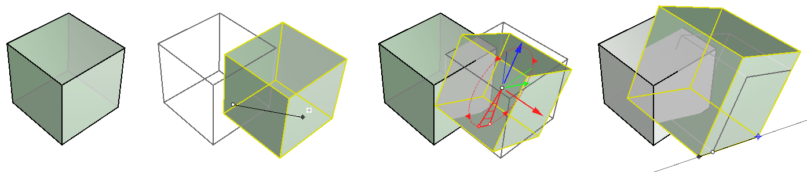
   <figcaption>Figure(4): Interactive 3D modeling to create and manipulate geometry uses visual widgets and guides</figcaption>
</figure>  

Algorithmic solutions are not interactive and require explicit articulation of data and processes. In the box example, you need to define the box orientation and dimensions. When copy, you need a vector and when rotate you need to define the plane and angle of rotation. 

<figure>
   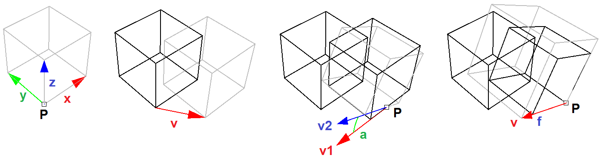
   <figcaption>Figure(5): Algorithmic solutions involve explicit definition of geometry, vectors and transformations</figcaption>
</figure>  

**Designing algorithms**
Designing algorithms requires knowledge in geometry, mathematics and programming. Knowledge in geometry and mathematics is covered in the [Essential Mathematics for Computational Design](https://developer.rhino3d.com/guides/general/essential-mathematics/). As for programming skills, it takes time and practice to build the ability to formulate design intentions into logical steps to process and manage geometric data. To help get started, it is useful to think of any **algorithm as a 4-step process** as in the following:

<table class="rounded">
  <tr>
    <td style="background-color:#cfe2f3"><b>1. Output</b></td>
    <td>Clearly identify the desired outcome</td>
  </tr>
  <tr>
    <td style="background-color:#f4cccc"><b>2. Key processes</b></td>
    <td>Identify key steps to reach the outcome</td>
  </tr>
  <tr>
    <td style="background-color:#d9d2e9"><b>3. Input</b></td>
    <td>Examine initial data and parameters</td>
  </tr>
    <tr>
    <td style="background-color:#eee4c5"><b>4. Intermediate steps</b></td>
    <td>Define intermediate parameters and processes to generate additional data</td>
  </tr>
</table>

Thinking in terms of these 4 steps is key to developing the skill of algorithmic design. We will start with simple examples to illustrate the methodology, and gradually apply more complex examples.

**Example 1-3-1: Add two numbers**
Use the 4-Step process to write an algorithm to add two numbers

<figure>
   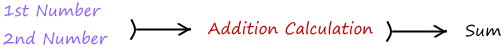
</figure> 

<table class="rounded">
  <tr>
    <td style="background-color:#cfe2f3"><b>1. Output: The sum of the 2 numbers</b>  Use the Panel component to collect the sum</td>
    <td>
   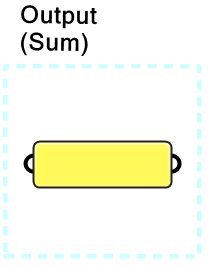
    </td>
  </tr>
  <tr>
    <td style="background-color:#f4cccc"><b>2. Key processes: Addition</b> Use the Addition component that takes 2 numbers and gives the sum</td>
    <td>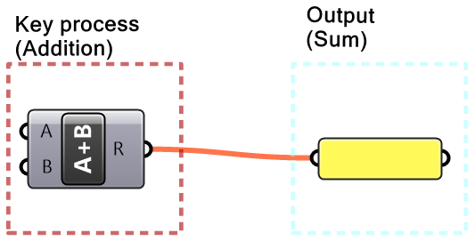</td>
  </tr>
  <tr>
    <td style="background-color:#d9d2e9"><b>3. Input: 2 numbers</b> Use the Panel component to hold and view the values of input numbers</td>
    <td>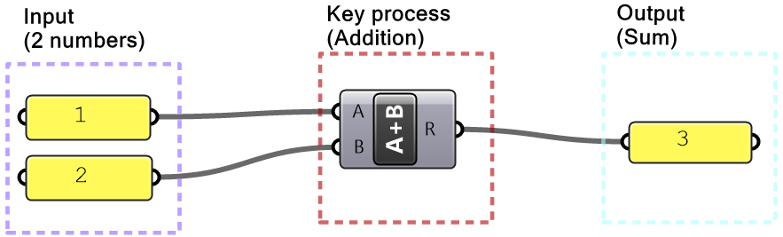</td>
  </tr>
</table>

**Example 1-3-2: Create a circle**
Use the 4-Step process to create a circle from a given center and radius

<figure>
   
</figure> 

<table class="rounded">
  <tr>
    <td style="background-color:#cfe2f3"><b>1. Output: A Circle</b> Use the <b>Circle</b> parameter to collect the output</td>
    <td>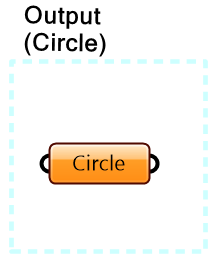</td>
  </tr>
  <tr>
    <td style="background-color:#f4cccc"><b>2. Key processes:</b> Identify a key process that generates a circle from a radius Use the <b>Circle</b> component in Grasshopper</td>
    <td></td>
  </tr>
  <tr>
    <td style="background-color:#d9d2e9"><b>3. Input:</b> Use the given input (center and radius). Feed the radius to the <b>Circle</b> component</td>
    <td></td>
  </tr>
  <tr>
    <td style="background-color:#eee4c5"><b>4.  Intermediate process:</b> The circle needs a center, and also the plane on which the circle is located. Let's assume the circle is on a plane parallel to the XY-Plane and use the circle center as the origin of the plane</td>
    <td></td>
  </tr>
</table>

**Example 1-3-3: Create a line**
Use the 4-Step process to create an algorithm to generate a line from 2 points. One point is referenced from Rhino, and the other is created using three coordinates (x=1, y=0.5 and z=3)

<figure>
   
</figure>

<table class="rounded">
  <tr>
    <td style="background-color:#cfe2f3"><b>1. Output:</b> The line geometry. Use the <b>Geometry</b> parameter to collect the output</td>
    <td>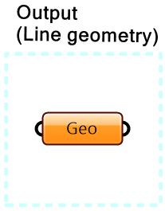</td>
  </tr>
  <tr>
    <td style="background-color:#f4cccc"><b>2. Key processes:</b> Identify a key process that generates a line from 2 points. Use the <b>Line</b> component in Grasshopper</td>
    <td></td>
  </tr>
  <tr>
    <td style="background-color:#d9d2e9"><b>3. Input:</b> Use the given input (a referenced point and 3 coordinates). Feed one point to one of the ends of the line</td>
    <td>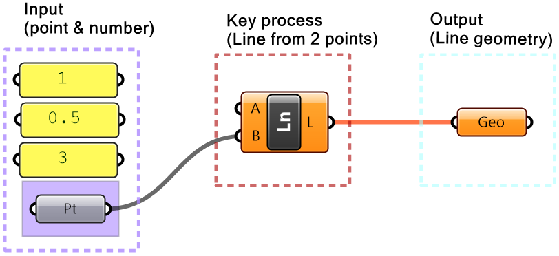</td>
  </tr>
  <tr>
    <td style="background-color:#eee4c5"><b>4.  Intermediate process:</b> Before we can use the coordinates as a point, we need to construct a point</td>
    <td>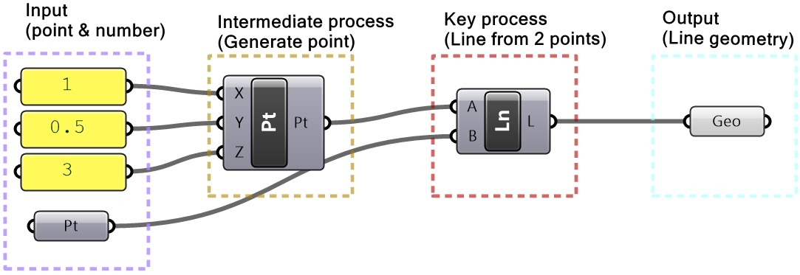</td>
  </tr>
</table>

In more complex algorithms, we will need to analyze the problems, investigate possible solutions and break them down to pieces whenever possible to make it more manageable and readable. We will continue to use the 4-step process and other techniques to solve more complex algorithms throughout the book.

## 1.4 Data

Data is information stored in a computer and processed by a program. Data can be collected from different sources, it has many types and is stored in well defined structures so that it can be used efficiently. While there are commonalities when it comes to data across all scripting languages, there are also some differences. This book explores data and data structures specific to Grasshopper.

## 1.5 Data sources

In Grasshopper, there are three main ways to supply data to processes (or what is called components): internal, referenced and external.

<table class="rounded">
  <tr>
    <th>Data sources in Grasshopper</th>
  </tr>
    <tr>
    <td>
    <b>1. Internally set data</b>  Data can be set inside any instance of a parameter. Once set, it remains constant, unless manually changed or overridden by external input. This is a good way when you do not
    </td>
  </tr>
  <tr>
    <td>
    <b>2. Referenced data</b>  Data can be referenced from Rhino or some external document. For example, you can reference a point created in a Rhino document. When you move the point in Rhino, its reference in Grasshopper updates as well. Grasshopper files are saved separately from Rhino files, and hence if the GH file has referenced data, the Rhino file needs to be saved and passed along with the GH file to avoid any loss of data 
    <figure>
    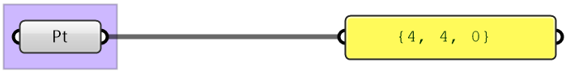
    </figure> 
    generally need to change the data after it is set (constant). Data is stored inside the GH file 
    <figure>
    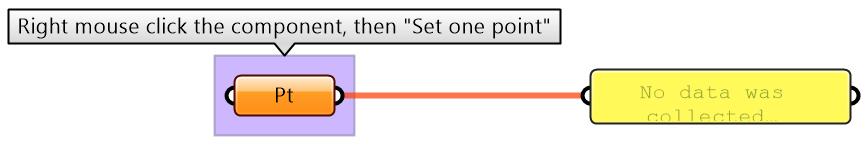
    </figure>
    </td>
  </tr>
    <tr>
    <td>
    <b>3. Externally supplied data</b>  Data can be supplied from previous processes. This method is best suited for dynamic data or data controlled parametrically. Externally supplied data to a parameter takes precedent over the internal or referenced values (when both exist) 
    <figure>
    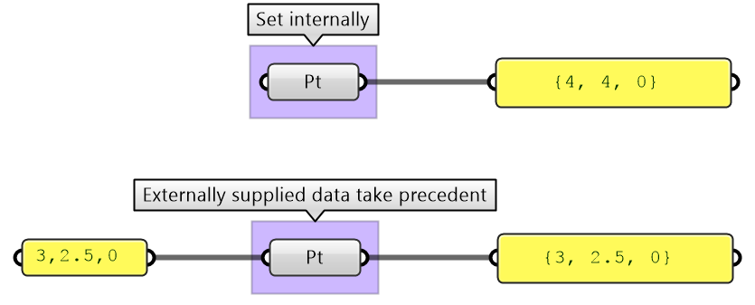
    </figure>
    </td>
  </tr>
</table>

## 1.6 Data types

All programming languages identify the kind of data used in terms of the values that can be assigned to and the operations and processes it can participate in. There are common data types such as <b>Integer, Number, Text, Boolean</b> (Boolean type can be set to <b>True</b> or <b>False</b>), and others. Grasshopper lists those under the <b>Params > Primitives</b> tab.

<figure>
   
   <figcaption>Figure(6): Examples of primitive data types common to all programming languages</figcaption>
</figure>  

Grasshopper supports geometry types that are useful in the context of 3D modeling such as Point (3 numbers for coordinates), <b>Line</b> (2 points), <b>NURBS Curve, NURBS Surface, Brep</b>, and others. All geometry types are included under the <b>Params> Geometry</b> tab in GH.

<figure>
   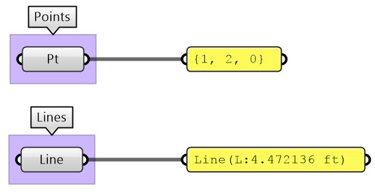
   <figcaption>Figure(7): Examples of geometry data types</figcaption>
</figure>  

There are other mathematics types that designers do not usually use in 3D modeling, but are very common in parametric design such as Domains, Vectors, Planes, and Transformation Matrices. GH provides a rich set of tools to help create, analyze and use these types. To fully understand the mathematical as well as geometry types such as NURBS curves and surfaces, you can refer to the Essential Mathematics for Computational Design book by the author

<figure>
   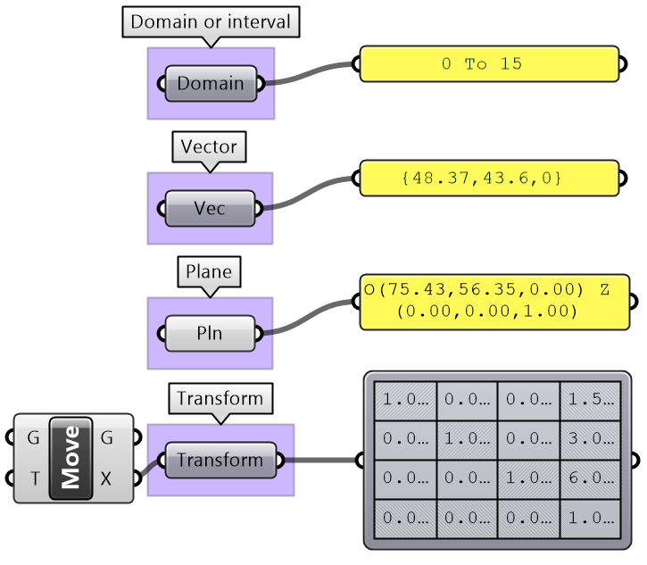
   <figcaption>Figure(8): Examples of data types common in computer graphics</figcaption>
</figure>  

The parameters in GH can be used to convert data from one type to another (cast). For example if you need to turn a text into a number, you can feed your text into a <b>Number</b> parameter. If the text cannot be converted, you’ll get an error.

<figure>
   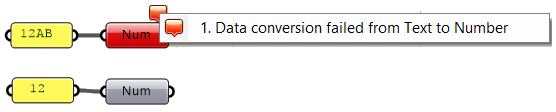
   <figcaption>Figure(9): Data conversion (casting) inside parameters in Grasshopper</figcaption>
</figure>  

Grasshopper components internally convert input to suitable types when possible. For example, if you feed a “text” to <b>Addition</b> component, GH tries to read the text as a number. If a component can process more than one type, it uses the input type without conversion. For example, equality in an expression can compare text as well as numbers. In such case, make sure you use the intended type to avoid confusion.

<figure>
   
   <figcaption>Figure(10): Some operations can be performed on multiple types. Cast to the intended type especially if the component is capable of processing multiple types (such as Expression in GH)</figcaption>
</figure>  

It is worth noting that sometimes GH components simply ignore invalid input (null or wrong type). In such cases, you are likely to end up with an unexpected result and it will be hard to find the bug. It is very important to verify the output from each component before using it.

<figure>
   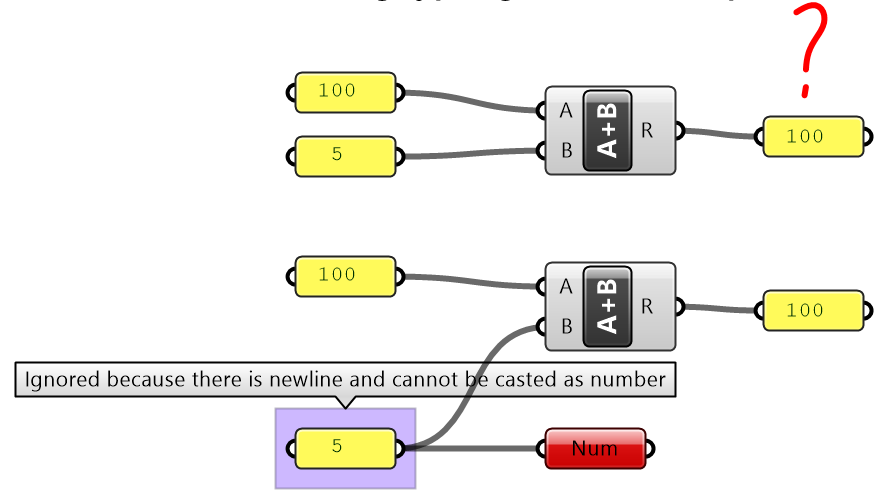
   <figcaption>Figure(11): Invalid input is ignored and a default value is used. For example a number inside a Panel component can be interpreted as a text and hence become invalid input to an Addition component</figcaption>
</figure>  

## 1.7 Processing Data

Algorithmic designs use many data operations and processes. In the context of this book, we will focus on five categories: numeric and logical operations, analysis, sorting and selection.

### 1.7.1 Numeric operations

Numeric operations include operations such as arithmetic, trigonometry, polynomials and complex numbers. GH has a rich set of numeric operations, and they are mostly found under the <b>Math</b> tab. There are two main ways to perform operations in GH. First by using designated components for specific operations such as <b>Addition, Subtraction</b> and <b>Multiplication</b>.

<figure>
   
   <figcaption>Figure(12): Examples of  numeric operations components in GH</figcaption>
</figure>  

Second, use an <b>Expression</b> component where you can combine multiple operations and perform a rich set of math and trigonometry operations, all in one expression.

<figure>
   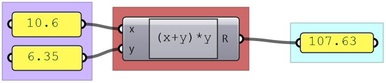
   <figcaption>Figure(13): Expression component in GH can be used to perform multiple operations</figcaption>
</figure>  

The <b>Expression</b> component is more robust and readable when you have multiple operations.

<figure>
   
   <figcaption>Figure(14): When a chain of operations is involved, using the Expression component is easier to maintain</figcaption>
</figure>  

Input to Expressions can be treated as text depending on the context.

<figure>
   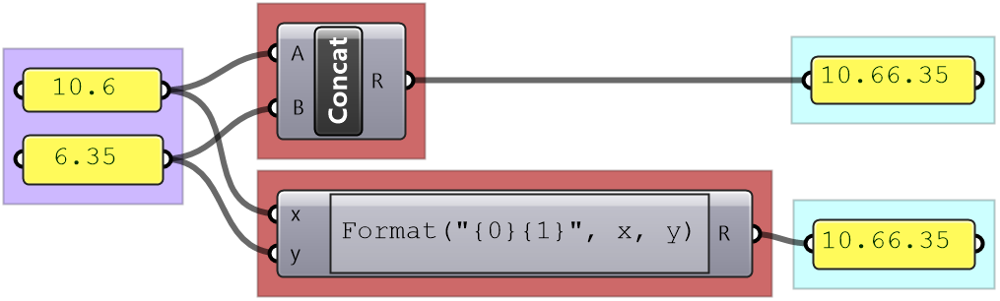
   <figcaption>Figure(15): Expression can process and format text</figcaption>
</figure>  

It is worth mentioning that most numeric input to components allow writing an expression to modify the inputs inline. For example, the Range component has N (number of steps) input. If you right mouse click on “N”, you can set an expression. You always use “x” to represent the supplied input regardless of the name.

<figure>
   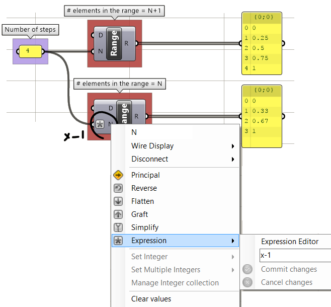
   <figcaption>Figure(16):  Expression can be set inside the input parameter. Variable “x” refers to the supplied input value</figcaption>
</figure>  

### 1.7.2 Logical operations

Main logical operations in GH include equalities, sets and logic gates.

<figure>
   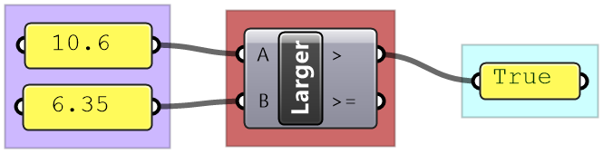
   <figcaption>Figure(17):  Grasshopper has multiple components to perform Logical operations</figcaption>
</figure>  

Logical operations are used to create conditional flow of data. For example, if you like to draw a sphere only when the radius is between two values, then you need to create a logic that blocks the radius when it is not within your limits.

<figure>
   
   <figcaption>Figure(18):  Data flow control using logical operations</figcaption>
</figure>  

### 1.7.3 Data analysis

There are many tools in GH to examine and preview data. <b>Panel</b> is used to show the full details of the data and its structure, while the <b>Parameter Viewer</b> shows the data structure only. Other analysis components include <b>Quick Graph</b> that plots data in a graph, and <b>Bounds</b> to find the limits in a given set of numbers (the min and max values in the set).

<figure>
   
   <figcaption>Figure(19):  Some of the ways to analyze data in Grasshopper</figcaption>
</figure>  

### 1.7.4 Sorting

GH has designated components to sort numeric and geometry data. The Sort List component can sort a list of numeric keys. It can sort a list of numbers in ascending order or reverse the order. You can also use the Sort List component to sort geometry by some numeric keys, for example sort curves by length. GH has components designated to sort geometry sets such as Sort Points to sort points by their coordinates.

<figure>
   
   <figcaption>Figure(20):  Sorting numbers in Grasshopper</figcaption>
</figure>  

### 1.7.5 Selection

3D modeling allows picking specific or a group of objects interactively, but this is not possible in algorithmic design. Data is selected in GH based on the location within the data structure, or by a selection pattern. For example <b>List</b> Item component allows selecting elements based on their indices.

<figure>
   
   <figcaption>Figure(21):  Select items from a list in Grasshopper</figcaption>
</figure>  

The <b>Cull Pattern</b> component allows using some repeated patterns to select a subset of the data.

<figure>
   
   <figcaption>Figure(22):  An example to select every other item in a list</figcaption>
</figure>  

As you can see from the examples, selecting specific items or using cull components yield a subset of the data, and the rest is thrown away. Many times you only need to isolate a subset to operate on, then recombine back with the original set. This is possible in GH, but involves more advanced operations. We will get into the details of these operations when we talk about advanced data structures in chapter 3.

### 1.7.6 Mapping

That refers to the linear mapping of a range of numbers where each number in a set is mapped to exactly one value in the new set. GH has a component to perform linear mapping called <b>ReMap</b>. You can use it to scale a set of numbers from its original range to a new one. This is useful to scale your range to a domain that suits your algorithm’s needs and limitations.

<figure>
   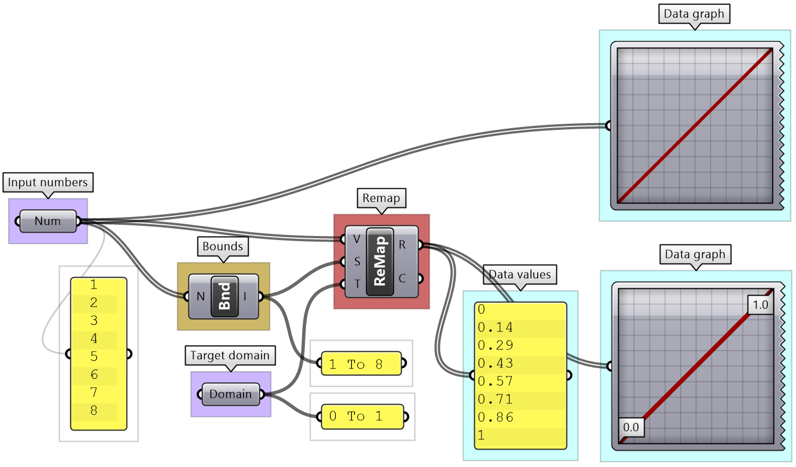
   <figcaption>Figure(23):  An example of linear remapping of numbers in Grasshopper</figcaption>
</figure>  

Converting data involves mapping. For example, you may need to convert an angle unit from degrees to radians ( GH components accept angles in radians only). 

<figure>
   
   <figcaption>Figure(24):  Convert angles from degrees to radians</figcaption>
</figure>  

As you know, parametric curves have “domains” (the range of parameters that evaluate to points on the curve). For example, if the domain of a given curve is between 12.5 to 51.3, evaluating the curve at 12.5 gives the point at the start of the curve. Many times you need to evaluate multiple curves using consistent parameters. Reparameterizing the domain of curves to some unified range helps solve this problem. One common domain to use is “0 To 1”. At the input of each curve in any GH component, there is the option to <b>Reparameterize</b> which resets the domain of the curve to be “0 to 1”.

<figure>
   
   <figcaption>Figure(25):  Normalize the domain of curves (set to 0-1). Use Reparameterize input flag in Grasshopper</figcaption>
</figure>  

<table class="rounded">
  <tr>
    <th>Tutorial 1-7-A: Flow control</th>
  </tr>
  <tr>
    <td>
    What is the purpose of the following algorithm? Notate and color code to describe the purpose of each part.
    <figure>
    
    </figure>
    </td>
  </tr>
  <tr>
    <td>
        

        
<b>Solution...</b>

         <b>Analyze the algorithm</b> 
        The algorithm has an output that is a sphere, a radius input and some conditional logic to process the radius.
        <figure>
         
         <b>Notate and color-code the solution</b> 
        From testing the output and following the steps of the solution it becomes apparent that the intention is to make sure that the radius of the sphere cannot be less than 1 unit. 
        Test with radius greater than 1 (3.4 in the example)
        <figure>
        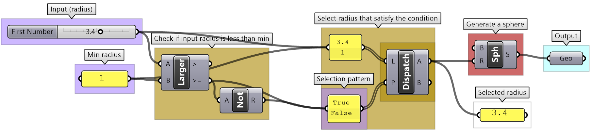 
        </figure> 
        Test with radius less than 1 (-2.8 in the example)
        <figure>
         
        </figure> 
        

    </td>
  </tr>
</table>

<table class="rounded">
  <tr>
    <th>Tutorial 1-7-B: Data processing</th>
  </tr>
  <tr>
    <td>
    Given a list of numbers of some point coordinates, do the following: 
    1. Analyze the list to understand the data. 
    2. Write an algorithm to convert the list of <b>Numbers</b> to a list of <b>Points</b>. 
    3. Change the domain of coordinate values to be between 3 and 9. 
     Note that the input number list is organized so that the first 3 numbers refer to the x,y,z of the first point, the second 3 numbers belong to the second point and so on.
    </td>
  </tr>
  <tr>
    <td>
        

        
<b>Solution...</b>

         <b>Analyze the algorithm</b> 
                <table>
          <tr>
            <td>
            There are 2 inputs: a list of 51 numbers (3 coordinates for each point) which means that the list has 17 points. 
            Using a <b>QuickGraph</b>, we can see that the numbers are between 2.60 and 15.89. We can also see that the values are distributed randomly. The other input is the target domain to be from 3 to 9.
            </td>
            <td>
            
            </td>
          </tr>
        </table>
        <b>Use the 4-step process to solve the algorithms</b> 
        <table>
          <tr>
            <td style="background-color:#cfe2f3">
            <b>Output: List of points</b> 
            Use the <b>Parameter Viewer</b> to view the resulting data structure. To start, it will be empty.
            </td>
            <td>
            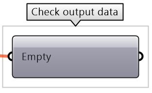
            </td>
          </tr>
          <tr>
            <td style="background-color:#f4cccc">
            <b>Key Process #1: Remap Coordinates</b> 
            Map the coordinates list from its current domain (2.60 to 15.89) to a new domain (3.0 to 9.0) 
            Use <b>ReMap</b> component to achieve that
            </td>
            <td>
            
            </td>
          </tr>
          <tr>
            <td style="background-color:#eee4c5">
            <b>Intermediate processes #1</b> 
            The input domain is missing and can be extracted using <b>Bounds</b> component
            </td>
            <td>
            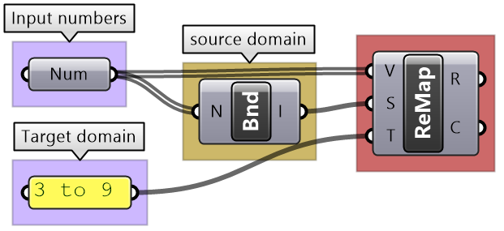
            </td>
          </tr>
          <tr>
            <td style="background-color:#f4cccc">
            <b>Key Process #2: Construct Points</b> 
            Construct points from coordinates 
            Use <b>Construct Point (Pt)</b> component
            </td>
            <td>
            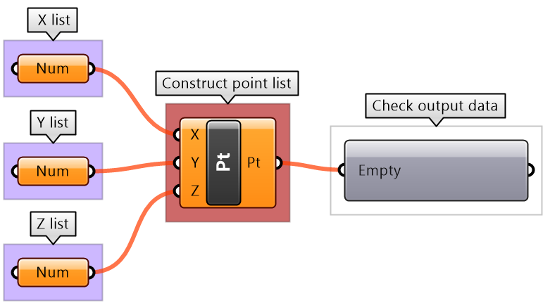
            </td>
          </tr>
          <tr>
            <td style="background-color:#eee4c5">
            <b>Intermediate processes #2</b> 
            Extract all X coordinates as one list, Y in another and Z in the third. Use <b>Cull Pattern</b> component with appropriate pattern to extract each coordinate as a separate list.  
            The input to <b>Cull</b> is the remapped points from process #1
            </td>
            <td>
            
            </td>
          </tr>
        </table>
        <b>Putting it all together</b> 
        
        

    </td>
  </tr>
</table>

## 1.8 Pitfalls of algorithmic design

Writing elegant algorithms that are efficient and easy to read and debug is hard. We explained in this chapter how to write algorithms with style using color-coding and labeling. We also articulated a 4-step process to help develop algorithms. Following these guides help minimize bugs and improve the readability of the scripts. We will list a few of the common issues that lead to incorrect or unintended result.

### 1.8.1 Invalid or wrong input type

If the input is of the wrong type or is invalid, GH changes the color of components to red or orange to indicate an error warning, with feedback about what the issue might be. This is helpful, but sometimes faulty input goes unnoticed if the components assign a default value, or calculate an alternative value to replace the input, that is not what was intended. It is a good practice to always double check the input (hook to a panel or parameter viewer and label the input). To avoid using wrong types, it is advisable to convert to the intended type to ensure accuracy.

<figure>
   
   <figcaption>Figure(26): Error resulting from wrong input type</figcaption>
</figure>  

### 1.8.2 Unintended input

Input is prone to unintended change via intermediate processes or when multiple users have writing access to the script. It is very useful to preview and verify all key input and output. The Panel component is very versatile and can help check all types of values. Also you can set up guarding logic against out of range values or to trap undesired values.

<figure>
   
   <figcaption>Figure(27): Error resulting from unintended input. Cannot assume curve domain is 0-1 and use 0.5 to evaluate the midpoint</figcaption>
</figure>  

<figure>
   
   <figcaption>Figure(28): Example of a robust solution to evaluate the midpoint of a curve</figcaption>
</figure>  

### 1.8.3 Incorrect order of operation

You should try to organize your solutions horizontally or vertically to clearly see the sequence of operations. You should also check the output from each step to make sure it is as expected before continuing on your code. There are also some techniques that help consolidate the script, for example use <b>Expression</b> when multiple numeric and math operations are involved. The following highlights some unfavorable organization.

<figure>
   
   <figcaption>Figure(29): Easy to confuse input to operations with poor organization</figcaption>
</figure>  

The following shows how to rewrite the same code to make it less error prone.

<figure>
   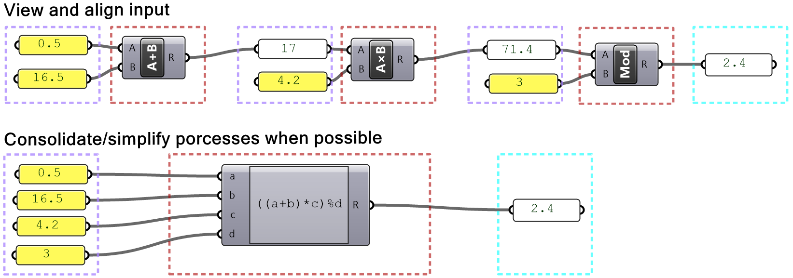
   <figcaption>Figure(30): Best practices to align input with processes, or use Expressions</figcaption>
</figure>

### 1.8.4 Mismatched data structures

The issue of mismatched data structures as input to the same process or component is particularly tricky to guard against in GH, and has the potential to spiral the solution out of memory. It is essential to test the data structure of all input (except trivial ones) before feeding into any component. It is also important to examine desired matching under different scenarios (data matching will be explained at length later).

<figure>
   
   <figcaption>Figure(31): Mismatched data structures of input can cause errors in the output</figcaption>
</figure>

### 1.8.5 Long processing time

Some algorithms are time consuming, and you simply have to wait for it to process, but there are ways to minimize the wait when it is unnecessary. For example, at the early cycles of development, you should try to use a smaller set of data to test your solution with before committing the time to process the full set of data. It is also a good practice to break the solution into stages when possible, so you can isolate and disable the time consuming parts. Also, it is often possible to rewrite your solution to be more optimized and consume less time. Use the GH <b>Profiler</b> to test processing time. When a solution takes far too long to process or crashes, you should do the following: before you reopen the solution, disable it, and disconnect the input that caused the crash.

<figure>
   
   <figcaption>Figure(32): Grasshopper Profiler widget helps observe processing time</figcaption>
</figure>

### 1.8.6 Poor organization

Poorly organized definitions are not easy to debug, understand, reuse or modify. We can’t stress enough the importance of writing your definitions with styles, even if it costs extra time to start with. You should always color code, label everything, give meaningful names to variables, break repeated operations into modules and preview your input and output.

<figure>
   
   <figcaption>Figure(33): Poor organization in visual programming make the code hard to read and debug</figcaption>
</figure>

## 1.9 Tutorials: algorithms and data

<table class="rounded">
  <tr>
    <th>Tutorial 1.9.1: Unioned circles</th>
  </tr>
  <tr>
    <td>
    Use the 4-step process to design an algorithm that combines 2 circles, given the following: 
    Both circles are located on the XY-Plane. The first circle (Cir1) has a center (C1) = (2,2,2) and radius (R1) that is equal to a random number between 3 and 6. The second circle (Cir2) has a center (C2) that is shifted to the right of the first circle (Cir1) by an amount equal to the radius of the first circle (R1) along the positive X-Axis. The second circle radius (R2) is 20% bigger, or in other words (R2) = (R1) * 1.2.
    </td>
  </tr>
  <tr>
    <td>
        

        
<b>Solution...</b>

         <b>Analyze the question and the flow of the solution</b> 
        <table>
          <tr>
            <td>
            There are 2 inputs: the coordinates of the center of the first circle (2,2,2) and the XY-Plane where both circles are located. Also, we know that the second circle is shifted the positive X-Axis direction, The following diagram shows an overview of the solution: 
            
            </td>
          </tr>
        </table>
        <b>Solution steps</b> 
        <table>
          <tr>
            <td style="background-color:#cfe2f3">
            <b>Output: Curve for the region union</b>
            </td>
            <td>
            
            </td>
          </tr>
          <tr>
            <td style="background-color:#f4cccc">
            <b>Key Process: Union of 2 circles</b> 
            Use the <b>Region Union</b> component that takes curves and a plane
            </td>
            <td>
            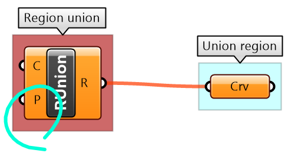
            </td>
          </tr>
          <tr>
            <td style="background-color:#d9d2e9">
            <b>Input: needed to calculate the region union</b> 
            Identify the input needed and use given input when relevant.  
            The plane for region union has been given. The 2 circles need their own plane and radius. The center of the plane is the center of the circle.
            </td>
            <td>
            
            </td>
          </tr>
          <tr>
            <td style="background-color:#eee4c5">
            <b>Intermediate processes #1:</b> 
            generate the center and plane of the 1st circle 
            Construct a center from the given coordinates. Create a plane using <b>Plane Origin</b> component and use the constructed center and XY-Plane.  
            The radius is from a random number between 3 and 6. Use <b>Random</b> component to create the radius
            </td>
            <td>
            
            </td>
          </tr>
          <tr>
            <td style="background-color:#eee4c5">
            <b>Intermediate processes #2</b> 
            Generate the center and plane of the 2nd circle 
            Calculate the 2nd circle plane by moving the first circle plane along the x-axis by an amount = first radius  
            Calculate the 2nd circle radius by multiplying the first radius by 1.2 
            </td>
            <td>
            
            </td>
          </tr>
        </table>
        <b>Putting it all together</b> 
        
        

    </td>
  </tr>
</table>

<table class="rounded">
  <tr>
    <th>Tutorial 1.9.2: Sphere with bounds</th>
  </tr>
  <tr>
    <td>
    Use the 4-step process to draw a sphere with a radius between 2 and 6. If input is less than 2, then set the radius to 2, and if input radius is greater than 6, set the radius to 6. Use a number slider to input the radius and set between 0 and 10 to test. Make sure your solution is well organized, color-coded and labeled properly.
    </td>
  </tr>
  <tr>
    <td>
        

        
<b>Solution...</b>

        <b>The 4-step process to solve the algorithm</b> 
        <table>
          <tr>
            <td style="background-color:#cfe2f3">
            <b>Output: The sphere as geometry</b>
            </td>
            <td>
            
            </td>
          </tr>
          <tr>
            <td style="background-color:#f4cccc">
            <b>Key Process: Create a sphere</b> 
            Use the <b>Sphere</b> component to create a sphere from a base plane and radius
            </td>
            <td>
            
            </td>
          </tr>
          <tr>
            <td style="background-color:#d9d2e9">
            <b>Input:</b> 
            1. The radius parameter (0 - 10) 
            2. The bounds of the radius are 2 & 6
            </td>
            <td>
            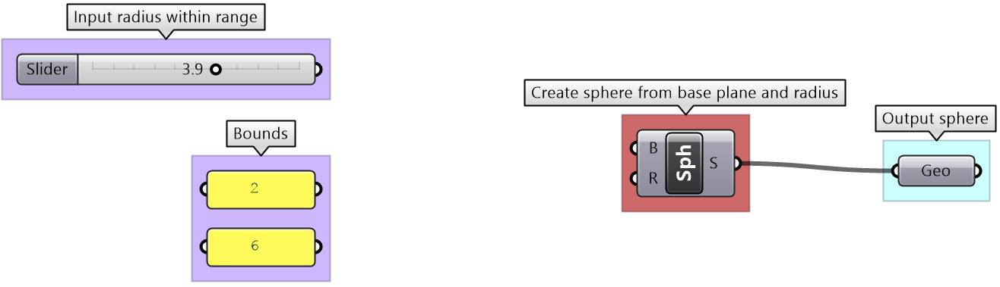
            </td>
          </tr>
          <tr>
            <td style="background-color:#eee4c5">
            <b>Intermediate processes #1:</b> 
            Construct a selection logic of radii and pattern. The radii is a list of the values from the slider, min and max.  
            The list of pattern is generated to select the correct radius value
            </td>
            <td>
            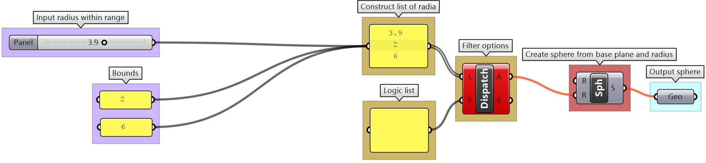
            </td>
          </tr>
          <tr>
            <td style="background-color:#eee4c5">
            <b>Intermediate processes #2</b> 
            Generate the center and plane of the 2nd circle 
            The selection logic ensures that the radius value falls within the intended range. If the radius input is less than the minimum value of the bounds, then the radius is set to the min value, and if it is greater than the maximum, then the max value is used instead.
            </td>
            <td>
            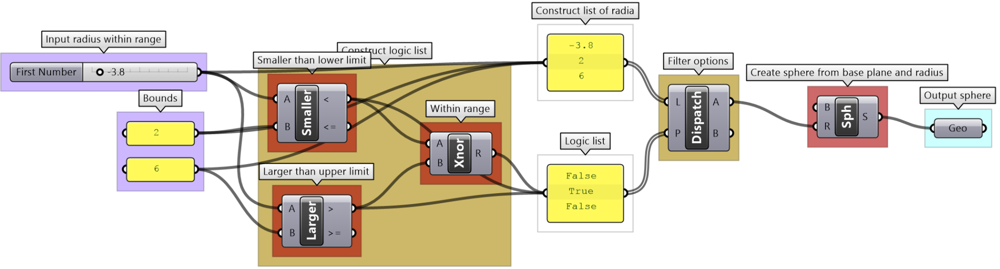
            </td>
          </tr>
        </table>
        

    </td>
  </tr>
</table>

<table class="rounded">
  <tr>
    <th>Tutorial 1.9.3: Data operations</th>
  </tr>
  <tr>
    <td>
    Given the numbers embedded in the <b>Number</b> parameter do the following: 
    1. Analyze input in terms of bounds and distribution 
    2. View the data and how it is structured 
    3. Extract even numbers 
    4. Sort numbers descending 
    5. Remap sorted numbers to (100 to 200)
    </td>
  </tr>
  <tr>
    <td>
        

        
<b>Solution...</b>

        <table>
          <tr>
            <td>
             <b>1- Analyze the input bounds and distribution</b>  
            Use the <b>QuickGraph</b> to show that the set of numbers are between 3 and 98 and are distributed randomly.
            </td>
            <td>
            
            </td>
          </tr>
          <tr>
            <td>
            <b>2- Analyze the input data structure and values</b>  
            Use the <b>Panel</b> and <b>Parameter Viewer</b> to show that there are 16 elements organized in a list
            </td>
            <td>
            
            </td>
          </tr>
          <tr>
            <td>
            <b>3- Extract Even numbers</b>  
            Create the logic to test if a number is even (divisible by 2 without a remainder) and use <b>Dispatch</b> to extract even numbers
            </td>
            <td>
            
            </td>
          </tr>
          <tr>
            <td>
            <b>4- Sort numbers descending</b>  
            The Sort List component sorts numbers in ascending order. Use Reverse List component to further process the list to order descending
            </td>
            <td>
            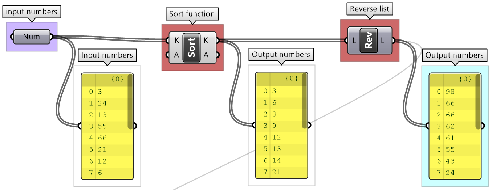
            </td>
          </tr>
          <tr>
            <td>
            <b>5- Remap to 100-200</b>  
            Check the input range and use Remap component to scale data to be between 100-200
            </td>
            <td>
            
            </td>
          </tr>
        </table>
        

    </td>
  </tr>
</table>

<table class="rounded">
  <tr>
    <th>Tutorial 1.9.4: Algorithmic Pitfalls</th>
  </tr>
  <tr>
    <td>
    Analyze what the following algorithm is intended to do, identify the errors that are preventing it from working as intended, then rewrite to fix the errors. Organize to reflect the algorithm flow, label and color-code.
    </td>
  </tr>
  <tr>
    <td>
        

        
<b>Solution...</b>

        <table>
          <tr>
            <td>
             The first step is to mark the errors:
            
            </td>
          </tr>
          <tr>
            <td>
            Next, fix the errors and rewrite the solution with labels and proper color codes:
            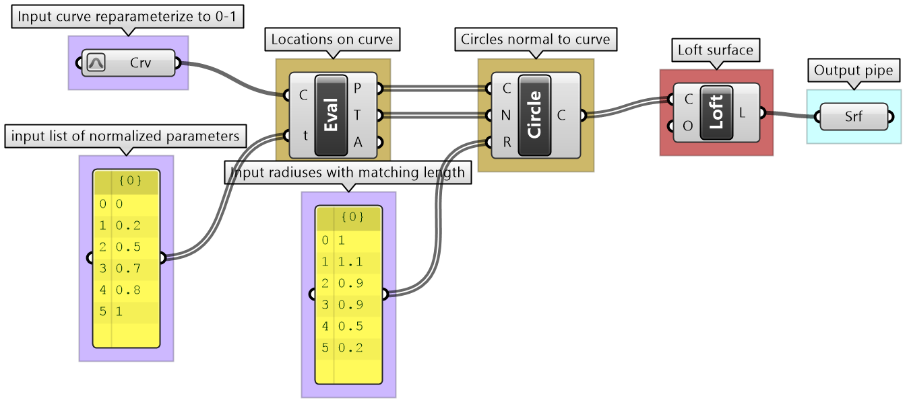
            </td>
          </tr>
        </table>
        

    </td>
  </tr>
</table>

## Next Steps

Those are the algorithms and data. Next, learn [Introduction to Data Structures](/guides/grasshopper/gh-algorithms-and-data-structures/data-structures/).

This is part 1-3 of the [Essential Algorithms and Data Structures for Grasshopper](/guides/grasshopper/gh-algorithms-and-data-structures/).
