+++
aliases = [""]
authors = [ "rajaa" ]
categories = [ "Essentials Algorithms and Data Structures" ]
category_page = "guides/grasshopper/gh-algorithms-and-data/"
keywords = [ "data structures", "grasshopper" ]
languages = [ "" ]
sdk = [ "" ]
title = "Chapter 2: Introduction to Data Structures"
type = "guides"
weight = 15
override_last_modified = "2024-07-15T14:59:06Z"
draft = false

[admin]
picky_sisters = ""
state = ""

[included_in]
platforms = [ "Windows", "Mac" ]
since = 7
until = ""

[page_options]
block_webcrawlers = false
byline = true
toc = true
toc_type = "single"

+++

All algorithms involve processing input data to generate a new set of data as output. Data is stored in well-defined structures to help access and manipulate efficiently. Understanding these structures is the key for successful algorithmic designs. This chapter includes an in-depth review of the basic data structures in Grasshopper. 

## 2.1 Overview

Grasshopper has three distinct data structures: single item, list of items and tree of items. GH components execute differently based on input data structures, and hence it is essential to be fully aware of the data structure before using. There are tools in GH to help identify the data structure. Those are Panel and Param Viewer.

<figure>
   
   <figcaption>Figure(34): Data structures in Grasshopper
</figcaption>
</figure>

Processes in GH execute differently based on the data structure. For example, the Mass Addition component adds all the numbers in a list and produces a single number, but when operating on a tree, it produces a list of numbers representing the sum of each branch.

<figure>
   
   <figcaption>Figure(35): Components execute differently based on the data structures. Result of adding numbers from Figure(34)
</figcaption>
</figure>

The wires connecting the data with components in GH offer additional visual reference to the data structure. The wire from a single item is a simple line, while the wire connecting a list is drawn as a double line. A wire output from a tree data structure is a dashed double line. This is very useful to quickly identify the structure of your data.

<table class="rounded">
  <tr>
    <th>Display the data structure</th>
    <th>Example</th>
  </tr>
  <tr>
    <td>
    <b>Item</b>: single branch with single item 
    Wire display: single line
    </td>
    <td>
    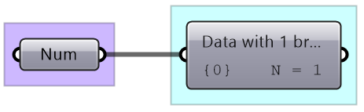
    </td>
  </tr>
  <tr>
    <td>
    <b>List</b>: single branch with multiple items 
    Wire display: double line
    </td>
    <td>
    
    </td>
  </tr>
    <tr>
    <td>
    <b>Tree</b>: multiple branches with any number of items per branch 
    Wire display: double dashed line
    </td>
    <td>
    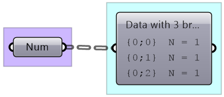
    </td>
  </tr>
</table>

## 2.2 Generating lists

There are many ways to generate lists of data in GH. So far we have seen how to directly embed a list of values inside a parameter or a panel (with multiline data). There are also special components to generate lists. For example, to generate a list of numbers, there are three key components: <b>Range</b>, <b>Series</b> and <b>Random</b>. Lists can be the output of some components such as <b>Divide</b> curve (the output includes lists of points, tangents and parameters). Use the <b>Panel</b> component to preview the values in a list and <b>Parameter Viewer</b> to examine the data structures.

 <table>
<tr>
  <td>
  The <b>Range</b> component creates equally spaced range of numbers between a min and max values (called domain) and a number of steps (the number of values in the resulting list is equal to the number of steps plus one).
  <figure>
   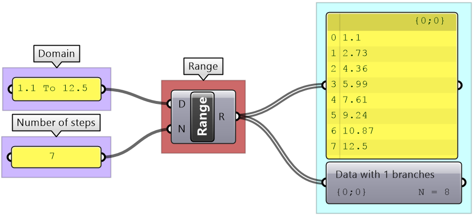
   <figcaption>Figure(36): Generate a list of 8 numbers using the Range component in Grasshopper</figcaption>
  </figure>
  </td>
</tr>
<tr>
  <td>
  The <b>Series</b> component also creates an equally spaced list of numbers, but here you set the starting number, step size and number of elements.
  <figure>
   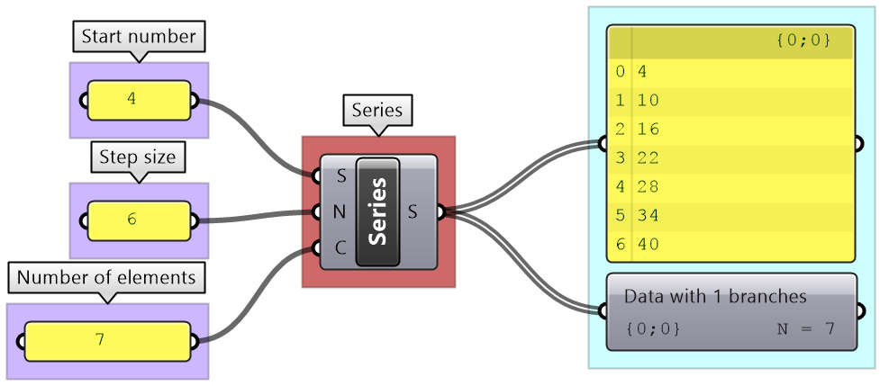
   <figcaption>Figure(37): Generate a list of 7 numbers using the Series component in Grasshopper</figcaption>
  </figure>
  </td>
</tr>
<tr>
  <td>
  The <b>Random</b> component is used to create random numbers using a domain and a number of elements. If you use the same seed, then you always get the same set of random numbers.
<figure>
   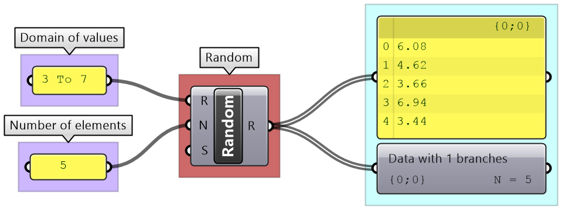
   <figcaption>Figure(38): Generate a list of numbers using the Random component in Grasshopper</figcaption>
</figure>
  </td>
</tr>
<tr>
  <td>
  The <b>Divide</b> component outputs divide points, tangents and parameters on curve.
<figure>
   
   <figcaption>Figure(39):  Divide Curve takes a single input (curve) and generate lists of output</figcaption>
</figure>
  </td>
</tr>
</table>

<table class="rounded">
  <tr>
    <th>Tutorial: 2_2_1 Generating lists</th>
  </tr>
  <tr>
    <td>
    Explore 4 different ways to create circles. Use different data sources and data structures.
    </td>
  </tr>
  <tr>
    <td>
        

        
<b>Solution...</b>

        <table>
          <tr>
            <td>
             1. Directly set a circle in a parameter
            
            </td>
          </tr>
          <tr>
            <td>
            2. Set the plane input to the default XY-Plane  (internal). Supply a list of radiuses using <b>Range</b> component
            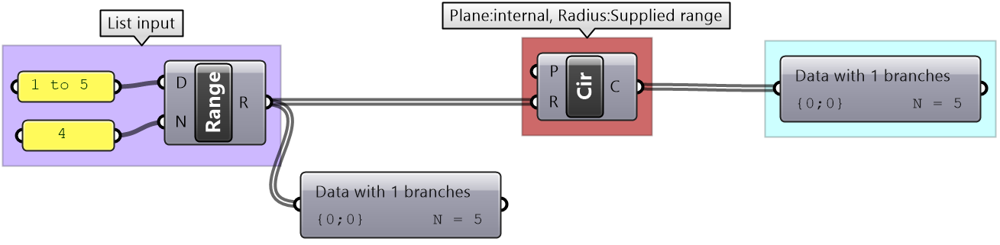
            </td>
          </tr>
          <tr>
            <td>
            3. Supply one value for the center. Normal is set to default (internal) List of radiuses using <b>Random</b> component
            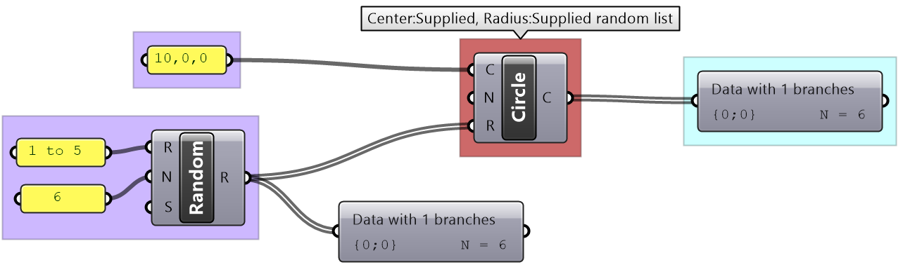
            </td>
          </tr>
          <tr>
            <td>
            4. Create a circle from 3 points: A: set internally to one value B: Supply one value C: Supply a list of values using the <b>Series</b> component to set a list of Z coordinates
            
            </td>
          </tr>
        </table>
        

    </td>
  </tr>
</table>

## 2.3 List operations

Grasshopper offers an extensive list of components for list operations and list management. We will review the most commonly used ones. 

 <table>
<tr>
  <td>
  You can check the length of a list using the <b>List Length</b> component, and access items at specific indices using the <b>List Item</b> component.
<figure>
   
   <figcaption>Figure(40):  Examples of list operations in Grasshopper</figcaption>
</figure>
  </td>
</tr>
<tr>
  <td>
  Lists can be reversed using the <b>Reverse List</b> component, and sorted using the <b>Sort List</b> component.
<figure>
   
   <figcaption>Figure(41):  Lists can be reversed or sorted using designated components in Grasshopper</figcaption>
</figure>
  </td>
</tr>
<tr>
<tr>
  <td>
  Components such as <b>Cull Patterns</b> and <b>Dispatch</b> allow selecting a subset of the list, or splitting the list based on a pattern.These components are very commonly used to control data flow and select a subset of the data.
<figure>
   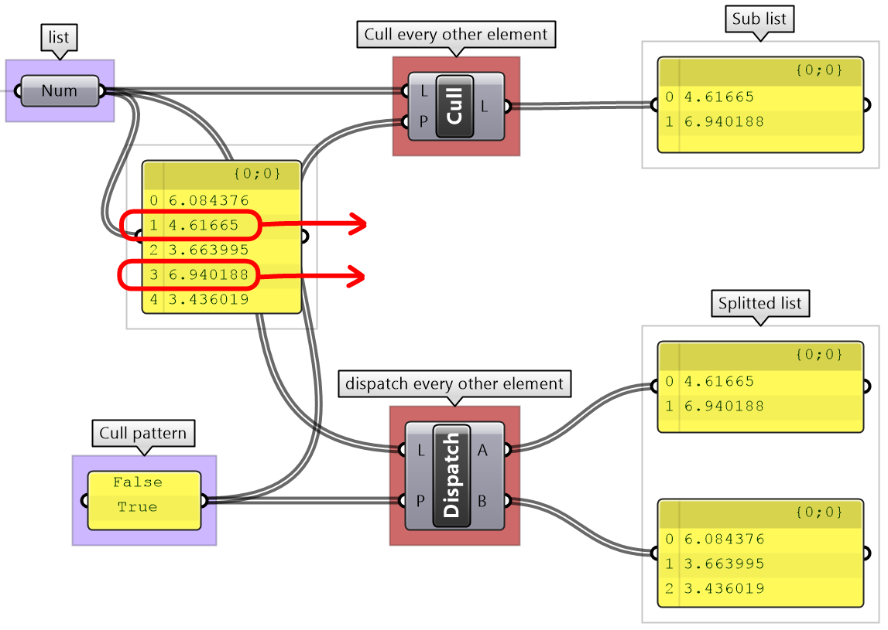
   <figcaption>Figure(42):  Cull part of a list using components such as Cull Pattern and Dispatch</figcaption>
</figure>
  </td>
</tr>
<tr>
<tr>
  <td>
  The <b>Shift List</b> component allows shifting a list by any number of steps. That helps align multiple lists to match in a particular order.
<figure>
   
   <figcaption>Figure(43):  Shift operation in Grasshopper</figcaption>
</figure>
  </td>
</tr>
<tr>
<tr>
<tr>
  <td>
  The <b>Subset</b> component is another example to select part of a list based on a range of indices.
<figure>
   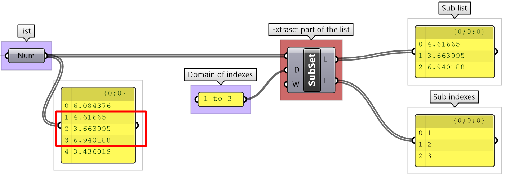
   <figcaption>Figure(44):  Select a subset of the list using a range of indices</figcaption>
</figure>
  </td>
</tr>
<tr>
</table>

<table class="rounded">
  <tr>
    <th>Tutorial: 2_3_1 List operations</th>
  </tr>
  <tr>
    <td>
    Given two lists of points from dividing two concentric circles, generate the following patterns:
    
    </td>
  </tr>
  <tr>
    <td>
        

        
<b>Solution...</b>

        <table style="width:100%">
          <tr>
            <td style="width:25%">
            
            </td>
            <td style="width:75%">
            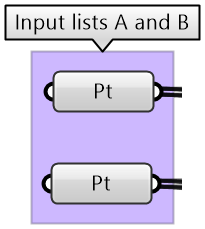
            </td>
          </tr>
          <tr>
            <td>
            
            </td>
            <td>
            
            </td>
          </tr>
          <tr>
            <td>
            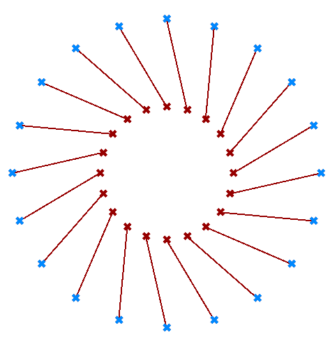
            </td>
            <td>
            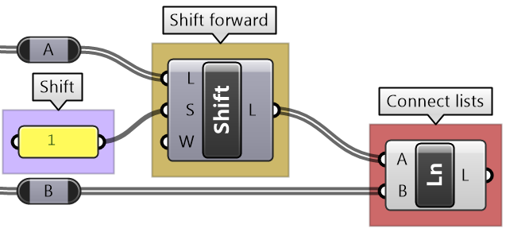
            </td>
          </tr>
          <tr>
            <td>
            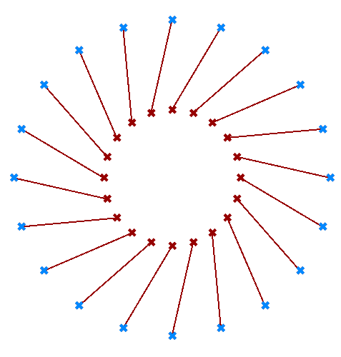
            </td>
            <td>
            
            </td>
          </tr>
          <tr>
            <td>
            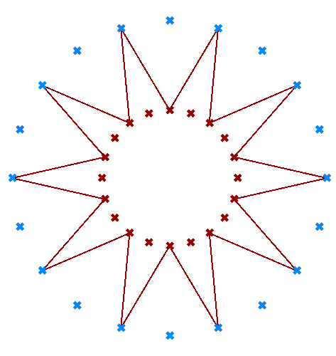
            </td>
            <td>
            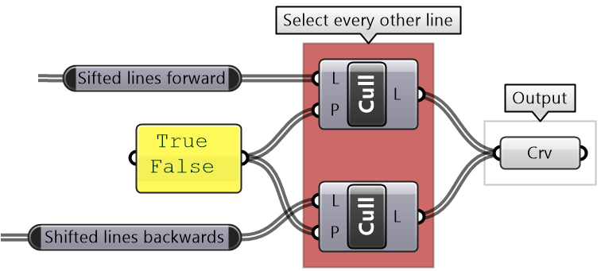
            </td>
          </tr>
          <tr>
            <td>
            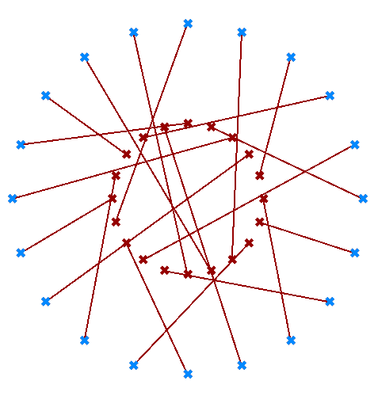
            </td>
            <td>
            
            </td>
          </tr>
          <tr>
            <td>
            
            </td>
            <td>
            
            </td>
          </tr>
          <tr>
            <td>
            
            </td>
            <td>
            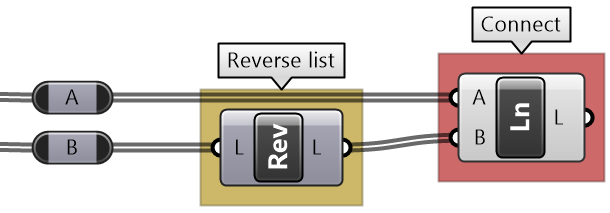
            </td>
          </tr>
          <tr>
            <td>
            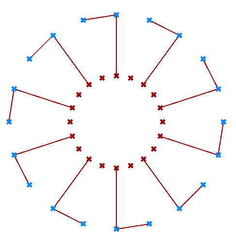
            </td>
            <td>
            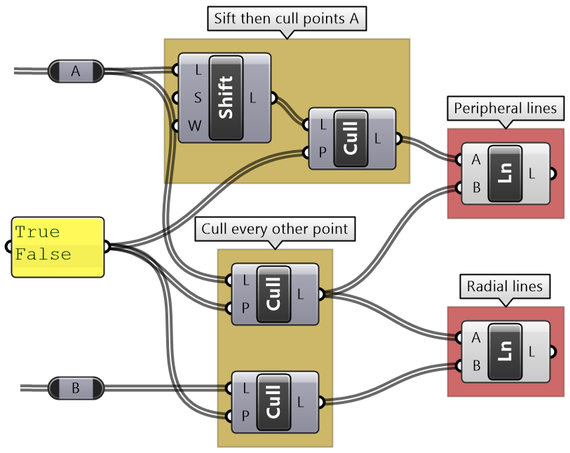
            </td>
          </tr>
        </table>
        

    </td>
  </tr>
</table>

## 2.4 List matching

When the input is a single item or has an equal number of elements in a simple list, it is easy to imagine how the data is matched. The matching is based on corresponding indices. Let’s use the <b>Addition</b> component to examine list matching in GH. Note that the same principles apply to all other Grasshopper components.

<figure>
   
   <figcaption>Figure(45): Examples of primitive data types common to all programming languages</figcaption>
</figure>

There are times when input has variable length lists. In this case, GH reuses the last item on the shorter list and matches it with the next items in the longer list. 

<figure>
   
   <figcaption>Figure(46): The default list matching in Grasshopper reuses the last element of the shorter list</figcaption>
</figure>

Grasshopper offers alternative ways of data matching: <b>Long</b>, <b>Short</b> and <b>Cross</b> reference that the user can force to use. The <b>Long</b> matching is the same as the default matching. That is, the last element of the shorter list is repeated to create a matching length.

<figure>
   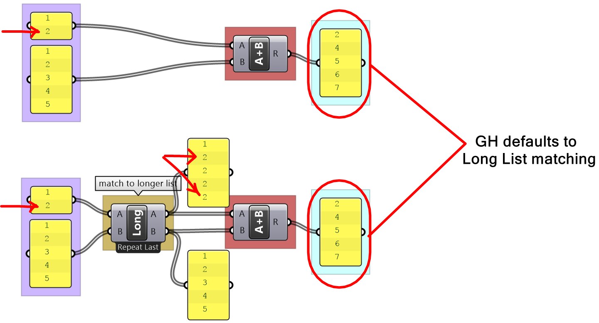
   <figcaption>Figure(47): Long list matching is the default matching mode in Grasshopper</figcaption>
</figure>

The <b>Short</b> list matching truncates the long list to match the length of the short list. All additional elements are ignored and the resulting list has a length that matches the shorter list.

<figure>
   
   <figcaption>Figure(48): Short matching of lists omits additional values in longer lists</figcaption>
</figure>

The <b>Cross Reference</b> matches the first list with each of the elements in the second list. The resulting list has a length equal to the multiplication product of the length of input lists. Cross reference is useful when trying to produce all possible combinations of input data. The order of input affects the order of the result as shown in Figure (49).

<figure>
   
   <figcaption>Figure(49): Cross reference matching creates longer lists to account for all possible permutations</figcaption>
</figure>

If none of the matching methods produce the desired result, you can explicitly adjust the lists to match in length based on your requirements. For example, if you like to repeat the shorter list until it matches the length of the longer list, then you’ll need to create the logic to achieve that as in the following example.

<figure>
   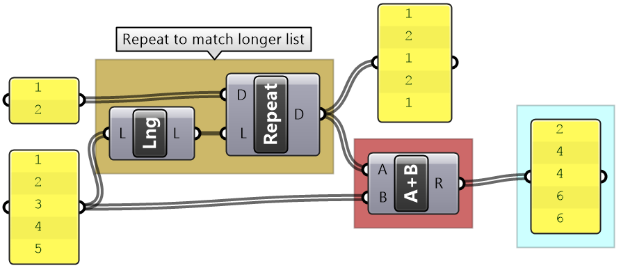
   <figcaption>Figure(50):  Need to create custom script to generate custom matching</figcaption>
</figure>

<table class="rounded">
  <tr>
    <th>Tutorial 2_4_1 List matching</th>
  </tr>
  <tr>
    <td>
    Use the 4-step method to generate an algorithm that takes 6 numbers (0 to 5) and turn them into a cube of points as in the image: 
    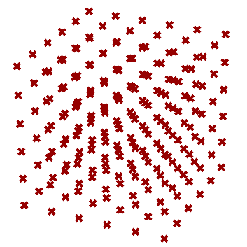
    </td>
  </tr>
  <tr>
    <td>
        

        
<b>Solution...</b>

        <table>
          <tr>
            <td style="background-color:#cfe2f3">
            <b>Output:</b> 
            A list of 6x6x6 = 216 points constructed from a list of X, Y, Z coordinates
            </td>
            <td>
            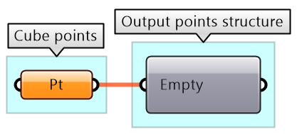
            </td>
          </tr>
          <tr>
            <td style="background-color:#f4cccc">
            <b>Key Process:</b> 
            Use the <b>Construct Point</b> component to generate the list of points
            </td>
            <td>
            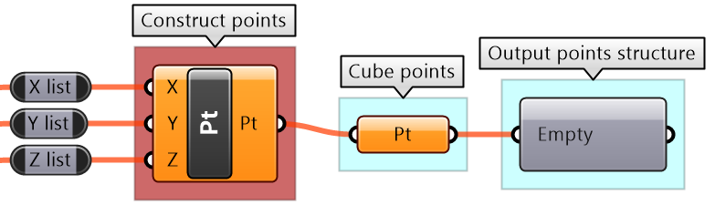
            </td>
          </tr>
          <tr>
            <td style="background-color:#d9d2e9">
            <b>Input:</b> 
            Examine input using the <b>Parameter Viewer</b> and <b>Panel</b> components. 
            The given list has 6 points representing each coordinate along each axis
            </td>
            <td>
            
            </td>
          </tr>
          <tr>
            <td style="background-color:#eee4c5">
            <b>Intermediate processes:</b> 
            Need to find all possible permutations for the coordinates to create the cube of 216 points along all 3 axes.  
            Use <b>Cross Reference</b> matching to generate lists of coordinates that have all possible permutations
            </td>
            <td>
            
            </td>
          </tr>
        </table>
        <b>Putting it all together</b> 
        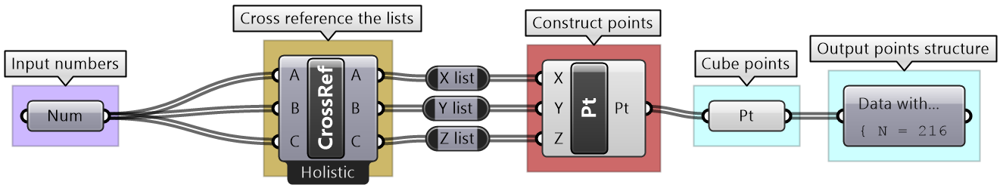
        

    </td>
  </tr>
</table>

## 2.5 Tutorials: data structures

<table class="rounded">
  <tr>
    <th>Tutorial 2.5.1: Variable thickness pipe</th>
  </tr>
  <tr>
    <td>
    Use the 4-step method to create a surface similar to the one in the image: 
    
    </td>
  </tr>
  <tr>
    <td>
        

        
<b>Solution...</b>

         <b> Algorithm Analysis:</b> 
        We can think of two different ways to generate this surface: 
        1. <b>Loft</b> circles created along a line at random locations with random radii 
        2. Create a profile curve at the circles start points, and <b>Revolve</b> around the line 
        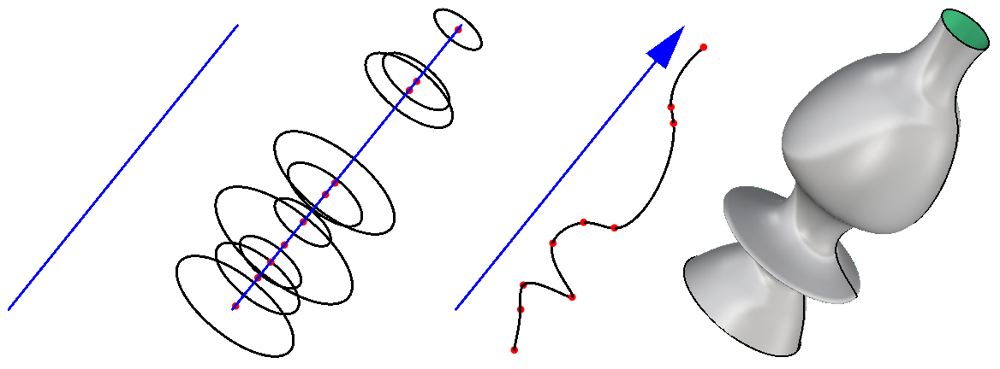  
        <table>
          <tr>
            <td style="background-color:#cfe2f3">
            <b>Output:</b> 
            The surface
            </td>
            <td>
            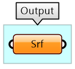
            </td>
          </tr>
          <tr>
            <td style="background-color:#f4cccc">
            <b>Key Process:</b> 
            Use the <b>Loft</b> component to generate the surface
            </td>
            <td>
            
            </td>
          </tr>
          <tr>
            <td style="background-color:#d9d2e9">
            <b>Input:</b> 
            Line (not given, so create one),  
            Number of intervals (not given, assume it is equal 10) 
            Thickness range (not given, assume it is equal to 1.0 to 3.0)
            </td>
            <td>
            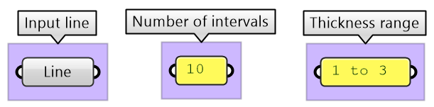
            </td>
          </tr>
          <tr>
            <td style="background-color:#eee4c5">
            <b>Intermediate processes #1:</b> 
            The Loft is created from a list of circles. Use the Circle component that takes centers, normals and radii lists. 
            Use the default Loft options 
            </td>
            <td>
            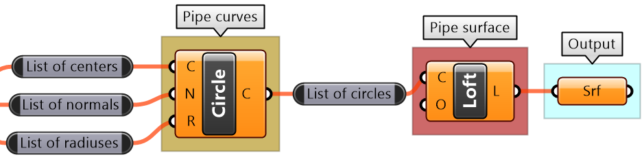
            </td>
          </tr>
          <tr>
            <td style="background-color:#eee4c5">
            <b>Intermediate processes #2:</b> 
            To create a list of random radii, use the <b>Random</b> component and the input thickness range 
            </td>
            <td>
            
            </td>
          </tr>
          </tr>
          <tr>
            <td style="background-color:#eee4c5">
            <b>Intermediate processes #3:</b> 
            Evaluate the line at random intervals. Use the <b>Evaluate Curve</b> component to extract center points and normals, and use the Random component to generate the parameters along the curve.  
            <b>Problem:</b> 
            The loft follows the order of input curves. however, the parameters (generated from the <b>Random</b> component) are not ordered along the line and hence it produces unordered circles. Use the Sort List component to order the parameters before feeding them into the <b>Evaluate Curve</b>
            </td>
            <td>
            
            </td>
          </tr>
        </table>
        <b>Putting it all together</b> 
        
        

    </td>
  </tr>
</table>

<table class="rounded">
  <tr>
    <th>Tutorial 2.5.2: Custom list matching</th>
  </tr>
  <tr>
    <td>
    Given the following three lists of numbers: [1, 2], [10, 20, 30] and [0.2, 0.4, 0.6, 0.9, 1], explain the default GH list matching when they are used as input. Compare the default matching with the Grasshopper <b>Shortest List</b> matching. Finally, use the original lists to create custom matching that repeats the pattern in the shorter lists to create a periodic matching until it matches the length of the longest list. For example [1,2] becomes [1,2,1,2,1].
    </td>
  </tr>
  <tr>
    <td>
        

        
<b>Solution...</b>

        <table>
          <tr>
            <td>
            <b>Construct default GH matching:</b> 
            To test the matching, feed the lists into the coordinates of the Construct Point component and observe the result 
            
            </td>
          </tr>
          <tr>
            <td>
            <b>Analysize GH default matching:</b> 
            The last element of shorter lists is repeated until all lists have the same length, then elements are matched by indices 
            
            </td>
          </tr>
          <tr>
            <td>
            <b>Construct shortest List matching:</b> 
            Omit additional values in longer lists so that the length of all lists equals the length of the shortest list 
            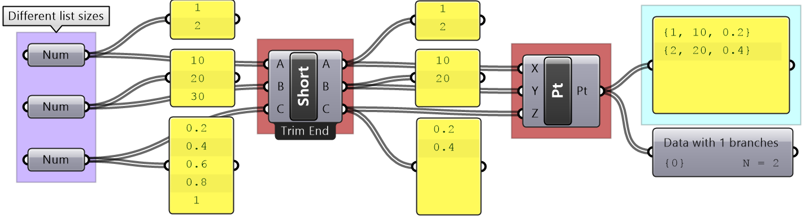
            </td>
          </tr>
         <tr>
            <td>
            <b>Create repeated custom matching:</b> 
            We know that the longest list has 5 items, but it is a good practice to make the script generic so it works with any input. First, figure out the length of the longest list, then use the <b>Repeat</b> component to repeat the elements  in shorter lists until they match the length of the longest list 
            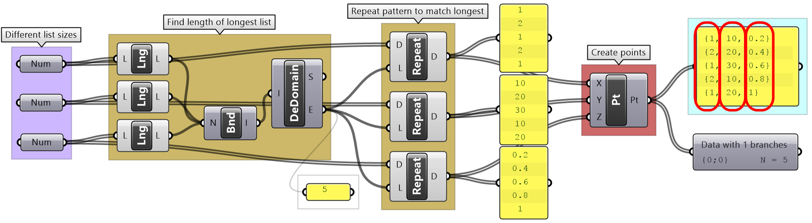
            </td>
          </tr>
        </table>
        

    </td>
  </tr>
</table>

<table class="rounded">
  <tr>
    <th>Tutorial 2.5.3: Simple truss</th>
  </tr>
  <tr>
    <td>
    Use the 4-step method to generate a simple truss as in the image. Use the given input for the baseline (base of the truss), height, number of runs (or spans), and the radius of the joint. 
    
    </td>
  </tr>
  <tr>
    <td>
        

        
<b>Solution...</b>

        <table>
          <tr>
            <td>
             <b>Algorithm analysis:</b>
            </td>
          </tr>
          <tr>
            <td>
            Define values for the input: 
            <b>L</b>= create a <b>Line</b> along X-Axis 
            <b>H</b>= assume height=7 
            <b>R</b>= assume number of runs=10 
            <b>J</b>= assume joint radius=0.5 
            </td>
            <td>
             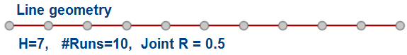
            </td>
          </tr>
          <tr>
            <td>
            Divide the baseline into 20 spans (2*<b>R</b>)
            </td>
            <td>
            
            </td>
          </tr>
          <tr>
            <td>
            Move every other point by 7 units (or <b>H</b>) in the Z-Axis direction
            </td>
            <td>
            
            </td>
          </tr>
          <tr>
            <td>
            Create 3 sets of ordered points for the beams along the base, top and middle, then connect each of the 3 sets with a polyline. Create spheres to represent the joints. 
            </td>
            <td>
            
            </td>
          </tr>
          <tr>
            <td>
             <b>Solution steps:</b>
            </td>
          </tr>
          <tr>
            <td style="background-color:#cfe2f3">
            <b>Output:</b> 
            There are 2 outputs, the beams as curves (polylines) and joints as spheres (surfaces)
            </td>
            <td>
            
            </td>
          </tr>
          <tr>
            <td style="background-color:#f4cccc">
            <b>Key Process:</b> 
            Need to create the polylines for the top, middle, and bottom beams. Use the <b>Polyline</b> component with a relevant set of points for each. 
            Use the <b>Sphere</b> component to create joints. Use middle points and joint radius as input.
            </td>
            <td>
            
            </td>
          </tr>
          <tr>
            <td style="background-color:#d9d2e9">
            <b>Input:</b> 
            Specify the inputs  and assume values when they are not given: 
            line, number of runs, height and joint radius
            </td>
            <td>
            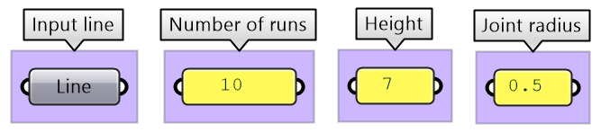
            </td>
          </tr>
          <tr>
            <td style="background-color:#eee4c5">
            <b>Intermediate processes #1:</b> 
            Divide the curve with twice the number of runs. Use <b>Divide</b> Curve component and <b>Multiply</b> the number of runs
            </td>
            <td>
            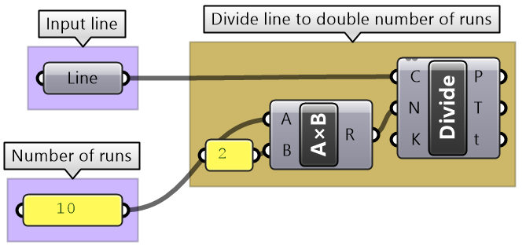
            </td>
          </tr>
          <tr>
            <td style="background-color:#eee4c5">
            <b>Intermediate processes #2:</b> 
            To create top points, select every other point from the list of all divide points, then move vertically by the height amount.  
            Use <b>Cull Pattern</b> component to select points and <b>Move</b> component to shift vertically
            </td>
            <td>
            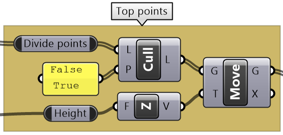
            </td>
          </tr>
          </tr>
          <tr>
            <td style="background-color:#eee4c5">
            <b>Intermediate processes #3:</b> 
            To create bottom points, select every other point, in the invert pattern used to select top points. 
            Use <b>Cull Pattern</b> component to select points (set the <b>invert</b> flag for the pattern input)
            </td>
            <td>
            
            </td>
          </tr>
          <tr>
            <td style="background-color:#eee4c5">
            <b>Intermediate processes #4:</b> 
            To create middle points, <b>Weave</b> the top and bottom points.
            </td>
            <td>
            
            </td>
          </tr>
        </table>
        <b>Putting it all together</b> 
        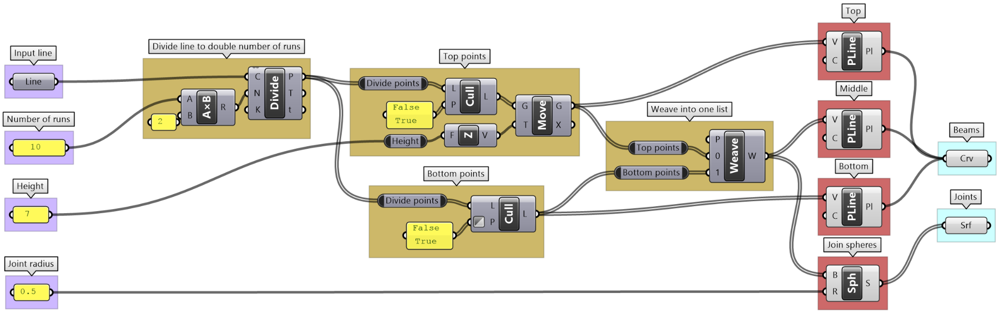
        

    </td>
  </tr>
</table>

<table class="rounded">
  <tr>
    <th>Tutorial 2.5.4: Pearl necklace</th>
  </tr>
  <tr>
    <td>
    Create a necklace with one big pearl in the middle, and gradually smaller size pearls towards the ends as in the image. The number of pearls is between 15-25. 
    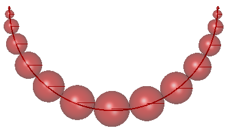
    </td>
  </tr>
  <tr>
    <td>
        

        
<b>Solution...</b>

        <table>
          <tr>
            <td>
             <b>Algorithm analysis:</b>
            </td>
          </tr>
          <tr>
            <td>
            The workflow to create the necklace follows these general lines: 
            1. Divide the curve into segments of variable distances (widest in the middle and narrow towards the ends) 
            2. Find length and midpoints of each segment 
            3. Create spheres at midpoints using half the length as radius 
            </td>
            <td>
             
            </td>
          </tr>
          <tr>
            <td>
             <b>Solution steps:</b>
            </td>
          </tr>
          <tr>
            <td style="background-color:#cfe2f3">
            <b>Output:</b> 
            The surfaces
            </td>
            <td>
            
            </td>
          </tr>
          <tr>
            <td style="background-color:#f4cccc">
            <b>Key Process:</b> 
            Use the Sphere component to generate the pearl surfaces
            </td>
            <td>
            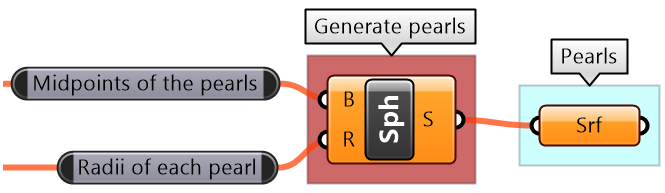
            </td>
          </tr>
          <tr>
            <td style="background-color:#d9d2e9">
            <b>Input:</b> 
            Necklace curve, 
            Number of pearls as a parameter (can be changed by the user)
            </td>
            <td>
            
            </td>
          </tr>
          <tr>
            <td style="background-color:#eee4c5">
            <b>Intermediate processes #1:</b> 
            The <b>Range</b> component creates equal distances. We need to change to variable distances and for that we can use the <b>Graph Mapper</b> component to control the spacing.
            </td>
            <td>
            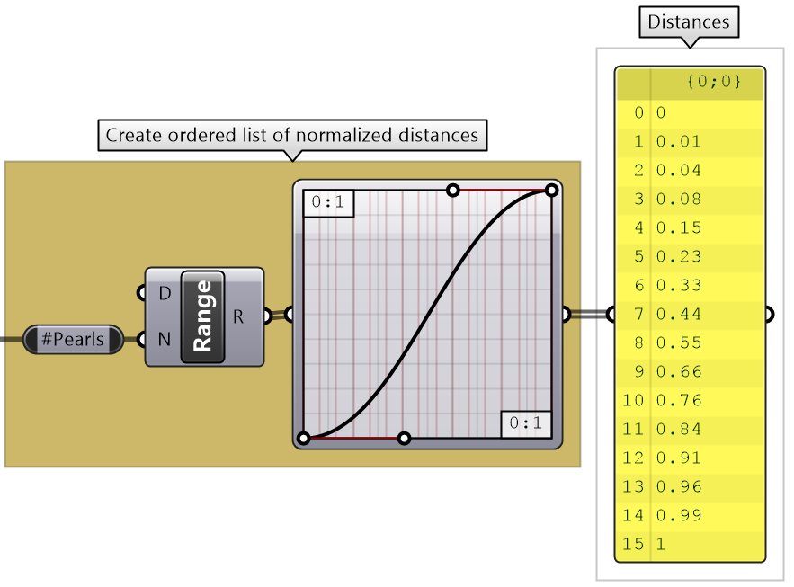
            </td>
          </tr>
          <tr>
            <td style="background-color:#eee4c5">
            <b>Intermediate processes #2:</b> 
            Since we have normalized distances from the start of the curve (parameters are between 0 to 1), we can use the <b>Evaluate</b> <b>Length</b> component to find the divide points.
            </td>
            <td>
            
            </td>
          </tr>
          </tr>
          <tr>
            <td style="background-color:#eee4c5">
            <b>Intermediate processes #3:</b> 
            Generate the segments. Use Polyline and Explode components to turn the points into segments 
            Center points are calculated at the middle of the segments. Use Evaluate Length at mid length 
            Radii are calculated as half of each segment length. Use Length and Division components 
            </td>
            <td>
            
            </td>
          </tr>
        </table>
        <b>Putting it all together</b> 
        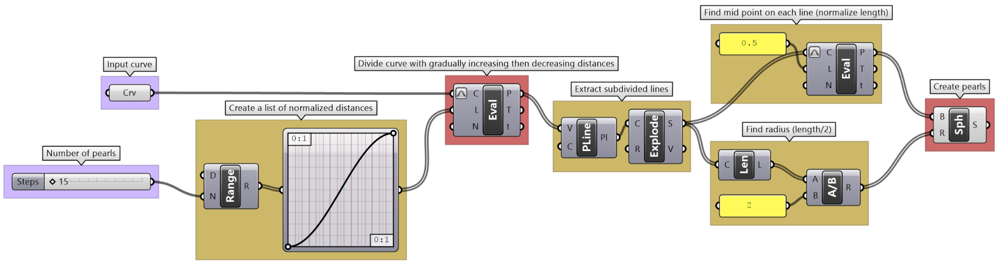
        

    </td>
  </tr>
</table>

## Next Steps

Those are the introduction to data structures. Next, learn [Advanced Data Structures](/guides/grasshopper/gh-algorithms-and-data-structures/advanced-data-structures/).

This is part 2-3 of the [Essential Algorithms and Data Structures for Grasshopper](/guides/grasshopper/gh-algorithms-and-data-structures/).
