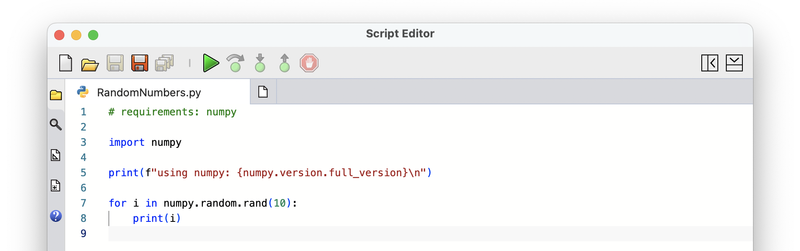

+++
title = "Scripting Guides"
description = "Guides to scripting in Rhino and Grasshopper."
categories = [ "Unsorted" ]
authors = "unset"
keywords = [ "rhino", "developer", "scripting" ]
languages = [ "C#", "Python", "CPython", "IronPython", "VB" ]
sdk = "unset"
type = "guides"
weight = 1

[admin]
TODO = ""
origin = ""
picky_sisters = ""
state = ""

[included_in]
platforms = [ "Windows", "Mac" ]
since = 8
+++





### Getting Started

#### ScriptEditor Command
  
- [Opening Script Editor](/guides/scripting/scripting-command/#opening-script-editor)
- [First Script](/guides/scripting/scripting-command/#first-script)
- [Edit Script](/guides/scripting/scripting-command/#edit-script)
- [Running Scripts](/guides/scripting/scripting-command/#running-scripts)
- [Debugging Scripts](/guides/scripting/scripting-command/#debugging-scripts)
- [Using Packages](/guides/scripting/scripting-command/#using-packages)
- [Editor Features](/guides/scripting/scripting-command/#editor-features)

#### Script Component

- [Create Script Component](/guides/scripting/scripting-component/#script-component)
- [First Script](/guides/scripting/scripting-component/#first-script)
- [Script Inputs and Outputs](/guides/scripting/scripting-component/#script-inputs-and-outputs)
- [Edit Script](/guides/scripting/scripting-component/#edit-script)
- [Run Scripts](/guides/scripting/scripting-component/#debugging-scripts)
- [Debugging Scripts](/guides/scripting/scripting-component/#debugging-scripts)
- [Using Packages](/guides/scripting/scripting-component/#using-packages)
- [Editor Features](/guides/scripting/scripting-component/#editor-features)





### Python Scripting

- Scripting: Python {}
- [Grasshopper Scripting: Python](/guides/scripting/scripting-gh-python)

### C# Scripting

- Scripting: C# {}  <!-- [C# Scripting](/guides/scripting/scripting-csharp) -->
- [Grasshopper Scripting: C#](/guides/scripting/scripting-gh-csharp)

### Editor Features

- [Editing Features](/guides/scripting/editor-editing)
- <!-- [Explorer](/guides/scripting/editor-explorer) --> Explorer {}
- <!-- [Search & Replace](/guides/scripting/editor-search) --> Search & Replace {}
- [Terminal](/guides/scripting/editor-terminal)
- <!-- [Problems Tray](/guides/scripting/editor-problems) --> Problems Tray {}
- <!-- [Debugging Your Scripts](/guides/scripting/editor-debug) --> Debugger {}
- <!-- [Templates](/guides/scripting/editor-templates) --> Templates {}
- <!-- [Examples](/guides/scripting/editor-examples) --> Examples {}
- <!-- [Help](/guides/scripting/editor-help) --> Help {}
- [Options](/guides/scripting/editor-configs)
- [Logs](/guides/scripting/editor-logs)





### Publishing Script Plugins

- [Creating Rhino/Grasshopper Script Plugins](/guides/scripting/projects-create)
- [Building & Publishing Script Plugins](/guides/scripting/projects-publish)

### Advanced

- [ScriptEditor Macros](/guides/scripting/advanced-scripteditor-macros)
- [Language Initialization](/guides/scripting/advanced-langinit)
- <!-- [CPython Runtime and Language Server](/guides/scripting/advanced-pyruntime) --> CPython Runtime and Language Server {}
- [Python Path Files](/guides/scripting/advanced-pthfiles)
- [Python Package Environments](/guides/scripting/advanced-pyvenvs)
- <!-- [Language Libraries](/guides/scripting/advanced-libraries) --> Language Libraries {}
- [Asynchronous Execution](/guides/scripting/advanced-async)
- <!-- [VisualStudioCode Extension](/guides/scripting/advanced-vscode) --> VisualStudioCode Extension {}
- [RhinoCode Command Line Interface](/guides/scripting/advanced-cli)
<!-- [RhinoCode API](/guides/scripting/advanced-core-api) -->
<!-- [RhinoCodeEditor API](/guides/scripting/advanced-editor-api) -->




