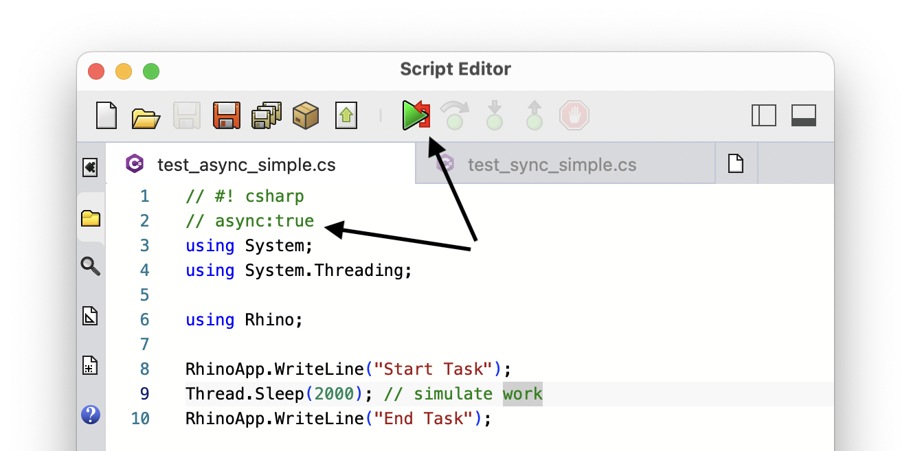
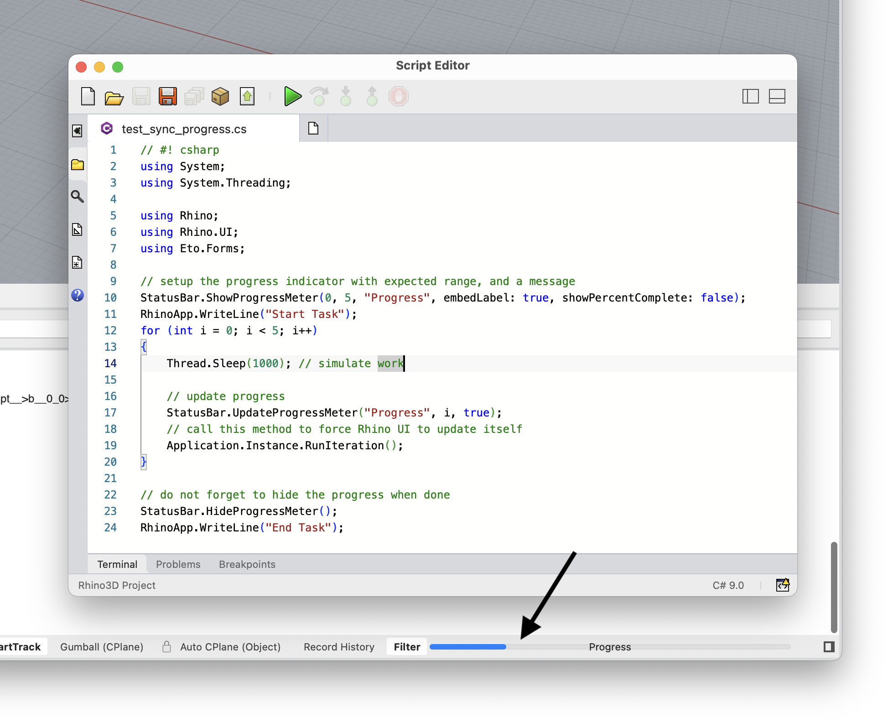

+++
title = "Async Execution"
description = "Provides information on running scripts in asynchronous mode to avoid locking Rhino UI with long running tasks"
authors = ["ehsan"]

[included_in]
platforms = [ "Windows", "Mac" ]
since = 8

[page_options]
byline = true
toc = true
toc_type = "single"
block_webcrawlers = false
+++

<style>
    .main-content img { zoom: 50%; }
    code {
        background-color: #efefef;
        padding-left: 5px;
        padding-right: 5px;
        border-radius: 3px;
    }
</style>

## What is Async

Normally, most operations in an application with a graphical user interface (GUI), run on the *UI Thread*. That is the thread that starts the UI and listens to the events like clicking buttons and moving the mouse. When you click on a button, the code behind that button runs on the UI thread.

**Asynchronous (Async for short) operations run on Non-UI threads and do not freeze the UI.**

If the task is time-consuming, the UI thread (now executing the task after button click) can not respond to any other events. Therefore UI is *"Frozen"* (not the Disney® movie) and unresponsive. Normally this is ok since you would not want the user to change the document while the task is running. It is a good idea to use Non-UI threads for time-consuming tasks and run them *Asynchronously*.

### Async in Script Editor
In Rhino Script Editor, if a script is performing a time-consuming task, clicking on the *Run* button would cause Rhino UI to freeze for the duration of the script. As we mentioned above this is ok. However, if your task does not deal with the Rhino document (could be changed by the Rhino user while your script is running), it could be made async. This would make Rhino UI responsive while your script is running. It is also a good habit to show progress while the task is running in the background.

## Async C#

The example C# script below completely freezes Rhino UI for about 2 seconds. That the amount of time we are specifying in `Thread.Sleep` to simulate work. This could be a long running computation or waiting to receive some data from web:

```csharp
// #! csharp
using System;
using System.Threading;

using Rhino;

RhinoApp.WriteLine("Start Task");
Thread.Sleep(2000); // simulate work
RhinoApp.WriteLine("End Task");
```

By adding the line `// async:true`, we can force this complete script to run on a Non-UI thread, keeping Rhino UI active so we can continue working while the script is running (this is a feature of Rhino Script Editor and not C# language):

```csharp
// #! csharp
// async:true
using System;
using System.Threading;

using Rhino;

RhinoApp.WriteLine("Start Task");
Thread.Sleep(2000); // simulate work
RhinoApp.WriteLine("End Task");
```

Notice that this is the only change we made to the script. Also note that the *Run* button in Script Editor dashboard now shows a red arrow to represent the async execution of this script:



## Show Progress

It is a good practice to show feedback on the progress of background tasks. Rhino UI has a progress indicator on the status bar. This is an example of how you can use this progress bar in your scripts. `Thread.Sleep` is used below to simulate work:

```csharp
// #! csharp
using System;
using System.Threading;

using Rhino;
using Rhino.UI;
using Eto.Forms;

// setup the progress indicator with expected range, and a message
StatusBar.ShowProgressMeter(0, 5, "Progress", embedLabel: true, showPercentComplete: false);
RhinoApp.WriteLine("Start Task");
for (int i = 0; i < 5; i++)
{
    Thread.Sleep(1000); // simulate work

    // update progress
    StatusBar.UpdateProgressMeter("Progress", i, true);
    // since we are on the main thread here,
    // call this method to force Rhino UI to update
    Application.Instance.RunIteration();
}

// do not forget to hide the progress when done
StatusBar.HideProgressMeter();
RhinoApp.WriteLine("End Task");
```



### Python Progress

In Python you can use `rhinoscriptsyntax` module to access the progress indicator easier:

```python
import rhinoscriptsyntax as rs
from Rhino import RhinoApp

MAX = 1000
rs.StatusBarProgressMeterShow("Progress", 0, MAX)

for i in range(0, MAX):
    rs.StatusBarProgressMeterUpdate(i)

rs.StatusBarProgressMeterHide()
```

## Advanced Async

Sometime it is necessary to run operations on the UI thread before or after completing a time-consuming operation. Remember that the `async:true` mechanism mentioned above is for convenience and runs the complete script on a Non-UI thread. Based on the script language, you can use the threading or async features on the language to perform more complicated sync/async operations.

This is an example C# script that runs on UI thread on parts **A** and **C** of the script (blocking), and has a time-consuming operation on part **B**. Rhino UI is frozen during the blocking portions, but is fully available otherwise. Notice that:

- Script specifies `// async: true`. **This means that the complete script is running on Non-UI thread.**

- To make sure **parts A and C are running on UI thread** and can make changes to Rhino, we use `Application.Instance.Invoke`. This method is provided by Eto which is the UI framework Rhino >=8 uses, and ensures the given action runs on the UI thread.

- On part B, script is calling `.GetAwaiter().GetResult()` on the `Task<int>` object created by`Task.Run` call. This is to ensure **execution waits for the task to complete** and we have the result before proceeding to part C. Also notice that calling `Application.Instance.RunIteration` is not necessary here and causes a crash if called.

```csharp
// #! csharp
// async: true
using System;
using System.Threading;
using System.Threading.Tasks;

using Rhino;
using Rhino.UI;
using Eto.Forms;

// Part A: runs on UI thread (blocking)
Application.Instance.Invoke(() => {
    // CAN MAKE CHANGES TO RHINO or DOCUMENT HERE
    StatusBar.ShowProgressMeter(0, 5, "Progress", true, false);
});

// Part B: runs on Non-UI thread
int result = Task.Run(() => {
    for (int i = 0; i < 5; i++)
    {
        Thread.Sleep(1 * 1000);
        StatusBar.UpdateProgressMeter("Progress", i, true);
        // DO NOT CALL THIS SINCE WE ARE NOT ON UI THREAD
        // Application.Instance.RunIteration();
    }

    return 42;
}).GetAwaiter().GetResult();

// Part C: runs on UI thread (blocking)
Application.Instance.Invoke(() => {
    // CAN MAKE CHANGES TO RHINO or DOCUMENT HERE
    RhinoApp.WriteLine($"Result: {result}");
    StatusBar.HideProgressMeter();
});
```

You can also debug this script by placing breakpoints inside the scope of each part. Notice how the first and last breakpoints are paused on `Thread 1` (main and UI thread in Rhino), but the breakpoint on line 19 is paused on `Thread 15` which happens to be the thread used to run the task by dotnet runtime:

