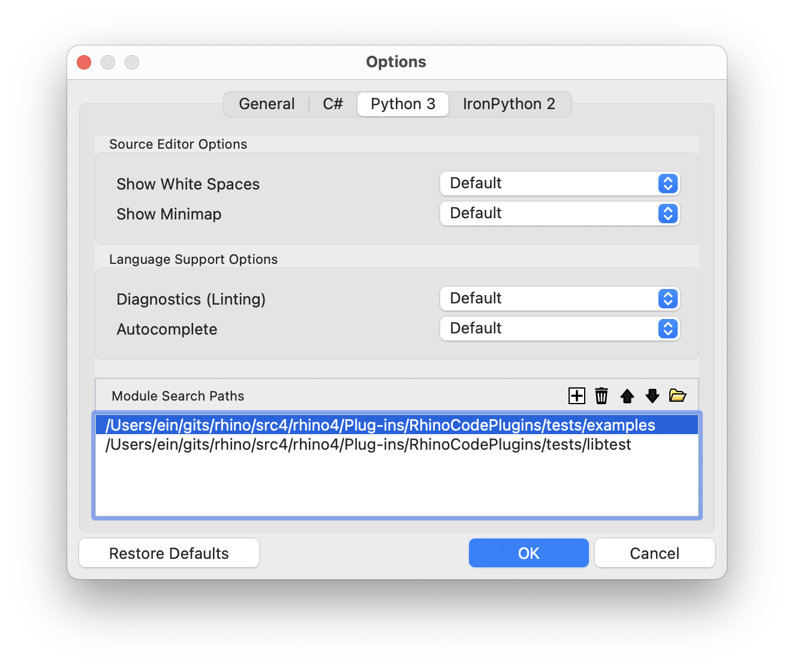

+++
title = ""
description = ""
type = "guides"
categories = ["Scripting"]
keywords = [ "", "" ]
languages = [ "C#", "Python", "CPython", "IronPython", "VB" ]
authors = ["ehsan"]
sdk = [ "RhinoCommon" ]
weight = 4

[included_in]
platforms = [ "Windows", "Mac" ]
since = 8

[page_options]
byline = true
toc = true
toc_type = "single"
block_webcrawlers = false
+++

## Python Paths

### Scripts Path

By default, Rhino adds these paths to Python 2 and 3 search paths (`sys.path`):

On Windows:

- **Shared** `%PROGRAMDATA%\McNeel\Rhinoceros\<version>.0\scripts` (if exists)
- **User** `%APPDATA%\McNeel\Rhinoceros\<version>.0\scripts`

On macOS:

- **Shared** `/Users/Shared/McNeel/Rhinoceros/<version>.0/scripts` (if exists)
- **User** `~/Library/Application Support/McNeel/Rhinoceros/<version>.0/scripts`

Note that the first path on either platform, is the shared path and takes precedence over the user path. So if python module `test` is available in both paths, the one under shared path will be imported. Shared `scripts` path are not created by default so there is not a conflict unless you, your system admin, or other third-party plugin intentionally places python modules or scripts in this path.

### Editor Paths

You can add a list of other search paths for each Python version in Editor options:

Note that the order of these paths is important. First path on the list would be the first path to be search for a module.

Editor stores these paths in two `.rhinocode/python-3.pth` and `.rhinocode/python-2.pth` files. See [Path Files]() for more information.