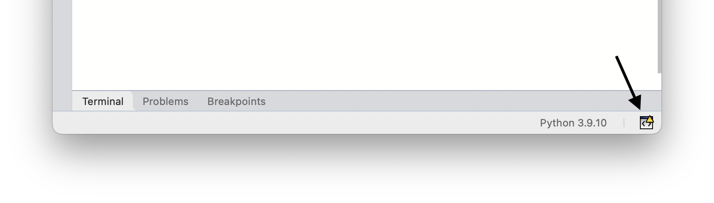
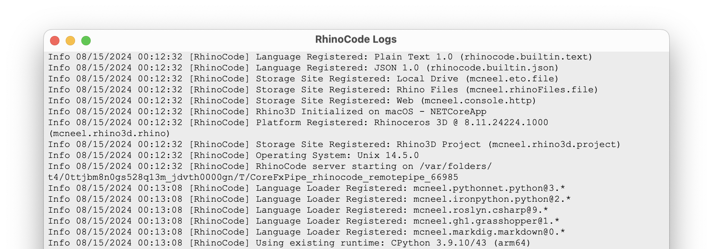

+++
title = ""
description = "Script Editor Logs"
type = "guides"
categories = ["Scripting"]
keywords = [ "", "" ]
languages = [ "C#", "Python", "CPython", "IronPython", "VB" ]
authors = ["ehsan"]
sdk = [ "RhinoCommon" ]
weight = 4

[included_in]
platforms = [ "Windows", "Mac" ]
since = 8

[page_options]
byline = true
toc = true
toc_type = "single"
block_webcrawlers = false
+++

## Opening Log Viewer

*Script Editor* writes log messages during its operation. These log messages are useful in detecting any internal errors that might have happened when working with the script editor. You can view these logs by clicking on the *Open Logger* button on the far right side of editor status bar, or by running **RhinoCodeLogs** command:

The same button is also available on a few other editor dialogs like *Publish Project* dialog:

This opens the **RhinoCode Logs** window:

## Saving Logs

To save all the log messages into a file, choose *Logs > Save Contents* menu item and save the logs to disk. By default the contents are saved to a log file named `ScriptEditor.log`
