+++
title = ""
description = ""
type = "guides"
categories = ["Scripting"]
keywords = [ "", "" ]
languages = [ "C#", "Python", "CPython", "IronPython", "VB" ]
authors = ["ehsan"]
sdk = [ "RhinoCommon" ]
weight = 4

[included_in]
platforms = [ "Windows", "Mac" ]
since = 8

[page_options]
byline = true
toc = true
toc_type = "single"
block_webcrawlers = false
+++

<style>
    .main-content img { zoom: 50%; }
    code {
        background-color: #efefef;
        padding-left: 5px;
        padding-right: 5px;
        border-radius: 3px;
        font-size: 14px;
    }

    .language-csharp {
        font-size: .9em;
    }
</style>

Rhino Script Editor is designed to utilize the widespread plugin infrastructure in both Rhino and Grasshopper, and generate plugins from your scripts.

Script editor can:

- Convert scripts into Rhino commands and publish as Rhino plugin (`.rhp` file)
- Convert scripts into Grasshopper components and publish as Grasshopper plugin (`.gha` file)
- Create a Yak package and publish on Rhino package server

It can also:

- Generate toolbar layout files for published Rhino commands (`.rui` file)
- Share code libraries and data files with published commands or components
- Generate dotnet project solution for published plugins for furthur customization (`.sln` and `.csproj` files)

## Create a Project

To create a project:

- Run `ScriptEditor` command
- Choose **Create Project** from main *File* menu
- Navigate to where you would like to save the project. Project file will be stored with `.rhproj` extension
- Editor displays **Edit Project** dialog.

  This dialog highlights the most important pieces of information about the new project:

  - **Id**: Unique UUID of this project. It should not be changed. See [Project Id](#project-id)
  - **Name**: Plugins will be published with this name. See [Project Name](#project-name)
  - **Version**: Plugins will be published with this version. See [Project Version](#project-version)
  - **Author**: This is required and if there are no authors available, this field will show a *No Author* error. See [Project Authors](#project-authors)

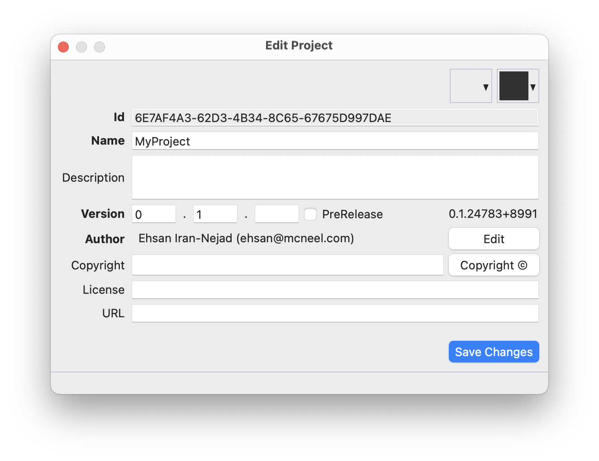

- Choose **Save Changes**
- Project file is now saved and editor opens the **Projects** panel on the left browser tray


- Now that the project saved and open, we can add command and components. We will get a chance to edit project information before publishing the project as plugins.

## Add Commands

To add a command, click on the **+** icon on the *Project Tray* toolbar and select **Add Commands/** item:


You can also right-click on the **Commands/** to add new commands:

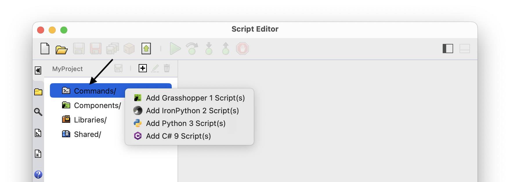

You can select a single or multiple scripts and add them to the project. Once scripts are added, they are opened in the editor and a black circle appears in front of project name in *Project Tray* to show that project is modified and must be saved. Click the Save Project button in *Project Tray* toolbar to save the project:

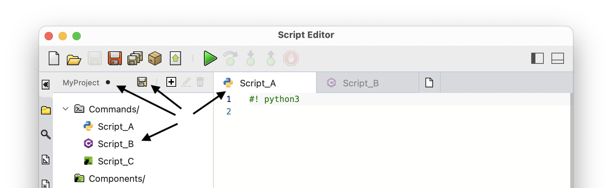


Rhino commands can be created from Grasshopper scripts that contain contextual inputs and outputs. In the example above, `Script_C` is a Grasshopper 1 definition (`Script_C.gh`) that contains two contextual integer inputs and a contextual print output component.

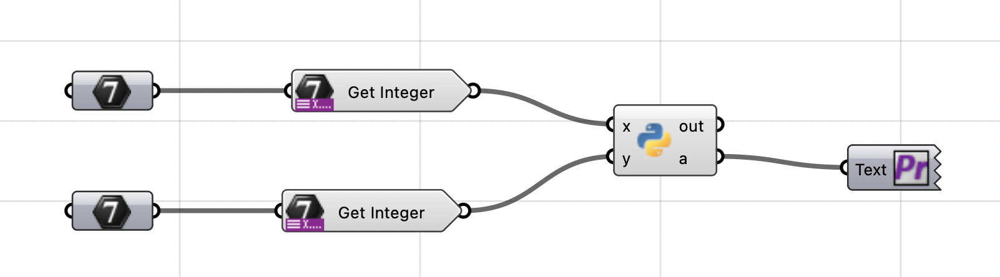

See [Run Published Commands](/guides/scripting/projects-publish#run-published-commands) for information on how the inputs are collected on Rhino command line.


During build, each script under **Commands/** is converted into a Rhino command. The script name is the default name of the command. See [Edit Commands](#edit-commands) for information on editing command, assigning icons, and changing command types.

To remove a command, select the command in *Project Tray* and click the trash button on the toolbar:


## Add Components

To add components, click on the **+** icon on the *Project Tray* toolbar and select **Add Components/** item:


You can also right-click on the **Components/** to add new components:

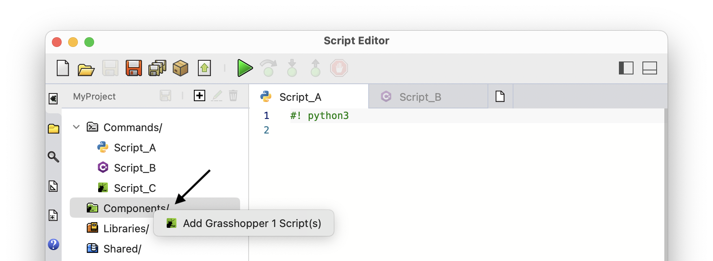

#### Components Types

When adding components to a project, an open dialog appears asking for Grasshopper definitions (`.gh` or `.ghx`). Depending on the contents of the definition, one of these two types of components are created in the project:

- **Script:** If Grasshopper definition *does not contain* any contextual inputs or outputs, a component is created for each *Script* that exist in the definition. The new component matches nickname, inputs, and outputs of the *Script* and runs the same code.

  **Example:**

  In this example, the definition contains 3 *Script* components, nicknamed *First*, *Second*, and *Third*. Each script components becomes a component in published Grasshopper plugin matching the nickname, inputs, and outputs. See [Edit Components](#edit-components) on how to edit components, add icons, and set their exposure.

  

  This is how the components look like when published (default icon). Note that although they are generated from scripts of different languages, the published components are language agnostic and the three components look the same:

  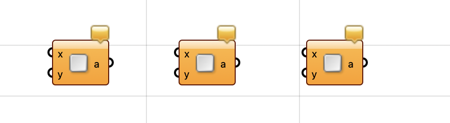

- **Contextual:** If Grasshopper definition *does contain* contextual inputs or outputs, a single component is created for the complete definition. The new component matches the contextual inputs and outputs of the definition and runs the full definition on each iteration.

  **Example:**

  In this example, the definition contains contextual inputs and outputs. The complete definition becomes a component in published Grasshopper plugin, and its name matches the definition name by default. Component inputs and outputs will match contextual inputs and outputs of the definition. Note that any other *Script* component in this definition is not converted. See [Project Components](#project-components) on how to edit components, add icons, and set their exposure.

  

  This is how the component looks like when published (default icon):

  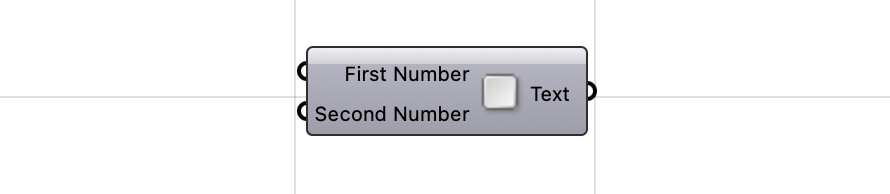

To remove a component, select the source Grasshopper definition in *Project Tray* and click the trash button on the toolbar. Note that you can only remove complete definitions from **Components/** and not the individual components:


## Edit Project Info

To edit project information, either use the **Publish Project** dialog, or run the **Edit Project Info** command from editor command prompt. Both dialogs show identical project information edit fields:


### Project Id

Project UUID is assigned when the project is created an remains read-only afterwards. This id, uniquely identifies your plugin among all other past and future Rhino and Grasshopper plugins.

This id is embedded in the final plugin assemblies as:

```csharp
[assembly: Guid("e73d16e6-a2d4-4917-93e7-aebeac2f38f5")]
```

It is also assigned to the Grasshopper `AssemblyInfo`:

```csharp
public sealed class AssemblyInfo : GH_AssemblyInfo
{
    public override Guid Id { get; } = new Guid("e73d16e6-a2d4-4917-93e7-aebeac2f38f5");
}
```

### Project Name

### Project Version

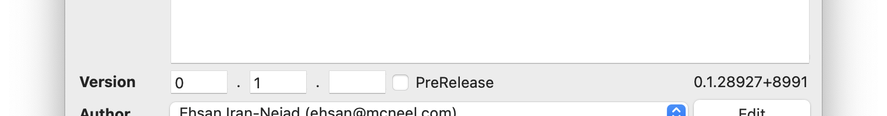

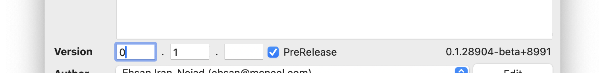
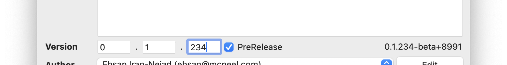

```csharp
[assembly: AssemblyVersion("0.1.234.8991")]
[assembly: AssemblyFileVersion("0.1.234.8991")]
[assembly: AssemblyInformationalVersion("0.1.234.8991")]
```

### Project Authors

### Project Copyright, License, and URL

Edit the copyright field and add your custom copyright message, or click on the **Copyright** button to add a default message based on the selected Author:


The copyright message is embedded in the final plugin assemblies as:

```csharp
[assembly: AssemblyCopyright("Copyright © 2024 Ehsan Iran-Nejad")]
```

## Edit Commands

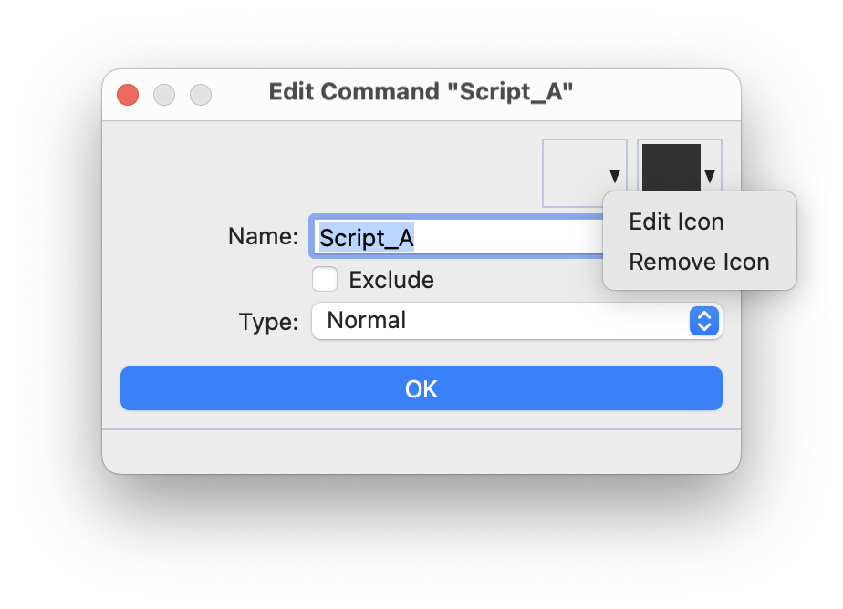

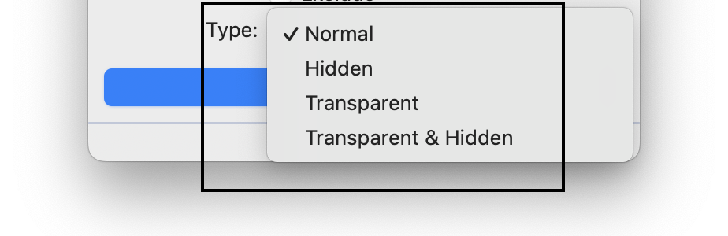


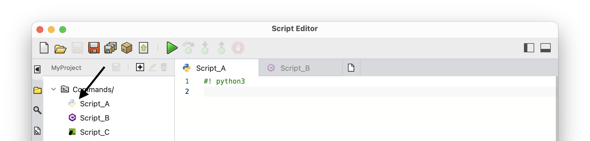

## Edit Components

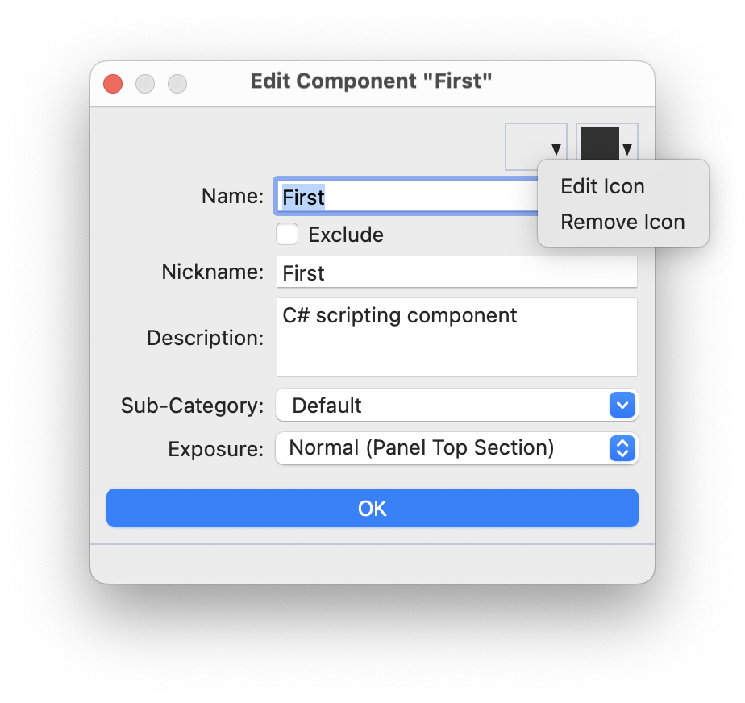


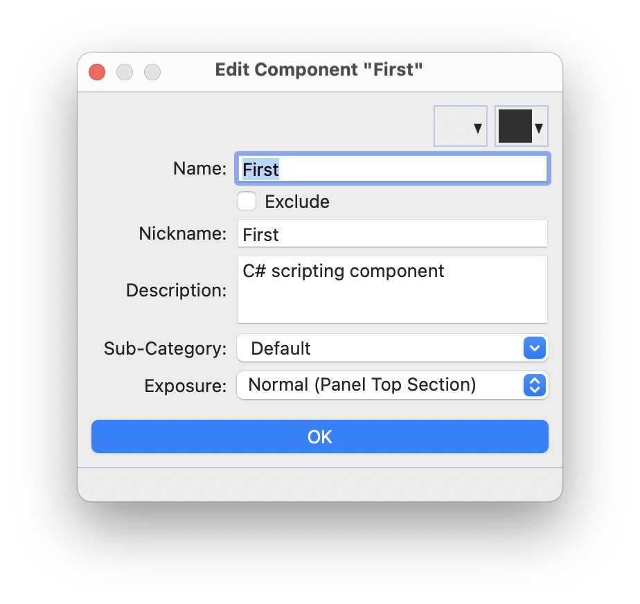

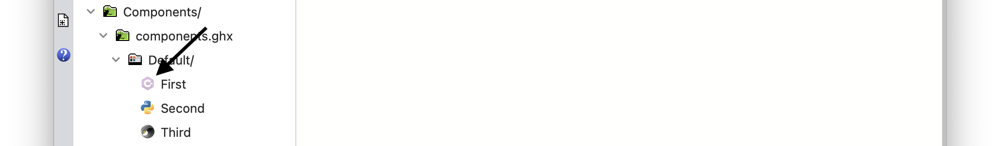

## Shared Libraries

## Shared Resources

