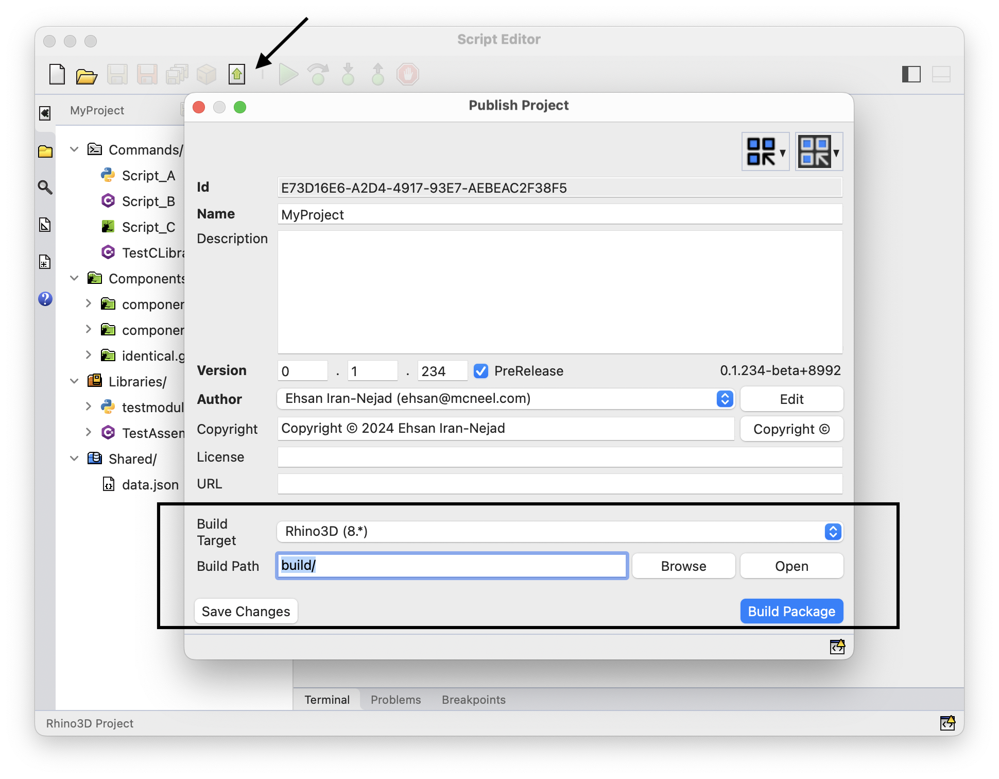
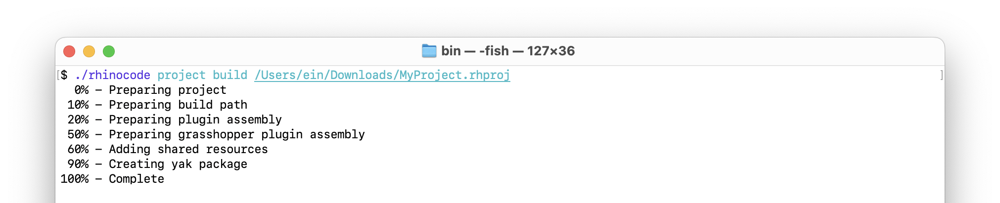

+++
title = "Publishing Rhino/Grasshopper Script Plugins"
description = "Provides information on publishing plugin projects in Script Editor"
authors = ["ehsan"]

[included_in]
platforms = [ "Windows", "Mac" ]
since = 8

[page_options]
byline = true
toc = true
toc_type = "single"
block_webcrawlers = false
+++

<style>
    .main-content img { zoom: 50%; }
    code {
        background-color: #efefef;
        padding-left: 5px;
        padding-right: 5px;
        border-radius: 3px;
        font-size: 14px;
    }
</style>



[Creating Rhino Projects](/guides/scripting/projects-create) for information on creating projects in Script Editor.


## Build Plugins from Script Editor

You can build a project directly from Script Editor:

- Open Script Editor
- Open Project (`File > Open Project` menu)
- Choose **Publish Project** (`File > Publish Project` or *Publish* button in editor dashboard)

  

  Project information fields are discussed in detail in [Create Project](/guides/scripting/projects-create). Here we focus on choosing a *Build Target* and *Build Path*.

- Choose a **Build Target**:

  This is the minimum version of Rhino required to run your plugin. The available versions are queried from [Rhino NuGet packages](https://www.nuget.org/profiles/McNeel). You can see `macOS` and `Windows` specific targets as well.

  

- Choose a **Build Path**:
  
  This is where all generated assemblies and files are placed. Depending on the *Build Target* a subpath is added to this build path to avoid conflicts (e.g `build/rh8/`)

  

- Choose **Build Package** to build the project:

  On a successful build, status tray will show success message in green:

  

## Build Plugins from Terminal


To build a project in terminal, use the `rhinocode` command line utility shipped with Rhino.

See [RhinoCode Command Line Interface](/guides/scripting/advanced-cli) for more information on setting up the build environment.


- Open Terminal
- Use `rhinocode` command line utility to build the project:

  

```text
$ rhinocode project build ~/MyProject.rhproj
  0% - Preparing project
 10% - Preparing build path
 20% - Preparing plugin assembly
 50% - Preparing grasshopper plugin assembly
 60% - Adding shared resources
 90% - Creating yak package
100% - Complete
```

See [RhinoCode: Build a Project](/guides/scripting/advanced-cli#build-a-project) for more information.

## Build Artifacts

Once project is built, the target path will contain all the generated artifacts:


A Yak package is generated that contains both Rhino and Grasshopper plugins.


See [Pushing a Package to the Server](/guides/yak/pushing-a-package-to-the-server) on how to publish `.yak` files to package server


## Project Solution

On successful build, a Visual Studio solution is automatically generated that contains the source code for both Rhino and Grasshopper plugins. This solution is created to allow full customization of Rhino and Grasshopper plugins. You can add extra commands and components and make any other modifications.

Use [Visual Studio](https://visualstudio.microsoft.com/) or [Visual Studio Code](https://code.visualstudio.com/) to edit the project.

Use `dotnet` command line utility to build the project from command line:


Once the project is built, compiled Rhino and Grasshopper plugins are under `bin/` directory of their respective projects:


