+++
title = "Script Component Grasshopper"
description = "This guide provides an overview on how to edit and run scripts inside of Grasshopper"
type = "guides"
categories = ["Scripting", "GhPython"]
keywords = [ "python", "commands", "grasshopper" ]
languages = [ "C#", "Python", "CPython", "IronPython", "VB", "RhinoPython" ]
authors = ["ehsan"]
sdk = [ "RhinoCommon",  "RhinoPython"]
weight = 4

[included_in]
platforms = [ "Windows", "Mac", "Grasshopper"]
since = 8

[page_options]
byline = true
toc = true
toc_type = "single"
block_webcrawlers = false
+++

<style>
    .main-content img { zoom: 50%; }
    code {
        background-color: #efefef;
        padding-left: 5px;
        padding-right: 5px;
        border-radius: 3px;
        font-size: 14px;
    }
</style>

## Script Component

To access the unified script editor in Grasshopper, go to the **Maths** tab and **Script** panel and drop a Script component onto the canvas:

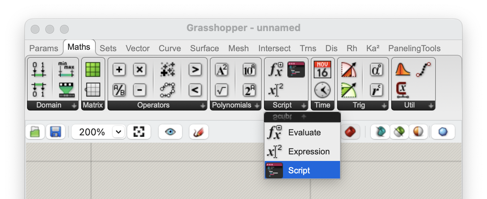

This component is designed to work with any of the supported languages. While being completely new and internally different from the legacy GHPython and C# components, it tries to replicate the same behaviors as those legacy components and stay familiar as much as possible.

## First Script

Once you place an instance of the **Script** component on the canvas, it will show a warning that it is missing a script. We first need to choose the programming language we would like to script in to initialize the component:


Double-click on the component to quickly start a new script using the most-recently used language.



The first button at the bottom of the component shows the default or last used language for this component. Double-clicking on the component itself will automatically use this language to initialize the component and start a new script:

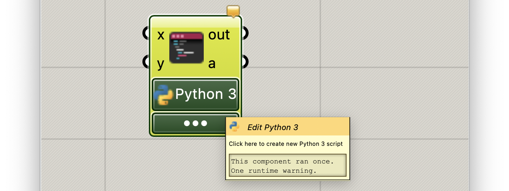

Other supported languages could be selected from the [ ● ● ● ] menu:


Choose **Python 3** to start a new script:


The default script looks like this:

```python
"""Grasshopper Script"""
a = "Hello Python 3 in Grasshopper!"
print(a)
```

## Script Inputs and Outputs

The **Script** component supports *Zoomable User Interface* (*ZUI* for short). This means that you can modify the inputs and outputs of the component by zooming in until the **Insert** [ ⊕ ] and **Remove** [ ⊖ ] controls are visible on either side:

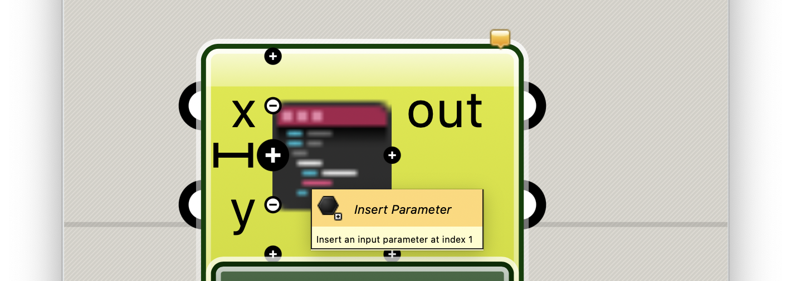

When all parameters on either side are removed, the component will draw a jagged edge on that side. This is completely okay as not all scripts require inputs or produce values on the other output:

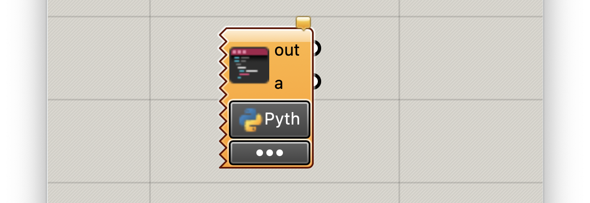

For this example lets keep the **x** and **y** inputs and the **a** as output:


## Edit Script

Let's remove the script contents and type a new line instead. The editor will help autocomplete the names:

```python
import Rhino
a = Rhino.RhinoApp.Version

```


Close the editor and click on Yes to apply the script to the component:


## Run Scripts

Connect a panel to the output **a** and run the Grasshopper canvas. The script will output the current Rhino version:

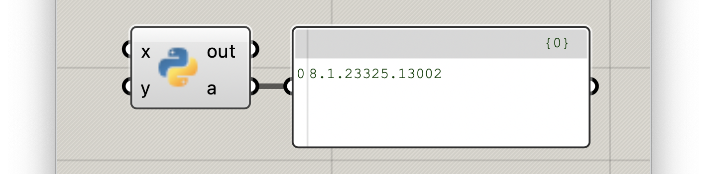

Let's add another output named **total** and add a few more lines to the script to compute a total of the given inputs:

```python
import Rhino
a = Rhino.RhinoApp.Version

total = x + y
```

The editor will pop up an execution error since it does not know the types for **x** and **y** because no values are assigned to these inputs yet:

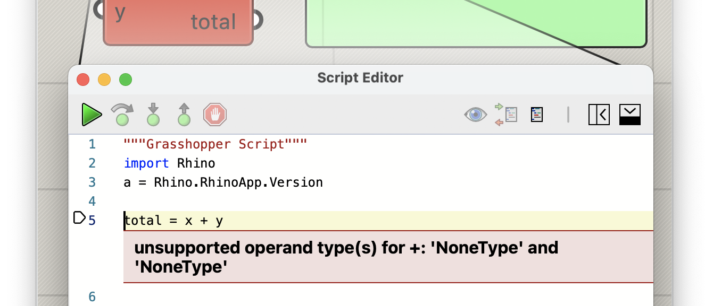

Right-click on each input and choose the **float** option from the **Type Hints** submenu. This will ensure the inputs are initialized with the default value for the chosen type:


Apply the script, connect a Range component to inputs and see a list of sums on the **total** output parameter:


## Debugging Scripts

The script editor can debug scripts of any supported language. During debug, we can execute the script line by line or pause the execution at certain lines called **Breakpoints** and inspect the values of global and local variables.

Move your mouse cursor to the left side of the line number column on line 5 and click. This should add a red dot and mark that line as a **Breakpoint**:

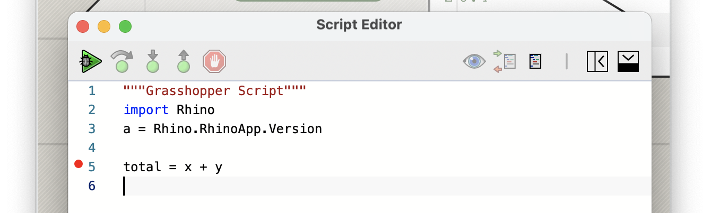

The **Breakpoints** tray at the bottom will show all the active breakpoints, and will provide buttons to Clear or Toggle all of them or individual breakpoints:

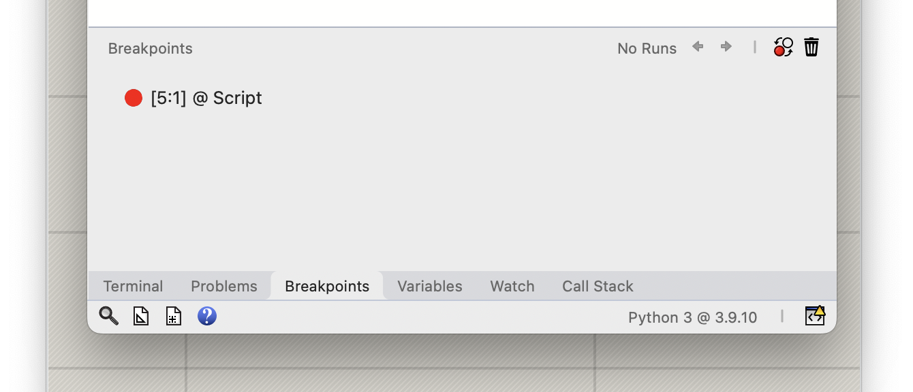

When you add breakpoints, the editor makes a few UI changes and provides a few more utilities for debugging:

- The **Run** button will change to **Debug**
- **Variables**, **Watch**, and **Call Stack** trays will be added to the bottom tray bar

Now click on the green **Debug** button on the Dashboard. The editor will run the script and:

- Stops at breakpoint on line 5
- Highlights the breakpoint line in orange and shows an arrow on the left side of the line
- Highlights Status Bar in orange to show we are debugging a script
- Activates the debug control buttons on the Dashboard
- Opens the **Variables** tray at the bottom to show global and local variables


We can control the execution of script using the debug control buttons on the Dashboard:

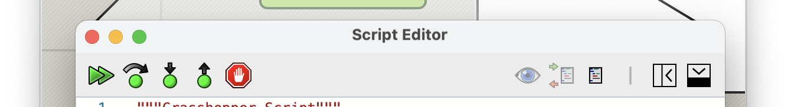

From left to right, they are:

- **Continue:** continues running the script until it stops on another breakpoint
- **Step Over:** executes current line and moves on the next line
- **Step In:** if the current line includes a function call, this will step into the lines defining the function code
- **Step Out:** if previously stepped into a function code, this will continue executing the function code until control is returned from the function to the calling code and will stop there
- **Stop:** stops debugging the script and does not continue executing the rest

Click on **Continue** to see the execution move to the next line:

Notice that the **Variables** panel now shows new values for **x** and **y**. The panel header also shows **Run Script (2 of 11)** on the top-right meaning this is the second time Grasshopper is executing this component with a pair of **x** and **y** inputs:


Progressively clicking on **Continue** will continue executing the script and modifying the variables. At each stop, the **Variables** tray shows the current values of global and local variables.

Now click on **Stop** button to stop the debugging. The script component will show an error marking with the message **Debug Stopped**:


Once the debug stops, the editor UI changes back to normal, and the **Variables** tray will show the last state of the variables. The tray will keep these data until another session of debugging is started.

At any point in time, you can use the **Toggle** button in the **Breakpoints** panel to activate or deactivate the breakpoints. Deactivated breakpoints will show up as gray dots in the editor:

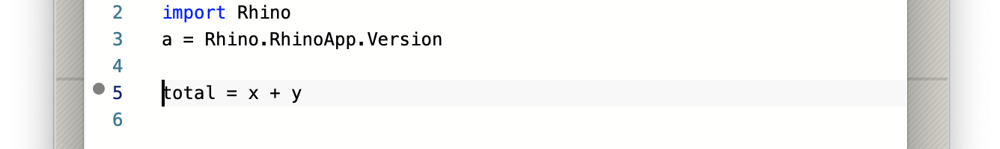

## Using Packages

### Python Packages

You can specify the packages required for your scripts inside the script source. This creates self-contained scripts that carry all their requirements with them.

- Python 3 will use **pip** to install packages from [PyPI.org](https://pypi.org)
  - **pip** does not support Python 2 anymore, so we are limited to the packages used in IronPython
- C# will use **NuGet** to install packages from [NuGet.org](https://www.nuget.org)

The default script for each language has a NOTE section at the top that describes how to specify the requirements in your scripts. Looking at the Python 3 default script, we can specify required packages using this syntax:

```python
# r: numpy
```

or 

```python
# requirements: numpy
```

Let's create a new Python 3 script and add `numpy` as a package and use that in our script:

```python
# requirements: numpy

import numpy

print(f"using numpy: {numpy.version.full_version}\n")

a = numpy.random.rand(10)

```

Click Run, and the script editor will attempt to install the required packages before running the script. This process might take some time and the editor is going to be disabled. Once the packages are installed, the editor will continue to execute the script:


### Python Libraries (Modules)

Another method of adding local packages to Python scripts is by adding their path to the `sys.path`. You can simplify this step by using the `# env:` specifier in your scripts to automatically add a path to the `sys.path` before running your script:

```python
# env: C:/Path/To/Where/My/Library/Is/Located/

import mylibrary

mylibrary.do_something()
```

### NuGet Packages

The same convention applies to C# scripts. They use a different syntax to specify packages that match the format provided in NuGet.org page for the package you want to use:

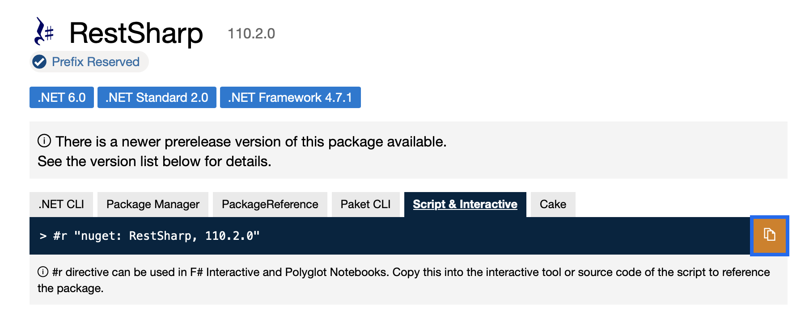

Here is an example script that uses the [RestSharp](https://www.nuget.org/packages/RestSharp/110.2.0) NuGet package to grab some data from a website. Note that the first line of the script specifies the **RestSharp** package version `110.2.0`

```csharp
#r "nuget: RestSharp, 110.2.0"
 
using System;
using System.Collections.Generic;
using Rhino;
 
using RestSharp;
using RestSharp.Authenticators;
 
var client = new RestClient("https://httpbin.org");
var request = new RestRequest("get");
var response = client.Get(request);
 
a = response.Content;

```


## Editor Features

Script Editor has other noteworthy features. Here we highlight a few that are used more often:

### Search

Click on the **Search** tab to open the Search panel. Searching for a keyword will show all the matches in the panel. You can click on any matched item to navigate to:

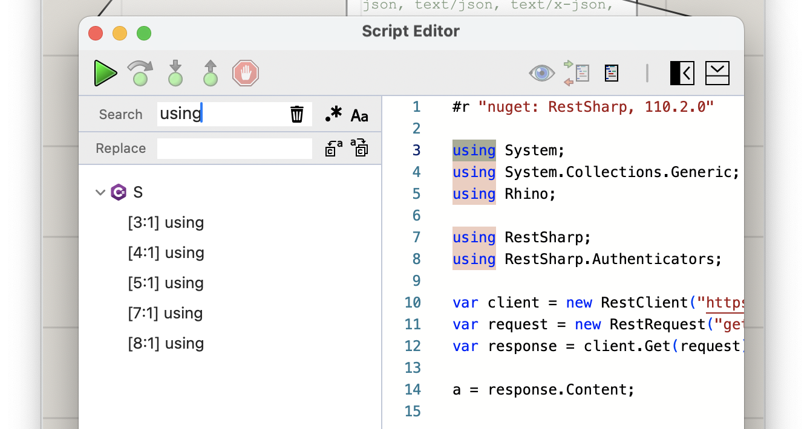

### Help

Click on the **Help** tab to open the Help panel. This panel provides a simple method to get help on Rhino and Grasshopper APIs and provided Python modules:

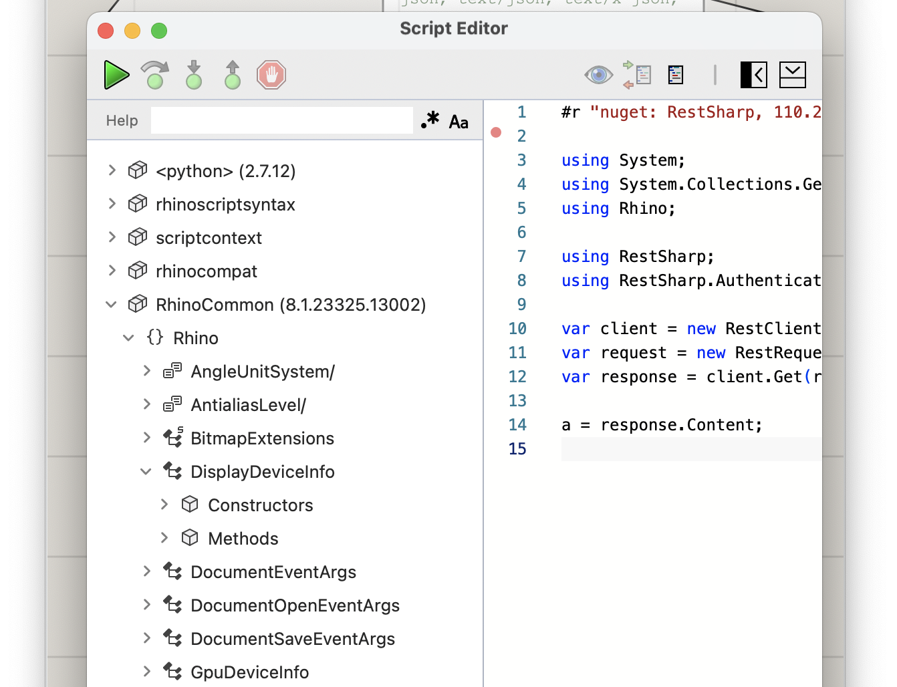

Use the search field to search for class or method names. The info panel at the bottom provides some info about the method and its parameters:

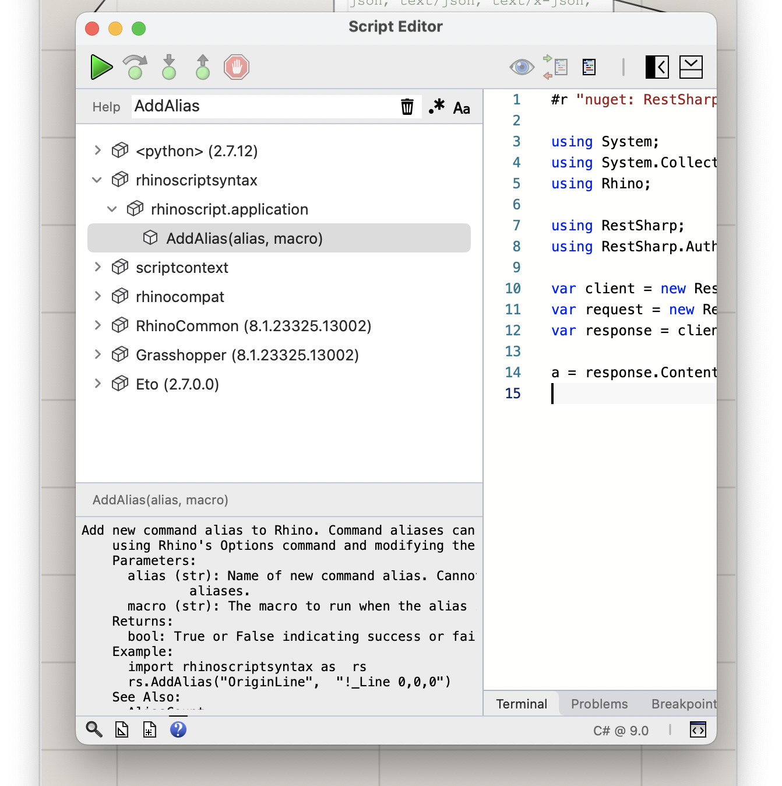
