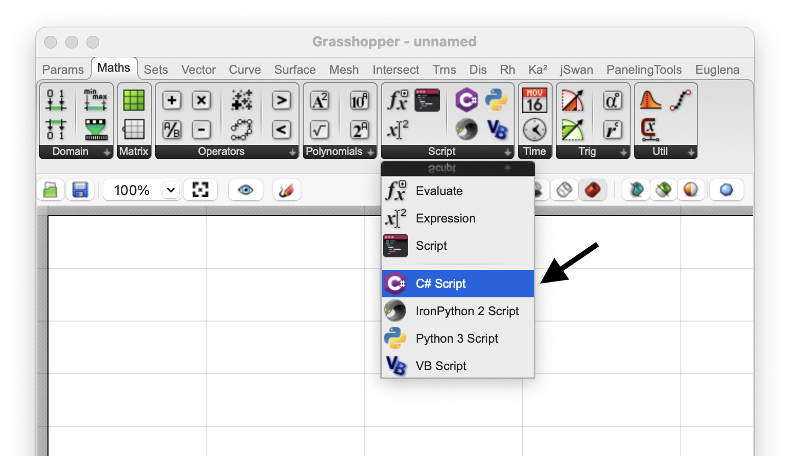
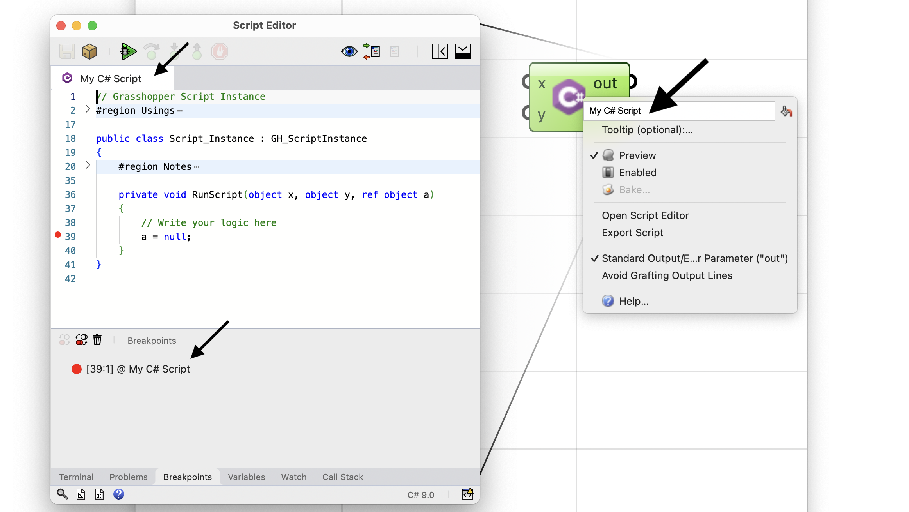
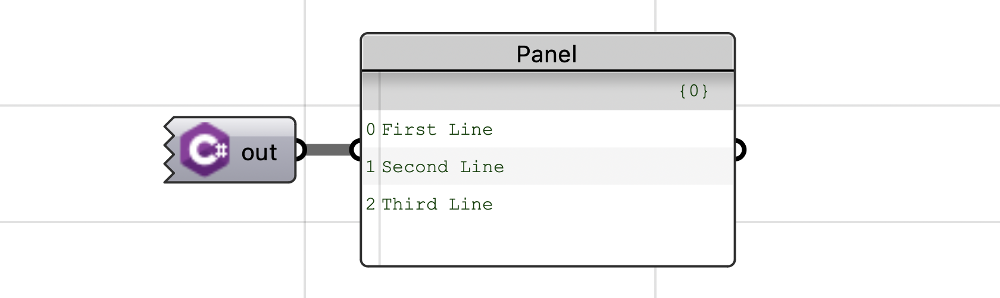
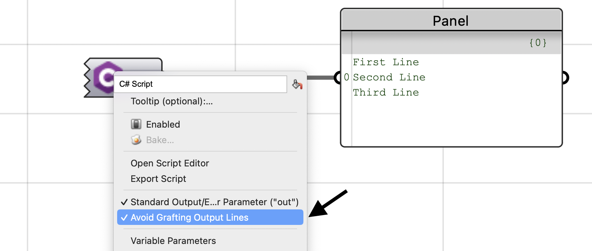
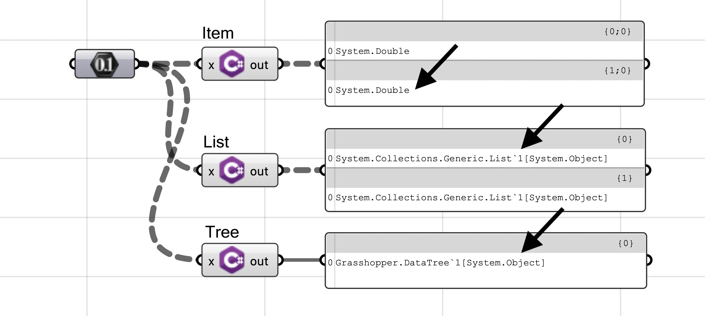
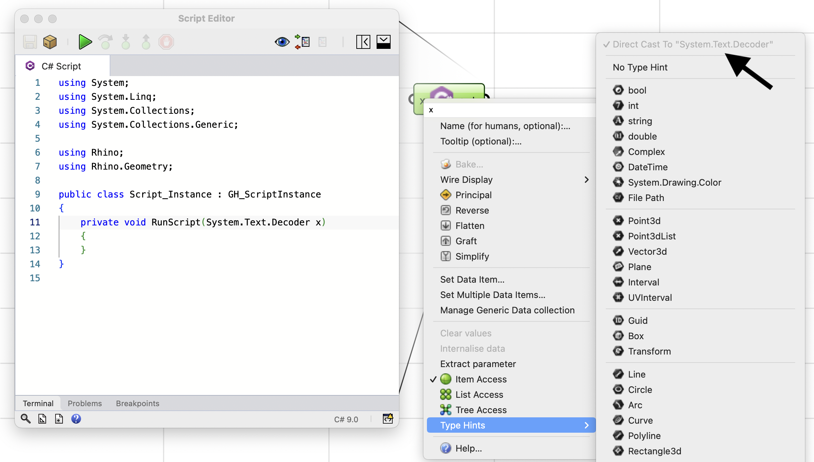
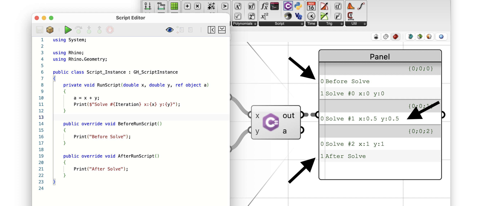
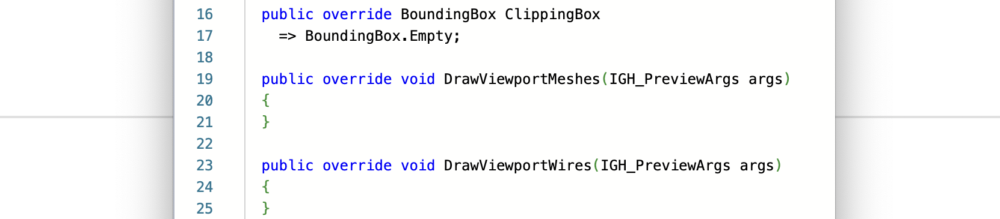
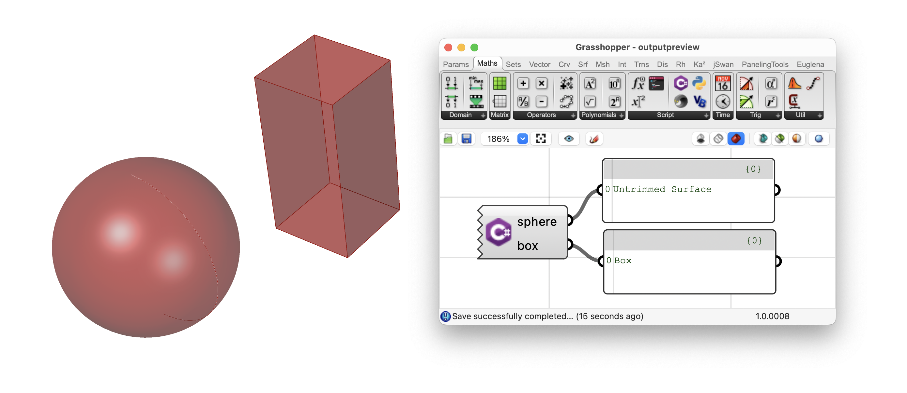

+++
title = "Grasshopper Scripting: C#"
description = ""
type = "guides"
categories = ["Scripting"]
keywords = [ "", "" ]
languages = [ "C#" ]
authors = ["ehsan"]
sdk = [ "RhinoCommon" ]
weight = 4

[included_in]
platforms = [ "Windows", "Mac" ]
since = 8

[page_options]
byline = true
toc = true
toc_type = "single"
block_webcrawlers = false
+++

<style>
    .main-content img { zoom: 50%; }
    code {
        background-color: #efefef;
        padding-left: 5px;
        padding-right: 5px;
        border-radius: 3px;
        font-size: 14px;
    }

    .scriptTable {
        margin: 0 auto;
        margin-top: 20px;
        margin-bottom: 20px;
    }
    .scriptTable th {
        background-color: #efefef;
    }
</style>


This guide is meant to be a detailed reference on all the important aspects and features of the Grasshopper C# Script component. If you would like a quick introduction to the script component, please check out:

[Grasshopper Script Component](/guides/scripting/scripting-component)

This guide does not discuss Rhino or Grasshopper APIs either. So if you would like to know how to create complex geometries in Rhino and Grasshopper, please check out:

[Essential Guide to C# Scripting in Grasshopper - by Rajaa Issa](https://developer.rhino3d.com/guides/grasshopper/csharp-essentials)


## C# Component

Let's dive into C# scripting in Grasshopper by creating a Script component. Go to the **Maths** tab and **Script** panel and drop a C# Script component onto the canvas:



You can also use the generic *Script* component that can run any language, and choose C# from the [ ● ● ● ] menu:


### Opening Script Editor

Now we can double-click on the component to open a script editor. Note that the component draws a cone pointing to the editor that is associated with this component.


### Component Options

At any time, you can right-click on a script component to access a few options that would change how the component behaves. You know a couple of them that are common with other Grasshopper components like **Preview**, **Enable**, and **Bake**. We will discuss all the options that are specific to this script component in detail below:


#### Advanced Options

An extended (advanced) flavour if the context menu is accessible by holding the Shift key and right-clicking on the component. This menu has a series of more advanced options that are needed in special cases, and are discussed later in this guide.

#### Script Name

Scripts in Grasshopper are not stored as files. Most often they are embedded inside script components. To name a script, we bascially renamed the component itself. The script tab and breakpoints panel reflect the script name:



### Modern C#

In C# script component, we can use a more modern flavour of C# language. It has more features that the older C# used in previous Rhino versions and also supports much simpler *Script-Mode* that is discussed below.

For example, [String Interpolation](https://learn.microsoft.com/en-us/dotnet/csharp/tutorials/string-interpolation) is a one of these modern features:

```csharp
int value = 42;

// interpolated strings start with $ before opening the quotation
// Each pair of {} can contain a valid C# statement. The computed result
// of that statement is converted to a string (`.ToString()`) and
// mixed into the interpolated string.
Console.WriteLine($"Value: {value}");
```

The script editor shows the version of C# language on the status bar:


## Inputs, Outputs

The most important concept on a script component is the inputs/outputs. The **Script** component supports *Zoomable User Interface* (*ZUI* for short). TThis means that you can modify the inputs and outputs of the component by zooming in until the **Insert** [ ⊕ ] and **Remove** [ ⊖ ] controls are visible on either side:


By default a script component will have `x` and `y` inputs, and `out` and `a` as outputs. When all parameters on either side are removed, the component will draw a jagged edge on that side. This is completely okay as not all scripts require inputs or produce values as outputs:


Every time you add a parameter, a new temporary name is assigned to it. You can right-click on the parameter itself, to edit the name. It is good practice to assign a meaningful name to parameters so others can understand what kind of inputs to pass to your component or what these inputs are gonna be used for.



C# is a compiled language. Every time you are changing the combination of input and output parameters, or their *Type Hints* you C# script is updated and must be recompiled. The component will show any compile or execute error messages that might occur on the message bubbles.

A short compile delay is expected when you are making parameter changes. If you have a very large script that takes a while to compile, you can disable the Grasshopper solver when making many parameter changes.


### Reserved Names

Every programming language has a set of reserved words (or keywords) that are used in its language constructs. For example in C#, the words `return`, `decimal`, or `default` are all reserved. The C# script component does not allow using any of these keywords for input or output parameters:


Check out [C# Keywords](https://learn.microsoft.com/en-us/dotnet/csharp/language-reference/keywords/) for more information on these keywords.

### Standard Output (out)

The `out` output parameter is special. It captures anything that the script prints to the console (`Console.WriteLine`). The captured output is passed to this parameter as one string or multiple strings (one for each line). The default behaviour is that each line being printed to the console, becomes one item in the `out` parameter:



You can control the single vs multi-line behaviour using the **Avoid Grafting Output Lines**. When this option is checked, all the console output will be passed as one single item to the `out` parameter.




#### Toggling Output 

In case your script is not printing anything to the output, the `out` and be toggled using the **Standard Output/Error Parameter** option in the component context menu. When checked, the `out` parameter is added as the first output parameter. Otherwise, it would be removed:


Removing the `out` parameter may improve the performance of your script component by a small amount, as the component will not attempt to capture the output, process (split into lines), and set the results on the `out` parameter. This performance increase might not be meaningful for a single component, but it would possibly be noticable in a larger Grasshopper definitions with multiple script components, each running thousands of times to process your data. Genereally it is good practice to toggle off the `out` parameter when unused.

### Type Hints

C# is a strongly-typed language. More often than not we need to define the types of inputs and outputs to be able to use all their associated features. For example, C# knows how to add two integers (`int`) together, so if we are going to add inputs in the script, we would need to define a type that supports the addition.

This is where *Type Hints* come into play. They define the type of input or output parameter while also act as data type converters. For example you can pass a *Line* to an input of type `integer` and the converter would capture the length of the line and pass that as the integer to the component. The conversions are identical to how Grasshopper parameters can convert to each other.

By default all inputs and outputs of a C# component have **No Type Hint** meaning they are defined as type `object` in the script. This provides a lot of flexibility but if you pass two integers to the default `x` and `y` inputs, this script below would fail as C# does not know how to add two `object`s to each other.

```csharp
a = x + y;
```


There are plenty of *Type Hints* to choose from. They are available on both input and output parameters:


Check out [Type Hints](/guides/scripting/scripting-gh-typehints) for more information on these type hints and their use cases.

### Outputs Are Objects

In C# script component, the output parameters are always defined as `object`. Their associated *Type Hint* is only used as a converter to convert the output value to the desired type, and does not affect the data type defined in the script.

This provides the flexibility to assign any value to an output and let the Type Hint determine how to convert that to the desired type. For example, assume output value `a` have an `int` *Type Hint* assigned. Since it is defined as `object` we can assign a value of `Sphere` and let the *Hint* convert the Sphere into a single numerical value.


### Parameter Access

Component input parameters have another useful option on their context menu. This feature is called **Parameter Access** and is part of Grasshopper SDK ([GH_ParamAccess](https://developer.rhino3d.com/api/grasshopper/html/T_Grasshopper_Kernel_GH_ParamAccess.htm)):


| Access    | Description |
| --------- | :---------- |
| **Item**      | Every data item is to be treated individually |
| **List**      | All data branches will be treated at the same time |
| **Tree**      | The entire data structure will be treated at once |
{.scriptTable}

We can modify this option on the script component inputs as well:


Here is an example of the data type passed to the script component on the `x` parameter, for the three access kinds. Notice, on **Item** access, `x` is set passed as an individual `double` representing the number value, for **List** access, `x` is set to a `List<object>` that contains all the number values in one branch, and for **Tree** access,`x` is set to a `DataTree<object>` that provides access to all branches and items of the input:



To get the generic collection data structures to use the correct `double` type, we can apply a `double` *Type Hint* to input parameter `x`:


### Extracting Parameters

Grasshopper allows extracting an input parameter from a component. Parameters on a component are independent entities that could exist as inputs or outputs on a component or as floating parameters ([Types of Parameters](https://developer.rhino3d.com/guides/grasshopper/simple-parameters/#types-of-parameters)).

You can extract a script input by choosing **Extract** from the right-click menu on the parameter:


If you have a *Type Hint* set on a parameter, the extracted floating parameter will be of that data type:


## SDK-Mode

There are two ways you can create a C# script in Grasshopper. The first and the easiest is to write a C# script in the simplest form. For example, if we want to pass the sum of our two `x` and `y` inputs to the `a` output, we would create C# script component with this script:

```csharp
a = x + y;
```

Note that we did not add and `using` statements to our script because we are only using builtin C# functionality here that is addition of two numbers.

However, a typical Grasshopper component can:

- Execute code *Before* component is asked to solve the inputs ([BeforeSolveInstance](https://developer.rhino3d.com/api/grasshopper/html/M_Grasshopper_Kernel_GH_Component_BeforeSolveInstance.htm))
- *Solve* the inputs and pass results to outputs ([SolveInstance](https://developer.rhino3d.com/api/grasshopper/html/M_Grasshopper_Kernel_GH_Component_SolveInstance.htm))
- Execute code *After* component is finishing solving the inputs ([AfterSolveInstance](https://developer.rhino3d.com/api/grasshopper/html/M_Grasshopper_Kernel_GH_Component_AfterSolveInstance.htm))
- Execute code to draw geometry wires on Rhino viewports ([DrawViewportWires](https://developer.rhino3d.com/api/grasshopper/html/M_Grasshopper_Kernel_GH_Component_DrawViewportWires.htm))
- Execute code to draw geometry meshes on Rhino viewports ([DrawViewportMeshes](https://developer.rhino3d.com/api/grasshopper/html/M_Grasshopper_Kernel_GH_Component_DrawViewportMeshes.htm))


The methods linked above are part of Grasshopper SDK for creating custom components. Every developer that creates a Grasshoper plugin is aware of these methods and might be using them to customize the component behaviour.

In a C# script component, we can implement our scripts in a similar manner. That is why we are calling it the SDK-mode as it provides similar functionality that is available in Grasshopper SDK to the scripts.

By default when you create a C# script component, the template script is already in SDK-mode as this is how C# components before Rhino 8 have been working and we kept it the same in Rhino 8 and above.

This is how the default script looks like (actual script might not be identical):

```csharp
using System;

using Rhino;
using Rhino.Geometry;

public class Script_Instance : GH_ScriptInstance
{
    private void RunScript(object x, object y, ref object a)
    {
        // Write your logic here
        a = null;
    }
}
```

`GH_ScriptInstance` is the base class that implements methods below, similar to Grasshopper components:

- `BeforeRunScript`: Execute code *Before* component is asked to solve the inputs
- `RunScript`: *Solve* the inputs and pass results to outputs
- `AfterRunScript`: Execute code *After* component is finishing solving the inputs
- `DrawViewportWires`: Execute code to draw geometry wires on Rhino viewports
- `DrawViewportMeshes`: Execute code to draw geometry meshes on Rhino viewports

This class provides base implementation for these methods except for `RunScript` that we must implement. In the example above, we subclass from `GH_ScriptInstance` and provide an empty implementation for `RunScript`.

### RunScript Signature

The `RunScript` method signature is going to include all the component inputs and outputs by their name and data type (based on their *Type Hints*). All outputs are passed by reference using `ref` keyword so that providing a value for them would be optional.

You can write the logic of your component inside the `RunScript` block, take the input values, compute, and set the outputs. As with any other Grasshopper component, the `RunScript` method might be call multiple times based on the pairing of input data.


### Changing RunScript Signature

*Script* component is smart enough to update the RunScript signature when parameters on the component are changed. It is also capable of updating parameters on the component, when the RunScript signature is manually edited:


Notice that input and output types will be used to apply an appropriate type hint to the parameter. The collection type of the input (`List`, or `DataTree`) is also used to apply the correct access kind to the associated input parameter.

If the data type does not have an associated *Type Hint*, it will adopt a *Cast Type Hint* that tries to directly cast input values to the data type:



### Before, After Solve Overrides

You can easily add the `BeforeRunScript` and `AfterRunScript` methods to your `Script_Instance` implementation by:

- Click on the **Add SolveInstance Overrides** button on the editor toolbar
- Click on the **Add SolveInstance Overrides** menu inside the **Grasshopper** menu on the editor
- Typing them yourself


These two methods will be added to the class implementation:



A good example of using these two methods would be to setup instance variables on the class instance during `BeforeRunScript` and clean them up after the execution during `AfterRunScript`. The component is not allowed to make changes to the output parameters inside these methods.


Each one of these methods is executed only once, per one full execution of this component. We can put a few print statements in these methods, and check the order of execution:



There are two range components included in this example to provide inputs to the script component. Each range component outputs 3 items, and their associated input parameter on the script component has a `double` *Type Hint* assigned to it. This means the `RunScript` method is going to be executed 3 times for 3 pairs of `x` and `y`.

Notice that the text *Before Solve* is printed on the same output item as *Solve #0* which is the first iteration of solving inputs. This is because `BeforeRunScript` runs before the script component is allowed to set values on its output parameters and therefore any output printed to the console are going to be captured by the first iteration of `RunScript` that runs right after.

All other iterations of `RunScript` will continue after the first.

The `AfterRunScript` is executed after all the iterations of `RunScript` have completed execution. Notice that the text *After Solve* is captured and appended to the last message on the `out` parameter which belongs to the last iteration of `RunScript` that ran right before.

### Preview Overrides

You can easily add the `DrawViewportWires` and `DrawViewportMeshes` methods to your `Script_Instance` implementation by:

- Click on the **Add Preview Overrides** button on the editor toolbar
- Click on the **Add Preview Overrides** menu inside the **Grasshopper** menu on the editor
- Typing them yourself


These two methods will be added to the class implementation:



Notice there is also a `BoundingBox` property implementation that is added as well. The default value is `BoundingBox.Empty` but you should change that to a larger bounding box that bounds any custom geometry being drawn by your component.

### Draw Calls

!!!

## Script-Mode

A simpler, more script-like, method of using *C# Script Component* is to write C# code in the script editor without implementing the `GH_ScriptInstance` class. This method does not support running code before and after the script or creating custom graphics on Rhino viewports, but it is great for any script that does not need these functionalities.

Here is a very simple example:


Notice that we do not have a `RunScript` method that would show the input and outputs and their data types. The `x` input parameter is magically defined and set before your script starts.

Check out [NuGet Packages]() for another example.


*SDK-Mode* and *Script-Mode* are both valid ways of writing scripts in C# script component. Choose the one you are comfortable with and is the most appropriate for the use case.


## Debugging Scripts

!!!

## NuGet Packages

!!!

### Assembly References

- absolute/relative/loaded
!!!

## Customizing Editor

Script editor used in C# script component, is an embedded variant of the main script editor in Rhino that is launched from `ScriptEditor` command. The component script editor, has a *Grasshopper* menu and few other Grasshopper-specific buttons.

We have already discussed the *SDK-Mode* related buttons in the editor toolbar. Here is a description of other editor options that are useful in Grasshopper:

### Close On Save

By default, when *Saving* the script in C# script component, the editor stays open. It saves the script and triggers a solution on the Grasshopper definition with the newly updated script.

This behaviour can be changed using the **Grasshopper -> Toggle Close Editor On Save** menu. When enabled, choosing *File -> Save* or *Ctrl + S* will save the script and close the editor (This is the default behaviour of the legacy script editor in GHPython component).

### Layout Options

Script editor used in C# script component, has a series of toggle menus to change the layout of the editor and make it more compact. These options can be accessed from **Window** menu in the editor:


They are also accessible from the **Tools -> Options** menu in the editor. Hover the mouse over the question mark icons to see more information on each option:


## Publishing Script

!!!

## Template Scripts

!!!

### Resetting Icon

If you have a script component that has an incorrect or low-resolution icon, you can reset the icon back to the default for the scripting language using the **Reset Icon** menu button in the Advanced context menu (Shift + Right-Click).

## Shared Scripts

!!!

## Value-Type Outputs

C# is a type-safe language and differentiates between [Reference Types](https://learn.microsoft.com/en-us/dotnet/csharp/language-reference/keywords/reference-types) and [Value Types](https://learn.microsoft.com/en-us/dotnet/csharp/language-reference/builtin-types/value-types).

We do not intent to get into the details here. It is only important to remember that *Value Types* can not be `null` and always have a default value. For example, in C# the statement below is invalid since `int` is a value type:

```csharp
int x = null;
```

If your C# script (*SDK* or *Script-Mode*), has an input that is marked with a *Type Hint* representing a *Value Type* (e.g. `double` or `Point3d`), and is not connected in your Grasshopper definition, the input will adopt the default value.

See this example. The C# script has two `double` inputs (`x` and `y`) but only assigns a value to the first input `x`. The `y` output will be set to the default value for the type `double` which is `0`:


Similarly, if your C# script (*SDK* or *Script-Mode*), has an output that is marked with a *Type Hint* representing a *Value Type*, and this output is not set in your script, the output will adopt the default value:


Keep this in mind when working with output Type Hints in C# script component.

## Output Previews

Output parameters have their own individual *Preview* control. This option is on by default and Grasshopper renders previews for geometry values in output parameters:



You can toggle this option off for any of the output parameters and hide the preview, using the **Preview** menu in the component context menu:


## Exporting Script

You can save the script that is embedded in a C# script component, using the **Export Script** menu item from component context menu.

## Script Cache

C# script component compiles and caches the script, so it can execute faster when the script is not changed. Normally the cache is expired automatically when you make changes to the script or any of the parameters.

However, sometimes it is desired to expire the cache manually to ensure component is using a fresh build. To expire the compile cache, choose **Discard Cache** from component context menu.