+++
title = "Grasshopper Scripting: Python"
description = ""
type = "guides"
categories = ["Scripting"]
keywords = [ "", "" ]
languages = [ "Python" ]
authors = ["ehsan"]
sdk = [ "RhinoCommon" ]
weight = 4

[included_in]
platforms = [ "Windows", "Mac" ]
since = 8

[page_options]
byline = true
toc = true
toc_type = "single"
block_webcrawlers = false
+++

<style>
    .main-content img { zoom: 50%; }
    code {
        background-color: #efefef;
        padding-left: 5px;
        padding-right: 5px;
        border-radius: 3px;
        font-size: 14px;
    }

    .scriptTable {
        margin: 0 auto;
        margin-top: 20px;
        margin-bottom: 20px;
    }
    .scriptTable th {
        background-color: #efefef;
    }
</style>


This guide is meant to be a detailed reference on all the important aspects and features of the Grasshopper Python 3 or 2 Script component. If you would like a quick introduction to the script component, please check out:

[Grasshopper Script Component](/guides/scripting/scripting-component)


<!-- 
This guide does not discuss Rhino or Grasshopper APIs either. So if you would like to know how to create complex geometries in Rhino and Grasshopper, please check out:

[Essential Guide to C# Scripting in Grasshopper - by Rajaa Issa](https://developer.rhino3d.com/guides/grasshopper/csharp-essentials)
 -->

## Why Python 3


## Why Python 2


## Python Component

Let's dive into Python scripting in Grasshopper by creating a Script component. Go to the **Maths** tab and **Script** panel and drop a Python 3 Script component onto the canvas. There is also an IronPython 2 Script component available that you can use. See above for the differences:

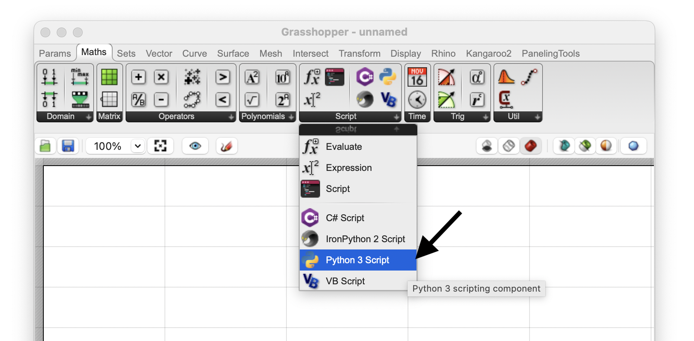

You can also use the generic *Script* component that can run any language, and choose Python 3 from the [ ● ● ● ] menu:

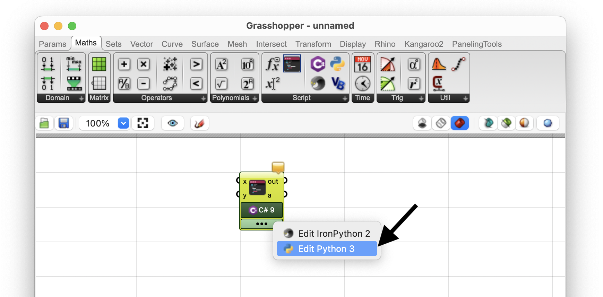

### Opening Script Editor

Now we can double-click on the component to open a script editor. Note that the component draws a cone pointing to the editor that is associated with this component.


The script editor shows the version of C# language on the status bar:


### Component Options

At any time, you can right-click on a script component to access a few options that would change how the component behaves. You know a couple of them that are common with other Grasshopper components like **Preview**, **Enable**, and **Bake**. We will discuss all the options that are specific to this script component in detail below:

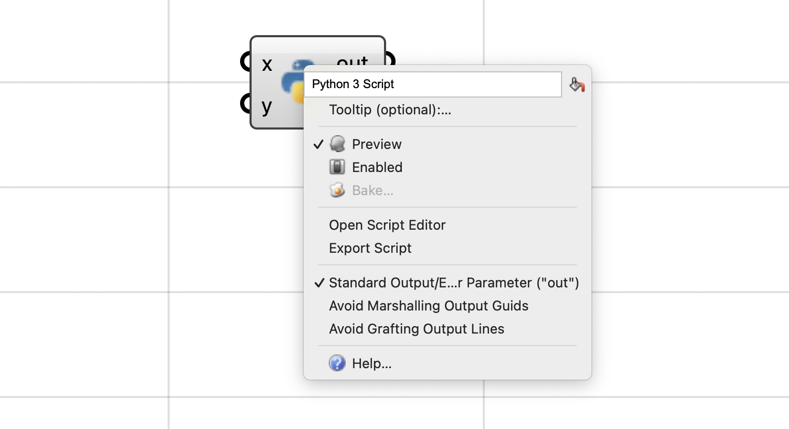

#### Advanced Options

An extended (advanced) flavour if the context menu is accessible by holding the Shift key and right-clicking on the component. This menu has a series of more advanced options that are needed in special cases, and are discussed later in this guide.

#### Script Name

Scripts in Grasshopper are not stored as files. Most often they are embedded inside script components. To name a script, we basically renamed the component itself. The script tab and breakpoints panel reflect the script name:

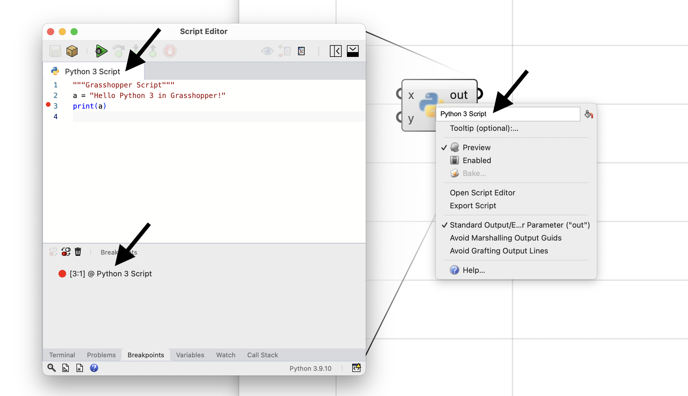

## Inputs, Outputs

The most important concept on a script component is the inputs/outputs. The **Script** component supports *Zoomable User Interface* (*ZUI* for short). This means that you can modify the inputs and outputs of the component by zooming in until the **Insert** [ ⊕ ] and **Remove** [ ⊖ ] controls are visible on either side:


By default a script component will have `x` and `y` inputs, and `out` and `a` as outputs. When all parameters on either side are removed, the component will draw a jagged edge on that side. This is completely okay as not all scripts require inputs or produce values as outputs:


Every time you add a parameter, a new temporary name is assigned to it. You can right-click on the parameter itself, to edit the name. It is good practice to assign a meaningful name to parameters so others can understand what kind of inputs to pass to your component or what these inputs are gonna be used for.

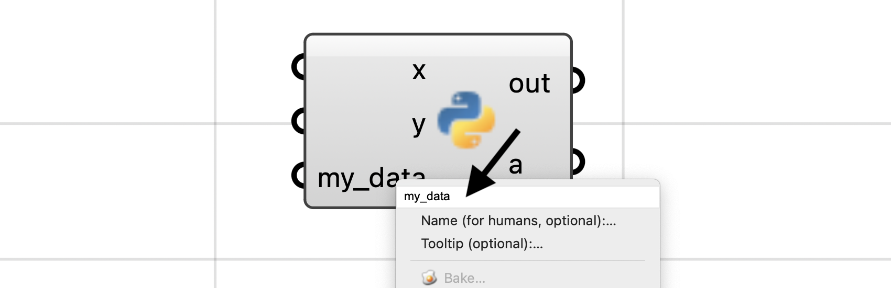

### Reserved Names

Every programming language has a set of reserved words (or keywords) that are used in its language constructs. For example in Python, the words `dir`, `filter`, or `str` are all reserved. The Python script component will warn you about using any of these keywords for input or output parameters, but does not stop you from using them. Python language itself does not stop you from assigning a value to builtin functions like `dir` or `filter` and this component follows this behaviour:


Check out [Python 3 Keywords](https://docs.python.org/3/reference/lexical_analysis.html#keywords) and [Python 3 Builtin Functions](https://docs.python.org/3/library/functions.html#built-in-functions) for more information on these keywords.

### Standard Output (out)

The `out` output parameter is special. It captures anything that the script prints to the console (`print()`). The captured output is passed to this parameter as one string or multiple strings (one for each line). The default behaviour is that each line being printed to the console, becomes one item in the `out` parameter:


You can control the single vs multi-line behaviour using the **Avoid Grafting Output Lines**. When this option is checked, all the console output will be passed as one single item to the `out` parameter.


#### Toggling Output 

In case your script is not printing anything to the output, the `out` and be toggled using the **Standard Output/Error Parameter** option in the component context menu. When checked, the `out` parameter is added as the first output parameter. Otherwise, it would be removed:


Removing the `out` parameter may improve the performance of your script component by a small amount, as the component will not attempt to capture the output, process (split into lines), and set the results on the `out` parameter. This performance increase might not be meaningful for a single component, but it would possibly be noticable in a larger Grasshopper definitions with multiple script components, each running thousands of times to process your data. Genereally it is good practice to toggle off the `out` parameter when unused.

### Type Safety

Python is NOT a type-safe language. This means a variable named `x` can be assigned a value if any type. This is very different from typed languages like C# where if variable `x` is defined as an `int`, a value of type `Sphere` can not be assigned to it.

Lets assume a Python Script Component that contains this script:

```python
a = x + y
```

If the `x` and `y` inputs are not connected and therefore do not carry any value (value of `None`), Python will throw an error when this component is executed since it does not know how to add a `None` to another `None`:

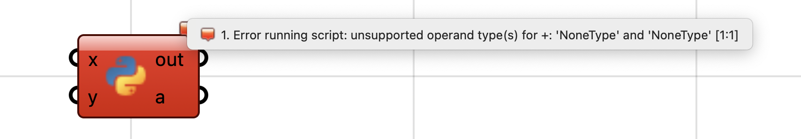

Type-safety really means that the language would detect variable types during compile (before even executing the script) and will throw errors if operations or function calls does not support the specific variable type. But as we mentioned Python is not type-safe so during compilation it assumes you are gonna provide values that support the `+` operation in the `a = x + y`. This is why it throws the error shown above, during execution of the script.

By providing values that support the addition, in this example integers, the component will run without any errors:


### Type Hints

In plenty of cases we need to make conversions to the input values of our script. These are the well-known parameter conversions that we all know and love in Grasshopper. As an example, you can pass a *Line* parameter to a *Number* parameter and it will automatically grab the lenght of the line as the value for the *Number* parameter:


We can easily apply these automatic conversions to Script Component input parameters. In this example, two *Line* values are passed to a Python script `a = x + y`. Both `x` and `y` inputs have been assigned *Type Hint* of `float` which can hold floating point values (*Number* in Grasshopper):


Therefore before running the script, both inputs lines will be converted to `float` values by the *Type Hint* and the output `a` will be set to the sum of the line lenghts:

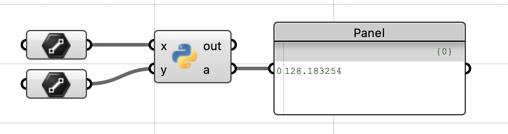


There are plenty of *Type Hints* to choose from. They are available on both input and output parameters.

Check out [Type Hints](/guides/scripting/scripting-gh-typehints) for more information on these type hints and their use cases.

### Parameter Access

Component input parameters have another useful option on their context menu. This feature is called **Parameter Access** and is part of Grasshopper SDK ([GH_ParamAccess](https://developer.rhino3d.com/api/grasshopper/html/T_Grasshopper_Kernel_GH_ParamAccess.htm)):


| Access    | Description |
| --------- | :---------- |
| **Item**      | Every data item is to be treated individually |
| **List**      | All data branches will be treated at the same time |
| **Tree**      | The entire data structure will be treated at once |
{.scriptTable}

We can modify this option on the script component inputs as well:


Here is an example of the data type passed to the script component on the `x` parameter, for the three access kinds. Notice, on **Item** access, `x` is set passed as an individual `double` representing the number value, for **List** access, `x` is set to a `List<object>` that contains all the number values in one branch, and for **Tree** access,`x` is set to a `DataTree<object>` that provides access to all branches and items of the input:


Notice that the *Item* and *List* access are showing builtin Python types of `float` and `list`, however the *Tree* access is showing `Grasshopper.DataTree[Object]` type (See [DataTree](https://developer.rhino3d.com/api/grasshopper/html/T_Grasshopper_DataTree_1.htm)). This is an important topic that is discussed in [Marshalling]().

To get the generic DataTree structure to use the correct type, we can apply a `float` *Type Hint* to input parameter `x`. Note that generic DataTree structure shows *Double* as the element type. This is the type for *Number* parameter in Grasshopper that can fit large floating point values and it somewhat similar to `float` in Python:

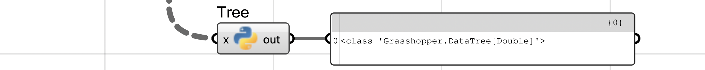

### Extracting Parameters

Grasshopper allows extracting an input parameter from a component. Parameters on a component are independent entities that could exist as inputs or outputs on a component or as floating parameters ([Types of Parameters](https://developer.rhino3d.com/guides/grasshopper/simple-parameters/#types-of-parameters)).

You can extract a script input by choosing **Extract** from the right-click menu on the parameter:


If you have a *Type Hint* set on a parameter, the extracted floating parameter will be of that data type:

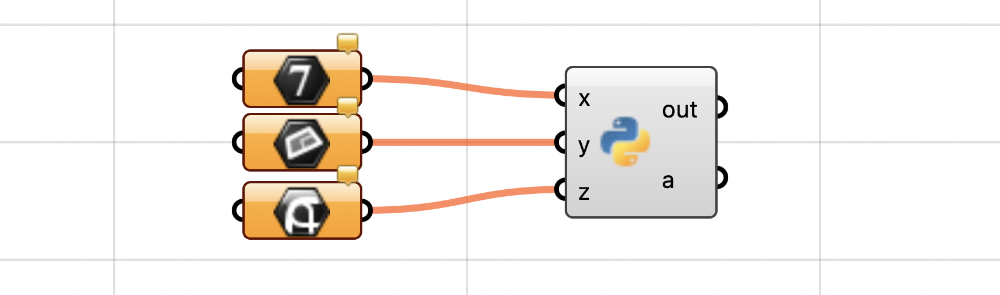

## Script-Mode

A simpler, more script-like, method of using *C# Script Component* is to write C# code in the script editor without implementing the `GH_ScriptInstance` class. This method does not support running code before and after the script or creating custom graphics on Rhino viewports, but it is great for any script that does not need these functionalities.

Here is a very simple example:


Notice that we do not have a `RunScript` method that would show the input and outputs and their data types. The `x` input parameter is magically defined and set before your script starts.

Check out [PyPI Packages]() for another example.

## SDK-Mode

There are two ways you can create a C# script in Grasshopper. The first and the easiest is to write a C# script in the simplest form. For example, if we want to pass the sum of our two `x` and `y` inputs to the `a` output, we would create C# script component with this script:

```csharp
a = x + y;
```

Note that we did not add and `using` statements to our script because we are only using builtin C# functionality here that is addition of two numbers.

However, a typical Grasshopper component can:

- Execute code *Before* component is asked to solve the inputs ([BeforeSolveInstance](https://developer.rhino3d.com/api/grasshopper/html/M_Grasshopper_Kernel_GH_Component_BeforeSolveInstance.htm))
- *Solve* the inputs and pass results to outputs ([SolveInstance](https://developer.rhino3d.com/api/grasshopper/html/M_Grasshopper_Kernel_GH_Component_SolveInstance.htm))
- Execute code *After* component is finishing solving the inputs ([AfterSolveInstance](https://developer.rhino3d.com/api/grasshopper/html/M_Grasshopper_Kernel_GH_Component_AfterSolveInstance.htm))
- Execute code to draw geometry wires on Rhino viewports ([DrawViewportWires](https://developer.rhino3d.com/api/grasshopper/html/M_Grasshopper_Kernel_GH_Component_DrawViewportWires.htm))
- Execute code to draw geometry meshes on Rhino viewports ([DrawViewportMeshes](https://developer.rhino3d.com/api/grasshopper/html/M_Grasshopper_Kernel_GH_Component_DrawViewportMeshes.htm))


The methods linked above are part of Grasshopper SDK for creating custom components. Every developer that creates a Grasshoper plugin is aware of these methods and might be using them to customize the component behaviour.

In a C# script component, we can implement our scripts in a similar manner. That is why we are calling it the **SDK-Mode** as it provides similar functionality that is available in Grasshopper SDK.

By default when you create a C# script component, the template script is already in *SDK-Mode* as this is how C# components before Rhino 8 have been working and we kept it the same in Rhino 8 and above.

This is how the default script looks like (actual script might not be identical):

```csharp
using System;

using Rhino;
using Rhino.Geometry;

public class Script_Instance : GH_ScriptInstance
{
    private void RunScript(object x, object y, ref object a)
    {
        // Write your logic here
        a = null;
    }
}
```

`GH_ScriptInstance` is the base class that implements methods below, similar to Grasshopper components:

- `BeforeRunScript`: Execute code *Before* component is asked to solve the inputs
- `RunScript`: *Solve* the inputs and pass results to outputs
- `AfterRunScript`: Execute code *After* component is finishing solving the inputs
- `DrawViewportWires`: Execute code to draw geometry wires on Rhino viewports
- `DrawViewportMeshes`: Execute code to draw geometry meshes on Rhino viewports

This class provides base implementation for these methods except for `RunScript` that we must implement. In the example above, we subclass from `GH_ScriptInstance` and provide an empty implementation for `RunScript`.

### RunScript Signature

The `RunScript` method signature is going to include all the component inputs and outputs by their name and data type (based on their *Type Hints*). All outputs are passed by reference using `ref` keyword so that providing a value for them would be optional.

You can write the logic of your component inside the `RunScript` block, take the input values, compute, and set the outputs. As with any other Grasshopper component, the `RunScript` method might be call multiple times based on the pairing of input data.


### Changing RunScript Signature

*Script* component is smart enough to update the RunScript signature when parameters on the component are changed. It is also capable of updating parameters on the component, when the RunScript signature is manually edited:


Notice that input and output types will be used to apply an appropriate type hint to the parameter. The collection type of the input (`List`, or `DataTree`) is also used to apply the correct access kind to the associated input parameter.

If the data type does not have an associated *Type Hint*, it will adopt a *Cast Type Hint* that tries to directly cast input values to the data type:


### Before, After Solve Overrides

You can easily add the `BeforeRunScript` and `AfterRunScript` methods to your `Script_Instance` implementation by:

- Click on the **Add SolveInstance Overrides** button on the editor dashboard
- Click on the **Add SolveInstance Overrides** menu inside the **Grasshopper** menu on the editor
- Typing them yourself


These two methods will be added to the class implementation:



A good example of using these two methods would be to setup instance variables on the class instance during `BeforeRunScript` and clean them up after the execution during `AfterRunScript`. The component is not allowed to make changes to the output parameters inside these methods.


Each one of these methods is executed only once, per one full execution of this component. We can put a few print statements in these methods, and check the order of execution:


There are two range components included in this example to provide inputs to the script component. Each range component outputs 3 items, and their associated input parameter on the script component has a `double` *Type Hint* assigned to it. This means the `RunScript` method is going to be executed 3 times for 3 pairs of `x` and `y`.

Notice that the text *Before Solve* is printed on the same output item as *Solve #0* which is the first iteration of solving inputs. This is because `BeforeRunScript` runs before the script component is allowed to set values on its output parameters and therefore any output printed to the console are going to be captured by the first iteration of `RunScript` that runs right after.

All other iterations of `RunScript` will continue after the first.

The `AfterRunScript` is executed after all the iterations of `RunScript` have completed execution. Notice that the text *After Solve* is captured and appended to the last message on the `out` parameter which belongs to the last iteration of `RunScript` that ran right before.

### Preview Overrides


*Preview Overrides* are continuously called as you are interacting with the Rhino viewports. See [Draw Calls]() for more information on how these overrides work.


You can easily add the `DrawViewportWires` and `DrawViewportMeshes` methods to your `Script_Instance` implementation by:

- Click on the **Add Preview Overrides** button on the editor dashboard
- Click on the **Add Preview Overrides** menu inside the **Grasshopper** menu on the editor
- Typing them yourself


These two methods will be added to the class implementation:


`DrawViewportWires` is called first and here you can draw points and curves. `DrawViewportMeshes` is called later and this is where you can draw transparent shapes, such as meshes.

Notice there is also a `BoundingBox` property implementation that is added as well. The default value is `BoundingBox.Empty` but you should change that to a larger bounding box that bounds any custom geometry being drawn by your component.

Here is an example of a component that draws a 2D filled rectangle at the top-left corner of Rhino viewport:


An argument of type [IGH_PreviewArgs](https://developer.rhino3d.com/api/grasshopper/html/T_Grasshopper_Kernel_GH_PreviewArgs.htm) is passed to these preview override methods. As you can see in the example above, you can access the `args.Display` property which is a Rhino [DisplayPipeline](https://developer.rhino3d.com/api/rhinocommon/rhino.display.displaypipeline) instance and has a lot of helpful draw methods.


Rhino 8 and above primarily use a UI framework called [Eto](https://github.com/picoe/Eto). However Grasshopper 1 predates this adoption and uses `System.Drawing` framework for its graphical interface. They both have similar data structures (e.g. `Rectangle`) but it is important to know when working with Grasshopper preview overrides to use `System.Drawing` data types.


### Draw Calls

It is very important to know that **Preview Overrides** are fundamentally different from *Solve Overrides* (`BeforeRunScript`, `RunScript`, `AfterRunScript`) in a sense that they are executed outside of Grasshopper solution and are designed to work in tandem with the solve methods.

When you interact with a component, Grasshopper triggers a new solution on the definition. When solution is completed, Grasshopper is ready to draw previews on all the geometries generated by the components on the canvas.

Any interaction with Rhino viewports results in Grasshopper receiving a request from Rhino to draw its previews in the viewports. These draw requests happen anytime you interact with Rhino viewports and a Grasshopper definition is open.

This is exactly where the *Preview Overrides* come into play. Their main purpose is to peform custom drawings in Rhino viewports based on the results of the computation done by *Solve Overrides*. Contradictory to the solve methods, the *Preview Overrides* are continuously called as you are interacting with the Rhino viewports.


*SDK-Mode* and *Script-Mode* are both valid ways of writing scripts in C# script component. Choose the one you are comfortable with and is the most appropriate for the use case.


## Debugging Scripts

You can debug your C# scripts in the script component. During debug, we can execute the script line by line or pause the execution at certain lines called **Breakpoints** and inspect the values of global and local variables.

Move your mouse cursor to the left side of any script line and click to add a **Breakpoint**:


The **Breakpoints** tray at the bottom will show all the breakpoints, and will provide buttons to *Enabled/Disable* or *Clear* them:


Use the **Toggle** button to activate or deactivate the breakpoints. Deactivated breakpoints will show up as gray dots in the editor:


When you add breakpoints, the editor makes a few UI changes and provides a few more utilities for debugging:

- The **Run** button will change to **Debug**
- **Variables**, **Watch**, and **Call Stack** trays will be added to the bottom tray bar

Now click on the green **Debug** button on the editor dashboard. The editor will run the script and:

- Stops at breakpoints
- Highlights the breakpoint line in orange and shows an arrow on the left side of the line
- Highlights status bar in orange to show we are debugging a script
- Activates the debug control buttons on the editor dashboard
- Opens the **Variables** tray at the bottom to show global and local variables


We can control the execution of script using the debug control buttons on the editor dashboard:


From left to right, they are:

- **Continue:** continues running the script until it stops on another breakpoint
- **Step Over:** executes current line and moves on the next line
- **Step In:** if the current line includes a function call, this will step into the lines defining the function code
- **Step Out:** if previously stepped into a function code, this will continue executing the function code until control is returned from the function to the calling code and will stop there
- **Stop:** stops debugging the script and does not continue executing the rest

Click on **Continue** to see the execution move to the next line:

Notice that the **Variables** panel now shows new values for **x** and **y**. The panel header also shows **Run Script (2 of 11)** on the top-right meaning this is the second time Grasshopper is executing this component with a pair of **x** and **y** inputs:


Progressively clicking on **Continue** will continue executing the script and modifying the variables. At each stop, the **Variables** tray shows the current values of global and local variables.

At any point during debug, the **Stop** button stops debugging. The script component will show an error marking with the message **Debug Stopped**:


Once the debug stops, the editor UI changes back to normal, and the **Variables** tray will show the last state of the variables. The tray will keep these data until another session of debugging is started.

### Variables Tray

*Variables* tray is a great tool to inspect the current values of all the global and local variables in our script. Variables data is shown in a table with 3 columns: **Name**, **Value**, **Type**. For each variable you can see the current value and the type of data it is holding. A red marker will highlight the variables that changed during debug:


For more complicated data types with fields and properties, you can expand the variable to see current values of its members:


If a value is a collection of other values, you can expand the variable to see each item individually. The *Name* column shows the item index like `[0]`:


### Watch Tray

*Watch* tray is very similar to the variables tray. The primary difference is that *Watch* tray only shows the variables that you have specifically added to watch. Use the **Add Expression** button on the tray toolbar to add a new variable to watch. Hit Enter on the added *Expression* item to edit and type the variable name:


*Watch* tray will show a green checkmark when it can extract the variable value during debug. A yellow warning icon is shown when the variable is not in scope:


### Call Stack Tray

*Call Stack* tray shows the call stack frames. This loosly translates to functions calls in our script. The item at the top is the last function that the script is executing, and the list goes on to show other functions that called the current function

In the example below, script execution started by running `RunScript`. Then the script called the `Sum` method and that is where we are paused during debug right now. *Call Stack* tray shows this function at the top of the list, with `RunScript` following right after. *Variable* and *Watch* trays also show the values of variables in the current call frame:


You can click on other stack frames, and switch to *Variables* or *Watch* tray to inspect the values in their scope:


*Call Stack* tray shows stack frames for different threads in your script independently.

## PyPI Packages

Python 3 script can benefit from third-party packages that are published on [PyPI](https://pypi.org) package server. You can use the *Install Package* button to install any of these packages and use in your script:


The Install Package dialog, shows a couple of example of how you can specify the package name and version requirements.

The **Add Package Reference to Script** option, when check (default), adds a package reference to the script text. In this manner, the script always knows which packages it needs even when you send this script to others and they do not have the required packages installed.

Notice the `#r "nuget: RestSharp, 110.2.0"` line in the example script below. The format follows the package reference for script on NuGet website:


```csharp
#r "nuget: RestSharp, 110.2.0"
 
using System;
using System.Collections.Generic;
using Rhino;
 
using RestSharp;
using RestSharp.Authenticators;
 
var client = new RestClient("https://httpbin.org");
var request = new RestRequest("get");
var response = client.Get(request);
 
a = response.Content;
```

## Assembly References

C# scripts can also directly reference dotnet assembly files. You can use the **Install Package** dialog and change the **Package Source** option to **DLL Reference**:


If the assembly is already loaded in Rhino, you can reference it by just typing the name of the assembly. Make sure the extension is included in the assembly name (e.g. `.dll`) A package reference like example below is optionally added to your script:

```csharp
#r "System.Text.Json.dll"
```

As the *Install Package* dialog examples show, you can also provide a relative or absolute path to the assembly:

```csharp
#r "/path/to/my/assemblies/MySharedAssembly.dll"
```

## Customizing Editor

Script editor used in C# script component, is an embedded variant of the main script editor in Rhino that is launched from `ScriptEditor` command. The component script editor, has a *Grasshopper* menu and few other Grasshopper-specific buttons.

We have already discussed the *SDK-Mode* related buttons in the editor dashboard. Here is a description of other editor options that are useful in Grasshopper:

### Close On Save

By default, when *Saving* the script in C# script component, the editor stays open. It saves the script and triggers a solution on the Grasshopper definition with the newly updated script.

This behaviour can be changed using the **Grasshopper -> Toggle Close Editor On Save** menu. When enabled, choosing *File -> Save* or *Ctrl + S* will save the script and close the editor (This is the default behaviour of the legacy script editor in GHPython component).

### Layout Options

Script editor used in C# script component, has a series of toggle menus to change the layout of the editor and make it more compact. These options can be accessed from **Window** menu in the editor, and can be used to dedicated more screen space to scripting area, and also visually differentiate the Grasshopper editor from the main editor in Rhino.

They are also accessible from the **Tools -> Options** menu in the editor. Hover the mouse over the question mark icons to see more information on each option:


#### Toggle Dashboard

You can completely hide the editor dashboard and open up more space for script:

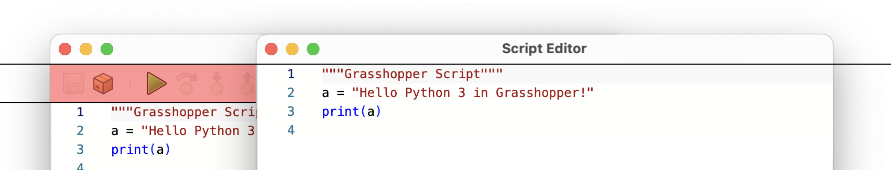

#### Toggle Compact Dashboard

When Dashboard is visible, you can save some space by making it more compact:

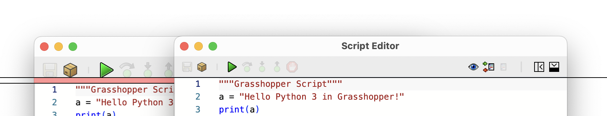

#### Toggle Compact Script Tabs

By default, Grasshopper editor does not show the script tabs, unless debug steps into a source file other than the main script. Toggle this option if you want the tabs to be always visible:

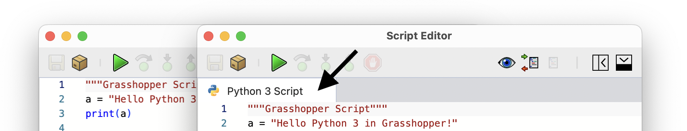

#### Toggle Compact Browser

By default Browser tabs are NOT shown on the left side of the editor in Grasshopper. The tab selector buttons are shown on the status bar to save some space. Toggle this option if you want to see the browser tabs on the left side:


#### Toggle Compact Console

By default Console tabs are shown on the bottom edge of the editor in Grasshopper. Toggle this option if you want to see the tab selector buttons on the status bar to save some space:


## Publishing Scripts

If you are planning to publish your script components in a Grasshopper plugin, a few considerations are important.

Right-Click on the script component and set appropriate values for **Tooltip**. This description is used for publishing the script and is shown on the published component.


Right-Click on all input and output parameters and set a **Name** (Human-readable) and  **Tooltip** for each parameter. The human-readable name is shown when **Display -> Draw Full Names** are enabled in Grasshopper. Setting a human-readable name and description helps understanding what inputs the component requires, and what outputs it provides and generally makes it easier to work with your published components.


Check out [Projects: Publish](/guides/scripting/projects-publish) on how to publish your script components in a Grasshopper plugin.

## Template Scripts

There are a few template scripts available in the **Templates** panel in the editor. You can Double-Click on any of these templates to replace the contents of your script with the template. This is a good way to start slightly more complicated scripts:


### User Objects As Templates

Another great way to create template scripts is to setup one script component with the desired inputs, outputs, and template script, and then save that as a Grasshopper **User Object**. You can set extra metadata on the component and customize its icon. Every time you would place an instance of this *User Object*, you are effectively creating a new script component instance with the template script and parameters.

### Resetting Icon

If you have a script component that has an overriden, incorrect, or low-resolution icon, you can reset the icon back to the default for the scripting language using the **Reset Icon** menu button in the *Advanced* context menu (Shift + Right-Click).

## Shared Scripts

*C# Script Component* is most commonly used with a C# script that is embedded inside the component. However you can share a single script between multiple *Script* components.

### Input Script

You can create a C# script (SDK-Mode is not yet supported for shared scripts) in a Grasshopper panel, and pass that as an input to multiple *Script* components. Script components have a special `script` input parameter that can be activated from the advanced context menu. Shift + Right-Click on the component and choose **Script Input Parameter ("script")** to toggle this input:


### Language Specifier Directive

Notice that the scripts starts with `// #! csharp`. This is called a language specifier directive. Its purpose is to embed the expected language in the script code itself as a comment and a known pattern. Since scripts that are stored in this way do not have a file extension so the language specifier is necessary for the script component to determine the language it should use to run the script. Alternatively you can Right-Click on the `script` parameter and choose a language from the menu, but that means all the input scripts must be of the chosen language.

Also note that the component icon changes to a generic script icon. The reason is that a script component with an `script` input can executed any of the supported languages. Notice the language specifer for the second script is `#! python 3`:


### Output Script

Editing a script in a Grasshopper panel is not very convenient. Script components have a special `script` output parameter that can be activated from the advanced context menu. Shift + Right-Click on the component and choose **Script Output Parameter ("script")** to toggle this output:


In this manner, we can use the first component to create and use our script, and pass the same script to other components to ensure they all run the same script. And as shown above, you can pass scripts of other languages to the `script` input as well:


## Output Previews

Output parameters have their own individual *Preview* control. This option is on by default and Grasshopper renders previews for geometry values in output parameters:


You can toggle this option off for any of the output parameters and hide the preview, using the **Preview** menu in the component context menu. Notice that the box preview does not show up while sphere is still previewed:


## Exporting Script

You can save the script that is embedded in a C# script component, using the **Export Script** menu item from component context menu. When *Save Dialog* opens, choose a file name and location where you would like to save the script, and hit save.

## Script Cache

C# script component compiles and caches the script, so it can execute faster when the script is not changed. Normally the cache is expired automatically when you make changes to the script or any of the parameters.

However, sometimes it is desired to expire the cache manually to ensure component is using a fresh build. To expire the compile cache, choose **Discard Cache** from component context menu.


- python 3 vs python 2
- cpython vs ironpython
- adding a python package in editor or gh
- adding python env path in editor or gh
- python engines and resetting
- python envs
- python venvs